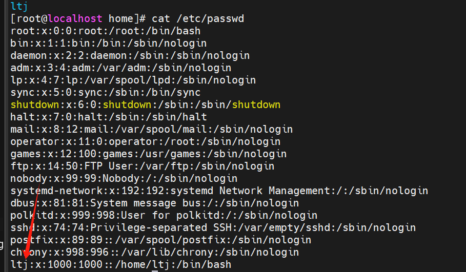

# 用户管理

## 增加用户

~~~
useradd [选项] 用户名
~~~

- -c comment 指定一段注释性描述。
- -d 目录 指定用户主目录，如果此目录不存在，则同时使用-m选项，可以创建主目录。
	- /home 下 家目录下
- -g 用户组 指定用户所属的用户组。

~~~
cd / #到初始
useradd ltj   # 在home文件夹下创建了一个用户
cat /etc/passwd # 查看用户列表

~~~



## 删除用户

~~~
userdel [-r] 用户名
userdel -r name
~~~

- -r删除HOME目录 ， 不写-rHOME保留

## 切换成员

~~~
su -l name
~~~

- **-l** : 符号是可选的，表示是否在切换用户后加载环境变量

切换用户后，可以通过`exit`命令退回上一个用户，也可以使用快捷键：ctrl + d

**提示**

- 使用普通用户，切换到其它用户需要输入密码，如切换到root用户
- 使用root用户切换到其它用户，无需密码，可以直接切换

## sudo

### **sudo命令的使用**

- 临时切换到root

### 为普通用户配置sudo认证

切换到root用户，执行visudo命令，会自动通过vi编辑器打开：`/etc/sudoers`

在文件的最后添加

```
1用户名 ALL=(ALL) NOPASSWD:ALL
```

- 其中最后的NOPASSWD:ALL 表示使用sudo命令，无需输入密码


~~~
su ltj 切换到普通账户
cd /opt
ls
sudo touch text2
>>> 某某不在....里此事将被报告
vim /etc/sudoers
G
o
用户名 ALL=(ALL) NOPASSWD:ALL
:wq!
~~~

## 更改密码

~~~
passwd
~~~

## 如何查看权限

- id

终端会输出当前用户的身份信息，其中包括`uid`和`gid`字段，分别表示用户ID和组ID。如果`uid`为0，则说明该用户是管理员

- whoami

### 命令行的提示符号 # 或者 $

命令行提示符中的`$`和`#`符号通常用来表示不同的用户或权限等级

> **注意**
>
> 但并不能直接判断当前用户是为管理员

- `$`：该符号一般出现在非特权用户的命令提示符中，表示当前用户没有超级用户（root）的权限
- `#`：该符号一般出现在超级用户（root）的命令提示符中，表示当前用户拥有最高权限

## 管理用户组

----

后边先不学了，暂时没啥用

