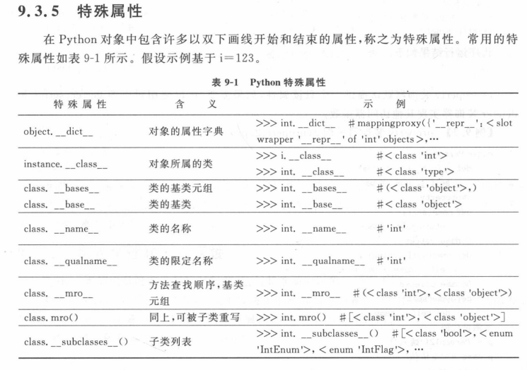
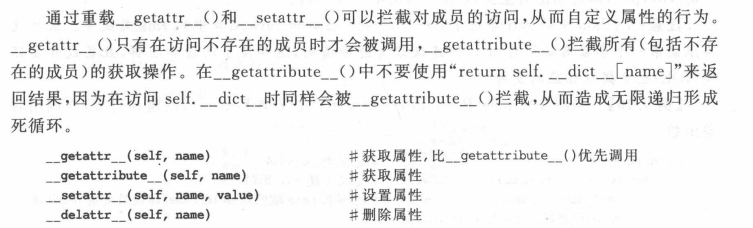
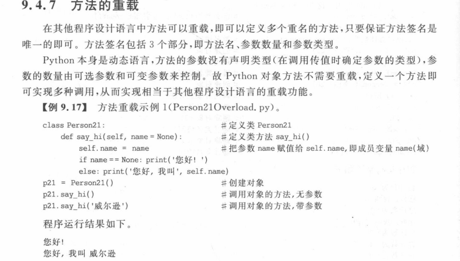
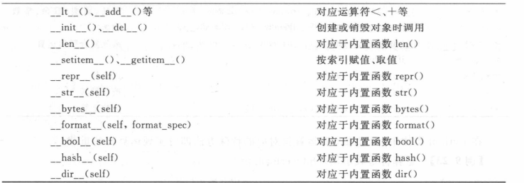

# 面向对象

## 类变量

-   在`init`函数外定义的
    -   有所有实例共同拥有（实例共享）

## 实例变量

-   `init`中初始化的

~~~
class P1:
    c1 = 1
    def __init__(self,c2):
        self.c2 = c2
~~~

-   c1是类变量
-   c2是实例变量

## 私有变量

-   两个下划线代表私有
-   私有属性不能直接访问，但是可以用方法返回

`__name`

~~~
class P1:
    c1 = 1
    __name = 'A'
    def __init__(self,c2):
        self.c2 = c2
    def get_name(self):
        return P1.__name
~~~




## 自定义属性

可以赋值一个类定义中不存在的属性通过"_ _ dict _ _" 来访问




## 静态方法

`@staticmethod`

**与类的对象实例无关的方法，不对特定的实例进行操作**

~~~
class TemperatureConverter:
    @staticmethod
    def c2f(t_c):
        t_c = float(t_c)              # 摄氏温度到华氏温度的转换
        t_f = (t_c * 9/5) + 32
        return t_f

    @staticmethod
    def f2c(t_f):
        t_f = float(t_f)              # 华氏温度到摄氏温度的转换
        t_c = (t_f - 32) * 5 / 9
        return t_c


# 测试代码
print("1. 从摄氏温度到华氏温度.")
print("2. 从华氏温度到摄氏温度.")
choice = int(input("请选择转换方向:"))
if choice == 1:
    t_c = float(input("请输入摄氏温度:"))
    t_f = TemperatureConverter.c2f(t_c)
    print("华氏温度为: {0:.2f}".format(t_f))
elif choice == 2:
    t_f = float(input("请输入华氏温度:"))
    t_c = TemperatureConverter.f2c(t_f)
    print("摄氏温度为: {0:.2f}".format(t_c))
else:
    print("无此选项,只能选择 1 或 2!")
~~~

## 类方法

`@classmethod`

类方法不对特定的实例进行操作，

~~~
@classmethod
def 方法名(cls,[形参]):
	...

~~~

-   要创建实例？→ 优先考虑 `@classmethod` 做替代构造器
-   要访问类变量？→ 用 `@classmethod`
-   只是数学计算？→ 用 `@staticmethod` 或普通函数

类方法（`@classmethod`）是 Python 面向对象编程中非常实用的特性，它与静态方法（`@staticmethod`）和实例方法各有不同的应用场景。下面我将详细解释类方法的具体应用，并通过实际例子说明。

---

### 一、什么是类方法？

使用 `@classmethod` 装饰器定义，第一个参数是 **类本身**（通常命名为 `cls`），而不是实例（`self`）。

```python
class MyClass:
    @classmethod
    def my_classmethod(cls, ...):
        ...
```

---

### 二、类方法的典型应用场景

### 1. **替代构造函数（Alternative Constructors）** ✅（最常见用途）

当你希望一个类支持**多种初始化方式**时，类方法是最佳选择。

##### 示例：从不同格式创建日期对象

```python
class Date:
    def __init__(self, year, month, day):
        self.year = year
        self.month = month
        self.day = day

    @classmethod
    def from_string(cls, date_str):
        """从 'YYYY-MM-DD' 字符串创建 Date 对象"""
        year, month, day = map(int, date_str.split('-'))
        return cls(year, month, day)  # ← 返回新实例

    @classmethod
    def today(cls):
        """返回今天的日期（模拟）"""
        return cls(2025, 10, 15)

# 使用
d1 = Date(2025, 10, 15)
d2 = Date.from_string("2025-10-15")  # 更灵活的创建方式
d3 = Date.today()
```

> ✅ 优势：  
> - 不需要修改 `__init__`  
> - 清晰表达不同创建意图  
> - 继承时自动适配子类（见下文）

---

#### 2. **在继承中保持正确类型（Polymorphism）**

类方法中的 `cls` 会自动指向**实际调用的类**（可能是子类），这使得它在继承体系中非常安全。

```python
class Person:
    species = "Homo sapiens"

    def __init__(self, name):
        self.name = name

    @classmethod
    def get_species(cls):
        return cls.species

    @classmethod
    def create_anonymous(cls):
        return cls("Anonymous")  # ← 如果是子类调用，会创建子类实例！

class Student(Person):
    pass

# 测试
s = Student.create_anonymous()
print(type(s))  # <class '__main__.Student'> ✅ 正确！
```

> 如果用静态方法或直接调用 `Person("Anonymous")`，就会错误地返回父类实例。

---

#### 3. **操作类变量（Class-level Operations）**

当需要修改或访问**类变量**（而非实例变量）时，类方法比静态方法更合适，因为它能明确使用 `cls`。

```python
class Counter:
    count = 0

    def __init__(self):
        Counter.count += 1  # 或 cls.count += 1（但这里不能用 cls，因为是实例方法）

    @classmethod
    def get_count(cls):
        return cls.count

    @classmethod
    def reset(cls):
        cls.count = 0

# 使用
c1 = Counter()
c2 = Counter()
print(Counter.get_count())  # 2
Counter.reset()
print(Counter.get_count())  # 0
```

---

#### 4. **工厂模式（Factory Pattern）**

类方法天然适合实现工厂模式，根据输入参数决定创建哪种对象。

```python
class Vehicle:
    def __init__(self, brand):
        self.brand = brand

    @classmethod
    def create_car(cls, brand):
        return cls(brand)

    @classmethod
    def create_truck(cls, brand, load_capacity):
        truck = cls(brand)
        truck.load_capacity = load_capacity
        return truck
```

---

## 三、类方法 vs 静态方法 vs 实例方法

| 特性         | 实例方法                   | 类方法 (`@classmethod`) | 静态方法 (`@staticmethod`)              |
| ------------ | -------------------------- | ----------------------- | --------------------------------------- |
| 第一个参数   | `self`（实例）             | `cls`（类）             | 无特殊参数                              |
| 访问实例变量 | ✅                          | ❌                       | ❌                                       |
| 访问类变量   | ✅（通过 `self.__class__`） | ✅（通过 `cls`）         | ❌（需硬编码类名）                       |
| 创建新实例   | ✅                          | ✅（推荐用于替代构造）   | 可以，但不推荐                          |
| 继承友好性   | ✅                          | ✅✅（自动适配子类）      | ❌（需硬编码类名）                       |
| 典型用途     | 操作实例状态               | 替代构造、类级操作      | 工具函数（与类相关但不依赖类/实例状态） |

> 🔸 **你的图片中的 `TemperatureConverter` 更适合用 `@staticmethod`**，因为它不涉及类或实例状态，只是一个工具函数集合。

---

## 四、何时**不要**用类方法？

- 如果方法**完全不使用 `cls`**，考虑用 `@staticmethod`。
- 如果只是**普通工具函数**，甚至可以定义在类外部。

---

## 总结：类方法的核心价值

✅ **提供灵活、语义清晰的构造方式**  
✅ **在继承体系中保持类型正确性**  
✅ **安全地操作类级别数据**

> 📌 **记住口诀**：  
> - 要创建实例？→ 优先考虑 `@classmethod` 做替代构造器  
> - 要访问类变量？→ 用 `@classmethod`  
> - 只是数学计算？→ 用 `@staticmethod` 或普通函数

如果你有具体场景（比如在 PyTorch 模型中使用类方法），也可以告诉我，我可以给出针对性例子！


## 方法的重载




## 继承

###  **实例方法（Instance Methods）**

子类可以**直接调用父类中定义的所有实例方法**（除非被子类重写）。

~~~
class Person:
    def greet(self):
        print("Hello!")

class Student(Person):
    pass

s = Student()
s.greet()  # 输出: Hello! ← 继承自 Person
~~~

###  **类变量（Class Variables）**

子类**共享父类的类变量**（但注意：如果子类或实例修改了该变量，行为可能不同）。

~~~
class Person:
    species = "Homo sapiens"

class Student(Person):
    pass

print(Student.species)  # "Homo sapiens" ← 继承
~~~

### **属性（通过 `@property` 定义的）**

如果父类使用 `@property` 定义了属性，子类也可以直接使用。

~~~
class Person:
    def __init__(self, name):
        self._name = name

    @property
    def name(self):
        return self._name

class Student(Person):
    pass

s = Student("Alice")
print(s.name)  # "Alice" ← 继承属性
~~~

###  **特殊方法（Dunder Methods）**

如 `__str__`, `__len__`, `__add__` 等，子类也会继承。

### **类方法（`@classmethod`）和静态方法（`@staticmethod`）**

子类同样继承这些方法，并且**类方法中的 `cls` 会自动指向子类**（这是关键优势！）。


| **`__init__` 方法**            | 子类如果不定义自己的`__init__`，会继承父类的；但如果定义了，**必须显式调用 `super().__init__()`**才能复用父类初始化逻辑。 |
| ------------------------------ | ------------------------------------------------------------ |
| **私有成员（如 `__private`）** | 以双下划线开头的属性/方法会被名称修饰（name mangling），子类无法直接访问（但可通过`_父类名__private`绕过，不推荐）。 |

## 装饰器@property

这是一个非常关键的问题！  
**“加不加括号”** 表面上只是语法差异，但背后体现了 **面向对象设计的核心思想**：**属性（状态） vs 方法（行为）**。这不是“多一个括号”的小事，而是**语义、封装和接口设计**的重要区别。

---

### ✅ 核心区别：**属性（Property） vs 方法（Method）**

| 特性         | `@property`（属性）                                  | 普通方法                                |
| ------------ | ---------------------------------------------------- | --------------------------------------- |
| **语义**     | 表示**对象的状态/特征**（如名字、年龄）              | 表示**对象的行为/动作**（如说话、计算） |
| **调用方式** | `obj.name`（像访问变量）                             | `obj.name()`（显式调用）                |
| **封装性**   | 可在不改变接口的前提下，将简单属性升级为带逻辑的计算 | 必须用括号，用户知道这是“执行操作”      |
| **可读性**   | 更自然、简洁                                         | 略显冗余（如果只是读值）                |

---

### 🌰 举个实际例子说明“功能差异”

#### 场景：用户类需要提供“全名”
```python
class User:
    def __init__(self, first, last):
        self.first_name = first
        self.last_name = last
```

##### 方案 1：用普通方法
```python
def full_name(self):
    return f"{self.first_name} {self.last_name}"

# 使用
user = User("Alice", "Smith")
print(user.full_name())  # 注意括号！
```

##### 方案 2：用 `@property`
```python
@property
def full_name(self):
    return f"{self.first_name} {self.last_name}"

# 使用
print(user.full_name)  # 无括号，像读属性
```

#### 💡 为什么 `@property` 更好？

1. **接口稳定**：  
   - 一开始你可能直接存 `self.full_name = "Alice Smith"`（简单属性）。
   - 后来需求变复杂（比如要处理中间名），你改成 `@property` 计算。
   - **所有调用代码无需修改**！用户始终用 `user.full_name`。

2. **符合直觉**：  
   “全名”是**状态**，不是“动作”。没人会说“请执行一下我的名字”。

3. **兼容数据模型**：  
   很多框架（如 Django ORM、Pydantic、JSON 序列化库）会自动读取 `@property` 作为字段，但不会调用普通方法。

---

### 🔧 实际功能优势：**无缝升级逻辑，不破坏 API**

假设最初：
```python
class Circle:
    def __init__(self, radius):
        self.radius = radius
        self.area = 3.14 * radius ** 2  # 直接计算并存储
```

后来发现：**半径可能被修改，但 area 没更新！**
```python
c = Circle(2)
c.radius = 3
print(c.area)  # 还是旧值！❌
```

✅ 用 `@property` 修复，**且调用方式不变**：
```python
class Circle:
    def __init__(self, radius):
        self.radius = radius

    @property
    def area(self):
        return 3.14 * self.radius ** 2

# 用户代码完全不用改！
c = Circle(2)
c.radius = 3
print(c.area)  # 自动重新计算 ✅
```

> 如果用普通方法 `get_area()`，所有调用处都要加括号，破坏兼容性。

---

### 🚫 什么时候**不该用** `@property`？

- 方法有**副作用**（如修改状态、打印、网络请求）→ 应该用普通方法，让用户明确知道“正在执行操作”。
- 方法**计算开销很大** → 用 `@property` 可能误导用户以为是廉价访问。
- 方法**需要参数** → `@property` 不能带参数（除了 `self`）。

---

### 总结：这不是“括号问题”，而是**设计哲学**

| 使用 `@property` 当...                   | 使用普通方法当...                  |
| ---------------------------------------- | ---------------------------------- |
| 你在暴露**对象的状态**                   | 你在定义**对象的行为**             |
| 读取是**轻量、无副作用**的               | 操作可能**耗时、有副作用**         |
| 你希望未来能**灵活改变实现**而不影响用户 | 你希望用户**明确知道这是函数调用** |

> ✅ **最佳实践**：  
> 对于“看起来像数据”的东西（名字、ID、尺寸、状态标志等），优先用 `@property`；  
> 对于“看起来像动作”的东西（保存、计算、转换、连接等），用普通方法。

所以，**加不加括号，决定了你的 API 是“数据导向”还是“行为导向”** —— 这在大型项目中至关重要。


## 查看继承的层次关系`__mro__`

## 特殊方法



# 继承顺序

在 Python 的多继承中，变量 `a` 的值取决于 **方法解析顺序（MRO，Method Resolution Order）**。MRO 确定了在多继承中，父类的构造函数和属性是如何被调用的。

### 代码示例：

```python
class A:
    def __init__(self):
        print("A initialized")
        self.a = 0

class B(A):
    def __init__(self):
        super().__init__()
        print("B initialized")
        self.a = 1

class C(A):
    def __init__(self):
        super().__init__()
        print("C initialized")
        self.a = 2

class D(B, C):
    def __init__(self):
        super().__init__()
        print("D initialized")

d = D()
print(f"a = {d.a}")
```

### 输出分析：

```
A initialized
C initialized
B initialized
D initialized
a = 1
```

### 解释：

在这个示例中，`D` 类继承自 `B` 和 `C`，而 `B` 和 `C` 又分别继承自 `A`。我们来看一下 MRO 是如何影响 `a` 的值的。

1.  **`D` 的 MRO：**
     Python 会按照 **C3 线性化算法** 来计算 MRO，确保继承关系的正确性，并避免重复调用父类。你可以通过 `D.__mro__` 来查看 MRO。

    ```python
    print(D.__mro__)
    ```

    输出：

    ```
    [<class '__main__.D'>, <class '__main__.B'>, <class '__main__.C'>, <class '__main__.A'>, <class 'object'>]
    ```

    这表明 Python 会按以下顺序调用父类：

    -   `D` -> `B` -> `C` -> `A`

2.  **`D.__init__` 执行流程：**

    -   当 `D` 被实例化时，`super().__init__()` 会根据 MRO 的顺序，首先调用 `B.__init__()`。
    -   在 `B.__init__()` 中，`super().__init__()` 又会调用 `C.__init__()`，然后再调用 `A.__init__()`。
    -   然后，`B.__init__()` 中设置了 `self.a = 1`，所以变量 `a` 会被设置为 1。
    -   由于 `C` 也有 `self.a = 2`，但 `C` 的初始化是在 `B` 之后执行的，因此 `C` 对 `a` 的赋值会覆盖掉 `B` 中的值。

3.  **变量 `a` 的最终值：**
     在 `D` 类中，变量 `a` 最终被 `C` 类中的 `self.a = 2` 设置，因此输出的 `a` 的值是 **1**。尽管 `C` 中设置了 `a = 2`，但是由于 MRO 先经过了 `B`，`B` 设置的 `a` 会在 `C` 设置之前生效。

### 总结：

-   在多继承中，父类的变量或方法调用的顺序取决于 **MRO（方法解析顺序）**。
-   在此例中，由于 MRO 顺序是 `D -> B -> C -> A`，`B` 类的 `a = 1` 会先被赋值，后来在 `C` 中的 `a = 2` 会覆盖掉 `B` 中的赋值。
-   最终，`D` 类的 `a` 变量值会被 `C` 中的赋值 `a = 2` 覆盖。

​																																																																																																									

# super显示定义继承父类

在 Python 中，`super()` 是用来调用父类的方法的。当你写 `super().__init__()` 时，它会自动调用父类的 `__init__()` 方法。但是，这里有一点需要注意：你提到的两种写法：

```python
super(SiameseNetwork, self).__init__()
```

和

```python
super().__init__()
```

都可以用来初始化父类，但它们在细节上有所不同。

### 1. **`super(SiameseNetwork, self).__init__()` 的写法**

这种写法明确指定了当前类（`SiameseNetwork`）和当前对象（`self`）作为参数来调用父类的 `__init__()` 方法：

-   **`SiameseNetwork`**：显式指定父类（当前类的直接父类）。
-   **`self`**：指明当前实例对象。

这种写法在多继承场景中非常有用。它确保了父类的初始化过程明确且可以精确控制。如果你的类有多重继承关系，显式调用 `super(SiameseNetwork, self)` 可以避免不小心调用到错误的父类方法。

例如：

```python
class A:
    def __init__(self):
        print("A initialized")

class B(A):
    def __init__(self):
        super().__init__()
        print("B initialized")

class C(A):
    def __init__(self):
        super().__init__()
        print("C initialized")

class D(B, C):
    def __init__(self):
        super().__init__()
        print("D initialized")

d = D()
```

在这个多继承的例子中，如果使用 `super().__init__()`，它会按照 **方法解析顺序（MRO）** 来调用父类的 `__init__()` 方法。在 `D` 类中，`super().__init__()` 实际上会首先调用 `B` 的 `__init__()`，然后再依次向上调用 `C` 和 `A`。

输出：

```
A initialized
C initialized
B initialized
D initialized
```

**`super(SiameseNetwork, self).__init__()`** 明确表明我们从 `SiameseNetwork` 类调用父类的构造函数，避免了可能在多继承中发生的混乱。

### 2. **`super().__init__()` 的写法**

这种写法是 Python 3 中对 `super()` 的简化版本。它不显式指定父类和实例对象，而是让 Python 自动根据当前类和当前对象推断出应该调用哪个父类的方法。

这种写法在单继承的情况下通常没有问题，因为 Python 能够自动推断出父类。然而，在多继承的情况下，它可能不如显式指定父类那么清晰，因为它依赖于 **方法解析顺序（MRO）** 来决定父类的调用顺序。

### 总结：

-   在 **单继承** 中，`super().__init__()` 是简化的写法，两者效果一样，Python 会自动找到正确的父类并调用 `__init__()` 方法。
-   在 **多继承** 中，`super(SiameseNetwork, self).__init__()` 明确指定了父类，避免了 `super().__init__()` 可能导致的意外结果，确保父类调用的顺序是按照正确的 MRO 进行的。

所以，**在大多数情况下，`super().__init__()` 是可以工作的**，但是在 **多继承** 中，如果你希望确保父类的调用顺序正确，使用 `super(SiameseNetwork, self).__init__()` 可能会更清晰和可靠。