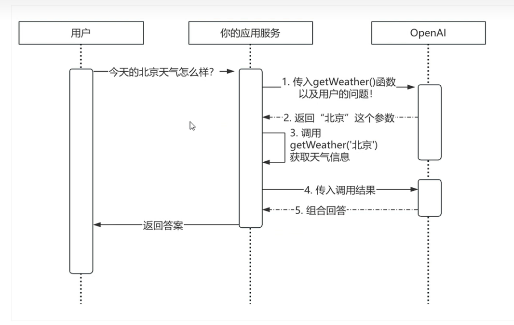
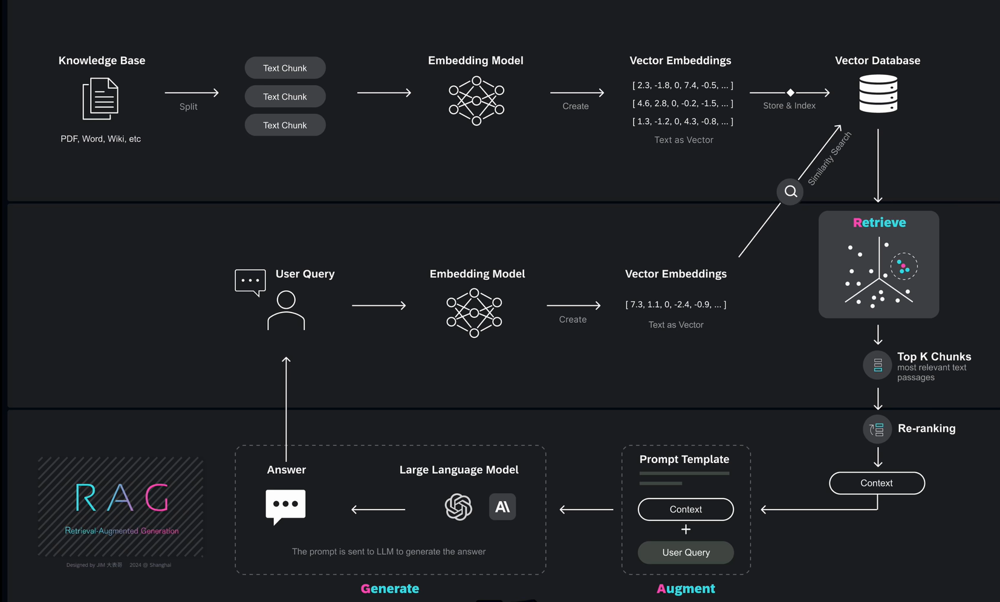
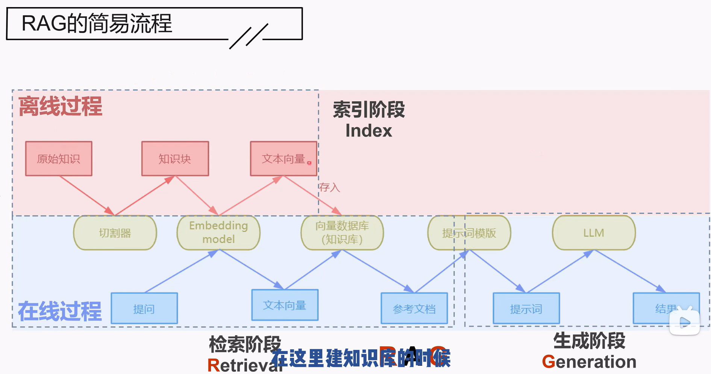
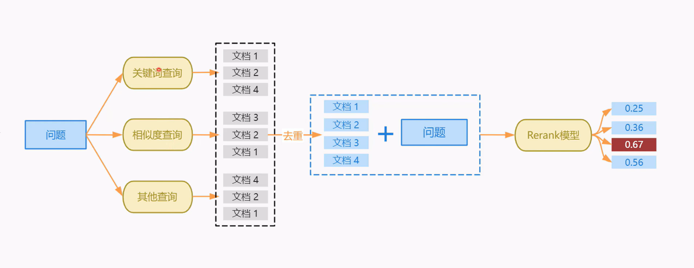
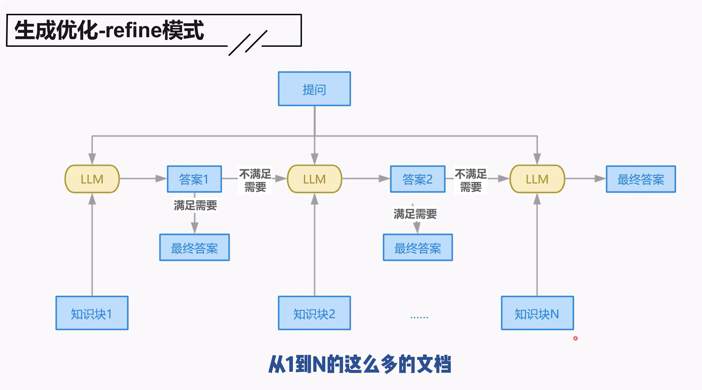
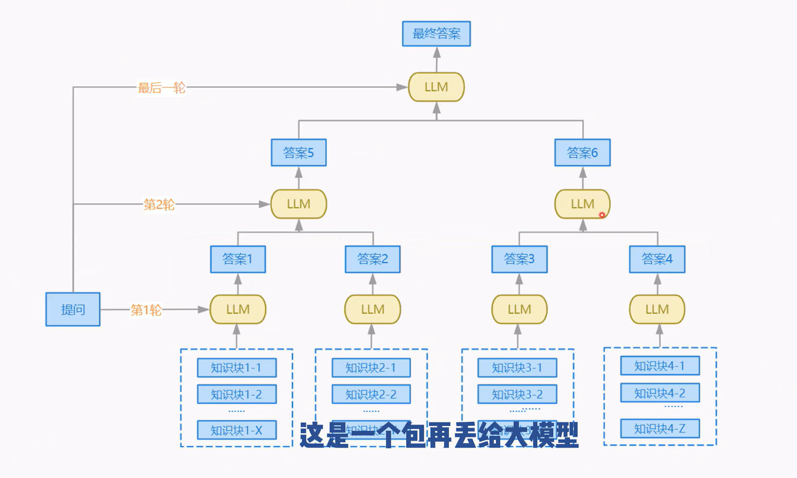
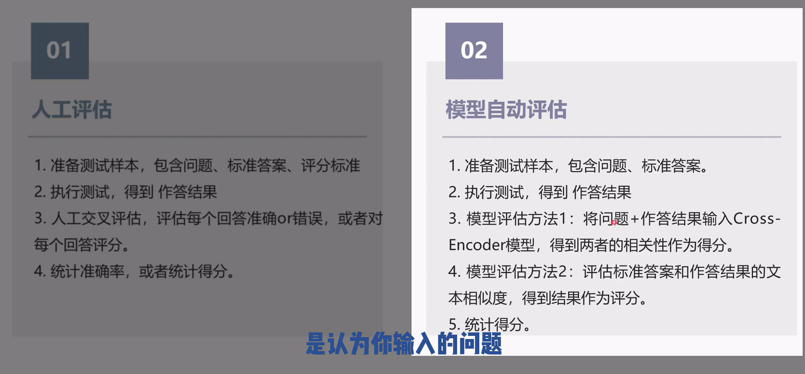
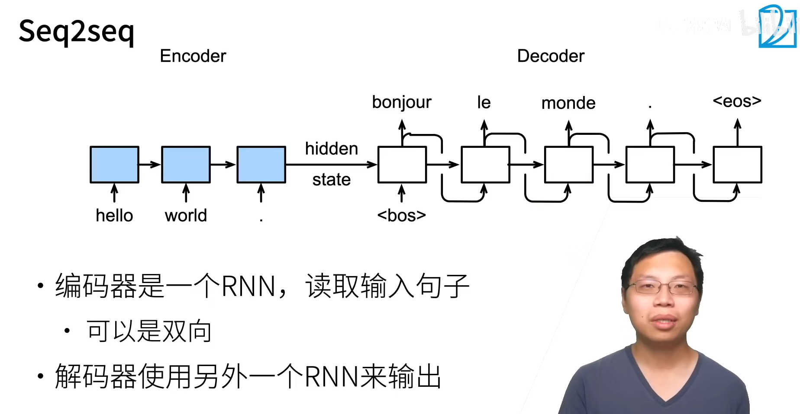

# mcp

让大模型可以识别外部的工具，function_call 

mcp 模型上下文协议

它是一个类似于LSP的标准化协议，目的是统一大型语言模型(LLM)与外部数据源和工具之间的通信协议。

# rag

## 向量数据库

嵌入文本，存储向量，相似度分析		

- **Chromadb**
- **FAISS**

## 检索优化

- 检索阶段小文本
- 生成阶段大文本

---

- 多路召回
- rerank

### 葫芦娃模式

把文档排队送给模型，一个不行换下一个

- 会用到所有知识块，不会上下文溢出
- 但是太复杂了

把知识块合起来，再送回模型

## 改写提问

- 提问不规范
- 多轮
- 复杂

## 合理利用元数据

## 评估rag

- 准确率：在用户视角的答案
- 忠实度：生成的内容是否忠实于上下文
- 召回率，精准率，F1

---

- 人工评估
- 模型自动评估

### 背景问题：

- 大型预训练语言模型（如BERT、GPT）虽然可以编码大量事实知识，但它们：
	- 难以更新知识（参数固定）；
	- 不能解释生成结果的来源；
	- 容易产生“幻觉”（hallucinations）；
	- 在知识密集型任务中表现不佳。

## 2. 方法（Methods）

RAG的整体架构由两个关键组件组成：

### 2.1 检索器 pη(z|x)

- **DPR结构**：使用一个BERT-based双编码器（bi-encoder），分别编码查询（q(x)）和文档（d(z)），相似度通过内积计算。
- **MIPS搜索**：最大内积搜索，使用FAISS加速从Wikipedia中检索前K个文档。
- 文档索引被视为**可查询的非参数化知识库**。

### 2.2 生成器 pθ(y|x, z)

- 基于**BART-Large**的Seq2Seq架构，输入是原始输入x和检索到的文档z的拼接。
- BART用于生成token序列，作为**参数化记忆**。

----

seq2seq序列到序列学习

可用于机器翻译

双向rnn可以翻译 encoder 不能做语言