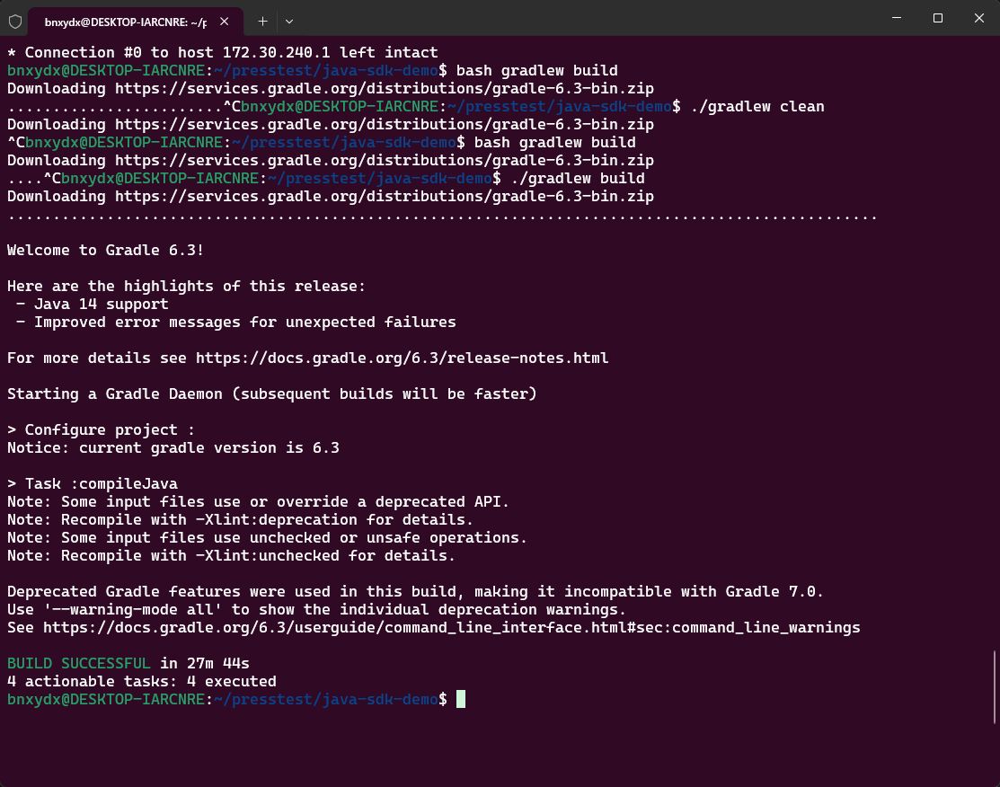
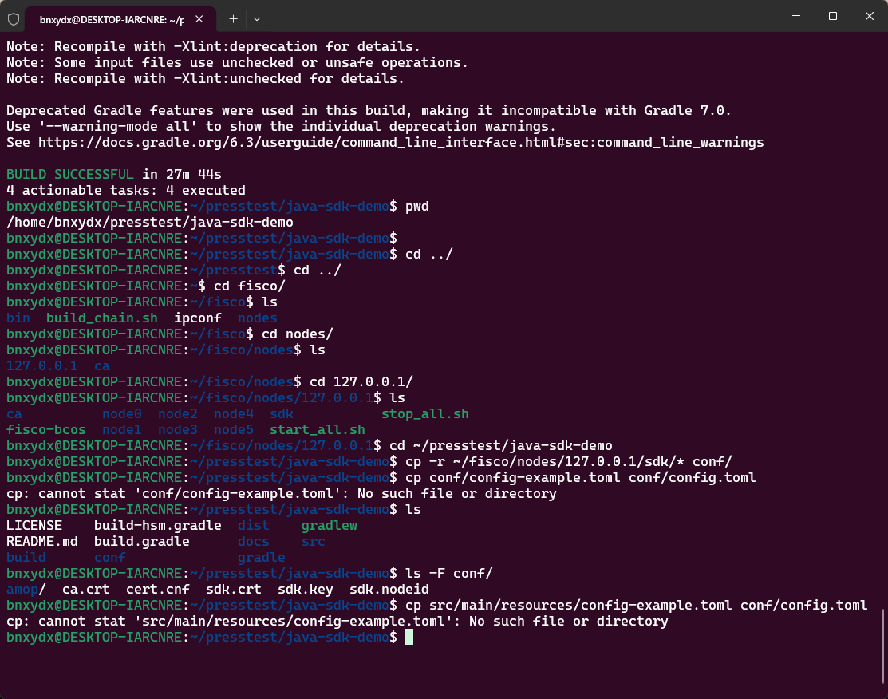

# 压力测试

1.   代理

~~~
# 自动获取 Windows 主机的 IP 并设置代理
# 使用 awk 提取默认网关的 IP
export host_ip=$(ip route show default | awk '{print $3}')

# 统一设置代理变量
export http_proxy="http://$host_ip:7890"
export https_proxy="http://$host_ip:7890"
export all_proxy="socks5://$host_ip:7890"

echo "当前宿主机 IP: $host_ip，代理已生效。"
~~~

2.   启动项目
     1.   启动结点
     2.   启动前端
     3.   自己找一下地址

~~~
bash nodes/127.0.0.1/start_al1.sh
python3 deploy.py startAll
~~~

3.   压测

编译源码

~~~
# 下载源码
$ git clone https://github.com/FISCO-BCOS/java-sdk-demo
$ cd java-sdk-demo
# 编译源码
$ bash gradlew build 
~~~

4.   配置

~~~
$ cp -r ~/fisco/nodes/127.0.0.1/sdk/* conf
~~~

