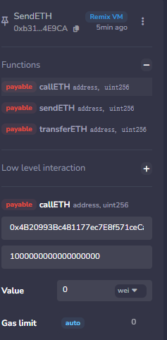

# 接收ETH

在合约收到 ETH 转账和未知调用时需要调用回调函数，

## 作用

1.  **接收 ETH**：当有人直接向合约地址转账时，合约需要知道如何处理这笔钱。
2.  **兜底处理**：当有人调用了合约中不存在的函数，或者带数据的转账时，合约需要一个“备用方案”来响应。

## `receive` 收款员

-   唯一的作用时接受纯ETH转账
-   用途：
    -   **接收捐赠或支付**：比如用户直接通过钱包向合约转账购买服务。
    -   **记录日志**：通常在这里触发一个 `event`，记录是谁转了多少钱。

-   **特点**：

    -   必须标记为 `external payable`。

    -   不能有任何参数，也不能返回值。

    -   **Gas 限制风险**：如果使用 `transfer` 或 `send` 方法转账，`receive()` 函数只有 **2300 Gas** 的执行额度。这意味着你只能在这里写非常简单的逻辑（如记录事件），不能进行复杂的存储写入或调用其他合约，否则会因 Gas 不足而失败

## `fallback`**错误处理器**或**代理转发器**

-   用于处理所有“不在菜单上”的请求。

-   触发条件
    -   **调用不存在的函数**：有人调用了合约里没有定义的函数（无论是否带 ETH）。
    -   **带数据的 ETH 转账**：有人向合约转账，同时附带了数据，但合约没有 `receive()` 函数，或者数据无法匹配任何函数。
    -   **无 `receive()` 时的收款**：如果合约没写 `receive()` 函数，但有人转了纯 ETH，`fallback()` 会作为替补来接收（前提是它标记为 `payable`）。

-   主要用途
    -   **代理模式（Proxy）**：在可升级合约中，`fallback()` 常用来将调用转发给逻辑合约。
    -   **防止资金锁死**：作为一个安全网，接收那些意外发送的 ETH 或调用，避免交易直接报错回滚。

-   特点
    -   必须标记为 `external`，`payable` 是可选的（想收钱就必须加）。
    -   同样没有参数和返回值。

----

## 总结

-   纯转账就是receive
-   否则就是fallback，（有msg，或其他逻辑）

# 发送ETH

发送ETH有三个方法

-   `transfer()`
-   `send()`
-   `call()`

## 发送ETH

~~~
contract SendETH {
    // 构造函数，payable使得部署的时候可以转eth进去
    constructor() payable{}
    // receive方法，接收eth时被触发
    receive() external payable{}
}

~~~

-   构造函数，相当于init，会在部署合约是运行一次
-   payable，这个可以让在部署合约时能够进行转账操作，能够让合约部署时就可以转账进去

### `transfer`

-   用法是`接收方地址.transfer(发送ETH数额)`。
-   `transfer()`的`gas`限制是`2300`，足够用于转账，但对方合约的`fallback()`或`receive()`函数不能实现太复杂的逻辑。
-   `transfer()`如果转账失败，会自动`revert`（回滚交易）。

~~~
// 用transfer()发送ETH
function transferETH(address payable _to, uint256 amount) external payable{
    _to.transfer(amount);
}

~~~

-   但是amount必须小于value
    -   相当于amount是要转账的钱，value是合约内的钱，合约的钱不够就不能转

### `send`

-   用法是`接收方地址.send(发送ETH数额)`。

-   `send()`的`gas`限制是`2300`，足够用于转账，但对方合约的`fallback()`或`receive()`函数不能实现太复杂的逻辑。

-   `send()`如果转账失败，不会`revert`。

-   `send()`的返回值是`bool`，代表着转账成功或失败，需要额外代码处理一下。

### `call`推荐使用

-   用法是`接收方地址.call{value: 发送ETH数额}("")`。

-   `call()`没有`gas`限制，可以支持对方合约`fallback()`或`receive()`函数实现复杂逻辑。

-   `call()`如果转账失败，不会`revert`。

-   `call()`的返回值是`(bool, bytes)`，其中`bool`代表着转账成功或失败，需要额外代码处理一下。
-   **call可以转发所有gas**

~~~
error CallFailed(); // 用call发送ETH失败error

// call()发送ETH
function callETH(address payable _to, uint256 amount) external payable{
    // 处理下call的返回值，如果失败，revert交易并发送error
   
   //（先检查/生效，后交互）
   (bool success,) = _to.call{value: amount}("");
    if(!success){
        revert CallFailed();
    }
}

~~~

-   **为什么要用 `call`？** 因为 `transfer` 的 Gas 限制太低，会导致转账给复杂合约时失败。
-   **不回滚怎么办？** 程序员必须手动写 `require(success)`。这虽然多写了一行代码，但换来了**兼容性**和**控制权**。

## 回滚操作

转账虽然没成功，但程序却假装一切正常继续往下跑。

-   钱会没转出去，并且你也不知道

-   实际上因为转账失败（比如接收方是合约且耗气量不足，或者接收方拒绝接收），钱并没有动。

（存在了合约中）

例如

~~~
// 伪代码示例
balances[msg.sender] = 0; // 1. 先把用户余额清零
(bool success) = msg.sender.send(100 ether); // 2. 尝试转账
// 如果没有检查 success，代码就在这里结束了
~~~

-   如果 `send` 失败了（返回 false）：
    -   用户的余额已经被清零了（步骤 1 执行了）。
    -   用户没收到钱（步骤 2 失败了）。
    -   **结果：** 用户的钱凭空消失了（其实是被合约吞了）。

-   只有transfer会回滚

-   **`send` (2300 Gas)**：失败返回 `false`，**不回滚**。容易导致上述的“钱丢了但程序还在跑”的问题。
-   **`transfer` (2300 Gas)**：失败直接 **Revert（回滚）**。这是旧版本推荐的安全做法，但现在因为 Gas 限制问题也被逐渐弃用。
-   **`call` (所有剩余 Gas)**：失败返回 `false`，**不回滚**。这是目前最推荐的方式，但**必须**配合 `require` 使用。

-----

## 完整代码

~~~~
// SPDX-License-Identifier: MIT
pragma solidity ^0.8.21;
contract ReceiveETH {
    // 收到eth事件，记录amount和gas
    event Log(uint amount, uint gas);
    
    // receive方法，接收eth时被触发
    receive() external payable{
        emit Log(msg.value, gasleft());
    }
    
    // 返回合约ETH余额
    function getBalance() view public returns(uint) {
        return address(this).balance;
    }
}

contract SendETH {
    // 构造函数，payable使得部署的时候可以转eth进去
    constructor() payable{}
    // receive方法，接收eth时被触发
    receive() external payable{}

    // 用transfer()发送ETH
    function transferETH(address payable _to, uint256 amount) external payable{
        _to.transfer(amount);
    }

    error SendFailed(); // 用send发送ETH失败error

    // send()发送ETH
    function sendETH(address payable _to, uint256 amount) external payable{
        // 处理下send的返回值，如果失败，revert交易并发送error
        bool success = _to.send(amount);
        if(!success){
            revert SendFailed();
        }
    }
    error CallFailed(); // 用call发送ETH失败error

    // call()发送ETH
    function callETH(address payable _to, uint256 amount) external payable{
        // 处理下call的返回值，如果失败，revert交易并发送error
        (bool success,) = _to.call{value: amount}("");
        if(!success){
            revert CallFailed();
        }
    }

}

~~~~

-   第一步给合约转钱，你现在是哪个用户就是用哪个用户的钱

这个按钮的作用是**把你的合约发布到区块链上**。

这里的部署过程确实就等同于 `amount = 0`（因为没传参），而 `value = 10`（因为你在部署面板里填了值）。

这个输入框决定了你在**创建合约的同时**，要给这个新诞生的合约**转多少钱**。

你可以把合约看作一个**保险箱**：

-   转钱，从合约内给指定账户转钱

第一行是用户的地址

第二行是钱默认单位是wei

1000000000000000000wei = 1ETH

当然你也可以填value的值继续给合约转钱

