# FISCO BCOS 3.x

手动搭建Pro版区块链网络(无tars管理台)

使用windows的wsl中ubantu环境部署

1.   查看ubantu版本

~~~
enovo1@DESKTOP-Q20A2OI:~$ lsb_release -a
No LSB modules are available.
Distributor ID: Ubuntu
Description:    Ubuntu 24.04.3 LTS
Release:        24.04
Codename:       noble
enovo1@DESKTOP-Q20A2OI:~$
~~~

需要大于18.04

2.   下载工具

https://fisco-bcos-doc.readthedocs.io/zh-cn/latest/docs/tutorial/pro/installation_without_tars.html

~~~
sudo apt-get update
sudo apt-get install -y curl python3 wget
~~~

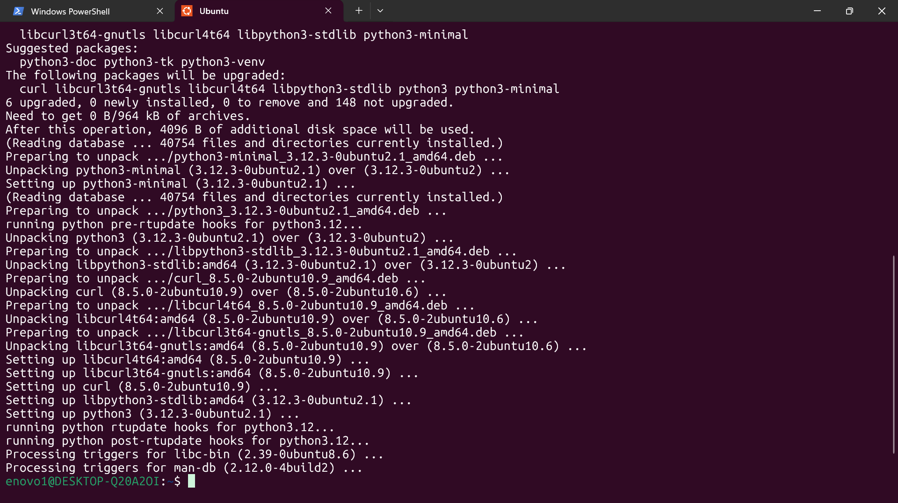

下载pip3

~~~
sudo apt install -y python3-pip
~~~

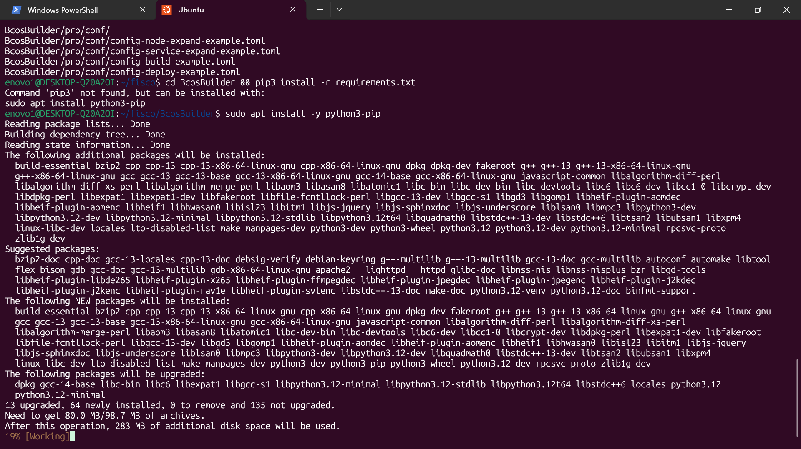

3.   下载部署工具BcosBuilder

https://fisco-bcos-doc.readthedocs.io/zh-cn/latest/docs/tutorial/pro/pro_builder.html

让用户最快的部署和使用FISCO BCOS Pro/max版本区块链，其功能包括：部署/启动/关闭/更新/扩容RPC服务、Gateway服务以及区块链节点服务。

由于是无tar版本

需要看以下内容

~~~
curl -#LO https://github.com/FISCO-BCOS/FISCO-BCOS/releases/download/v3.6.0/BcosBuilder.tgz && tar -xvf BcosBuilder.tgz
~~~

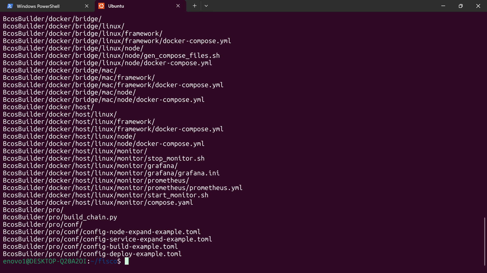

但是发现可能有网络问题

下载压缩包后拖进ubantu

## 打开地址

~~~
\\wsl.localhost\Ubuntu\home\enovo1\fisco
~~~

解压

~~~
enovo1@DESKTOP-Q20A2OI:~/fisco$ ls
BcosBuilder.tgz
enovo1@DESKTOP-Q20A2OI:~/fisco$ tar -zxvf BcosBuilder.tgz
enovo1@DESKTOP-Q20A2OI:~/fisco$ ls
BcosBuilder  BcosBuilder.tgz
enovo1@DESKTOP-Q20A2OI:~/fisco$ cd BcosBuilder/
~~~

下载venv 创建虚拟环境 下载库

~~~
sudo apt install -y python3-venv
~~~

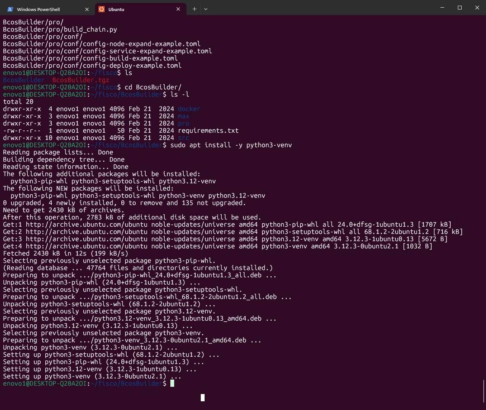

~~~
python3 -m venv fisco_env
source fisco_env/bin/activate
pip install -i https://pypi.tuna.tsinghua.edu.cn/simple -r requirements.txt
~~~

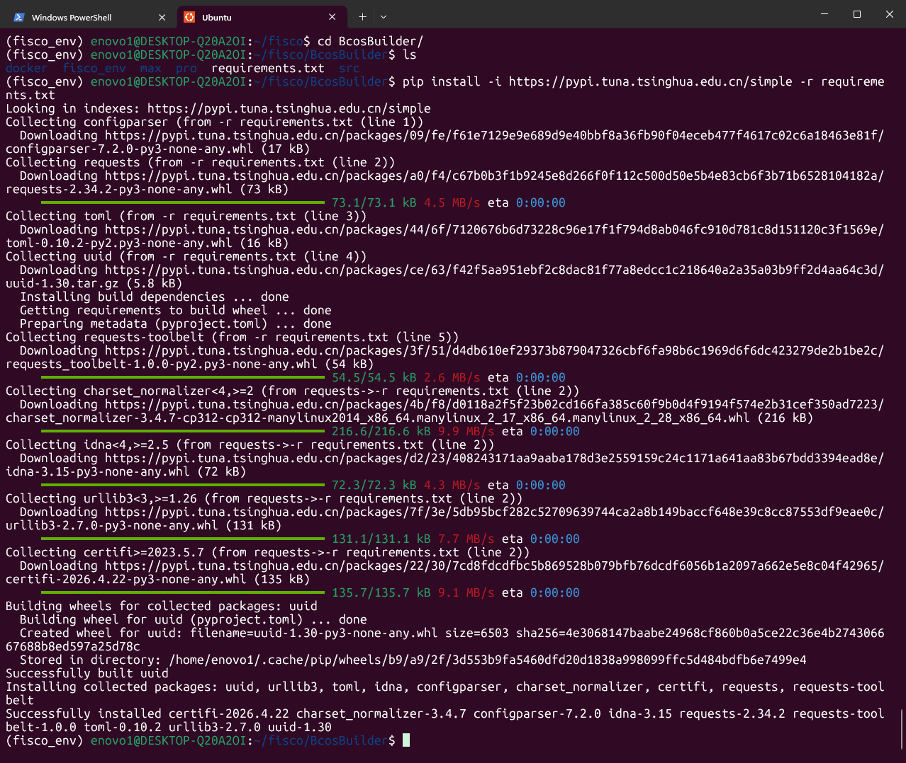

## 主要服务

Pro版本FISCO BCOS包括RPC服务、Gateway服务以及区块链节点服务BcosNodeService。

-   RPC服务：负责接收客户端请求，并将请求转发到节点进行处理， RPC服务可横向扩展，一个RPC服务可接入多个区块链节点服务
-   Gateway服务：负责跨机构区块链节点之间的网络通信，Gateway服务横向可扩展，一个Gateway服务可接入多个区块链节点服务
-   区块链节点服务`BcosNodeService`：提供区块链相关的服务，包括共识、执行、交易上链等，节点服务通过接入到RPC服务和Gateway服务获取网络通信功能。

##  下载二进制

构建Pro版本FISCO BCOS前，需要先下载二进制包，`BcosBuilder`的提供了基于linux的静态二进制包下载功能，下载最新二进制的命令如下：

~~~
cd pro
# 运行build_chain.py脚本下载二进制，二进制包默认下载到binary目录
python3 build_chain.py download_binary
~~~

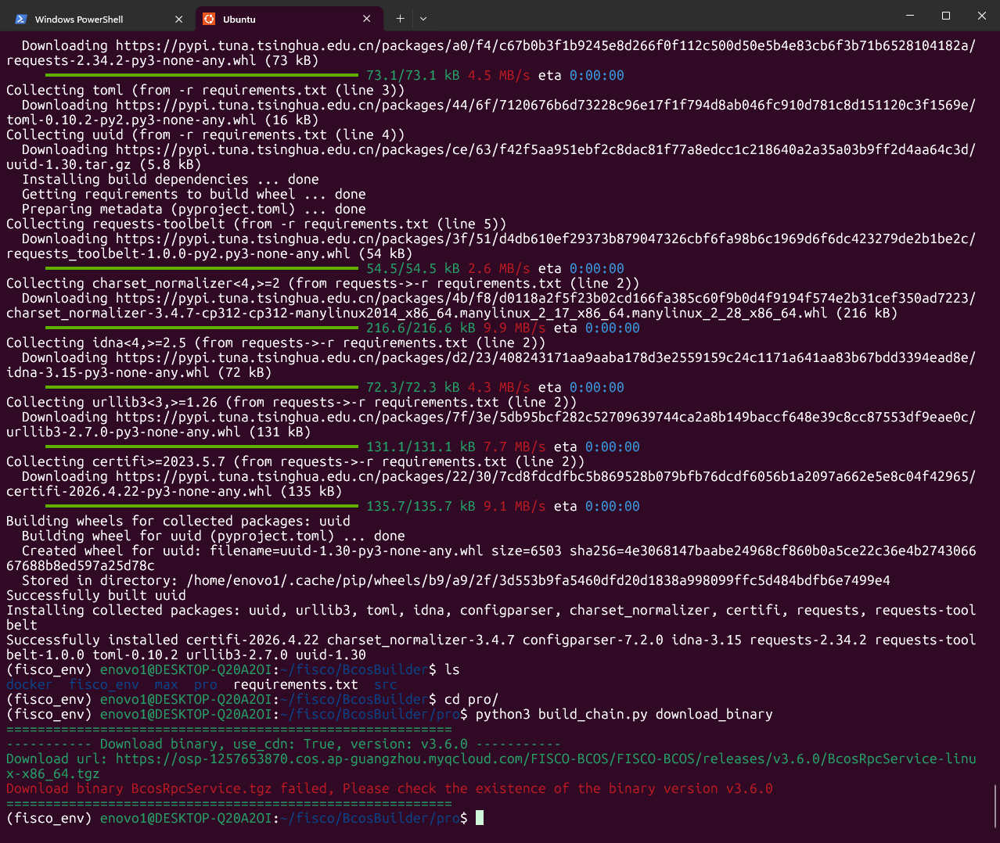

**RPC 服务：** `BcosRpcService-linux-x86_64.tgz`

**网关服务：** `BcosGatewayService-linux-x86_64.tgz`

**节点服务：** `BcosNodeService-linux-x86_64.tgz`

只能去github上找了

https://github.com/FISCO-BCOS/FISCO-BCOS/releases/tag/v3.7.3

这个版本比较稳定

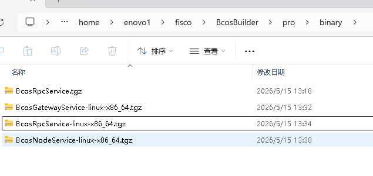

https://juejin.cn/post/7229603103945834554

~~~
python3 build_chain.py create-subnet -n tars-network -s 172.25.0.0/16
~~~

1.   设置数据库密码

~~~
sed -i 's/MYSQL_ROOT_PASSWORD: ""/MYSQL_ROOT_PASSWORD: "FISCO"/g' docker-compose.yml

初始密码改成了FISCO
~~~

~~~
FISCO
~~~

2.   准备启动

~~~
cd ../docker/bridge/linux/framework
docker-compose up -d
~~~

可能会遇到网络问题

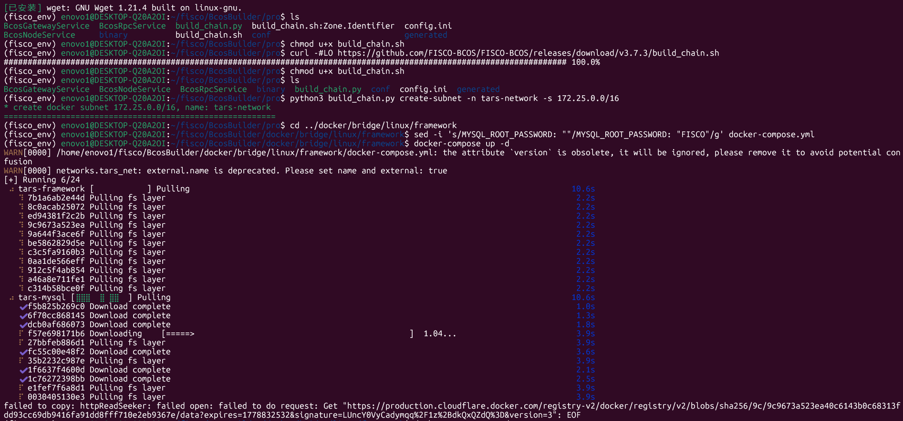

在 Windows 任务栏找到 **Docker Desktop** 图标，右键选择 **Settings**。

点击 **Docker Engine** 选项卡。

在右侧的 JSON 配置文件中，添加 `registry-mirrors` 字段（如果已经有字段，注意补逗号）。

~~~
{
  "builder": {
    "gc": {
      "defaultKeepStorage": "20GB",
      "enabled": true
    }
  },
  "experimental": false,
  "registry-mirrors": [
    "https://docker.m.daocloud.io",
    "https://hub-mirror.c.163.com",
    "https://mirror.baidubce.com",
    "https://dockerproxy.com"
  ]
}
~~~

~~~
docker-compose up -d
~~~

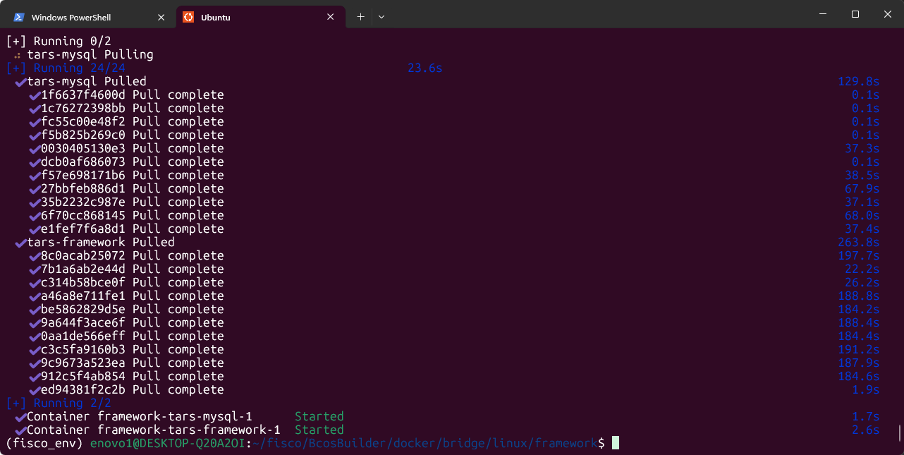

启动完成

http://127.0.0.1:3000

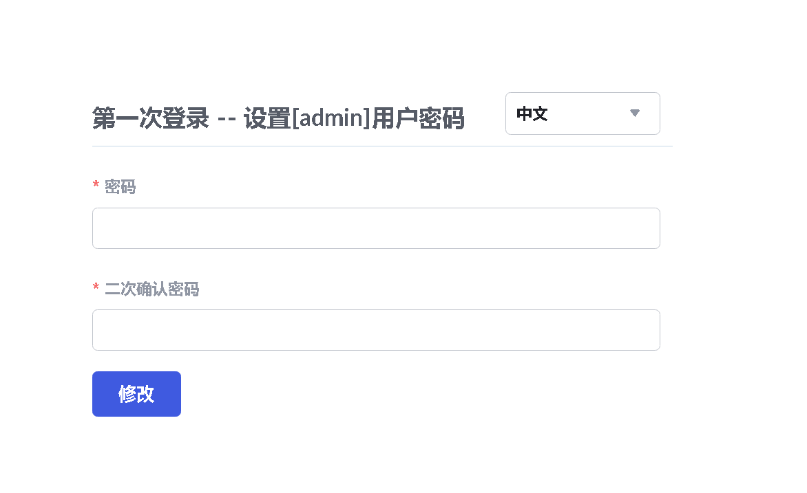

密码：`123456`

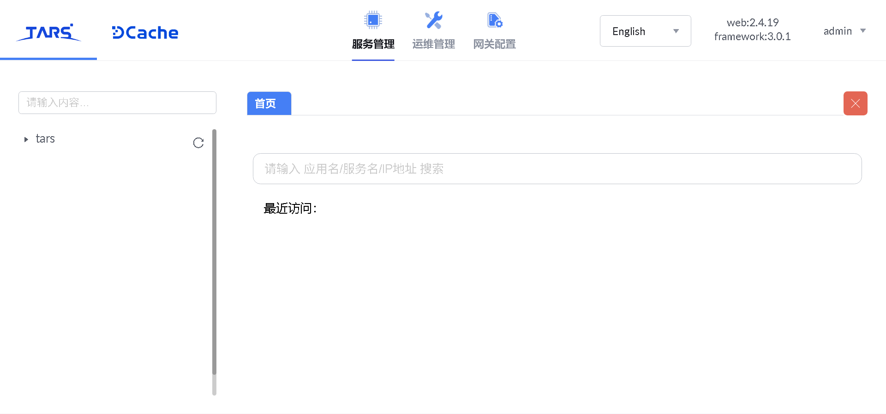

## 部署Pro版本区块链节点

~~~
python3 build_chain.py download_binary下载二进制，不过我已经下载过了
~~~

#### （1）在pro目录下进行拷贝

~~~
  cp conf/config-deploy-example.toml config.toml 
~~~

### 将第六步网页中的TOKEN复制下来（需要进行新增）

​    admin--》用户中心--》TOKEN管理--》新增Token

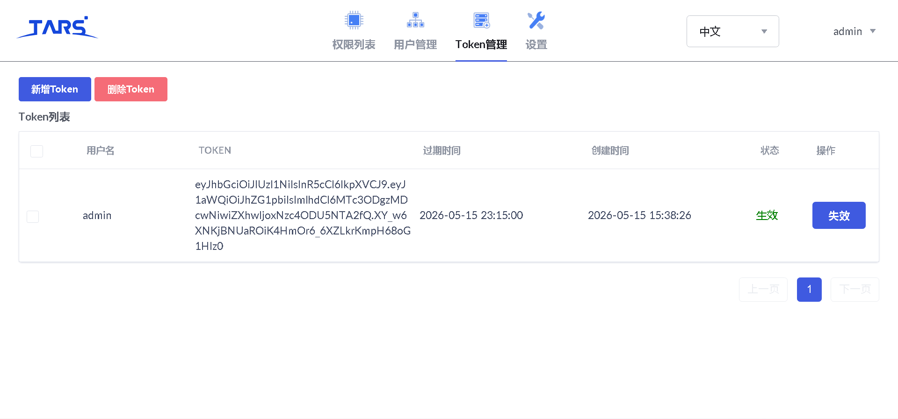

直接vim进行修改config.toml配置文件中的tars_token即可

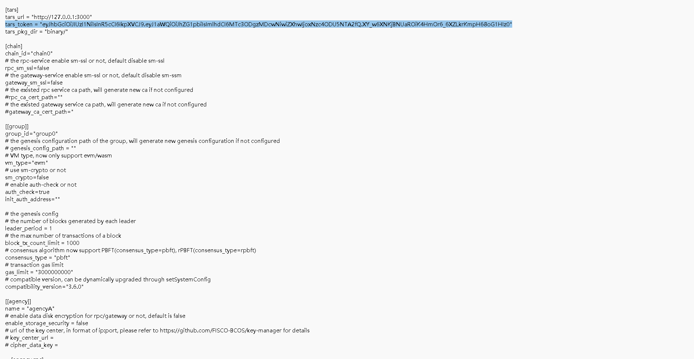

改完之后

你最好确保以下二进制文件那个目录压缩包还在不在

generated这个文件夹可以随便删除

~~~
 python3 build_chain.py chain -o deploy -t rpc
~~~

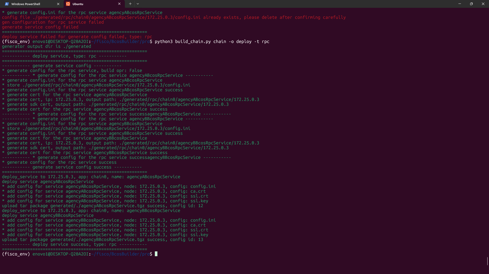

文件目录是这样的

~~~
(fisco_env) enovo1@DESKTOP-Q20A2OI:~/fisco/BcosBuilder/pro/binary$ ls
BcosGatewayService      BcosNodeService      BcosRpcService
BcosGatewayService.tgz  BcosNodeService.tgz  BcosRpcService.tgz

(fisco_env) enovo1@DESKTOP-Q20A2OI:~/fisco/BcosBuilder/pro/generated$ ls
agencyABcosRpcService.tgz  agencyBBcosRpcService.tgz  rpc
~~~

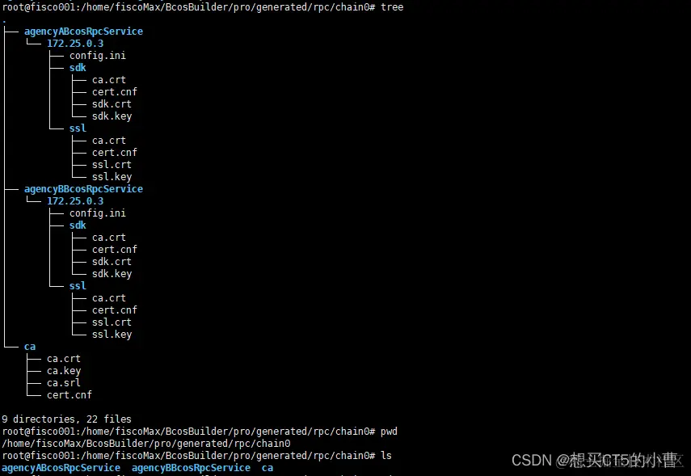

## 部署Gateway服务及区块链节点服务（监控服务）

~~~
python3 build_chain.py chain -o deploy -t gateway
~~~

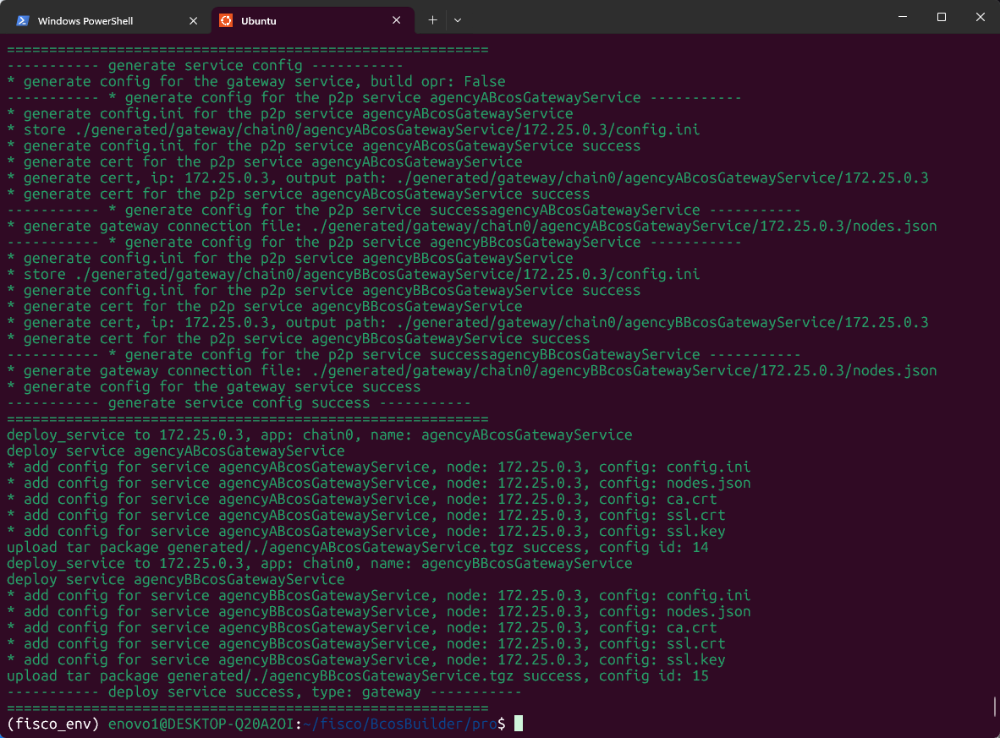

在generated里新生成了一个gateway文件夹

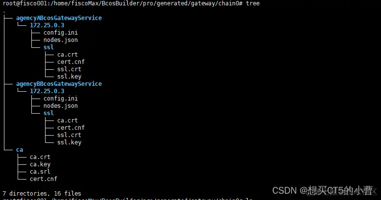

## 部署启动区块链节点服务

~~~
  python3 build_chain.py chain -o deploy -t node
~~~

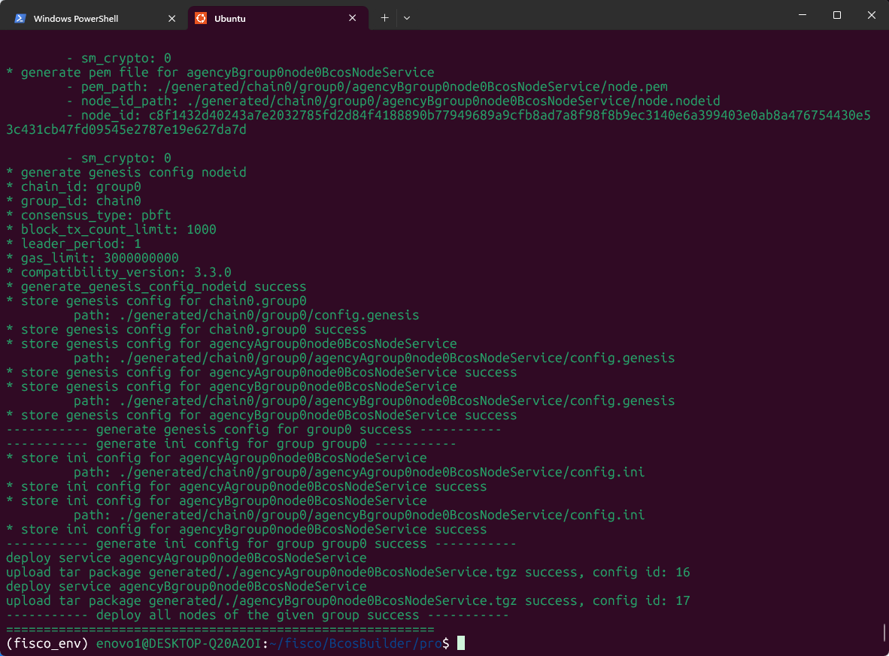

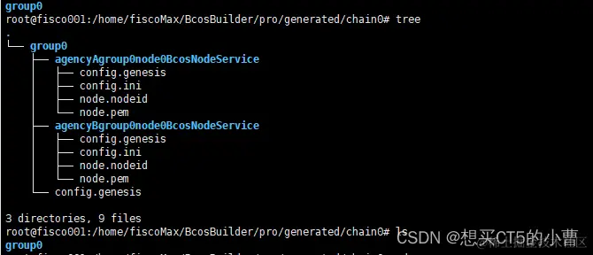

## 安装java

~~~
javac
~~~

~~~
sudo apt install -y default-jdk
~~~

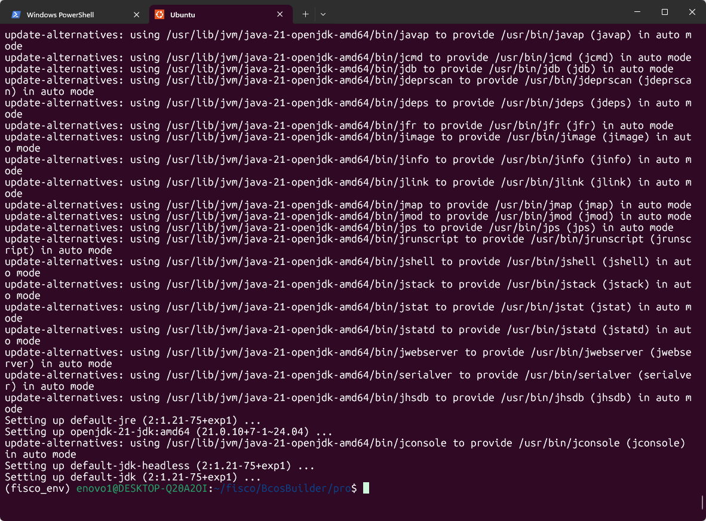

下载控制台

~~~
https://github.com/FISCO-BCOS/console/releases/download/v3.8.0/console.tar.gz
~~~

手动解压

~~~
tar -zxf console.tar.gz
~~~

配置控制台

~~~
cp -n console/conf/config-example.toml console/conf/config.toml
~~~

配置控制台证书

~~~
cp -r BcosBuilder/pro/generated/rpc/chain0/agencyBBcosRpcService/172.25.0.3/sdk/* console/conf
~~~

进入console目录

~~~
cd console
bash start.sh
~~~

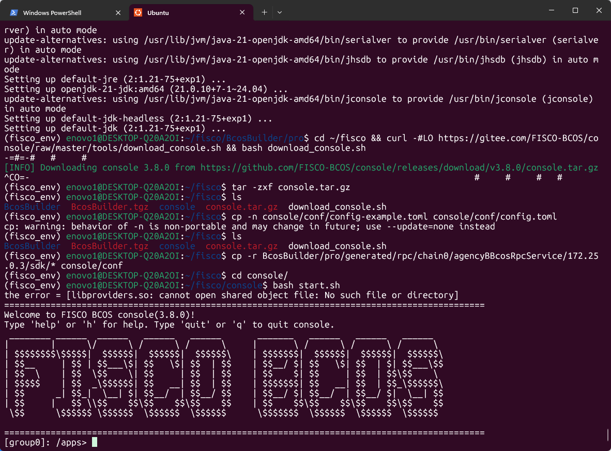

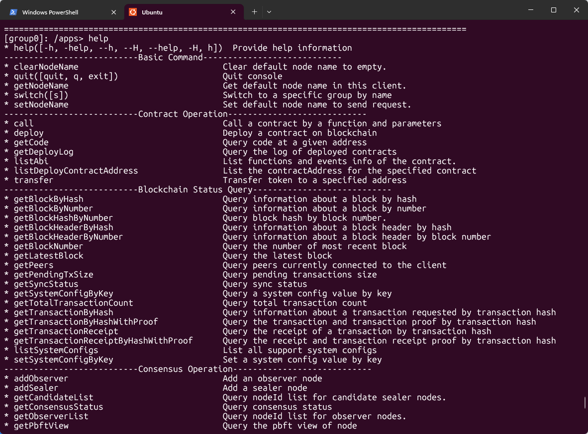

## 使用控制台部署HELLOWorld合约

HelloWorld合约已经内置于控制台中，位于控制台目录`contracts/solidity/HelloWorld.sol`，

~~~
cd ..
deploy HelloWorld
getBlockNumber
 call HelloWorld 0x6849f21d1e455e9f0712b1e99fa4fcd23758e8f1 get
~~~

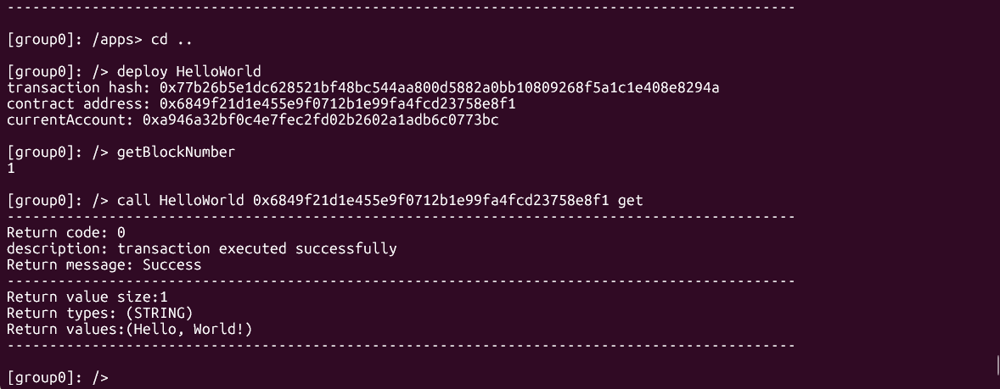

~~~
# 调用get接口获取name变量，此处的合约地址是deploy指令返回的地址
[group0]: /> call HelloWorld 0x6849f21d1e455e9f0712b1e99fa4fcd23758e8f1 get
---------------------------------------------------------------------------------------------
Return code: 0
description: transaction executed successfully
Return message: Success
---------------------------------------------------------------------------------------------
Return value size:1
Return types: (string)
Return values:(Hello, World!)
---------------------------------------------------------------------------------------------

# 查看当前块高，块高不变，因为get接口不更改账本状态
[group0]: /> getBlockNumber
1

# 调用set方法设置name
[group0]: /> call HelloWorld 0x6849F21D1E455e9f0712b1e99Fa4FCD23758E8F1 set "Hello, FISCO BCOS"
transaction hash: 0x2f7c85c2c59a76ccaad85d95b09497ad05ca7983c5ec79c8f9d102d1c8dddc30
---------------------------------------------------------------------------------------------
transaction status: 0
description: transaction executed successfully
---------------------------------------------------------------------------------------------
Receipt message: Success
Return message: Success
Return value size:0
Return types: ()
Return values:()
---------------------------------------------------------------------------------------------
Event logs
Event: {}

# 查看当前块高，因为set接口修改了账本状态，块高增加到2
[group0]: /> getBlockNumber
2

# 退出控制台
[group0]: /> exit
~~~

https://juejin.cn/post/7229603103945834554

# 扩容？

