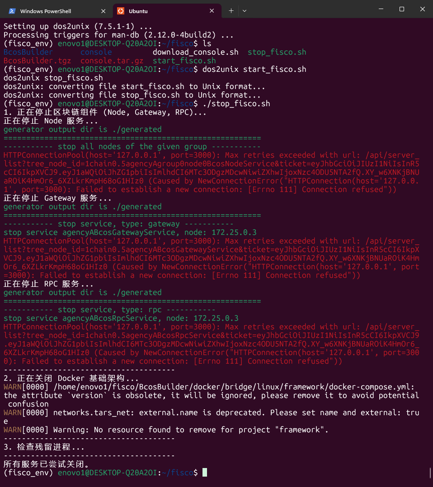

1.   启动docker服务

**启动 Docker Desktop**：确保 Windows 上的 Docker Desktop 已经运行。

**启动基础架构容器**：打开 WSL2 (Ubuntu) 终端，进入部署目录并启动容器。

~~~
# 进入你文档中提到的 docker 目录
cd ~/fisco/BcosBuilder/docker/bridge/linux/framework
# 启动所有基础服务（如 MySQL, Grafana 等）
docker-compose up -d
~~~

2.   启动区块链各组件服务

FISCO BCOS Pro 版本包含 RPC、Gateway 和 Node 三个核心服务。你需要进入 `BcosBuilder` 的虚拟环境，利用其生成的脚本来统一启动。

~~~
cd ~/fisco/BcosBuilder
source fisco_env/bin/activate

cd pro

# 启动 RPC 服务
python3 build_chain.py chain -o start -t rpc

# 启动 网关服务
python3 build_chain.py chain -o start -t gateway

# 启动 节点服务
python3 build_chain.py chain -o start -t node
~~~

如果不行，分别启动

~~~
bash generated/rpc/chain0/start_all.sh
bash generated/gateway/chain0/start_all.sh
bash generated/node/chain0/start_all.sh
~~~

检查服务是否真的跑起来了

~~~
ps -ef | grep -i bcos
netstat -anp | grep 30300  # 检查 RPC 端口
~~~

~~~
cd ~/fisco/console
启动控制台
bash start.sh
~~~

数据库密码

~~~
FISCO
~~~

~~~
http://127.0.0.1:3000/auth.html#/token
~~~

~~~sh
#!/bin/bash

# --- FISCO BCOS Pro 一键启动脚本 (优化版) ---

echo "1. 正在检查并启动 Docker 基础服务..."
# 进入 Docker 部署目录
cd ~/fisco/BcosBuilder/docker/bridge/linux/framework || { echo "错误: 未找到 Docker 目录"; exit 1; }

# 兼容性处理：自动选择 docker-compose 或 docker compose
if command -v docker-compose &> /dev/null; then
    DOCKER_CMD="docker-compose"
else
    DOCKER_CMD="docker compose"
fi

# 启动基础架构容器 (MySQL, Tars Framework 等)
$DOCKER_CMD up -d

echo "--------------------------------------"
echo "正在等待基础架构 (Tars/MySQL) 初始化..."
echo "由于管理台启动较慢，请耐心等待 40 秒，否则会导致连接重置..."
# 增加延时以避开 Connection reset 错误
sleep 40
echo "等待结束，继续执行..."

echo "--------------------------------------"
echo "2. 正在启动区块链组件 (RPC, Gateway, Node)..."
# 进入 Pro 部署目录
cd ~/fisco/BcosBuilder/pro || { echo "错误: 未找到 Pro 部署目录"; exit 1; }

# 指定虚拟环境中的 Python 路径
PYTHON_EXEC=~/fisco/BcosBuilder/fisco_env/bin/python3

# 依次启动 RPC、网关和节点服务
echo "正在启动 RPC 服务..."
$PYTHON_EXEC build_chain.py chain -o start -t rpc
echo "正在启动 Gateway 服务..."
$PYTHON_EXEC build_chain.py chain -o start -t gateway
echo "正在启动 Node 服务..."
$PYTHON_EXEC build_chain.py chain -o start -t node

echo "--------------------------------------"
echo "3. 检查进程状态..."
# 检查是否有 Bcos 开头的相关进程
ps -ef | grep -i bcos | grep -v grep

echo "--------------------------------------"
echo "启动程序执行完毕。"
echo "您可以前往 ~/fisco/console 运行 bash start.sh 开启控制台。"
~~~

# 退出

1.   控制台

~~~
exit
~~~

2.   执行停止命令

~~~
cd pro
# 停止 RPC 服务
python3 build_chain.py chain -o stop -t rpc

# 停止 网关服务
python3 build_chain.py chain -o stop -t gateway

# 停止 节点服务
python3 build_chain.py chain -o stop -t node
~~~

注意：如果该命令提示不支持 stop，你可以手动进入生成的目录执行脚本：

~~~
bash generated/rpc/chain0/stop_all.sh
bash generated/gateway/chain0/stop_all.sh
bash generated/node/chain0/stop_all.sh
~~~

3.   关闭 Docker 基础架构

~~~
cd ~/fisco/BcosBuilder/docker/bridge/linux/framework

docker-compose down
~~~

4.   检查

~~~
ps -ef | grep -i bcos
~~~

~~~sh
#!/bin/bash

# --- FISCO BCOS Pro 一键关闭脚本 ---

echo "1. 正在停止区块链组件 (Node, Gateway, RPC)..."
# 进入 BcosBuilder 部署目录
cd ~/fisco/BcosBuilder/pro || { echo "错误: 未找到 Pro 部署目录"; exit 1; }

# 指定虚拟环境中的 Python 路径，直接调用以提高兼容性
PYTHON_EXEC=~/fisco/BcosBuilder/fisco_env/bin/python3

# 依次停止服务 (按照启动的逆序停止更为稳妥)
echo "正在停止 Node 服务..."
$PYTHON_EXEC build_chain.py chain -o stop -t node

echo "正在停止 Gateway 服务..."
$PYTHON_EXEC build_chain.py chain -o stop -t gateway

echo "正在停止 RPC 服务..."
$PYTHON_EXEC build_chain.py chain -o stop -t rpc

echo "--------------------------------------"
echo "2. 正在关闭 Docker 基础架构..."
# 进入 Docker 部署目录
cd ~/fisco/BcosBuilder/docker/bridge/linux/framework || { echo "错误: 未找到 Docker 目录"; exit 1; }
# 停止并移除容器 (释放内存资源)
docker-compose down

echo "--------------------------------------"
echo "3. 检查残留进程..."
# 确认是否还有 bcos 相关进程在运行
ps -ef | grep -i bcos | grep -v grep

echo "--------------------------------------"
echo "所有服务已尝试关闭。"
~~~

# sh脚本可能用不了需要转换一下

~~~
sudo apt install -y dos2unix

dos2unix start_fisco.sh
dos2unix stop_fisco.sh
~~~

