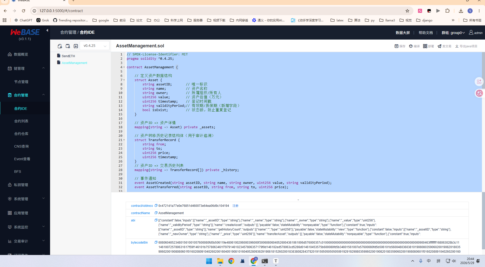
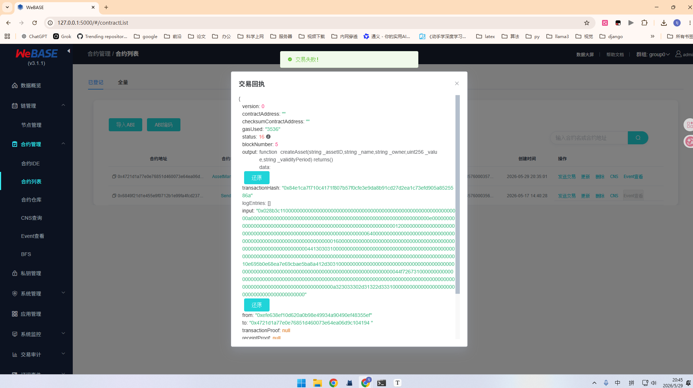
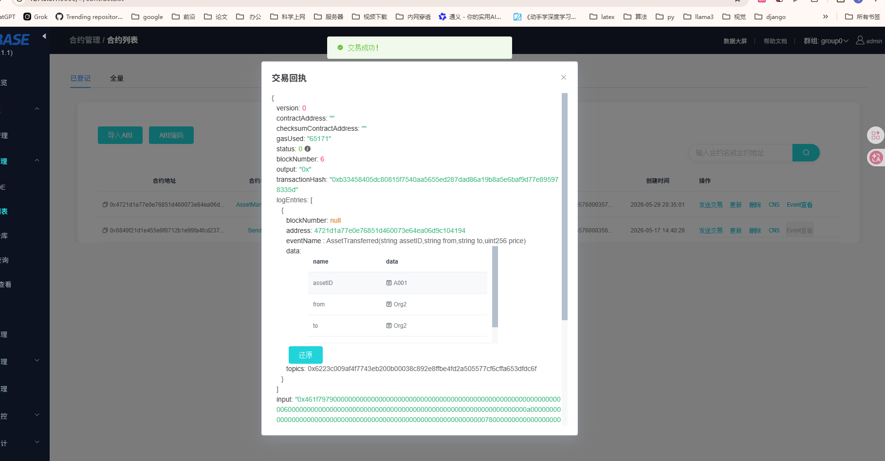
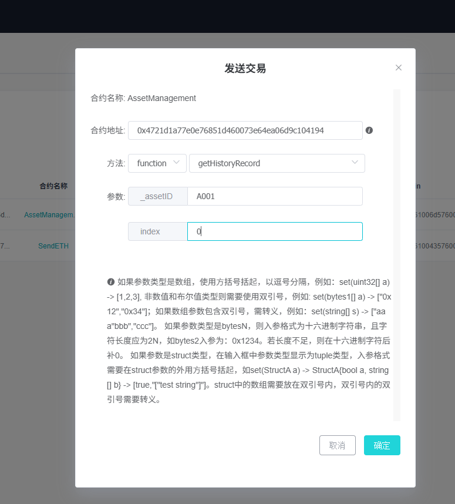
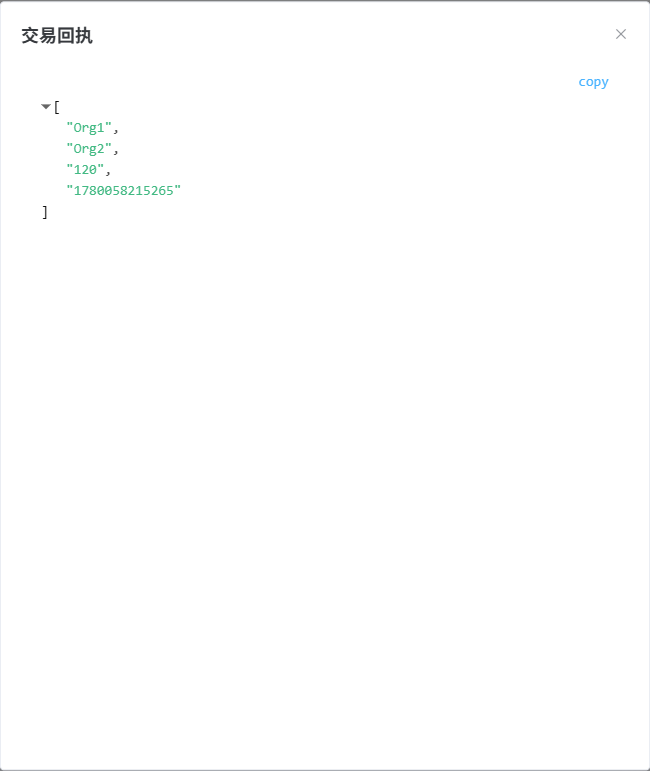

**《基于联盟链的工业物联网（IoT）设备资产管理与审计系统》**

完美契合你模板里的“数控机床”示例，组织可以设计为：设备制造厂（Org1）、使用企业（Org2）、第三方质检/审计机构（Org3）。

1.   智能合约AssetManagement.sol

~~~
// SPDX-License-Identifier: MIT
pragma solidity ^0.4.25;

contract AssetManagement {
    
    // 定义资产数据结构
    struct Asset {
        string assetID;       // 唯一标识
        string name;          // 资产名称
        string owner;         // 所属组织/所有人
        uint256 value;        // 资产估值（万元）
        uint256 timestamp;    // 登记时间戳
        string validityPeriod;// 有效期/质保期（新增字段）
        bool isExist;         // 状态锁，防止重复登记
    }

    // 资产ID => 资产详情
    mapping(string => Asset) private _assets;
    
    // 资产转移历史记录结构体（用于审计追溯）
    struct TransferRecord {
        string from;
        string to;
        uint256 price;
        uint256 timestamp;
    }
    // 资产ID => 交易历史列表
    mapping(string => TransferRecord[]) private _history;

    // 事件通知
    event AssetCreated(string assetID, string name, string owner, uint256 value, string validityPeriod);
    event AssetTransferred(string assetID, string from, string to, uint256 price);

    /**
     * @dev 功能一：资产登记
     */
    function createAsset(
        string memory _assetID, 
        string memory _name, 
        string memory _owner, 
        uint256 _value,
        string memory _validityPeriod
    ) public {
        require(!_assets[_assetID].isExist, "Error: Asset ID already exists.");
        
        _assets[_assetID] = Asset({
            assetID: _assetID,
            name: _name,
            owner: _owner,
            value: _value,
            timestamp: now,
            validityPeriod: _validityPeriod,
            isExist: true
        });

        emit AssetCreated(_assetID, _name, _owner, _value, _validityPeriod);
    }

    /**
     * @dev 功能二：资产交易（所有权转移）
     */
    function transferAsset(
        string memory _assetID, 
        string memory _newOwner, 
        uint256 _price
    ) public {
        require(_assets[_assetID].isExist, "Error: Asset does not exist.");
        
        string memory oldOwner = _assets[_assetID].owner;
        
        // 更新账本状态
        _assets[_assetID].owner = _newOwner;
        _assets[_assetID].value = _price; // 交易后更新最新估值

        // 记录审计历史
        _history[_assetID].push(TransferRecord({
            from: oldOwner,
            to: _newOwner,
            price: _price,
            timestamp: now
        }));

        emit AssetTransferred(_assetID, oldOwner, _newOwner, _price);
    }

    /**
     * @dev 功能三：查询当前资产状态
     */
    function getAsset(string memory _assetID) public view returns(
        string memory assetID,
        string memory name,
        string memory owner,
        uint256 value,
        uint256 timestamp,
        string memory validityPeriod
    ) {
        require(_assets[_assetID].isExist, "Error: Asset does not exist.");
        Asset memory asset = _assets[_assetID];
        return (asset.assetID, asset.name, asset.owner, asset.value, asset.timestamp, asset.validityPeriod);
    }

    /**
     * @dev 功能三扩充：审计查询（获取资产变更历史流转记录次数）
     */
    function getHistoryCount(string memory _assetID) public view returns (uint256) {
        return _history[_assetID].length;
    }

    /**
     * @dev 获取具体的某一笔历史交易记录
     */
    function getHistoryRecord(string memory _assetID, uint256 index) public view returns (
        string memory from,
        string memory to,
        uint256 price,
        uint256 timestamp
    ) {
        require(index < _history[_assetID].length, "Error: Index out of bounds.");
        TransferRecord memory record = _history[_assetID][index];
        return (record.from, record.to, record.price, record.timestamp);
    }
}
~~~

~~~
# 1. 部署合约
[group:1]> deploy AssetManagement

# 2. 调用 createAsset 登记资产 (参数：ID, 名称, 组织, 价值, 有效期)
[group:1]> call AssetManagement 0x合约地址 createAsset "A001" "数控机床A-01" "Org1" 100 "2030-12-31"

# 3. 查询当前资产信息验证结果
[group:1]> call AssetManagement 0x合约地址 getAsset "A001"

# 4. 调用 transferAsset 变更所有权 (将资产A001以120万转移给Org2)
[group:1]> call AssetManagement 0x合约地址 transferAsset "A001" "Org2" 120

# 5. 审计查询：查看历史流转记录数
[group:1]> call AssetManagement 0x合约地址 getHistoryCount "A001"
~~~

1.   登记资产createAsset 

~~~
_assetID: A001

_name: 数控机床A-01

_owner: Org1

_value: 100 (注意：uint256 类型直接填纯数字，不要带引号或单位)

_validityPeriod: 2030-12-31
~~~

1.   查询当前资产信息getAsset 
2.   调用 transferAsset 变更所有权 (将资产A001以120万转移给Org2)

~~~
_assetID: A001

_newOwner: Org2

_price: 120
~~~

1.   审计查询：查看历史流转记录数getHistoryCount 

~~~
参数填 "A001", 索引填 0）
~~~

# 项目

## 1. 业务核心：解决传统资产管理的“篡改”与“赖账”痛点

在传统的管理系统中，资产数据存在中心化数据库（如 MySQL）里。如果 Org1、Org2 和审计机构协同，任何一方有权限的人都能偷偷改掉机床的估值或所有者。

-   

    **在这个项目里**：企业通过你的**前端界面**填入资产数据 ，请求通过 **WeBASE** 发送到区块链网络，由 3 个组织（Org1、Org2、审计机构）共同记账和背书 。  

-   数据一旦上链，无论是谁，**哪怕是系统管理员，也无法直接修改和删除**历史记录，从而保证了资产的绝对真实性。

## 2. 技术核心：三大功能模块的底层联动

项目的硬核技术点在于通过智能合约（Solidity）和 WeBASE API 完美落地了老师要求的三个核心功能 ：  

-   

    **核心一：资产登记（数据上链）** 前端把资产ID、名称、估值以及你新增的**有效期**作为参数，通过 WeBASE-Front 封装的接口发送 。底层节点利用 PBFT 共识机制将数据打包进区块，永久固化状态 。  

-   

    **核心二：资产交易（状态原子流转）** 当资产的所有权从 Org1 转移到 Org2 时 ，智能合约在同一个区块周期内**同时完成**两个动作：修改当前资产的最新所有人，并将这笔交易的详情（谁卖给谁、多少钱、什么时间）追加到历史变更队列中 。  

-   

    **核心三：审计查询（全生命周期追溯）** 这是最体现区块链价值的地方 。审计机构通过前端或 WeBASE 平台，输入一个资产 ID，智能合约就能把该资产从“诞生（首次登记）”到“中间经历了 N 次转手”的全生命周期流转轨迹（时间轴）完整无误地拉取出来 。  

“本项目的核心是基于 **FISCO BCOS** 联盟链底层平台与 **WeBASE** 中间件架构 ，设计并实现了一个**去中心化的资产全生命周期管理与审计系统** 。  

系统通过智能合约（Solidity）规范了资产在多组织间的**无信任登记**与**可信所有权转移** ；利用区块链不可篡改与分布式共识特性 ，为第三方机构提供了**全流程可追溯的穿透式审计查询功能** ；并通过 WeBASE 前端实现了区块链复杂底层逻辑的可视化与应用落地 。”  

# 项目功能

基于你上传的课设要求文档以及当前的 WeBASE 部署架构，这个项目主要实现了**三大核心功能模块** 。这三个模块共同构建了资产从“出生”到“流转”再到“审计”的完整全生命周期管理：  

## 1. 资产登记（数据上链凭证）

该功能实现了企业将实物资产或数字资产的初始信息安全地记录到区块链账本中 。  

-   

    **用户操作**：用户在 WeBASE 前端表单中输入资产的唯一标识（如设备序列号 `_assetID`）、资产名称（如“数控机床A-01”）、所属组织（如 `Org1`）以及资产的估值 。  

-   

    **扩展属性**：为了满足课设中“修改资产属性字段”的要求，系统额外添加了有效期/质保期（`_validityPeriod`）字段 。  

-   

    **底层逻辑**：智能合约会首先校验该资产 ID 是否已存在。若不存在，则自动获取当前区块链系统的**登记时间戳**，并将完整的资产数据持久化写入区块链的状态数据库中 。数据一旦上链，便具备了防篡改的特性。  

## 2. 资产交易（所有权可信变更）

该功能通过智能合约实现资产在不同组织或企业之间的所有权流转，自动且原子化地更新账本状态 。  

-   **用户操作**：在前端选择某一已登记的资产，指定新的接收方组织（如将所有权由 `Org1` 变更为 `Org2`）以及最新的交易价格。

-   

    **底层逻辑**：合约在执行时会执行多组织背书与共识逻辑 。一旦共识达成，账本中的 `owner`（所有人）字段将自动更新为新组织，同时 `value`（资产估值）也会更新为最新的交易价格 。  

-   **自动记账**：在更新当前状态的同时，合约内部会触发一个隐藏的“记账流”，将这笔交易的流转详情（原所有人、新所有人、交易价、交易时间）自动追加到该资产的历史变更队列中。

## 3. 审计查询（全生命周期追溯）

该功能主要面向第三方审计机构或监管部门，支持按资产 ID 查询其完整的交易历史，确保资产的每一步流转都具备强力的可追溯性 。  

-   

    **资产状态快照**：支持直接查询某一资产当前的最新状态（如当前在哪家组织手里、目前值多少钱、是否在有效期内） 。  

-   

    **链码级历史穿透**：直接调用智能合约的查询函数（或底层的 `GetHistory` 逻辑），返回该资产在链上的完整流转记录 。  

-   **可视化时间轴**：前端通过轮询合约中的历史记录，可以在网页上为审计人员渲染出一条直观的**资产流转时间轴**（例如：`[2023年由Org1登记] → [2024年以120万转让给Org2] → [2026年由审计机构核验]`），清晰展现资产从登记到当前状态的每一次变更轨迹。