# 后端搭建

## 目录结构

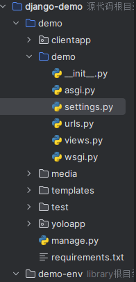

-   demo主应用文件夹
    -   setting设置
    -   urls路由

# 主应用

## setting

-   `ALLOWED_HOSTS = ["*"]`允许所有主机

-   `INSTALLED_APPS` 子应用

-   `DATABASES`数据库

-   语言和时区

    ~~~
    LANGUAGE_CODE = "en-us" 
    
    TIME_ZONE = 'Asia/Shanghai'
    ~~~

-   路径配置
    ~~~
    STATIC_URL = "static/"
    RUNS_ROOT = os.path.join(BASE_DIR, 'runs')
    RUNS_URL = '/runs/'  # 前端访问前缀
    STATICFILES_DIRS = [
        BASE_DIR / "static",
        BASE_DIR / "runs",
    
    ]
    MEDIA_URL = '/media/'
    MEDIA_ROOT = BASE_DIR / 'media'
    ~~~

    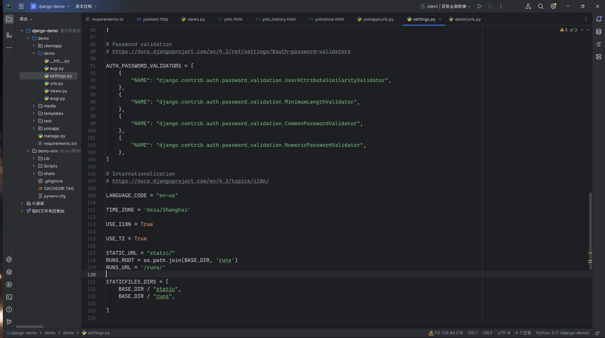

## urls

-   添加子应用路由
    ~~~
    urlpatterns = [
        path("", views.index, name="index"),
        path("yolo/", include('yoloapp.urls')),
        path("clientapp/", include('clientapp.urls')),
    ]
    ~~~

    

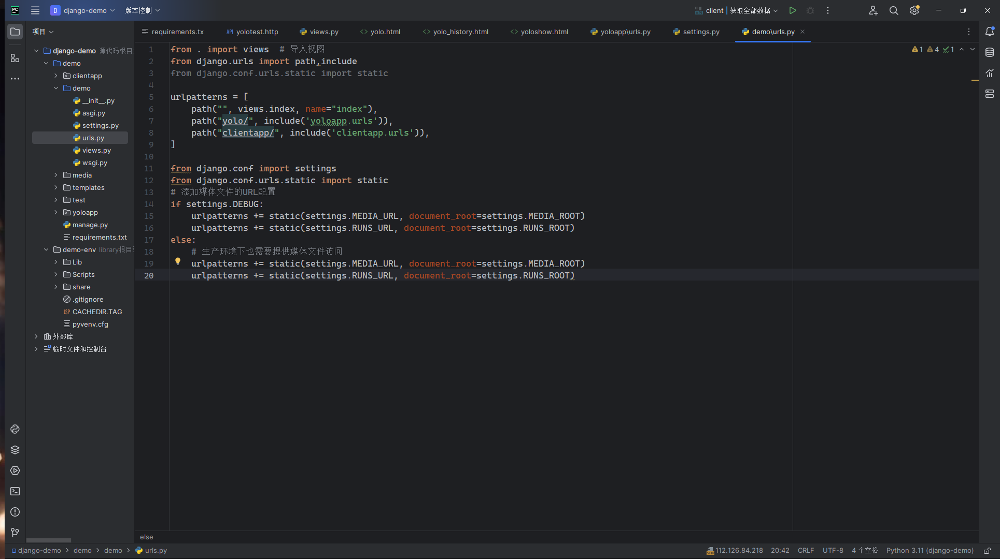

# 图像检测应用yoloapp

## model模型

-   存两个数据
    -   图片路径
    -   创建时间
-   支持各种格式

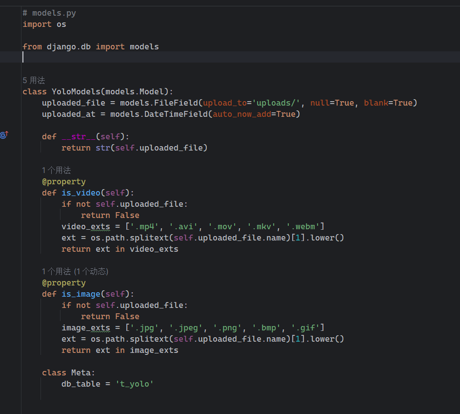

## 序列化器serializers

-   序列化五个字段
    -   原始路径
    -   检测图 路径
    -   创建时间
    -   id
    -   兼容img

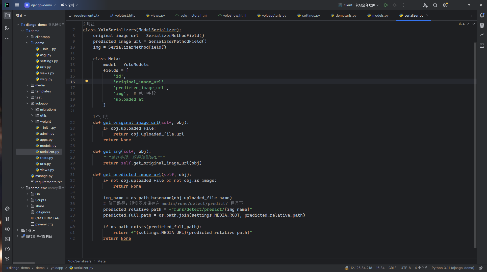

## 视图views

-   获取视觉检测模型视图`get_model`

-   视觉图片检测视图`class YoloPredictAPIView(APIView):`
    -   提供post请求方式

-   视觉视频检测视图`class YoloVideoStreamView(View):`
    -   提供get请求方式

-   发送邮件视图 `class SendEmailView(APIView):`

    -   提供post请求

-   查看历史查询记录视图以及分页器

    -   `class LargeResultsSetPagination(PageNumberPagination):`
    -   `class HistoryDataView(ListAPIView):`

    

## urls路由

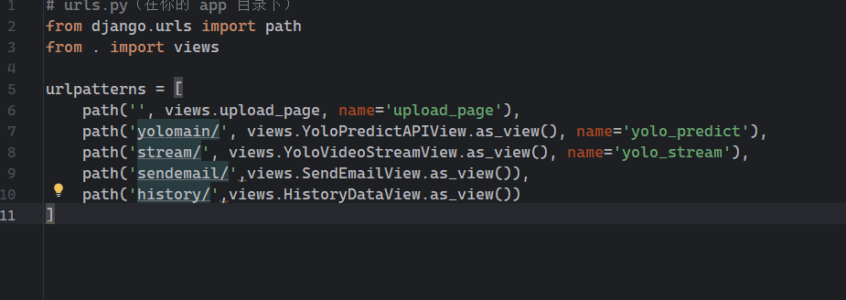

# 客户端参数应用

## models模型

-   如图

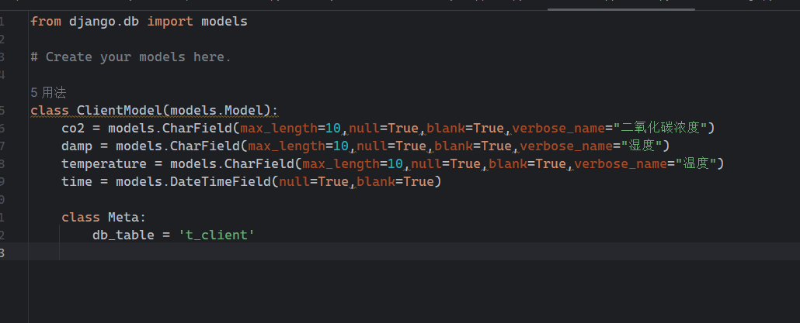

## 序列化器serializers

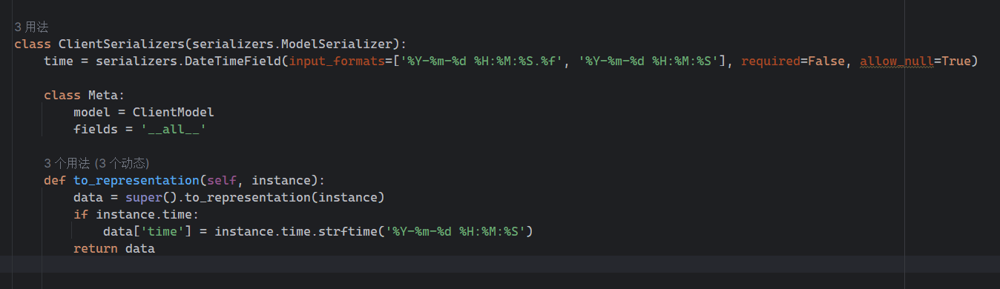

## 视图views

-   添加数据视图`class ClientListView(ListAPIView):`

-   数据添加视图`class ClientAddView(CreateAPIView):`

## 路由

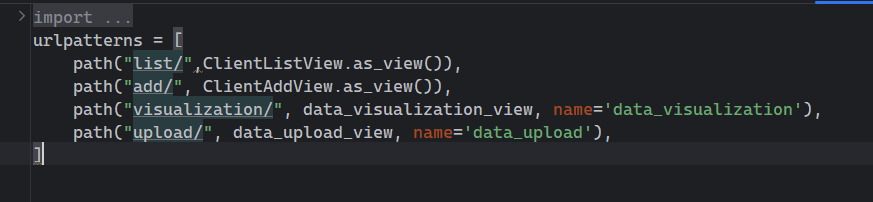

# 接口测试test

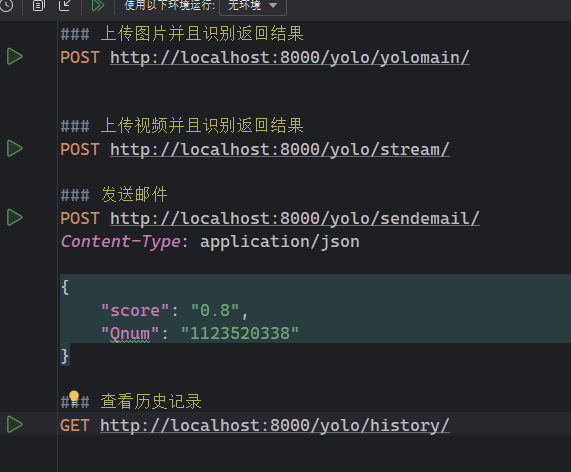

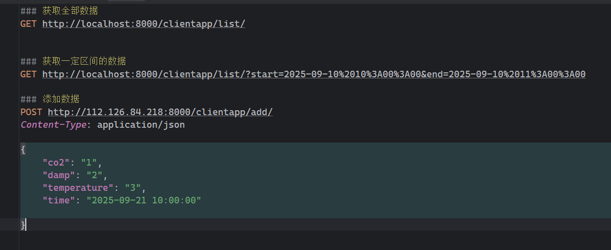

