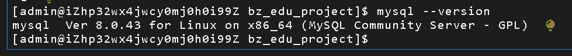
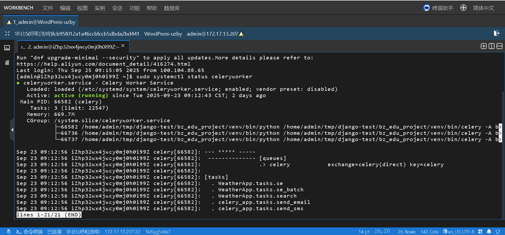
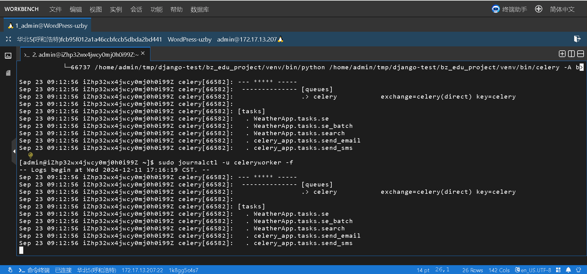
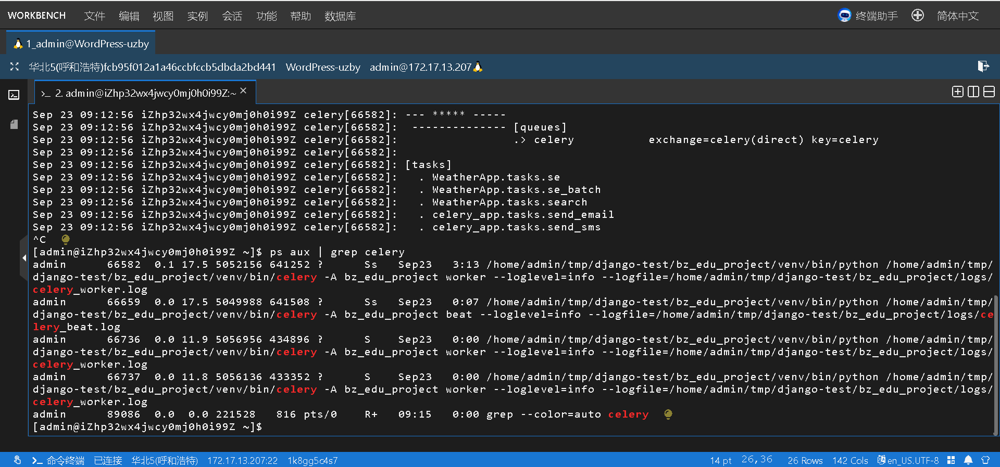
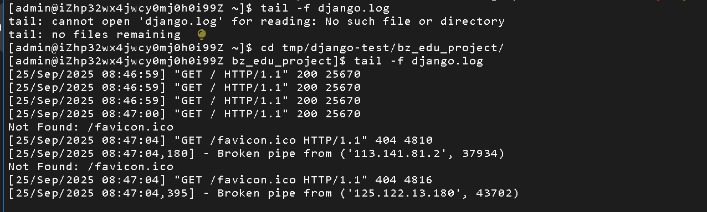
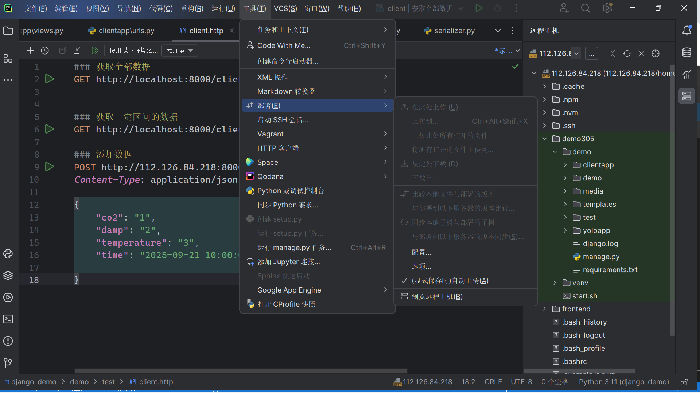

# 服务器

## 防火墙

- 加一条规则，mysql

## 设置数据库

### 查看版本

~~~
查看数据库的版本以及类别

[root@iZ2ze54i6a2rnixm5aycg7Z ~]# mysql --version
mysql  Ver 15.1 Distrib 10.5.27-MariaDB, for Linux (x86_64) using readline 5.1
~~~

### 设置密码

- 停止服务

~~~
systemctl stop mariadb

如果报错Failed to stop mariadb.service: Unit mariadb.service not loaded.
就
systemctl stop mysqld
~~~

- 跳过权限

~~~shell
mysqld_safe --skip-grant-tables --skip-networking &
~~~

显示如下

~~~shell
[root@iZ2ze54i6a2rnixm5aycg7Z ~]# mysqld_safe --skip-grant-tables --skip-networking &
[1] 4618
[root@iZ2ze54i6a2rnixm5aycg7Z ~]# 250916 15:06:24 mysqld_safe Logging to '/www/server/data/iZ2ze54i6a2rnixm5aycg7Z.err'.
250916 15:06:25 mysqld_safe Starting mariadbd daemon with databases from /www/server/data

~~~

- 新建一个窗口

~~~
mysql -u root

重置密码
FLUSH PRIVILEGES;
ALTER USER 'root'@'localhost' IDENTIFIED BY 'lintongjun1';

注意：lintongjun1换成你自己的密码

exit
~~~

- 杀死跳过进程服务

~~~
pkill mysqld_safe
pkill mysqld
~~~

- 启动数据库等操作

~~~
systemctl start mysqld
systemctl enable mysqld开机自启

"""
这个是成功状态只是兼容性问题
systemctl enable mysqld
mysqld.service is not a native service, redirecting to systemd-sysv-install.
Executing: /usr/lib/systemd/systemd-sysv-install enable mysqld
"""

~~~

### 连接本地datagrip

### **确认 MariaDB 是否监听公网 IP**

尽管你已经在安全组中放行了 `3306` 端口，但如果 MariaDB 只监听本地回环地址 `127.0.0.1`，外部依然无法访问。

~~~
netstat -tlnp | grep :3306
如果什么都没有
 你没有设置 bind-address，并且系统默认只监听本地 socket，没有监听 TCP 3306 端口！
 
 vim /etc/my.cnf
 在 [mysqld] 段下，添加一行：
 bind-address = 0.0.0.0
  然后重启 MariaDB 服务：
  systemctl restart mysqld
  再次检查
  netstat -tlnp | grep :3306
~~~

- 取消ip限制远程登录（全部都解除了，有风险，但是自己的ip会变动，所以只能如此了）

~~~
-- 一条命令搞定远程访问（开发用）
GRANT ALL PRIVILEGES ON edu_project.* TO 'root'@'%' IDENTIFIED BY 'lintongjun1';
FLUSH PRIVILEGES;

~~~

## 下载python3.11

~~~
# 1. 安装编译依赖
yum groupinstall -y "Development Tools"
yum install -y gcc openssl-devel bzip2-devel libffi-devel zlib-devel xz-devel

# 2. 下载 Python 3.11.10（当前稳定版）
cd /usr/src
curl -O https://www.python.org/ftp/python/3.11.10/Python-3.11.10.tgz

# 3. 解压
tar xzf Python-3.11.10.tgz

# 4. 编译安装（不会覆盖系统默认 python）
cd Python-3.11.10
./configure --enable-optimizations --prefix=/usr/local
make altinstall # 这里很慢

# 5. 验证安装
/usr/local/bin/python3.11 --version
~~~

## 创建虚拟环境

~~~
pip3 install virtualenv
virtualenv django-demo-env   #（名字）
source django-demo-env/bin/activate # 激活
~~~

## redis 数据库

这个下载直接是用的包管理器比较方便，不是源码编译的

~~~
# 安装 Redis
sudo yum install -y redis

# 启动 Redis
sudo systemctl start redis

# 设置开机自启
sudo systemctl enable redis

# 检查状态
sudo systemctl status redis
~~~

- 验证是否安装成功

~~~
# 连接 Redis
redis-cli

# 在 redis> 提示符下输入
ping

# 如果返回
PONG

# 说明 Redis 正常运行！输入 exit 退出。
~~~

- 配置

~~~
bind 127.0.0.1  # 改为 bind 0.0.0.0 允许所有IP（不安全！仅测试用）
protected-mode yes  # 改为 no（或设置密码）
~~~

- 重启

~~~
sudo systemctl restart redis   
~~~

## 开启项目

-   查看异步worker是否开启

-   查看日志

-   查看进程

-   查看项目日志

-   从本地上传项目代码
-   

