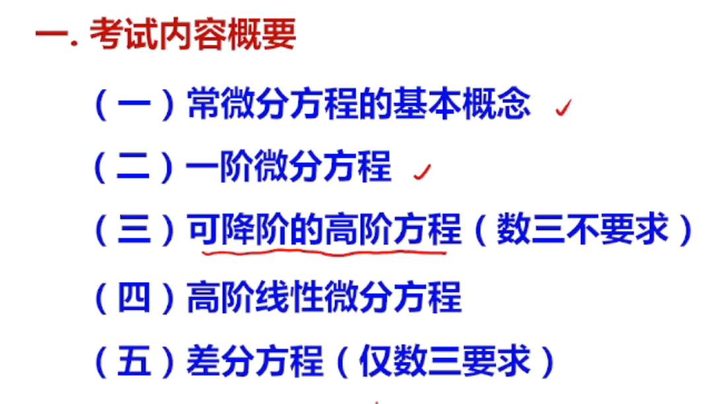

## 微分方程

-   定义：含有y，y',y'',x
-   阶：所出现的未知函数最高阶的导数的阶数
-   解：满足函数的解
-   通解：如果微分方程的解含有任意常数，任意常数的个数与微分方程的阶数相同
-   初始条件：确定特解的一组常数
-   积分曲线：方程的一个解在平面对应一条曲线

## 一阶微分方程
有时候需要把xy对调能看出是线性方程
或者是变量代换
### 可分离变量

**方程中只包含一阶导数 y′ 。**
**方法**
变量分离
两边积分
$$y' = f(x)g(y)$$

$$\frac{dy}{dx} = f(x)g(y) \Rightarrow \frac{dy}{g(y)} = f(x)\,dx$$

 - **例**（2006）：$y' = \frac{y(1-x)}{x}$

$\int \frac{dy}{y} = \int \frac{1-x}{x}dx$ → $\ln|y| = \ln|x| - x + C_1$

$y = Cxe^{-x}$

**例**：$y' + xy^2 - y^2 = 1 - x$

$y' = (1-x)(1+y^2)$ → $\int \frac{dy}{1+y^2} = \int (1-x)dx$

- **例**：$y' = \cos(x + y)$

令 $x + y = u$，则 $1 + y' = u'$

$u' = 1 + \cos u$，化为可分离变量方程

### 齐次方程

> 形如 $\frac{dy}{dx}=f\left(\frac{y}{x}\right)$，注意 $\frac{y}{x}$ 结构有时不会直接给出，需作简单变换才能看出。

**解法**
- 令$u=\frac{y}{x}$，则 $y=xu$，两边求导得 $$y'=u+xu'$$，代入化为 $u$ 关于 $x$ 的可分离变量方程

$$\frac{dy}{dx} = u + x\frac{du}{dx}$$

代入得 $u + x\frac{du}{dx} = \varphi(u)$，化为可分离变量方程

 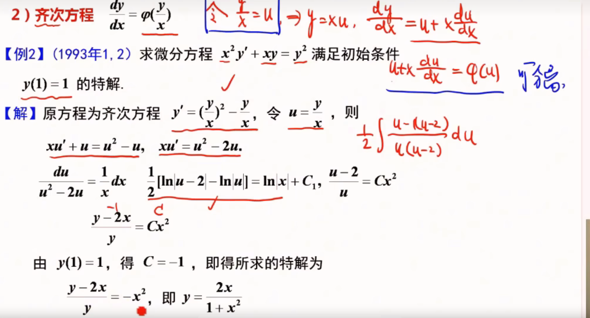

### 一阶线性微分方程

$$y' + P(x)y = Q(x)$$

$$y = e^{-\int P(x)\,dx}\left[\int Q(x)e^{\int P(x)\,dx}\,dx + C\right]$$

-   例

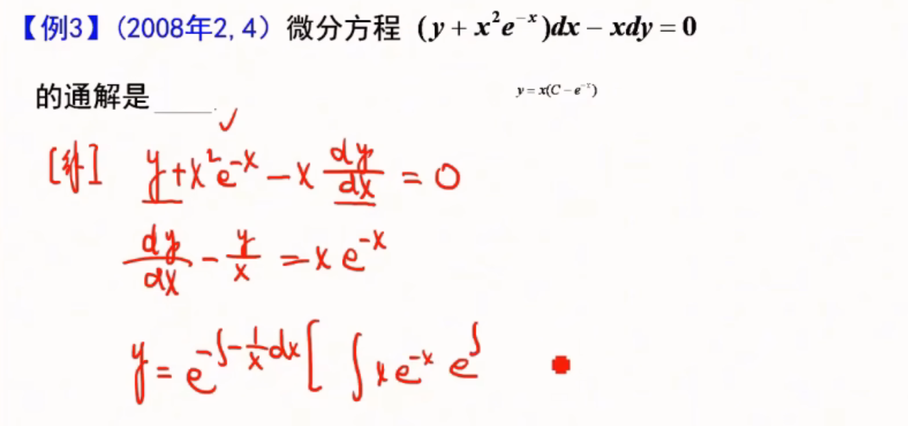
### 全微分方程
左边等于一个函数的二元全微分
$$P(x,y)dx + Q(x,y)dy = 0$$

判定：$$\frac{\partial P}{\partial y} = \frac{\partial Q}{\partial x}$$

- 例：$(2xy + y^2)dx + (x^2 + 2xy)dy = 0$

$\frac{\partial P}{\partial y} = 2x + 2y = \frac{\partial Q}{\partial x}$，是全微分方程

取 $(x_0, y_0) = (0, 0)$

$$u(x, y) = \int_0^x 0\,dt + \int_0^y (x^2 + 2xt)\,dt = x^2y + xy^2$$

通解 $x^2y + xy^2 = C$
## 可降阶的高阶方程（数三不要求）

| 类型  | 形式               | 解法                                 |
| --- | ---------------- | ---------------------------------- |
| 1   | $y'' = f(x)$     | 直接两次积分（多次积分）                       |
| 2   | $y'' = f(x, y')$ | 令 $y' = p$，$y'' = \frac{dp}{dx}$（） |
| 3   | $y'' = f(y, y')$ | 令 $y' = p$，$y'' = p\frac{dp}{dy}$  |
|     |                  |                                    |

- 例：$y'' = e^x + x$

$y' = e^x + \frac{1}{2}x^2 + C_1$

$y = e^x + \frac{1}{6}x^3 + C_1x + C_2$

- 例（第3类）：$2yy'' = (y')^2 + y^2$，$y(0)=1$，$y'(0)=-1$
- **无显式x**   P159

令 $y' = p$，$y'' = p\frac{dp}{dy}$，代入 $2yp\frac{dp}{dy} = p^2 + y^2$

整理 $2\frac{p}{y}\frac{dp}{dy} = \left(\frac{p}{y}\right)^2 + 1$，令 $u = \frac{p}{y}$

化为 $2yu\frac{du}{dy} = 1 - u^2$，得 $u = -1$

$p = -y$ → $y' = -y$ → $y = Ce^{-x}$，代入初值 $y = e^{-x}$

#  高阶线性微分方程

## 定义

**二阶齐次线性微分方程**：
**齐次**：$y'' + p(x)y' + q(x)y = 0$（二阶）

**二阶非齐次线性微分方程**：
**非齐**：$y'' + p(x)y' + q(x)y = f(x)$

## 类型

### 二阶线性常系数齐次方程

$$
y'' + py' + q*y = 0
$$
$p, q$ 都是常数

### 二阶常系数非齐次方程

$$
y'' + py' + q*y = f(x)
$$
$p, q$ 都是常数

## 解的形式

### 齐次解的结构

如果y1，y2都是齐次方程的解（线性无关（比不等于常数）），则C1y1+C2y2也是齐次方程的通解

### 非齐次解的结构

**齐通 + 非齐特 = 非通**

1. y1，y2是齐次方程的线性无关的特解
y = C1y1(x)+C1y2(x) + y*()

- 若 $y^*$ 是非齐特解 → 非通 $y = C_1y_1 + C_2y_2 + y^*$

2. 如果y1和y2都是非齐次方程的解，那么y1-y2是齐次方程的解
**两个非齐次方程的两个特解的差是齐次的解**

3. 叠加原理：
	若 $y_1$ 是方程 ① $y'' + P(x)\cdot y' + Q(x)\cdot y = f_1(x)$ 的解，
	 且 $y_2$ 是方程 ② $y'' + P(x)\cdot y' + Q(x)\cdot y = f_2(x)$ 的解，
	 则$y_1 + y_2$ 是方程 ③ $y'' + P(x)\cdot y' + Q(x)\cdot y = f_1(x) + f_2(x)$ 的解。

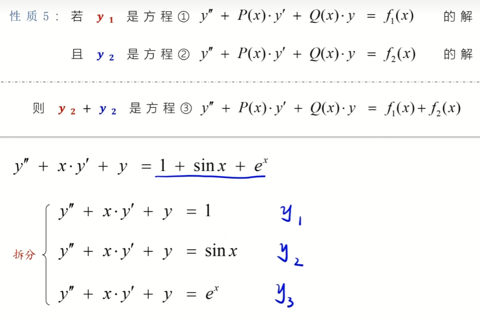

> 非齐次方程右端拆为多函数之和时，总特解等于各特解之和。

- **性质5**：若 $y_1$ 是 $y'' + P(x)y' + Q(x)y = f_1(x)$ 的解，$y_2$ 是 $y'' + P(x)y' + Q(x)y = f_2(x)$ 的解，则 $y_1 + y_2$ 是 $y'' + P(x)y' + Q(x)y = f_1(x) + f_2(x)$ 的解
- **应用**：$y'' + xy' + y = 1 + \sin x + e^x$ 拆为三个方程分别求特解，$y^* = y_1 + y_2 + y_3$

---

### 齐次方程三种特征根对应的通解形式

特征方程 $r^2 + pr + q = 0$，设两特征根 $r_1, r_2$

| 根的情况                          | 通解                                                  |
| ----------------------------- | --------------------------------------------------- |
| $r_1 \neq r_2$（实）             | $y = C_1e^{r_1x} + C_2e^{r_2x}$                     |
| $r_1 = r_2 = r$               | $y = e^{rx}(C_1 + C_2x)$                            |
| $r_{1,2} = \alpha \pm i\beta$ | $y = e^{\alpha x}(C_1\cos\beta x + C_2\sin\beta x)$ |

-   三阶例题

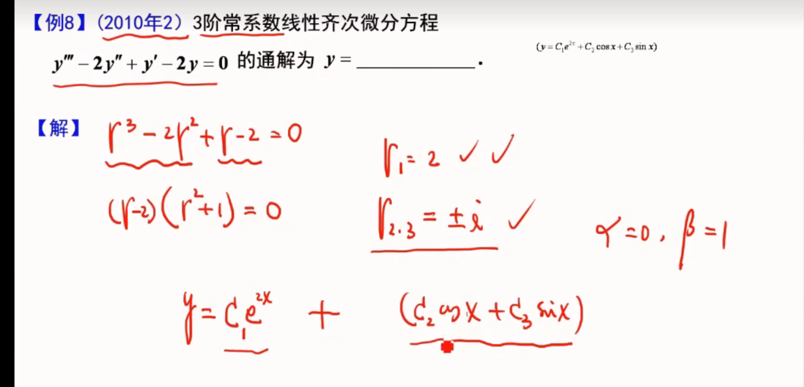

### 非齐次方程两种 $f(x)$ 类型的特解设解形式

$$y'' + py' + qy = f(x)$$

| $f(x)$ 形式                                       | 特解 $y^*$ 设解                                                           |
| ----------------------------------------------- | --------------------------------------------------------------------- |
| $P_m(x)e^{\lambda x}$                           | $y^* = x^k Q_m(x) e^{\lambda x}$                                      |
| $e^{\alpha x}[P_l\cos\beta x + P_n\sin\beta x]$ | $y^* = x^k e^{\alpha x}[R_m^{(1)}\cos\beta x + R_m^{(2)}\sin\beta x]$ |
最终解 = 齐次方程通解 + 非齐次方程特解

$m = \max\{l, n\}$，$k$ 取 $\lambda$（或 $\alpha \pm i\beta$）在特征根中的重数（0/1/2）

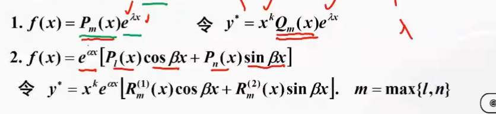

> $f(x)$ 有两种标准形式，分别对应不同的设解策略。

- **类型一**：$f(x) = e^{\lambda x} P_n(x)$，$P_n(x)$ 为 $n$ 次多项式1
- **类型二**：$f(x) = e^{\lambda x}[P_n(x)\sin(\omega x) + P_l(x)\cos(\omega x)]$，设解时取 $m = \max\{n, l\}$

## 解题步骤

### 齐次方程

对于 $y'' + py' + qy = 0$（$p, q$ 为常数）：

**第一步**：写出特征方程
$$r^2 + pr + q = 0$$

**第二步**：求特征根 $r_1, r_2$，计算判别式 $\Delta = p^2 - 4q$

**第三步**：按 $\Delta$ 的符号套通解公式

| 判别式          | 特征根                                | 通解                                                    |
| ------------ | ---------------------------------- | ----------------------------------------------------- |
| $\Delta > 0$ | 两不等实根 $r_1 \neq r_2$               | $y = C_1 e^{r_1 x} + C_2 e^{r_2 x}$                   |
| $\Delta = 0$ | 二重实根 $r_1 = r_2 = r$               | $y = e^{rx}(C_1 + C_2 x)$                             |
| $\Delta < 0$ | 共轭复根 $r_{1,2} = \alpha \pm i\beta$ | $y = e^{\alpha x}(C_1 \cos\beta x + C_2 \sin\beta x)$ |

### 非齐次方程（类型一）

$f(x) = P_m(x) e^{\lambda x}$，其中 $P_m(x)$ 为 $m$ 次多项式。

**第一步**：解特征方程 $r^2 + pr + q = 0$，得齐次方程通解。

**第二步**：由 $f(x)$ 读出 $\lambda$ 和多项式次数 $m$，判定 $\lambda$ 在特征根中的重数 $k$：
- $\lambda$ 不是特征根：$k = 0$
- $\lambda$ 是单重特征根：$k = 1$
- $\lambda$ 是二重特征根：$k = 2$

**第三步**：设特解
$$y^* = x^k \, Q_m(x) \, e^{\lambda x}$$
其中 $Q_m(x)$ 是 $m$ 次待定多项式（与 $P_m(x)$ 同次），例如：
- $m = 0$ 时设 $Q_m(x) = A$
- $m = 1$ 时设 $Q_m(x) = Ax + B$
- $m = 2$ 时设 $Q_m(x) = Ax^2 + Bx + C$

**第四步**：将 $y^*$ 代回原方程，比较同次项系数解出 $Q_m(x)$，得非齐次通解：
$$y = \text{齐通} + y^*$$

**例：**

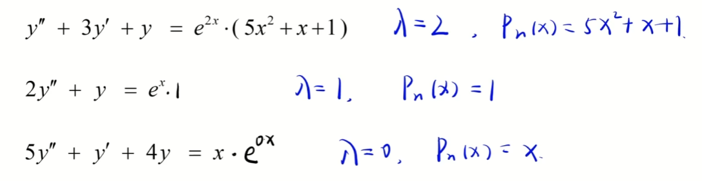
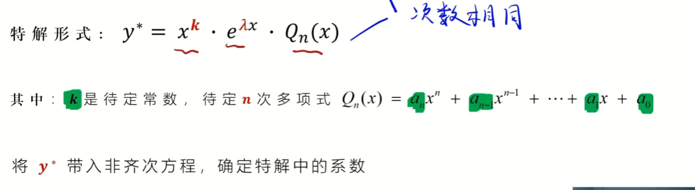

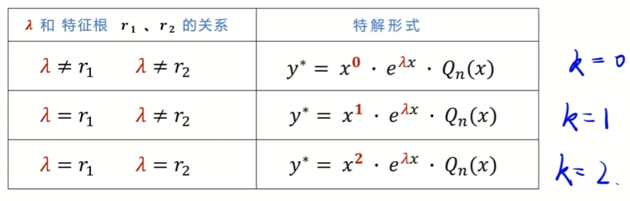

**例：**

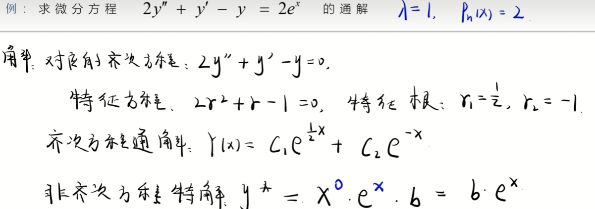
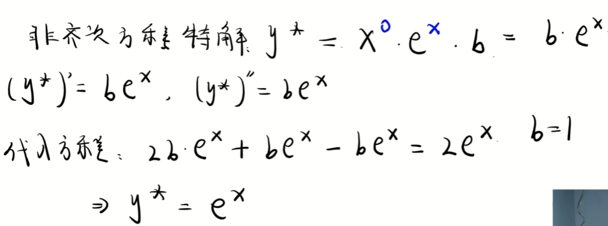
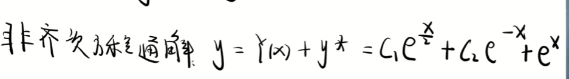

- 例：$y'' - 2y' + y = 2xe^x$

特征方程 $r^2 - 2r + 1 = 0$ → $r = 1$（二重根），齐通 $y = e^x(C_1 + C_2x)$

$f(x) = 2x \cdot e^x$，$\lambda = 1$ 是二重根 → $k = 2$

设 $y^* = x^2(Ax + B)e^x = (Ax^3 + Bx^2)e^x$

代入解得 $A = \frac{1}{3}$，$B = 0$，$y^* = \frac{1}{3}x^3 e^x$

非通 $y = e^x(C_1 + C_2x + \frac{1}{3}x^3)$

### 非齐次方程（类型二）

$f(x) = e^{\alpha x}[P_l(x)\cos\beta x + P_n(x)\sin\beta x]$

**第一步**：解特征方程 $r^2 + pr + q = 0$，得齐次方程通解。

**第二步**：由 $f(x)$ 读出 $\alpha, \beta$，取 $m = \max(l, n)$，判定 $\alpha \pm i\beta$ 在特征根中的重数 $k$：
- $\alpha \pm i\beta$ 不是特征根：$k = 0$
- $\alpha \pm i\beta$ 是特征根：$k = 1$

**第三步**：设特解
$$y^* = x^k \, e^{\alpha x}\left[R_m^{(1)}(x)\cos\beta x + R_m^{(2)}(x)\sin\beta x\right]$$
其中 $R_m^{(1)}(x)$ 和 $R_m^{(2)}(x)$ 是两个不同的 $m$ 次待定多项式。

**第四步**：将 $y^*$ 代回原方程，比较 $\cos\beta x$ 与 $\sin\beta x$ 前的系数，解出所有待定系数，得非齐次通解：
$$y = \text{齐通} + y^*$$

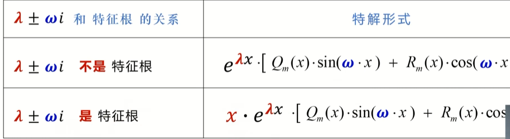

**例：**

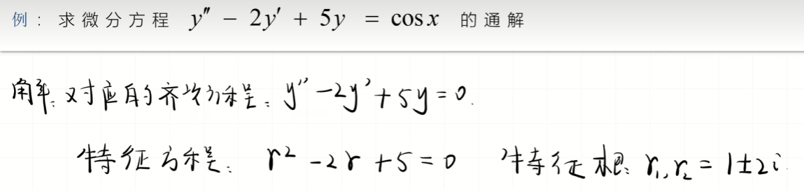

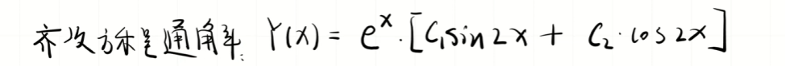

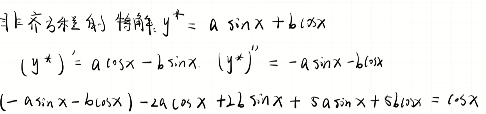

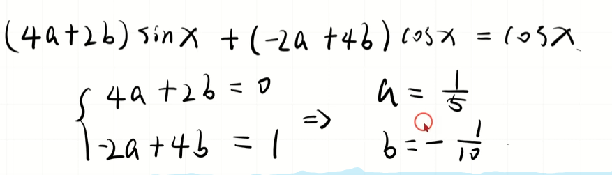

---

# 例题精讲：各类型完整解题步骤

## 一、可分离变量

**例**：$y' = \frac{y(1-x)}{x}$，$y(1) = 2$

**步骤**：

1. **分离变量**：将 $y$ 与 $x$ 分到两侧
$$\frac{dy}{y} = \frac{1-x}{x}\,dx = \left(\frac{1}{x} - 1\right)dx$$

2. **两边积分**
$$\int \frac{dy}{y} = \int \left(\frac{1}{x} - 1\right)dx \Rightarrow \ln|y| = \ln|x| - x + C_1$$

3. **整理通解**
$$\ln\left|\frac{y}{x}\right| = -x + C_1 \Rightarrow y = Cxe^{-x}$$

4. **代入初值求特解**：$y(1)=2 \Rightarrow C \cdot e^{-1} = 2 \Rightarrow C = 2e$

5. **结果**
$$y = 2e \cdot x \cdot e^{-x} = 2xe^{1-x}$$

---

## 二、齐次方程

**例**：$y' = \frac{y}{x} + \frac{x}{y}$

**步骤**：

1. **识别齐次结构**：右端可化为 $f\left(\frac{y}{x}\right)$，令 $u = \frac{y}{x}$，即 $y = xu$

2. **求导代入**：$y' = u + xu'$，代入原方程
$$u + xu' = u + \frac{1}{u} \Rightarrow xu' = \frac{1}{u}$$

3. **分离变量并积分**
$$u\,du = \frac{dx}{x} \Rightarrow \frac{u^2}{2} = \ln|x| + C$$

4. **代回 $u = \frac{y}{x}$ 得通解**
$$y^2 = 2x^2\ln|x| + Cx^2$$

---

## 三、一阶线性微分方程

**例**：$y' + y = e^x$

**步骤**：

1. **识别标准形式**：$y' + P(x)y = Q(x)$，得 $P(x) = 1$，$Q(x) = e^x$

2. **套通解公式**
$$y = e^{-\int P\,dx}\left[\int Q\,e^{\int P\,dx}\,dx + C\right]$$

3. **计算**：$\int P\,dx = \int 1\,dx = x$

4. **代入公式并积分**
$$y = e^{-x}\left[\int e^x \cdot e^x\,dx + C\right] = e^{-x}\left[\int e^{2x}\,dx + C\right] = e^{-x}\left(\frac{1}{2}e^{2x} + C\right)$$

5. **整理得通解**
$$y = \frac{1}{2}e^x + Ce^{-x}$$

---

## 四、全微分方程

**例**：$(3x^2 + 2y)dx + (2x - 4y^3)dy = 0$

**步骤**：

1. **判定全微分**：$P = 3x^2 + 2y$，$Q = 2x - 4y^3$
$$\frac{\partial P}{\partial y} = 2 = \frac{\partial Q}{\partial x}$$ 成立，是全微分方程

2. **对 $P$ 关于 $x$ 积分**
$$u = \int (3x^2 + 2y)\,dx = x^3 + 2xy + \varphi(y)$$

3. **对 $y$ 求偏导并与 $Q$ 比对**
$$\frac{\partial u}{\partial y} = 2x + \varphi'(y) = 2x - 4y^3 \Rightarrow \varphi'(y) = -4y^3 \Rightarrow \varphi(y) = -y^4$$

4. **得通解**
$$x^3 + 2xy - y^4 = C$$

---

## 五、可降阶的高阶方程

### 类型一：$y'' = f(x)$（直接积分）

**例**：$y'' = 6x + 2$

**步骤**：连续两次积分
$$y' = 3x^2 + 2x + C_1, \quad y = x^3 + x^2 + C_1x + C_2$$

### 类型二：$y'' = f(x, y')$（令 $y' = p$）

**例**：$y'' = 2y' + 1$

**步骤**：

1. 令 $y' = p$，则 $y'' = p'$，代入得 $p' = 2p + 1$
2. 分离变量：$\frac{dp}{2p+1} = dx$，积分得 $p = C_1e^{2x} - \frac{1}{2}$
3. 再积分得通解：$y = C_1e^{2x} - \frac{x}{2} + C_2$

### 类型三：$y'' = f(y, y')$（令 $y' = p$，$y'' = p\frac{dp}{dy}$）

**例**：$yy'' = (y')^2$

**步骤**：

1. 令 $y' = p$，$y'' = p\frac{dp}{dy}$，代入得 $yp\frac{dp}{dy} = p^2$
2. 约去 $p$（$p \neq 0$）：$y\frac{dp}{dy} = p$
3. 分离变量：$\frac{dp}{p} = \frac{dy}{y}$，积分得 $p = C_1y$
4. 代回 $p = y'$：$\frac{dy}{dx} = C_1y$
5. 再积分得通解：$y = Ce^{C_1x}$

---

## 六、二阶常系数齐次方程

**例（两不等实根）**：$y'' - 3y' + 2y = 0$

**步骤**：

1. **写特征方程**：$r^2 - 3r + 2 = 0$
2. **求特征根**：$(r-1)(r-2) = 0 \Rightarrow r_1 = 1, r_2 = 2$
3. **套通解公式**：$y = C_1e^{x} + C_2e^{2x}$

**例（二重根）**：$y'' - 4y' + 4y = 0$

特征方程 $r^2 - 4r + 4 = 0 \Rightarrow r = 2$（二重根），通解 $y = e^{2x}(C_1 + C_2x)$

**例（共轭复根）**：$y'' + 4y = 0$

特征方程 $r^2 + 4 = 0 \Rightarrow r = \pm 2i$，即 $\alpha = 0, \beta = 2$，通解 $y = C_1\cos 2x + C_2\sin 2x$

---

## 七、二阶常系数非齐次方程（类型一：$f(x) = P_m(x)e^{\lambda x}$）

**例**：$y'' - 3y' + 2y = 2x$

**步骤**：

1. **求齐通**：$r^2 - 3r + 2 = 0 \Rightarrow r_1 = 1, r_2 = 2$，齐通 $y = C_1e^x + C_2e^{2x}$
2. **判断 $k$ 与 $m$**：$f(x) = 2x \cdot e^{0\cdot x}$，$\lambda = 0$ 不是特征根 $\Rightarrow k = 0$；$P_m$ 为 1 次多项式 $\Rightarrow m = 1$
3. **设特解**：$y^* = Ax + B$
4. **代入原方程**：$y^{*\prime} = A$，$y^{*\prime\prime} = 0$
$$0 - 3A + 2(Ax + B) = 2x \Rightarrow 2Ax + (2B - 3A) = 2x$$
5. **比较系数**：$2A = 2 \Rightarrow A = 1$；$2B - 3A = 0 \Rightarrow B = \frac{3}{2}$
6. **得特解与通解**：$y^* = x + \frac{3}{2}$
$$y = C_1e^x + C_2e^{2x} + x + \frac{3}{2}$$

---

## 八、二阶常系数非齐次方程（类型二：$f(x) = e^{\alpha x}[P_l\cos\beta x + P_n\sin\beta x]$）

**例**：$y'' + y = \sin x$

**步骤**：

1. **求齐通**：$r^2 + 1 = 0 \Rightarrow r = \pm i$，齐通 $y = C_1\cos x + C_2\sin x$
2. **判断 $k$ 与 $m$**：$\alpha = 0, \beta = 1$，$\alpha \pm i\beta = \pm i$ 是特征根 $\Rightarrow k = 1$；$m = \max(0, 0) = 0$
3. **设特解**（因 $k=1$ 需乘 $x$）：$y^* = x(A\cos x + B\sin x)$
4. **求导并代入**
$$y^{*\prime} = A\cos x + B\sin x + x(-A\sin x + B\cos x)$$
$$y^{*\prime\prime} = -2A\sin x + 2B\cos x - x(A\cos x + B\sin x)$$
$$y^{*\prime\prime} + y^* = -2A\sin x + 2B\cos x = \sin x$$
5. **比较系数**：$2B = 0 \Rightarrow B = 0$；$-2A = 1 \Rightarrow A = -\frac{1}{2}$
6. **得通解**
$$y = C_1\cos x + C_2\sin x - \frac{1}{2}x\cos x$$

假设方程为：

$$y'' + y = \cos(2x)$$

**1. 求特征根**

齐次方程 $y'' + y = 0$ 的特征方程为：

$$r^2 + 1 = 0 \implies r = \pm i$$

**2. 判定 $\alpha \pm i\beta$ 与 $k$**

右端自由项为 $f(x) = \cos(2x) = e^{0\cdot x}(1\cdot \cos(2x) + 0\cdot \sin(2x))$。

- 对应的参数为：$\alpha = 0, \beta = 2$。
    
- 构成的复数为：$\alpha \pm i\beta = \pm 2i$。
    

对比发现：$\pm 2i$ **不是**特征方程的根（特征根是 $\pm i$ 而非 $\pm 2i$）。

因此，取 **$k = 0$**。

**3. 设特解**

因为 $k = 0$，特解前面不需要乘 $x$（即 $x^0 = 1$），直接设为：

$$y^* = A\cos(2x) + B\sin(2x)$$