# 三角基础

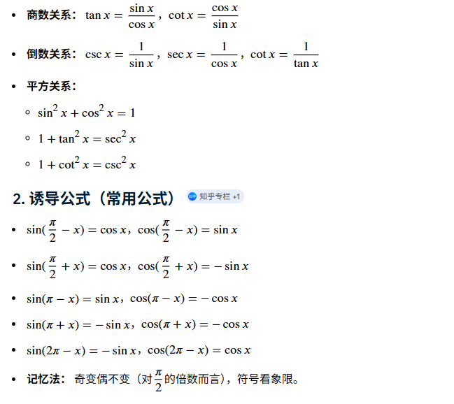

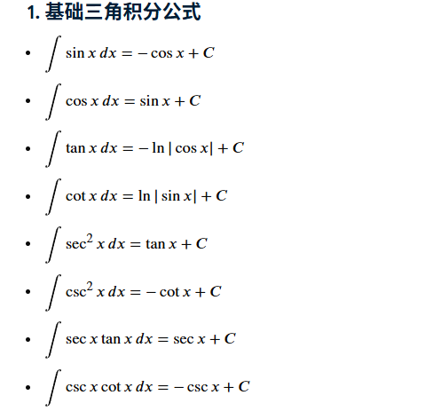

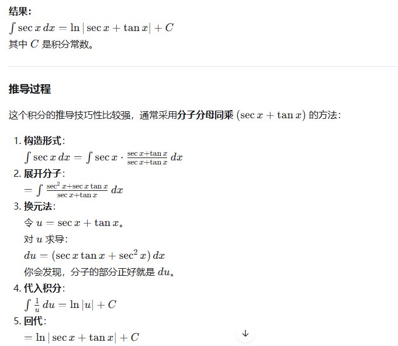
**方法二：三角变换法（无需记忆凑项技巧）**

$$\int \sec x \, \mathrm{d}x = \int \frac{1}{\cos x} \, \mathrm{d}x = \int \frac{\cos x}{\cos^2 x} \, \mathrm{d}x = \int \frac{\mathrm{d}(\sin x)}{1 - \sin^2 x}$$

利用裂项积分公式 $\int \frac{\mathrm{d}u}{1-u^2} = \frac{1}{2} \ln\left\vert{}\frac{1+u}{1-u}\right\vert{} + C$：

$$\int \frac{\mathrm{d}(\sin x)}{1 - \sin^2 x} = \frac{1}{2} \ln \left\vert{} \frac{1 + \sin x}{1 - \sin x} \right\vert{} + C$$

**方法二：万能公式/半角变换法**

利用三角恒等变换：

$$\csc x - \cot x = \frac{1}{\sin x} - \frac{\cos x}{\sin x} = \frac{1 - \cos x}{\sin x} = \frac{2\sin^2\frac{x}{2}}{2\sin\frac{x}{2}\cos\frac{x}{2}} = \tan \frac{x}{2}$$

因此积分直接写作：

$$\int \csc x \, \mathrm{d}x = \ln\left\vert{}\tan \frac{x}{2}\right\vert{} + C$$

- **$\int \sec x \, \mathrm{d}x = \ln\vert{}\sec x + \tan x\vert{} + C = \ln\left\vert{}\tan\left(\frac{x}{2} + \frac{\pi}{4}\right)\right\vert{} + C$**
    
- **$\int \csc x \, \mathrm{d}x = \ln\vert{}\csc x - \cot x\vert{} + C = -\ln\vert{}\csc x + \cot x\vert{} + C = \ln\left\vert{}\tan \frac{x}{2}\right\vert{} + C$**
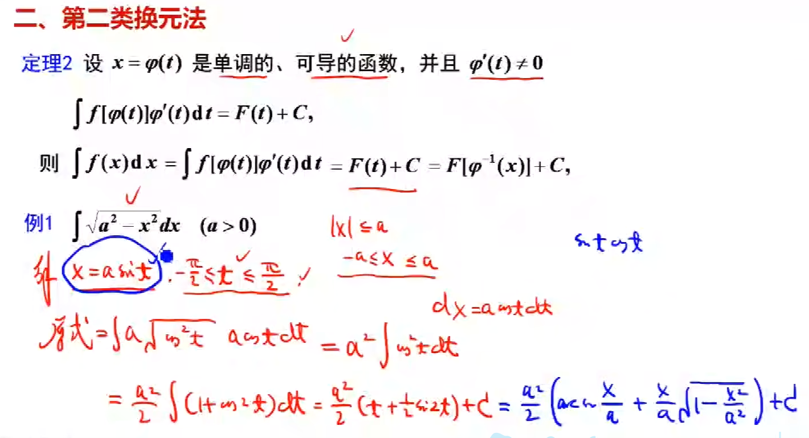

**换元要使用单调可导的函数**

 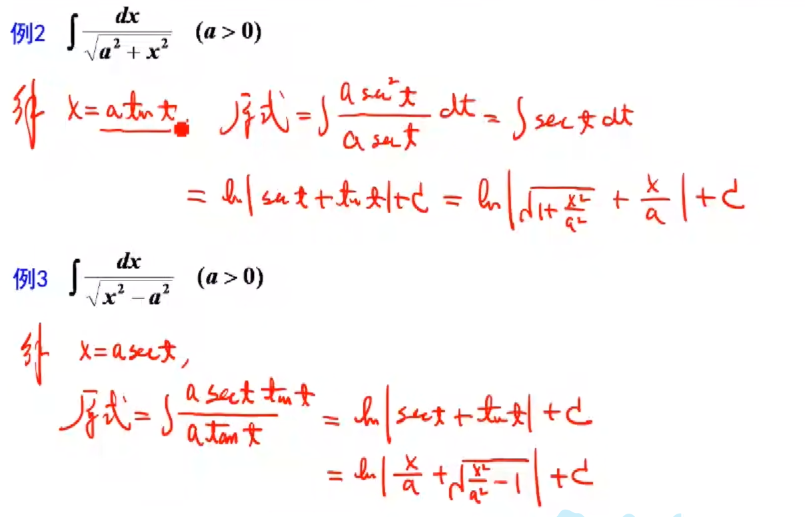

 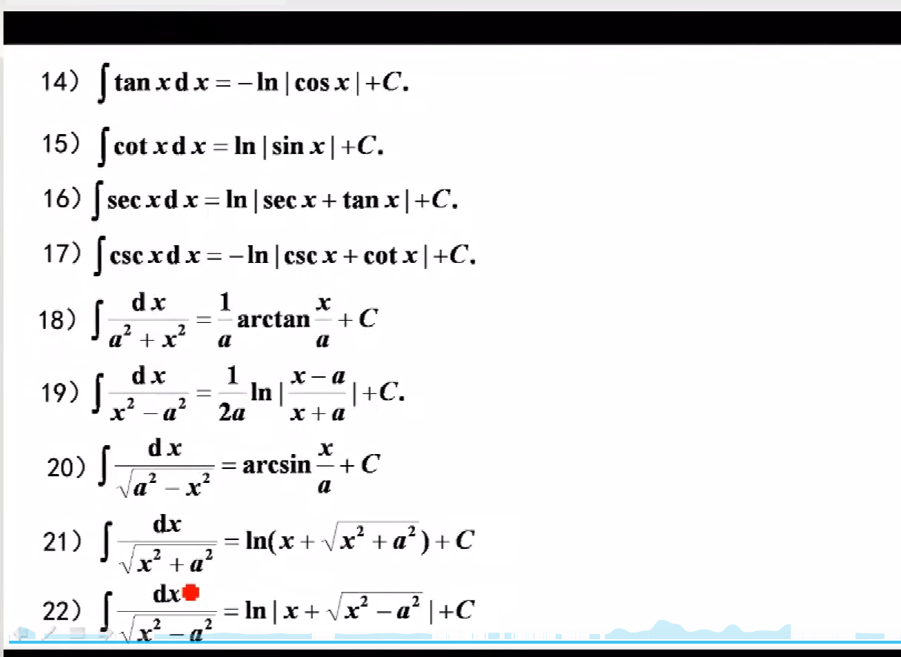

 # 定积分

## 积分上限函数

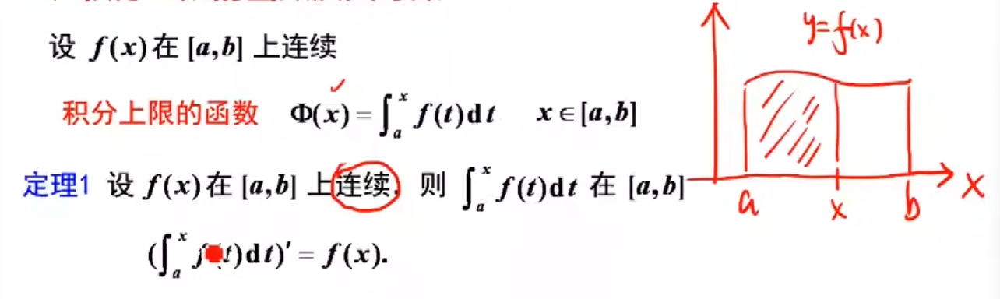

**证明**

---

### 极限技巧：

0比0型，可以使用基本极限和消去0因子的方法

---

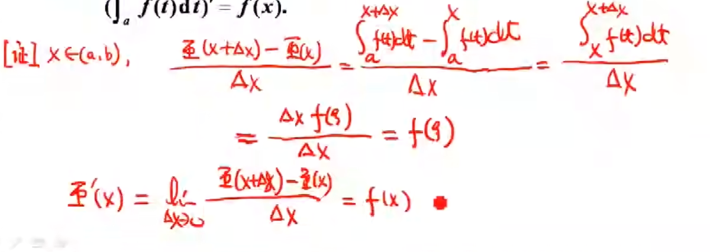

积分中值定理

## 例

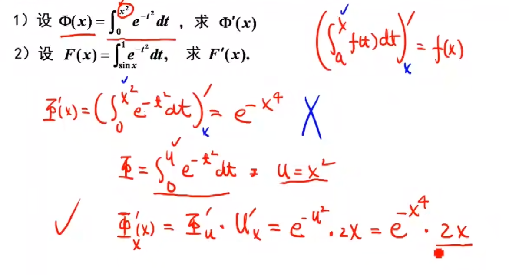

-   x带入上限，再对上限求导

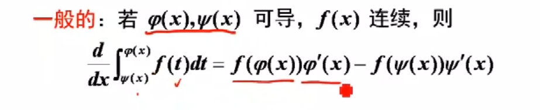

# 牛顿莱布尼兹

## 极坐标

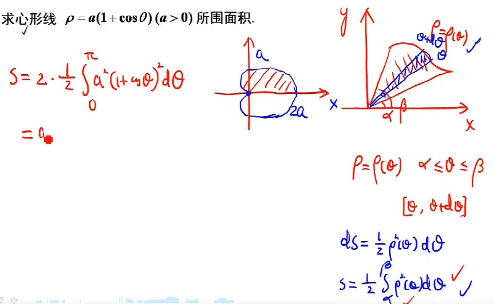

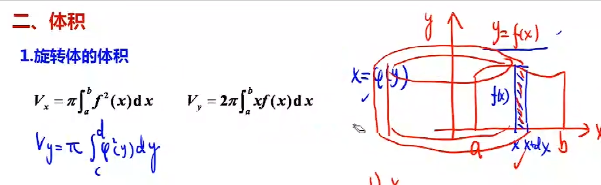

## 体积

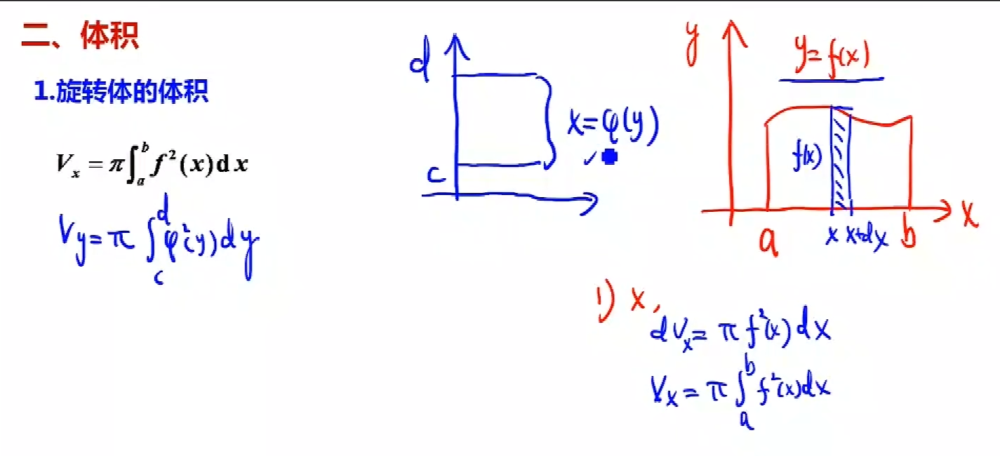

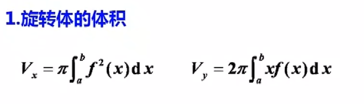
