# 实对称矩阵
定义：
$A^T = A$
全是实数

## 性质
1.   特征值全为实数，向量均为实向量
2.   必能相似对角化，且存在正交矩 阵Q把A给对角化了，$Q^TAQ = Q^{-1}AQ=\varLambda$
3.   不同特征值的特征向量必定**正交**
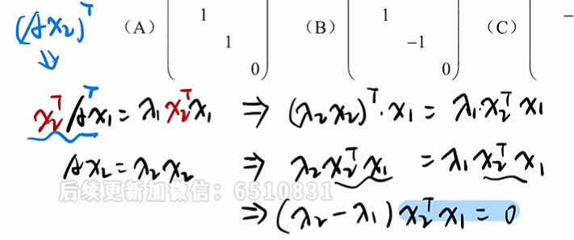
- . 构造内积 
- 转置
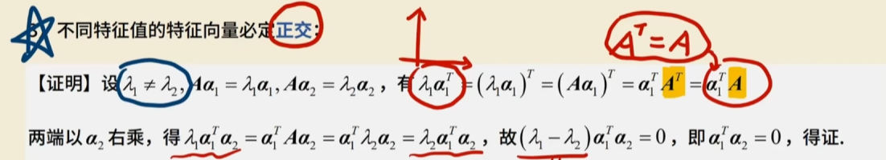

# 正交矩阵

$AA^T = A^TA = E$
保持向量长度不变

||x|| = ||y||

## 性质
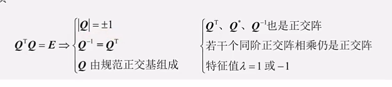
1.   $A^{-1} = A^T$
2.   |A| = 1 或-1
3.   行/列向量长度为1，并且两两正交
- $Q^T,Q^*,Q^{-1}也是正交矩阵$
- 若干同阶正交矩阵相乘仍然是正交阵
- 特征值 = 1 或 -1
- 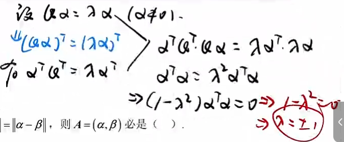
模可以转化为内积的形式

# 实对称矩阵正交对角化
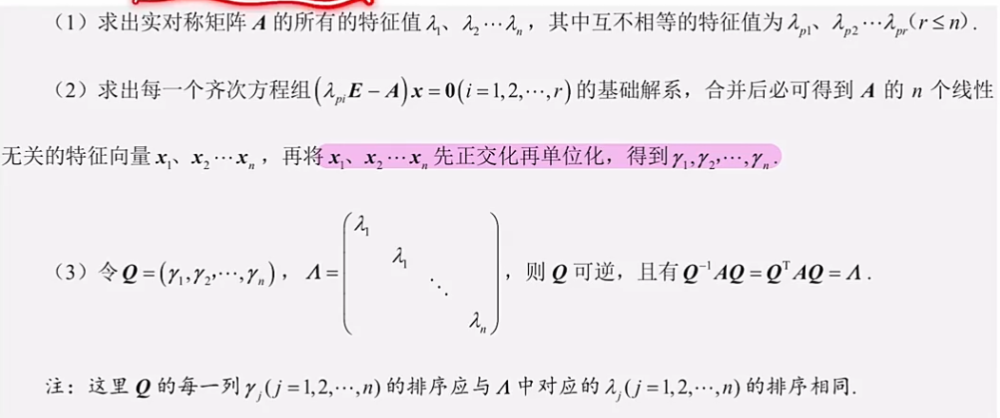

## 施密特正交
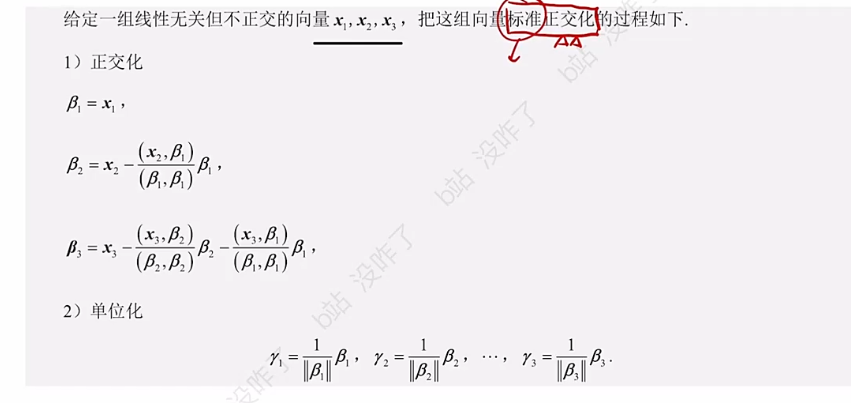
求b2，先看成平面求直观
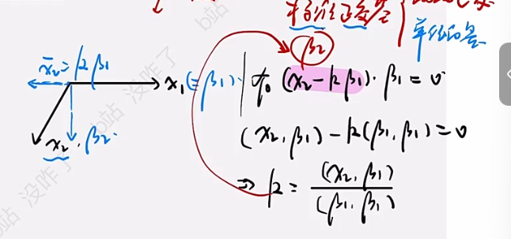

求b3，看成  
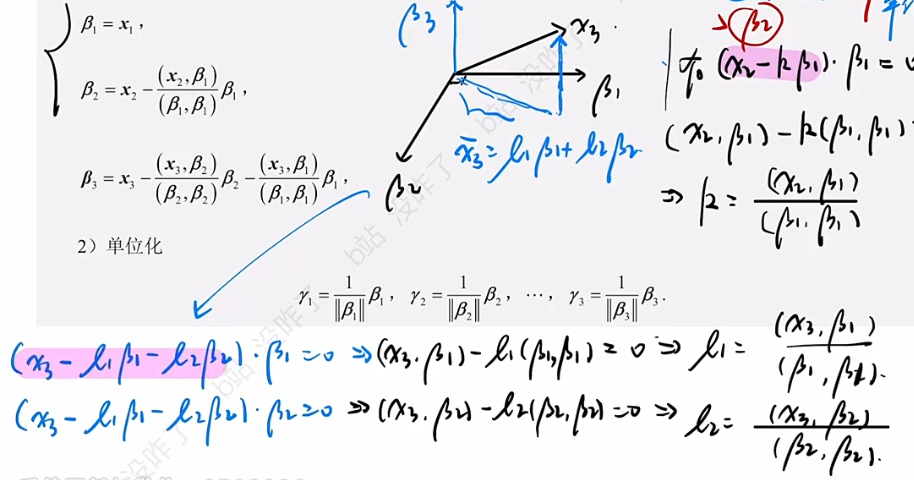

## 求Q&施密特正交

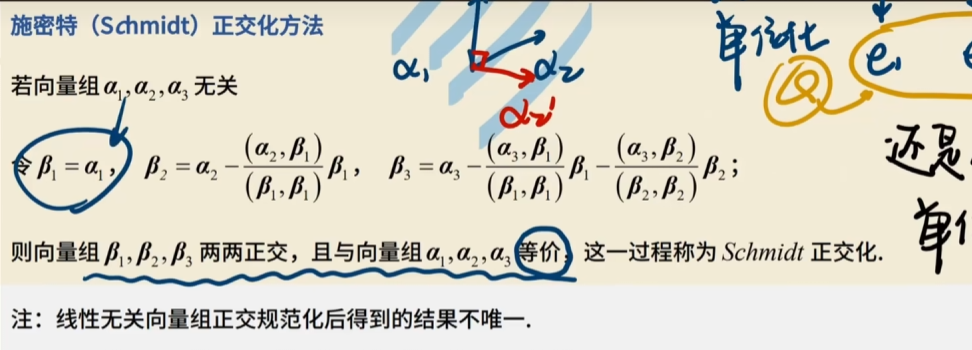

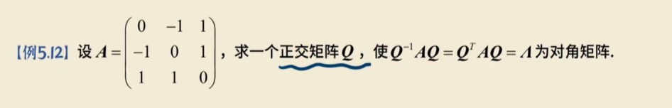

-   求完特征值和特征向量x1，x2
-   求b1，b2
-   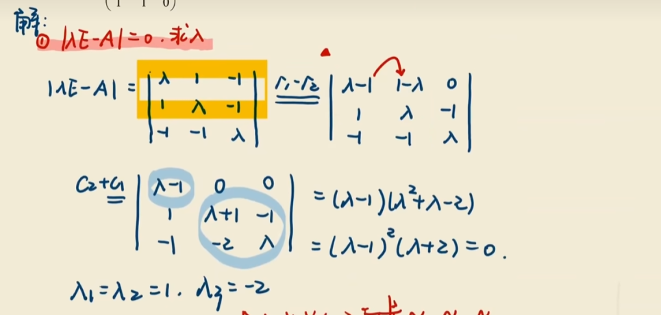

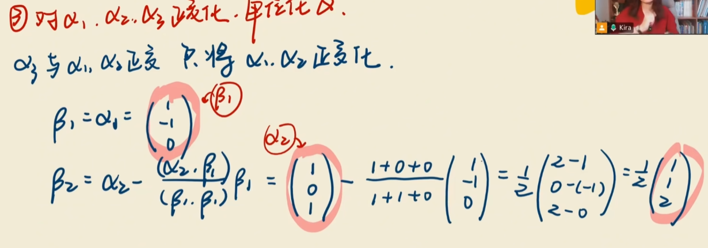

-   单位化

除一个模

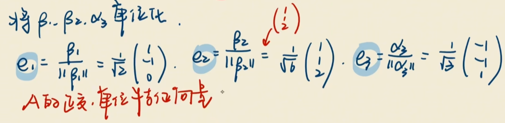

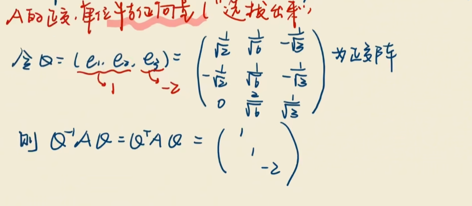

