# 二次型

二次齐次多项式

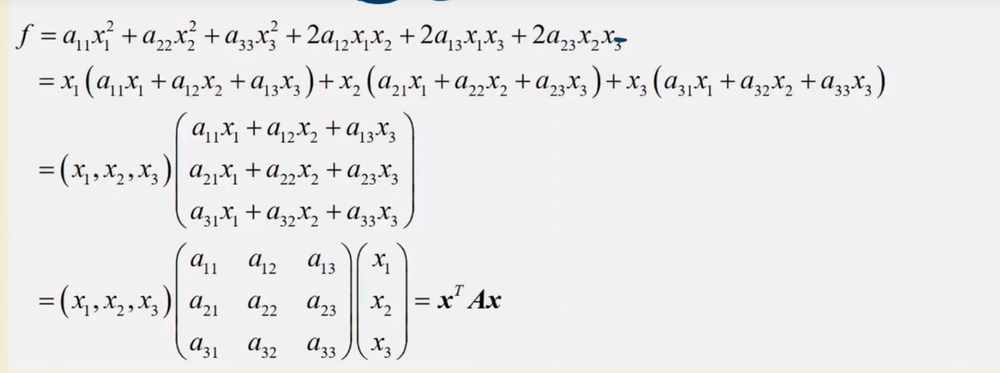

===$f = x^TAx$

-   主对角线的元素是aii平方项的系数
-   xixj是一半系数
- A矩阵必须为实对称矩阵A = A^T
- 把A的秩称为二次型的秩

## 题型
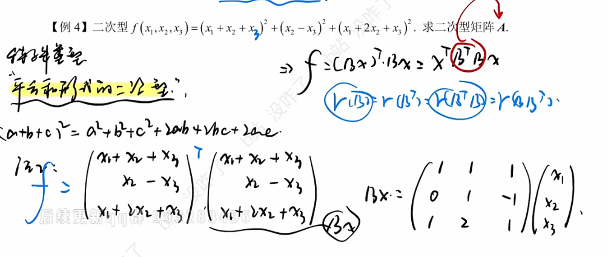
对于一个二次型，把他转化为矩阵相乘的形式，再拆分右边的矩阵为3* 3 *  列向量
```
f = (BX)^T BX  = XT BT B X
R(B) = R(BT) = R(BBT) = R(BTB)
```
**算二次型矩阵的秩**
就等于B的秩，B的秩可以直接根据系数写出来

例：
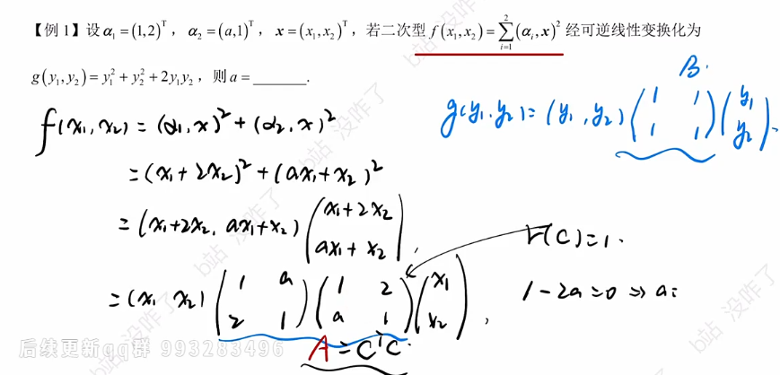
把二次型矩阵写出来之后4秩相同

# 可逆线性变换
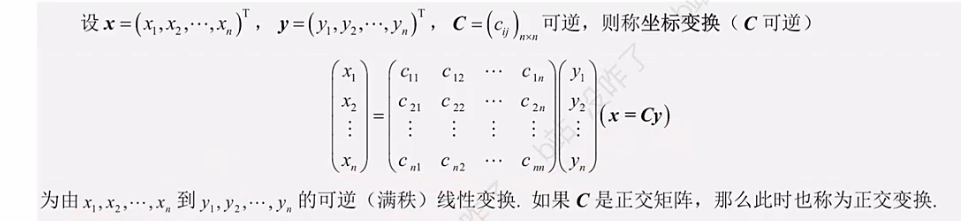
C必须可逆，才时可逆线性变换
x -> y
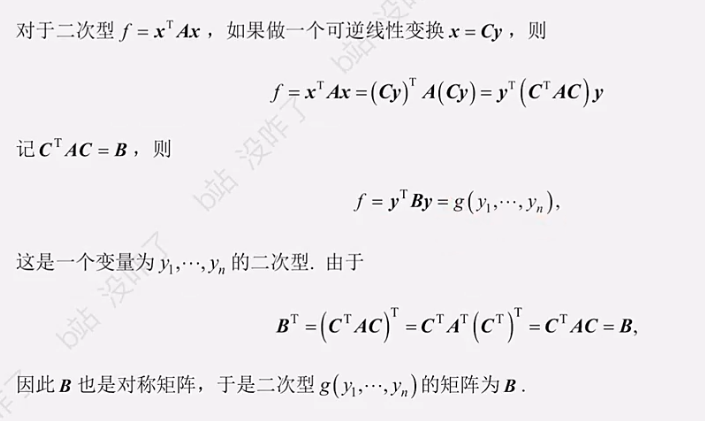
变换二次型，隐藏了坐标变换
B矩阵需要证明是不是实对称
**二次型变换过程**
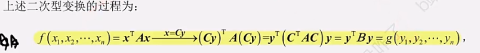

## 题型

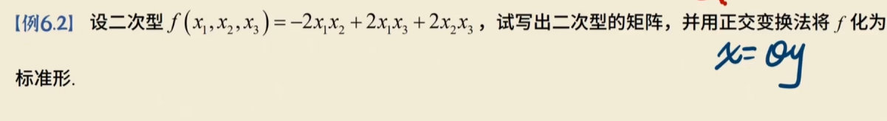

求Q

1.   写出二次型矩阵A
2.   求A特征值，正交阵
3.   另x = Qy将二次型化成标准型


1.   A

~~~
0 -1 1
-1 0 1 = A
1 1 0 
~~~

2.   特征值

然后用施密特正交法求出正交向量

组合起来就是Q


3.   用特征值组合起来


## 配方法
### 二次型化成标准型


-   把含有x1的配方
-   把x2配方
-   换元
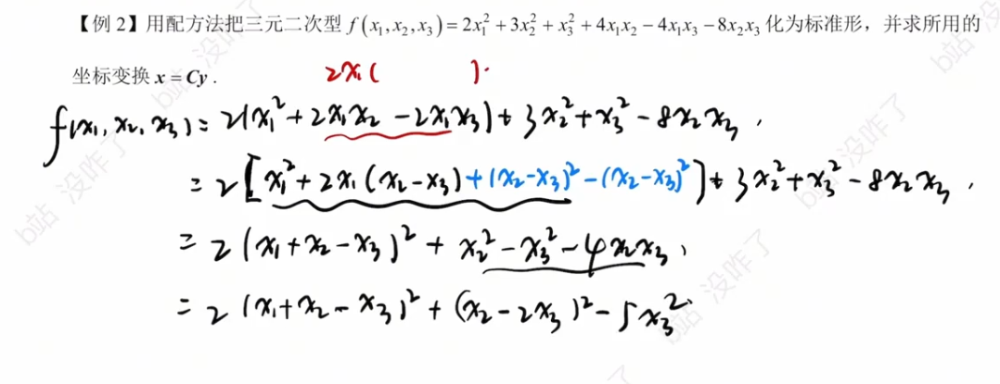
标准型

设y，反求x
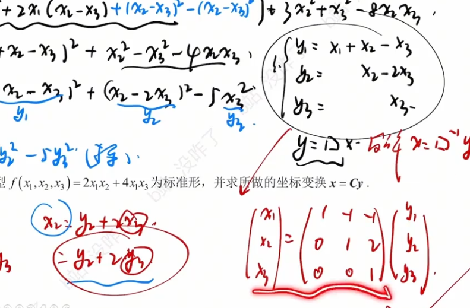

### 标准型变成规范性
只有1 -1 0
就直接设系数就可以了


# 合同

**设A与B都是n阶方阵，若存在可逆矩阵C使得B = $C^TAC$**
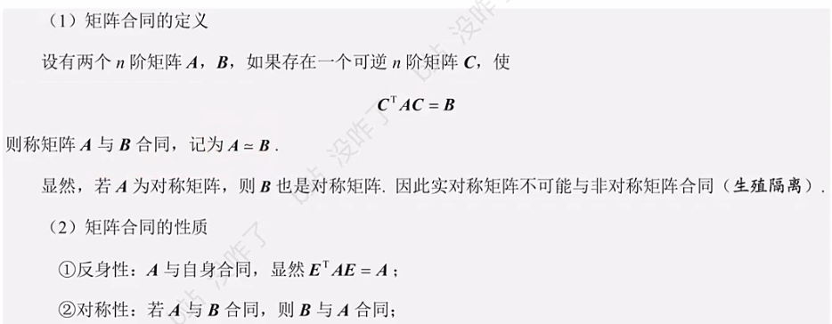
- 两个矩阵同为实对称或者同为非实对称矩阵
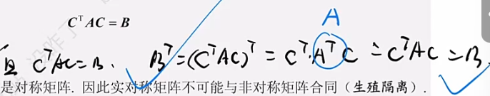
- 反身性：于自身合同 ETAE = E
- 对称性：AB合同则BA合同
- 传递性：
- AB秩相等，正负惯性指数相等
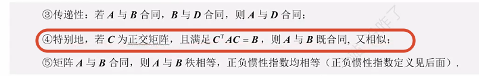
正交矩阵可以连接合同和相似矩阵


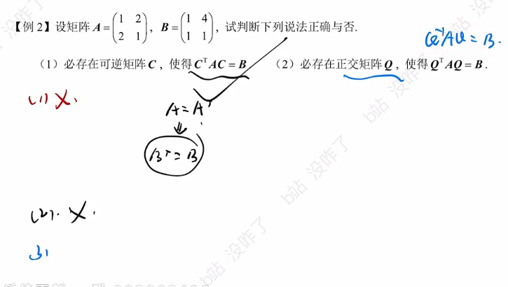
A是实对称，B不是，所以不合同


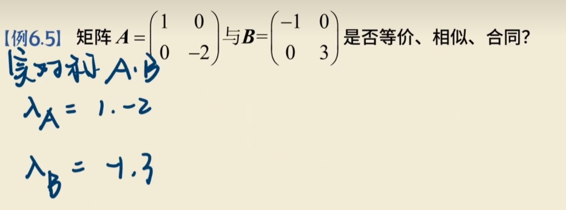

1.   相似

**定义**：如果存在可逆矩阵 $P$，使得 $P^{-1}AP = B$，则称 $A$ 与 $B$ 相似。

**判定方法**：相似的必要条件包括行列式相等、迹相等、特征值相等。对于可对角化的矩阵，**相似的充要条件是特征值完全相同**。

看特征值一不一样

2.   合同

**定义**：如果存在可逆矩阵 $C$，使得 $C^T AC = B$，则称 $A$ 与 $B$ 合同。

**判定方法**：对于实对称矩阵，**合同的充要条件是正、负惯性指数相同**（即正特征值的个数相同，负特征值的个数也相同）。

特征值的符号是否相同

3.   等价

秩相等

**定义**：如果存在可逆矩阵 $P$ 和 $Q$，使得 $PAQ = B$，则称 $A$ 与 $B$ 等价。

**判定方法**：对于同型矩阵，**等价的充要条件是秩相等**，即 $r(A) = r(B)$。


# 一些性质 
## 标准型
没有混合项的二次型

### 二次型转化为标准型
#### 正交变换
$$\lambda_1y_1^2+\lambda_2y_2^2+\cdots+\lambda_ny_n^2$$
系数是n个特征值
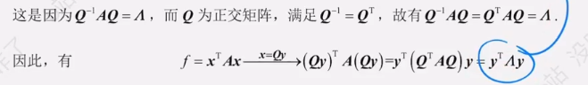

正交矩阵的T = -1，


## 二次型的规范型

当标准型的系数d为 1 -1 0时叫做规范性

**任一一个二次型f都可经过逆线性变换变换成规范型**

## 惯性指数

对于二次型的标准型来说

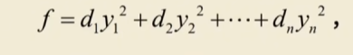

**正惯性指数：正平方项的个数，用p表示**
**负惯性指数：负平方项的个数，用q表示**


-   在变换时，pq的个数是不会改变的
-   对于二次型矩阵A，r（A) = q + p,即有p + q个**非零特征值**
-   p是正特征值个数
-   q是负特征值个数

---


# 题

1.   配方法 2y1^2 - y2^2 + 4y3^2
2.   求特征值

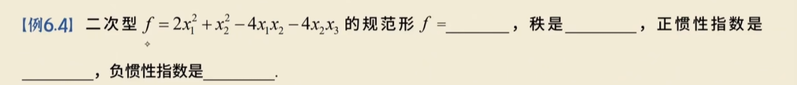
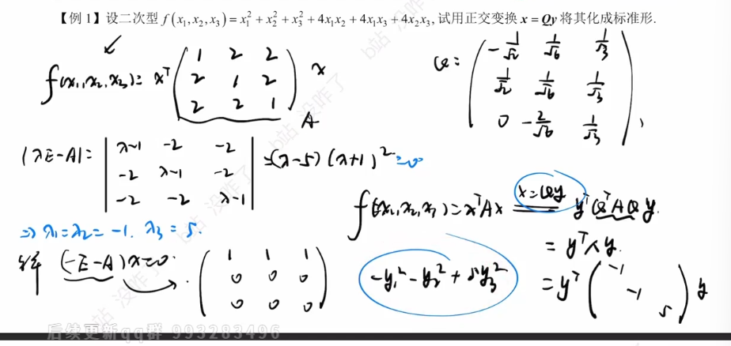


# 正定

定义设二次型f(x)=$x^TAx$，如果对任何x≠0都有f(x)=$x^TAx$>0，则称f为正定二次型，并称对称
矩阵A为正定矩阵。

对于

f = $x_1^2 + x_2^2 + x_3^2$

x可以取任何值都  > 0

## 充要条件

**定义法**：对任何 $\boldsymbol{x} \neq \mathbf{0}$，恒有 $f(\boldsymbol{x}) = \boldsymbol{x}^T A \boldsymbol{x} > 0$（证明 $f$ 正定常用）。

**标准形**：$f(\boldsymbol{x}) = \boldsymbol{x}^T A \boldsymbol{x}$ 的标准形的 $n$ 个系数全大于 $0$。

**合同关系**：$A$ 合同于单位矩阵 $E$，即存在可逆矩阵 $C$，使得 $A = C^T C$。

**惯性指数**：$A$ 的正惯性指数 $p$ 等于其阶数 $n$。

**特征值法**：$A$ 的所有特征值都是正数（证明 $f$ 正定常用）。

**霍尔维茨定理 (Hurwitz Criterion)**：$A$ 的各阶**顺序主子式**全大于 $0$（证明 $f$ 正定常用）。

  

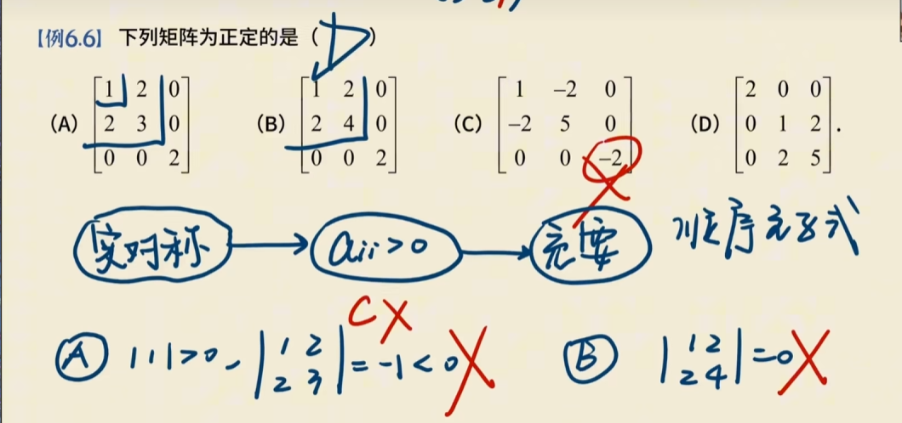

求各阶顺序主子式


