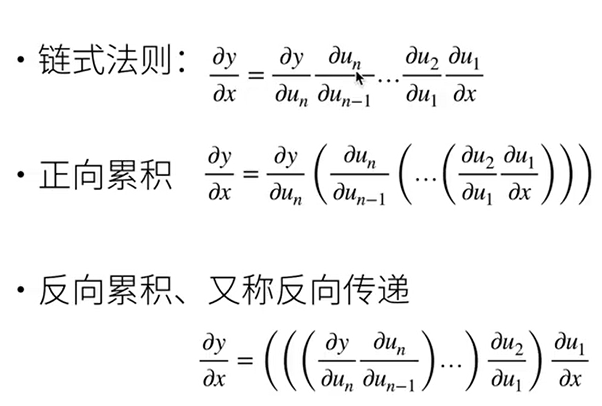

# torch 函数

## ```torch.normal(mean, std, size)```

生成从正态分布中采样的张量

~~~
mean ： 中心值（正态分布的均值，表示分布的中心。这里是 0，所以生成的值围绕 0。）
std : 正态分布的标准差（正态分布的标准差，决定了数据的离散程度。这里是 1，表示生成的数据将符合标准正态分布（均值为0，标准差为1））
size 生成张量的形状
torch.normal(0, 1, (num_examples, len(w)))

~~~

## size =

-   生成一个大小为 `(n_text + n_train, 1)` 的二维数组。这个数组的元素是从标准正态分布中随机抽取的数值。

~~~
feature = np.random.normal(size = (n_text+n_train,1))

~~~


## ```torch.matmul(X, w)```

计算两个张量（矩阵或向量）之间的乘法

~~~
X 通常是输入数据矩阵。假设 X 的形状是 (num_examples, num_features)，其中 num_examples 是样本的数量，num_features 是每个样本的特征数量。
w 是权重向量或矩阵，通常是模型的参数。假设 w 的形状是 (num_features, 1)，即每个特征有一个权重。

torch.matmul(X, w) 的形状将是 (num_examples, 1)
~~~

~~~
import torch

# 输入数据 X（3个样本，2个特征）
X = torch.tensor([[1.0, 2.0],
                  [3.0, 4.0],
                  [5.0, 6.0]])

# 权重向量 w（2个特征）
w = torch.tensor([[0.5], [0.8]])

# 计算矩阵乘法 X * w
output = torch.matmul(X, w)
print(output)

>>>

tensor([[1.9],
        [3.7],
        [5.5]])

~~~

# **torch.rand**

**返回一个张量，包含了从区间[0,1)的均匀分布中抽取的一组随机数，形状由可变参数`sizes` 定义。**

~~~
torch.rand(*sizes, out=None) → Tensor

torch.rand(4)

 0.9193
 0.3347
 0.3232
 0.7715
~~~

# **torch.randn**

**返回一个张量，包含了从标准正态分布(均值为0，方差为 1，即高斯白噪声)中抽取一组随机数，形状由可变参数`sizes`定义。 参数:**

~~~
torch.randn(4)

-0.1145
 0.0094
-1.1717
 0.9846
 [torch.FloatTensor of size 4]
 
 torch.randn(2, 3)

 1.4339  0.3351 -1.0999
 1.5458 -0.9643 -0.3558
[torch.FloatTensor of size 2x3]
~~~


# torch.mul

**用标量值`value`乘以输入`input`的每个元素，并返回一个新的结果张量**

~~~
torch.mul(input, value, out=None)

a = torch.randn(3)
torch.mul(a, 100)
-93.7411
-52.5374
-60.6908
[torch.FloatTensor of size 3]
~~~

# **torch.zeros**

```
torch.zeros(*sizes, out=None) → Tensor

 torch.zeros(2, 3)

 0  0  0
 0  0  0
[torch.FloatTensor of size 2x3]
```

返回一个全为标量 0 的张量，形状由可变参数`sizes` 定义。

# torch.round

```
torch.round(input, out=None) → Tensor

 a = torch.randn(4)
>>> a

 1.2290
 1.3409
-0.5662
-0.0899
[torch.FloatTensor of size 4]

>>> torch.round(a)

 1
 1
-1
-0
[torch.FloatTensor of size 4]
```

返回一个新张量，将输入`input`张量每个元素舍入到最近的整数。


# torch.sum

```
torch.sum(input) → float

>>> a = torch.randn(1, 3)
>>> a

 0.6170  0.3546  0.0253
[torch.FloatTensor of size 1x3]

>>> torch.sum(a)
0.9969287421554327
```

返回输入张量`input` 所有元素的和。

# torch.mm

```
torch.mm(mat1, mat2, out=None) → Tensor

>>> mat1 = torch.randn(2, 3)
>>> mat2 = torch.randn(3, 3)
>>> torch.mm(mat1, mat2)
 0.0519 -0.3304  1.2232
 4.3910 -5.1498  2.7571
[torch.FloatTensor of size 2x3]
```

对矩阵`mat1`和`mat2`进行相乘。 如果`mat1` 是一个n×m 张量，`mat2` 是一个 m×p 张量，将会输出一个 n×p 张量`out`


----

# 自动求导

**计算一个函数在指定值上的求导**



~~~
用一个地方存梯度
x.requires_grad_(True)
x.grad

y = 2 * torch.dot(x,x)
y
~~~

- 调用反向传播函数计算y关于x的每个分量梯度

~~~
y.backword()
x.grad
~~~


- 默认情况梯度会累积

~~~
z.grad.zero_()
y = x.sum() 向量的sum
y.backward()
x.grad
~~~


y 不是标量

~~~
x.grad.zero_()
y = x * x
y.sum().backward() 求一个和变成标量

~~~


---

# nn.Flatten()


`nn.Flatten()` 是 PyTorch 中的一个层（Layer），它的作用是将输入的多维张量（Tensor）展平（flatten）成一个一维张量。

### 作用

`nn.Flatten()` 将输入张量的所有维度从第二维开始展平为一个一维向量，只保留第一维（通常是批量大小 batch size）。这在处理卷积神经网络（CNN）时非常常见，尤其是在卷积层后将多维特征图转换为一维向量，以便将其输入到全连接层（fully connected layer）。

### 用法

假设你有一个形状为 `(batch_size, channels, height, width)` 的张量，这通常是卷积层的输出。如果你希望将其展平为 `(batch_size, channels * height * width)`，可以使用 `nn.Flatten()`。

### 示例

```python
import torch
import torch.nn as nn

# 假设输入的形状为 (batch_size, channels, height, width)
x = torch.randn(32, 3, 28, 28)  # 32 是批量大小，3 是通道数，28x28 是图像的尺寸

# 创建一个 nn.Flatten 层
flatten = nn.Flatten()

# 展平操作
x_flat = flatten(x)

print(x_flat.shape)  # 输出 (32, 3 * 28 * 28) = (32, 2352)
```

### 解释

-   `x` 的形状是 `(32, 3, 28, 28)`，表示 32 张 3 通道 28x28 的图像。
-   `nn.Flatten()` 会将每张图像从 `(3, 28, 28)` 展平为一个大小为 2352 的一维向量。
-   展平后的 `x_flat` 形状变为 `(32, 2352)`，表示每个样本（图像）都被展平为一个长度为 2352 的向量。

### 使用场景

通常 `nn.Flatten()` 用在卷积神经网络的最后阶段，在特征提取（通过卷积层）之后，将特征图展平为一维向量，以便传入全连接层进行分类或回归任务。

# 查看指定层的参数

-   这个是一个推理过程，不过参数都是随机初始化的

~~~
import torch
from torch import nn

net = nn.Sequential(nn.Linear(4,8),nn.ReLU(),nn.Linear(8,1))
X = torch.rand(size=(2,4))
print(net(X))

tensor([[0.1932],
        [0.2113]], grad_fn=<AddmmBackward0>)

print(net[2].state_dict())

OrderedDict([('weight', tensor([[ 0.1003,  0.1006, -0.0494,  0.2923, -0.2908, -0.1966,  0.2506, -0.1870]])), ('bias', tensor([0.2791]))])


print(type(net[2].bias))
<class 'torch.nn.parameter.Parameter'>

print((net[2].bias))# 查看第二层的偏置
tensor([0.2791], requires_grad=True)


~~~

# 一次性访问所有参数

~~~
print(*[(name, param.shape) for name, param in net[0].named_parameters()])
print(*[(name, param.shape) for name, param in net.named_parameters()])

('weight', torch.Size([8, 4])) ('bias', torch.Size([8]))
('0.weight', torch.Size([8, 4])) ('0.bias', torch.Size([8])) ('2.weight', torch.Size([1, 8])) ('2.bias', torch.Size([1]))
或者

net.state_dict()['2.bias'].data
~~~


# shuffle 打乱数据

~~~
feature = np.random.normal(size = (n_text+n_train,1))
np.random.shuffle(features)
~~~

