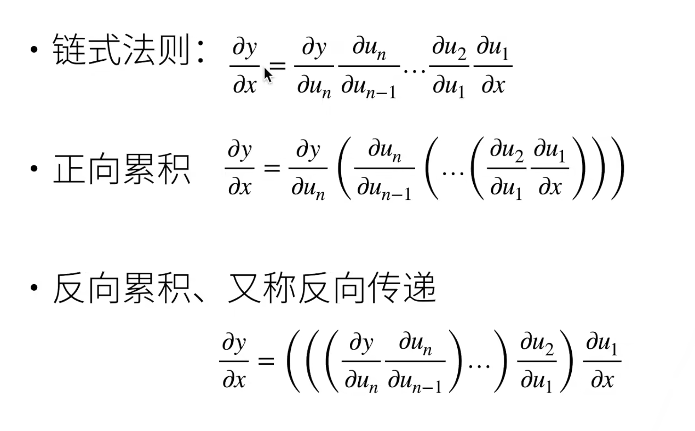
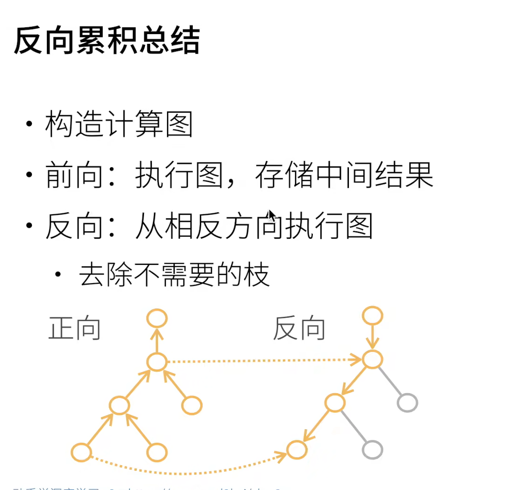

# 07 自动求导【动手学深度学习v2】

反向的传播需要正向传播存下来计算中间结果

~~~
import torch
x = torch.arange(4.0, requires_grad=True)
y = torch.dot(x, x)

# print(y)
y.backward()
print(x.grad)
x.grad.zero_()
y = x.sum()
y.backward()
print(x.grad)
~~~

