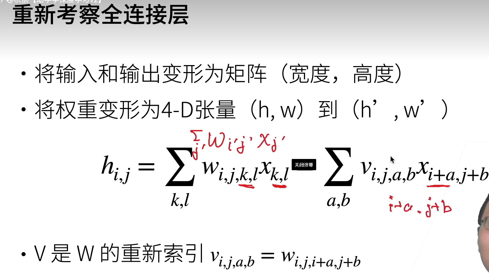

# 19卷积

## 问题

**对于MLP分类猫和狗**

如果使用一个单隐藏层的MLP，一个像素为1200w的RGB = 3600w个元素，隐藏层大小为100

计算的总参数量是 36亿，那么就是

## 找东西有两个原则

-   平移不变性：不同的分类器（识别）可以用在不同的位置
-   局部性：看局部的信息就可以了

## 公式

~~~
def corr2d(X,K):
    """
    互相关运算
    :param X:输入 
    :param K: 核矩阵
    :return: 
    """
    h,w = K.shape
    Y = torch.zeros((X.shape[0] - h + 1,X.shape[1] - w + 1))
    for i in range(Y.shape[0]):
        for j in range(Y.shape[1]):
            Y[i,j] = (X[i:i + h,j:j + w] * K).sum()
    return Y
X = torch.tensor([[0.0, 1.0, 2.0], [3.0, 4.0, 5.0], [6.0, 7.0, 8.0]])

~~~

~~~py
class Conv2D(nn.Module):
	"""
	卷积层
	"""
    def __init__(self,Kernel_size):
        super().__init__()
        self.weight = nn.Parameter(torch.rand(Kernel_size))
        self.bias = nn.Parameter(torch.zeros(1))

    def forward(self,x):
        return corr2d(x,self.weight) + self.bias
~~~

### 边缘检测

~~~
from corr2d_ import corr2d
import torch
# 只能检测垂直的
X = torch.ones((6,8))
X[:,2:6] = 0
print(X)
K = torch.tensor([[1.0,-1.0]])
Y = corr2d(X,K)
print(Y)

tensor([[1., 1., 0., 0., 0., 0., 1., 1.],
        [1., 1., 0., 0., 0., 0., 1., 1.],
        [1., 1., 0., 0., 0., 0., 1., 1.],
        [1., 1., 0., 0., 0., 0., 1., 1.],
        [1., 1., 0., 0., 0., 0., 1., 1.],
        [1., 1., 0., 0., 0., 0., 1., 1.]])
tensor([[ 0.,  1.,  0.,  0.,  0., -1.,  0.],
        [ 0.,  1.,  0.,  0.,  0., -1.,  0.],
        [ 0.,  1.,  0.,  0.,  0., -1.,  0.],
        [ 0.,  1.,  0.,  0.,  0., -1.,  0.],
        [ 0.,  1.,  0.,  0.,  0., -1.,  0.],
        [ 0.,  1.,  0.,  0.,  0., -1.,  0.]])

~~~

~~~
"""
给定X，Y学习K

"""
from torch import nn
import torch

from corr2d_ import corr2d

conv2d = nn.Conv2d(1, 1, kernel_size=(1, 2), bias=False)
"""
第一个参数 1：表示输入通道数（in_channels）。这里假设输入是一个单通道的图像或特征图（如灰度图像）。
第二个参数 1：表示输出通道数（out_channels）。这意味着该卷积层将产生一个单通道的输出特征图。
kernel_size=(1, 2)：指定卷积核的大小为 (1, 2)，即高度为1、宽度为2的卷积核。
bias=False：表示不使用偏置项（bias term），这意味着卷积操作的结果不会加上任何偏置值。
"""
#                                            核
X = torch.ones((6, 8))
X[:, 2:6] = 0
K = torch.tensor([[1.0, -1.0]])
Y = corr2d(X, K)
Y.reshape((1, 1, 6, 7))
X = X.reshape(1, 1, 6, 8)

for i in range(25):
    Y_hat = conv2d(X)
    """
    输入张量 X 传递给卷积层 conv2d，执行前向传播计算，得到输出张量 Y_hat。
输入张量 X 需要具有适当的形状以匹配卷积层的输入要求。例如，如果 X 是一个二维图像，它应该有形状 (batch_size, in_channels, height, width)。对于单个灰度图像，形状可能是 (1, 1, height, width)。
卷积操作会根据定义的卷积核对输入张量进行滑动窗口计算，生成一个新的特征图作为输出张量 Y_hat。
    """
    l = (Y_hat - Y) ** 2  # 均方误差
    conv2d.zero_grad()  # 清除之前计算的所有梯度信息
    l.sum().backward()  # 对所有损失求和，并调用backward()方法来计算相对于每个需要梯度的张量的梯度
    conv2d.weight.data[:] -= 3e-2 * conv2d.weight.grad
    if (i + 1) % 2 == 0:
        print(f"batch {i + 1},loss{l.sum():.3f}")
print(conv2d.weight.data.reshape((1, 2)))

~~~

卷积层将输入和核矩阵进行交叉相关，加上偏移后得到输出

核矩阵和偏移是可学习的参数

核矩阵的大小是超参数