# 44 物体常用检测算法：R-CNN，SSD，YOLO【动手学深度学习v2】

# R-CNN基于区域的卷积神经网络

**Region (R)**：这指的是“区域”部分。RCNN 主要通过选择不同的区域（Region）来定位图像中的目标，使用的是所谓的 **候选区域**（region proposals）。这些候选区域是通过一个区域提议方法（如 selective search）生成的。

**CNN (Convolutional Neural Network)**：这部分是 RCNN 模型的核心技术之一，表示它使用卷积神经网络来进行目标分类和边界框回归。RCNN 使用卷积神经网络来从图像的每个候选区域中提取特征，并进行目标检测。

# R-CNN

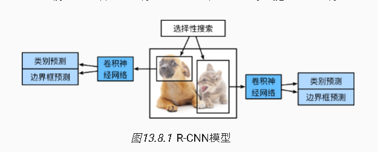

-   使用启发式搜索算法来选择锚框
-   使用预训练模型来对每个锚框抽取特征

​	对一个框当成一个图片，使用一个模型来抽feature

-   训练一个SVM来对类别分类（分类器在深度学习前主要是svm）
-   训练一个线性回归模型来预测边缘框偏移

​	使用线性回归模型预测边界框

## 兴趣区域（ROL）池化

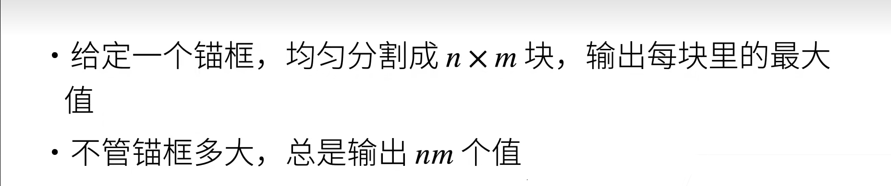

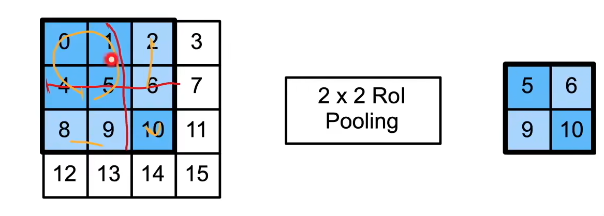

# fast RCNN

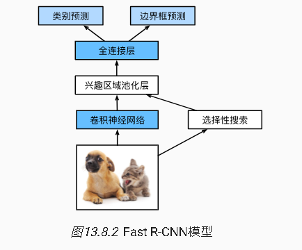

-   问题:对于每一张图片都需要去抽特征，我一个图片抽1000个，那么就要做1000次抽features
-   在RCNN做块
-   用CNN对整个图片做特征，再做一个选择性搜索
-   再对每个框做一个Rol

# Raster R-CNN

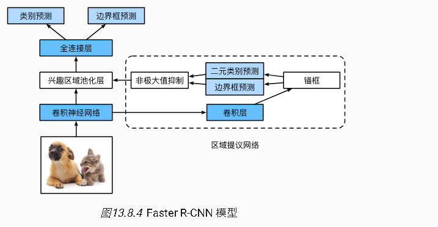

-   使用神经网络替代启发性搜索来获得更好的锚框

-   几乎使用的是目标检测

-   非极大值抑制（NMS把类似的锚框去重）

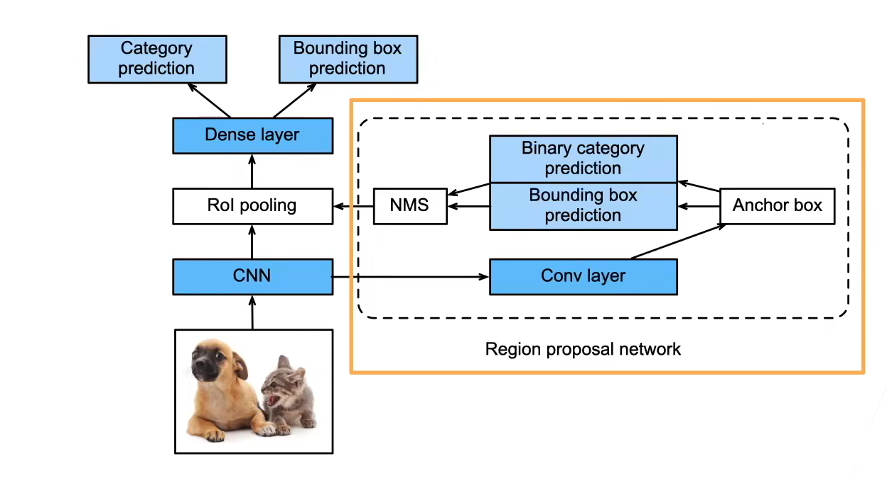

# MASK R-CNN

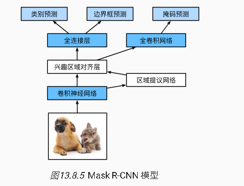

https://cv.gluon.ai/model_zoo/classification.html

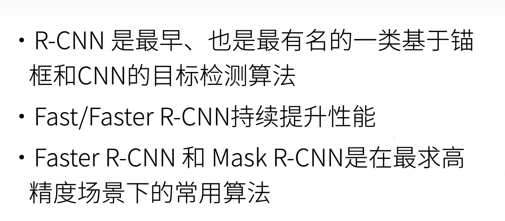

# SSD单发多框检测

-   对单个像素生成多个锚框

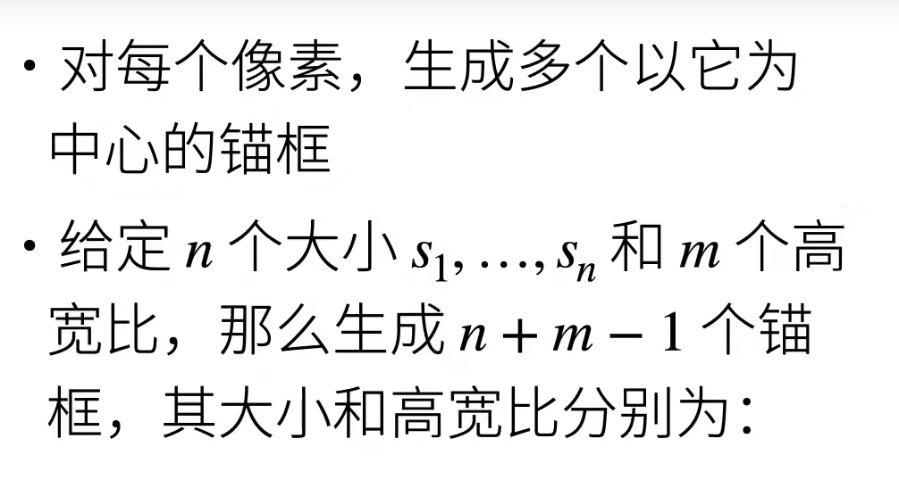

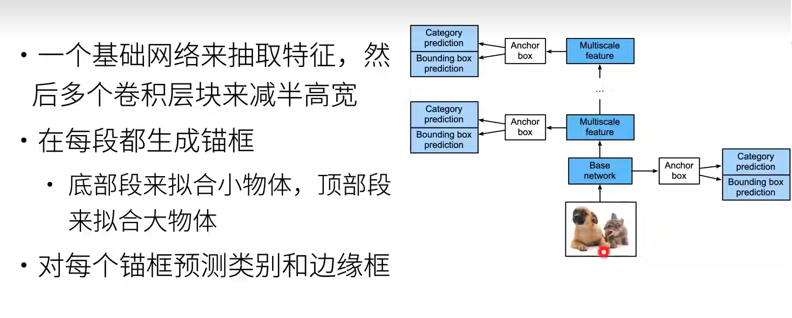

-   对锚框直接做预测了

-   先抽特征
-   Anchor box 生成锚框 
    -   预测

# YOLO  you only look(改live) one

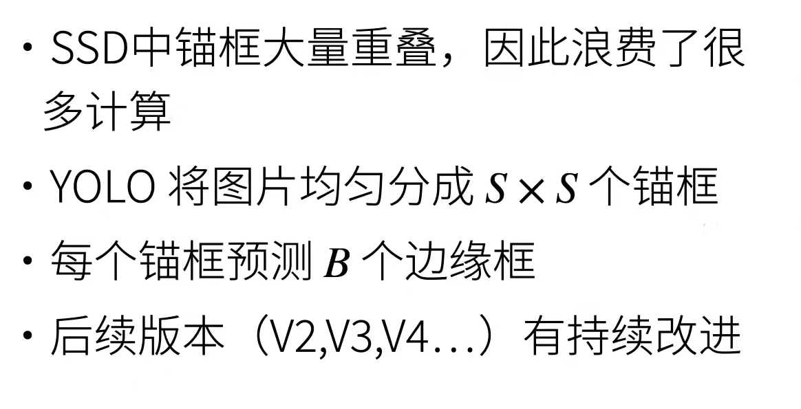