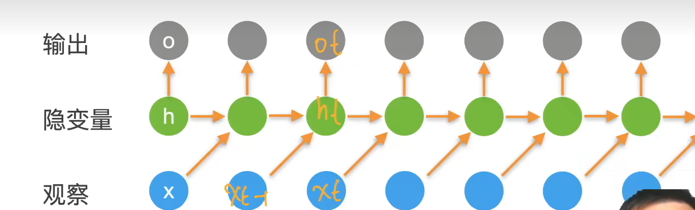
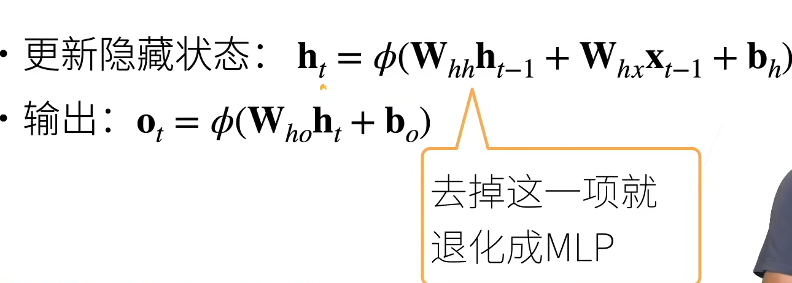
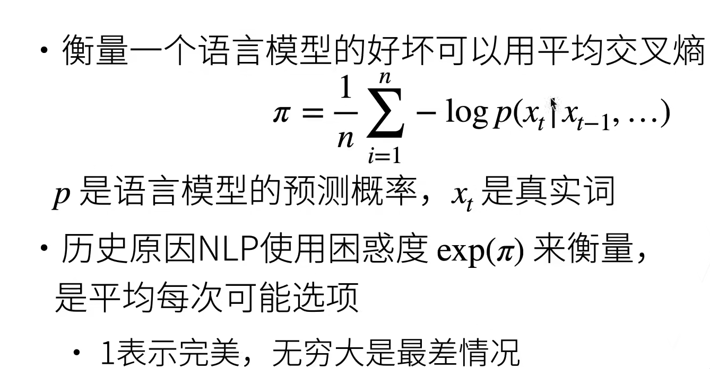
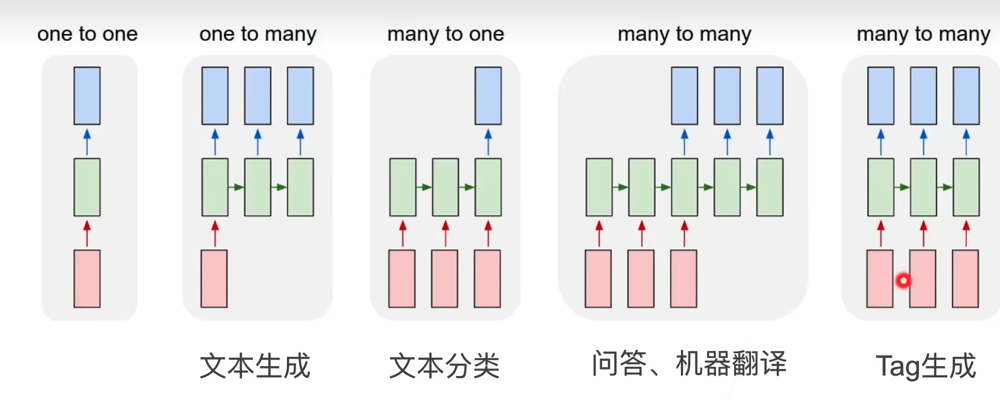
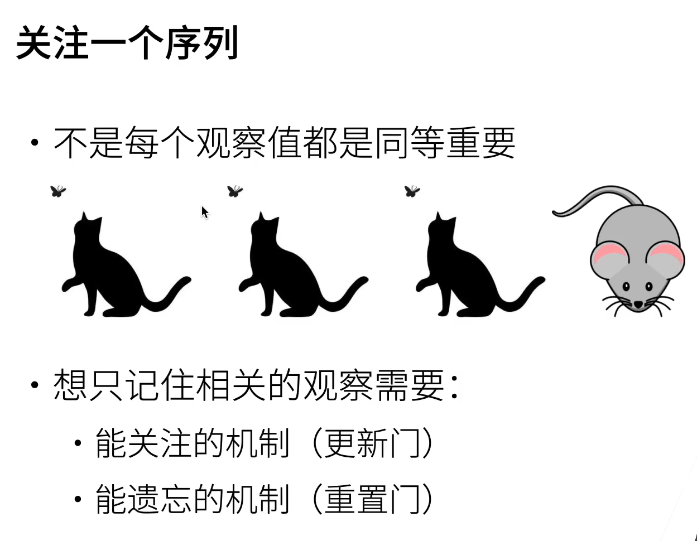
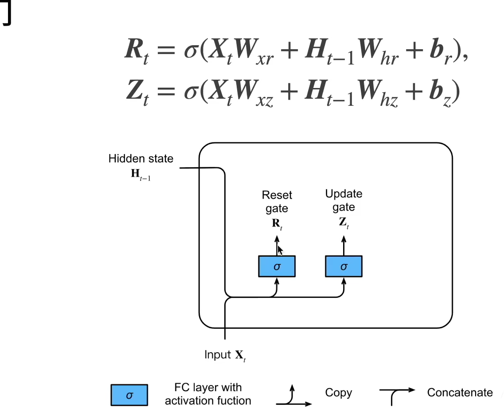
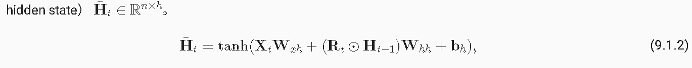
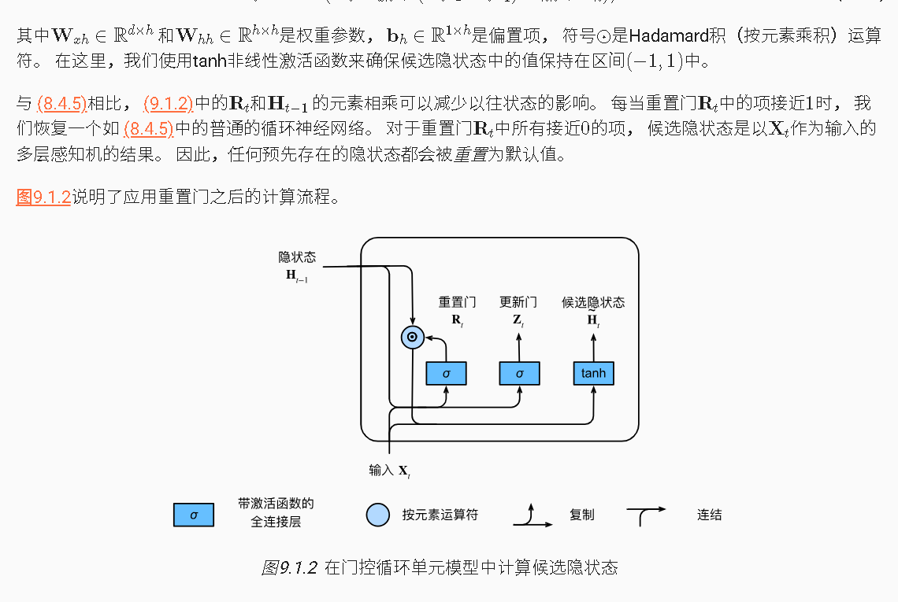

**通过输入xt-1 于隐变量 预测Ot ，之后观察Xt**

**损失函数是Ot于Xt做损失**

**存在一个时间轴**

# [困惑度perplexity]衡量一个语言模型的好坏（交叉熵）

- 其实是一个分类问题
- 通过预测下一个词，

# 梯度剪裁

- 预防梯度爆炸

---

- 迭代中计算这 $ T $ 个时间步上的梯度，在反向传播过程中产生长度为 $ O(T) $ 的矩阵乘法链，导致数值不稳定
- 梯度裁剪能有效预防梯度爆炸
  - 如果梯度长度超过 $ \theta $，那么拖影回长度 $ \theta $

$$
\mathbf{g} \leftarrow \min\left(1, \frac{\theta}{|\mathbf{g}|}\right)\mathbf{g}
$$

$$
|\mathbf{g}'| = \frac{\theta}{|\mathbf{g}|} \cdot |\mathbf{g}| = \theta
$$

---

# 应用

- 文本生成：给开始的词生成下一个词
- 文本分类：给很多词做分类
- 问答：
- Tag生成：对每个词进行输出

# GRU 门控神经网络

## 门

-   相当于和隐藏状态长度相同的向量

-   多了两个权重

-   Ht-1进 然后全连接层 用σ做激活函数

## 候选隐状态

那个符号的意思是按元素乘法

