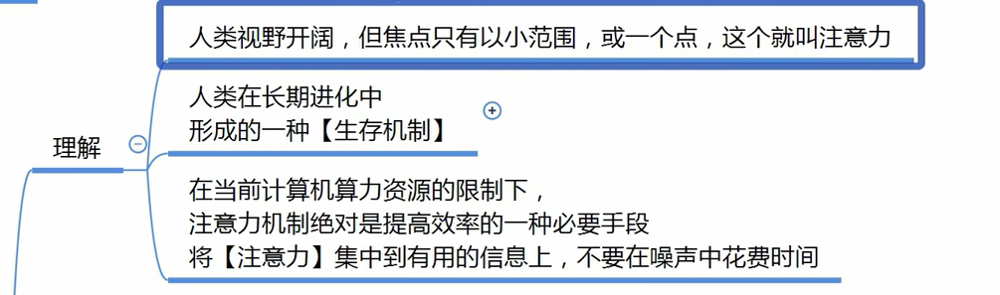
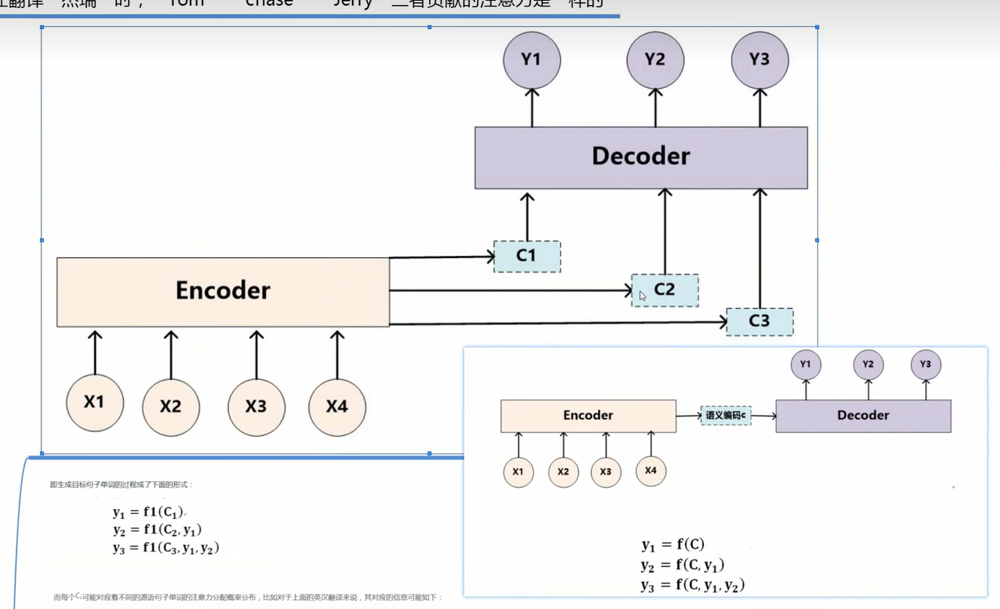
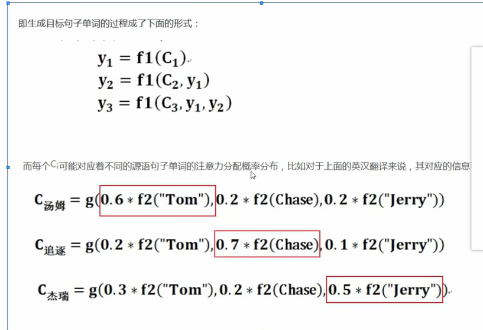
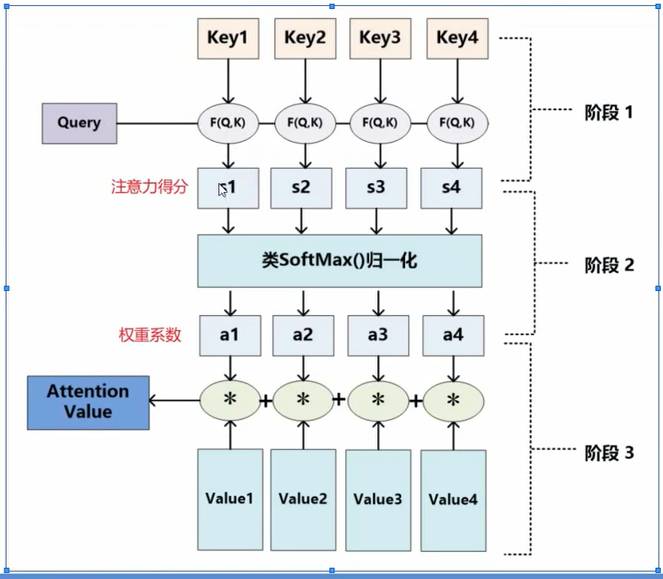
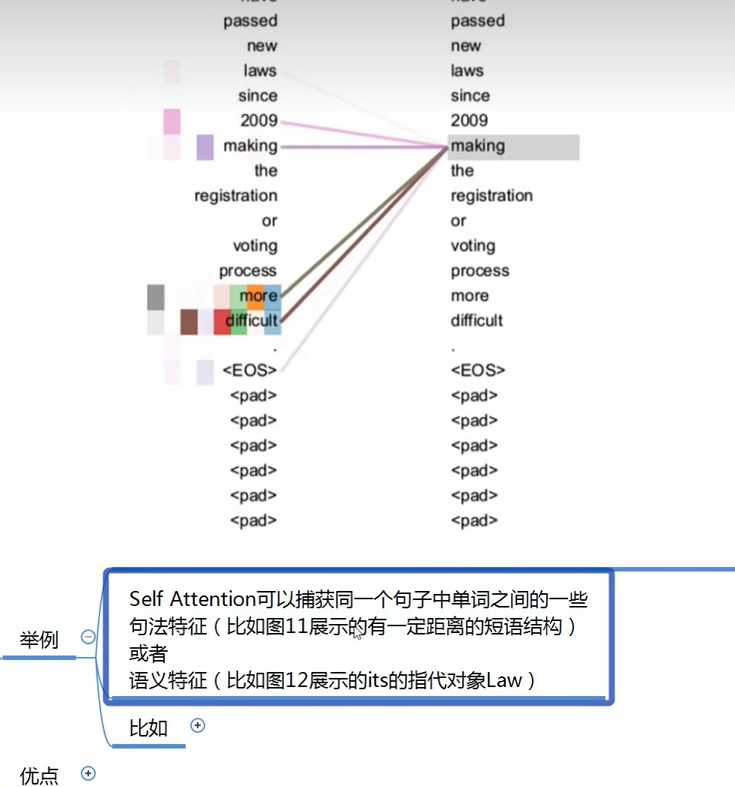

# 注意力

-   注意力机制显示的考虑随意线索
-   随意线索为查询Query
-   每输入一个值Value和不随意线索Key的对
-   通过注意力池化层来由偏向性的选择某些输入

 

-   引入注意力后，C1会告诉哪一个更相关，

-   将特征与相似度进行匹配

Si 越大相似度越高

-   计算方法可以使用
    -   向量点积
    -   余弦相似度
    -   MLP

## self attention

key Q V都是自己

