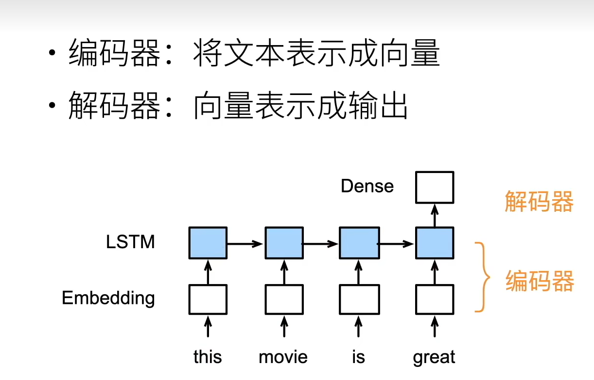
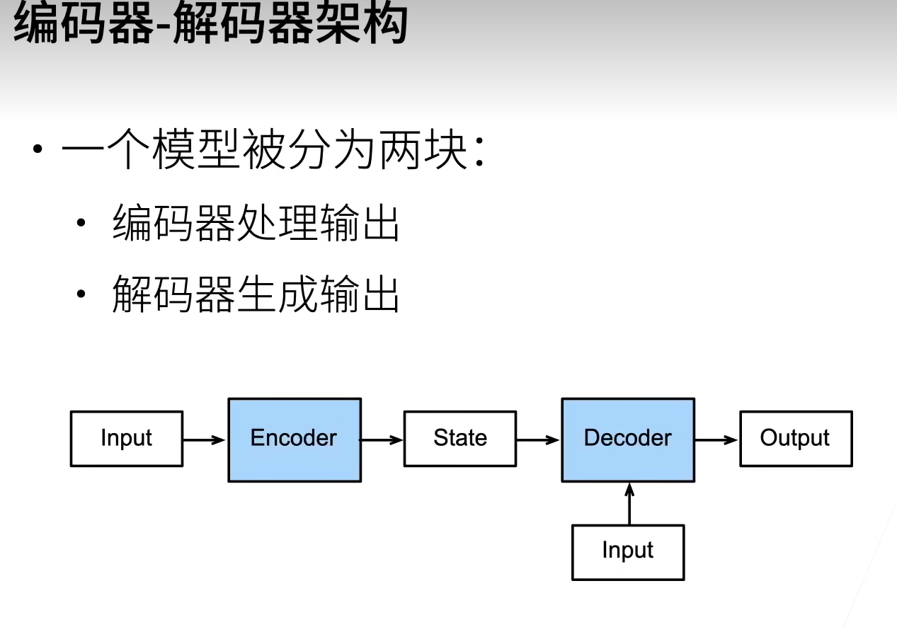
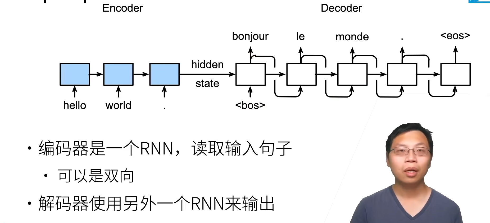
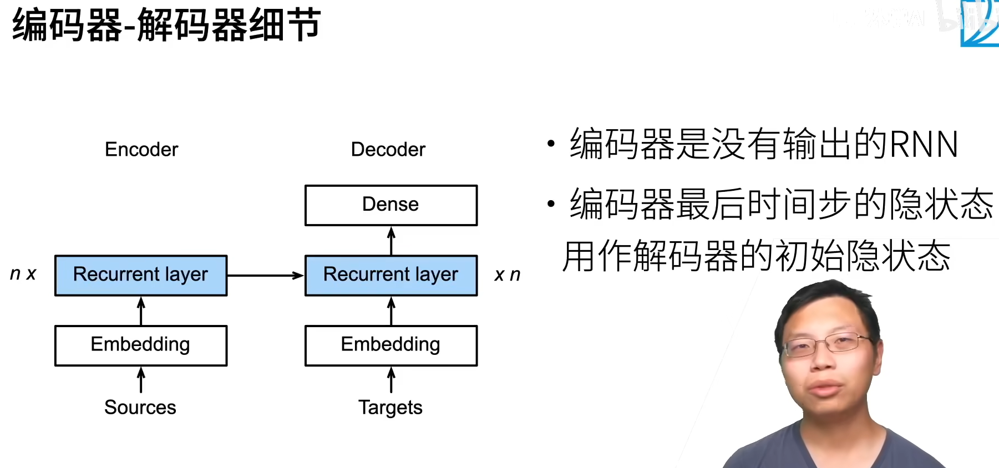
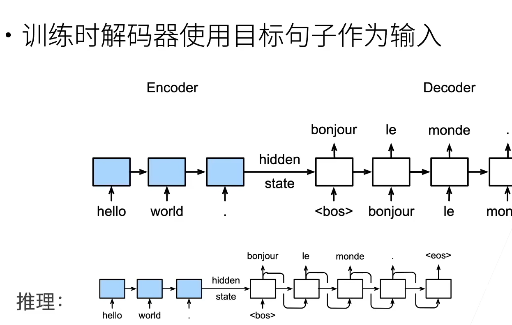
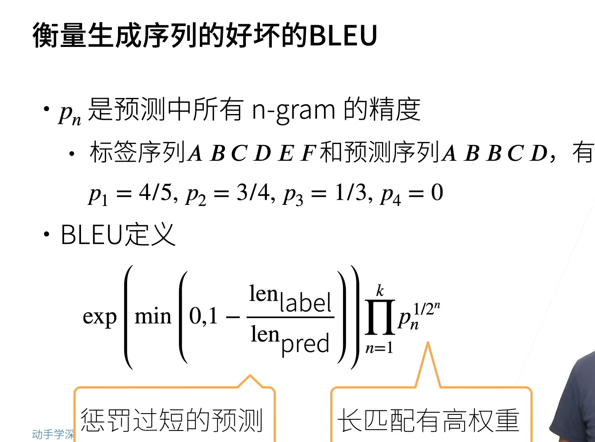
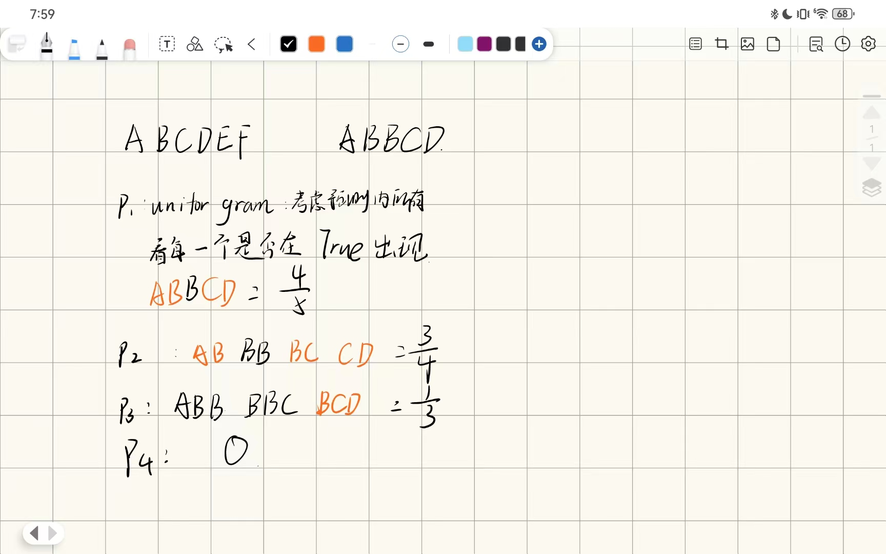
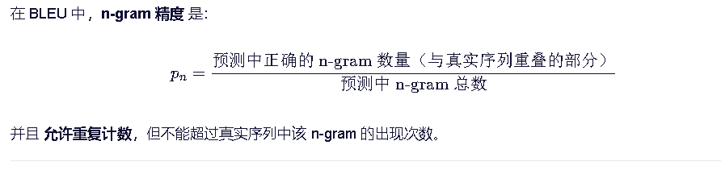

# 编码器和解码器

-   编码器：将输入编程成中间表达形式（其实就是提取特征CNN中）
-   讲中间表示解码成输出

## 在RNN中

# 编解码

-   decoder也可以有一个额外的输入

~~~py
from torch import nn

class Encoder(nn.Module):
    
    def forward(X):
        return 输出一个状态
    
class Decoder(nn.Mudule):
    
    def init_state(self,enc_outputs,*args)
    	中间状态 编码器怎么传过来
        enc_outputs = encoder的输出
        
    def forward(self,x,state)
    	有一个额外的输入X
        state 从编码器拿来的
~~~

## 编码解码器

~~~py
class EncoderDecoder(nn.Module):
    def __init__(self,encdoer,decoder,**kwargs):
        super(EncoderDecoder,self).__init__(**kwargs)
        self.encdoer = encoder
        self.decoder = decoder
    def forward(self,enc_x,dec_x,*args):
        enc_outputs = self.encdoer(enc_x*args)
        dec_state = self.decoder.init_state(enc_outputs,*args)
        rreturn self.decoder(dec_X,dec_state)
~~~

# 应用

## Seq2Seq

-   双向不能做语言模型但是可以i做翻译
-   

-   编码器不需要输出

## 训练和预测

-   在decoder训练中，就算预测错了，但是下一个x+1的input仍是正确的句子的输入而不是将预测的放到下一个输入

-   

## 生成一个句子

-   句子的长度可能不一样

