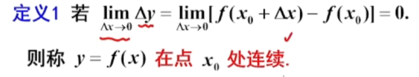
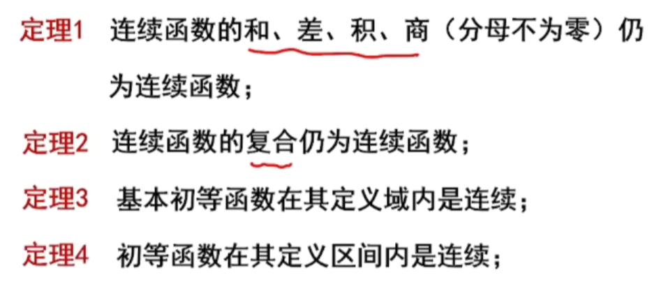
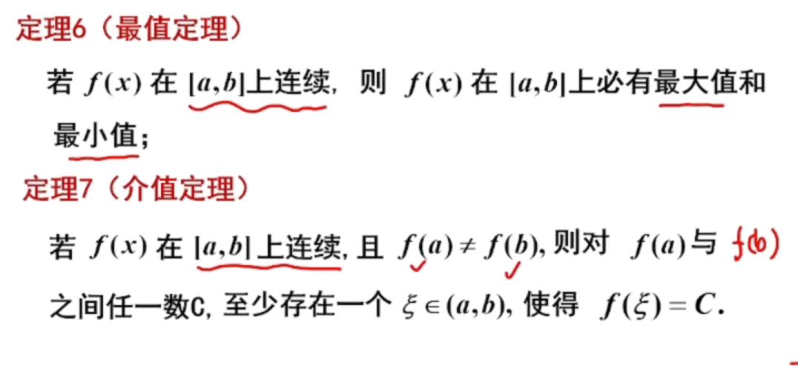
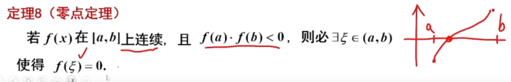

# 函数的连续性

## 考试内容

-   间断点类型
-   闭区间上连续函数性质的证明题

## 连续的概念

极限值等于函数值说明连续

-   左连续 * 右连续

## 间断点

-   定义：在x0处的去心邻域有定义，但在x0处不连续

## 第一类间断点----左右极限都存在

### 跳跃间断点

左右极限不等

### 可去间断点

左右极限相等

## 第二类间断点 ---- 至少有一个不存在

-   极限值为无穷则为第二类间断点

### 无穷间断点

1/x

### 震荡间断点

sin1/x

**判断间断点不一定需要用左右极限如果是以下三种情况则需要**
**分段函数，e无穷，acr无穷**

## 连续性的运算和性质

## 闭区间上连续函数的性质

-   定理五：有界定理

