# 导数和微分（变化率）

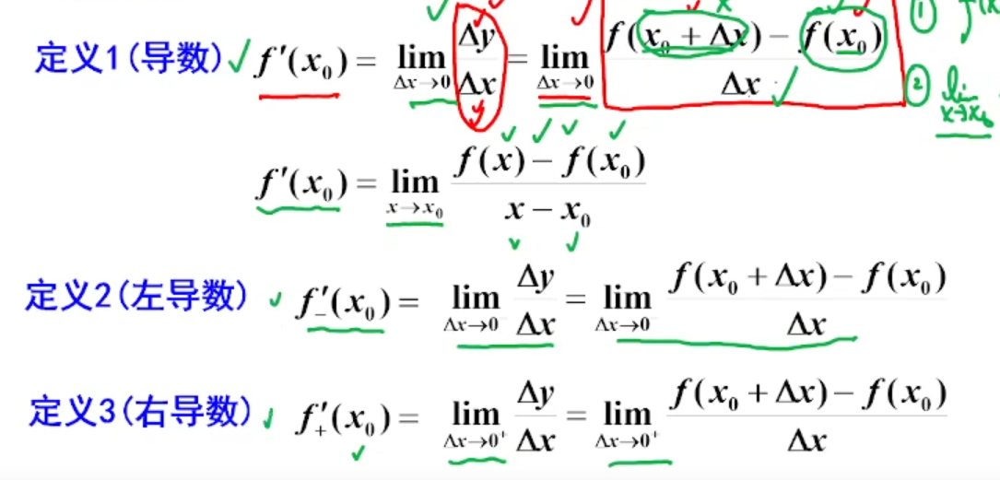

-   函数改变量/x改变量
-   导数与函数值是有关的
    -   动点 - 定点
-   极限f（x）与f（x0)无关
-   连续与f(x)有关

## 可导的充要条件

区间可导则都可导

# 微分（函数变化量）

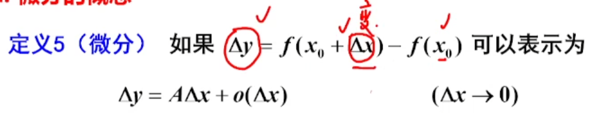

~~~·
▲y = f'(x)*▲x
~~~

微分是函数改变量的近似值，把无穷小去掉了

可微 的充要条件是可导 

再一阶可微和可导是等价的，但是二元就不是了（主要考察全微分）

# 切线

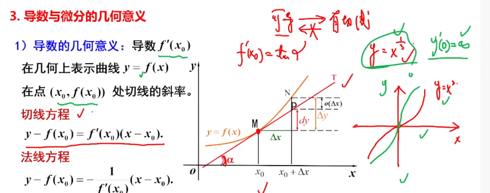

可导说明可以有切线

有切线不一定可导 ----- 平行于y轴，切线不存在

# 可导可微连续的关系

连续但是可以不光滑

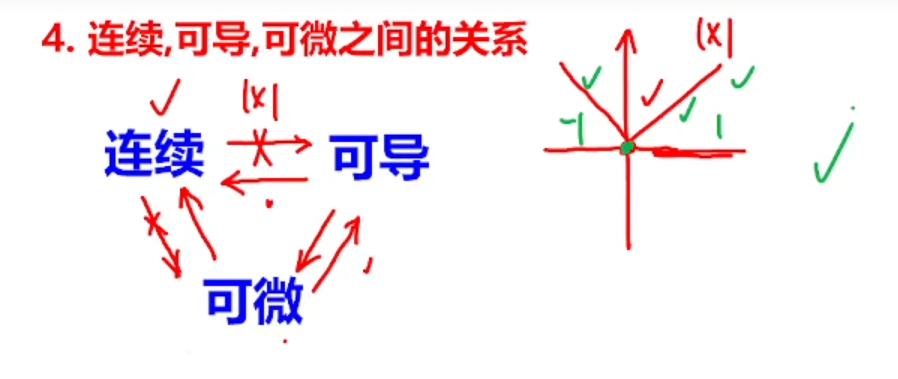

反例 -- |x| 找一个零点不可导的函数

-   连续但不光滑 则不可导

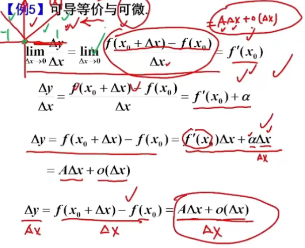

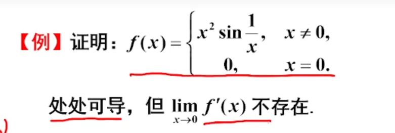

# 导数的性质

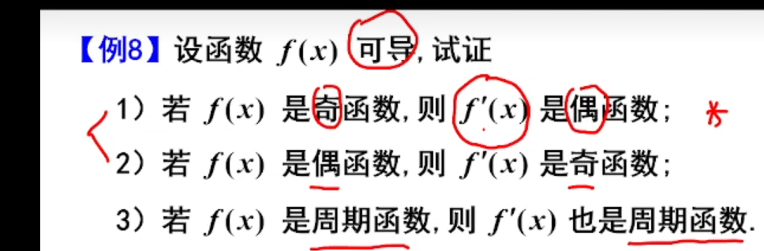

## 隐函数求导

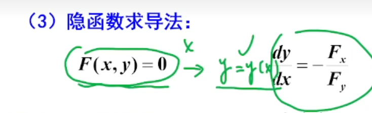

## 反函数求导

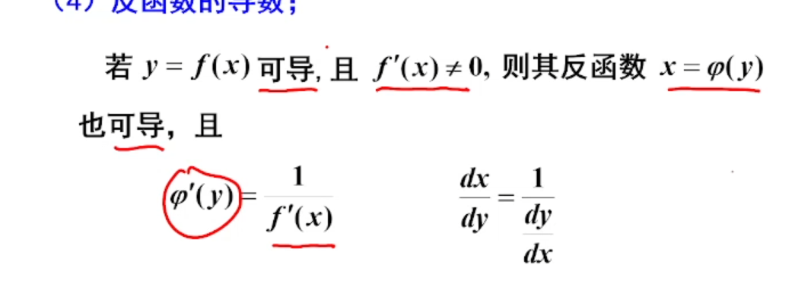

### arcsinx的导数

~~~
y = arcsinx
x = siny

y' = 1/x'y = 1/cosy =  
~~~

## 高阶导数

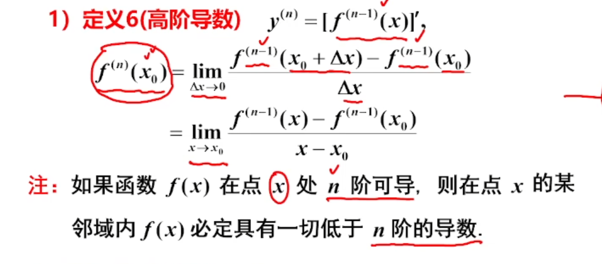

### 常见的高阶导数

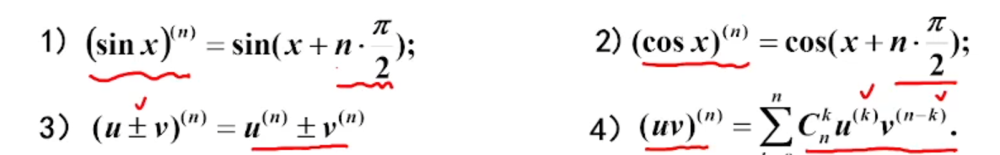

### 例题

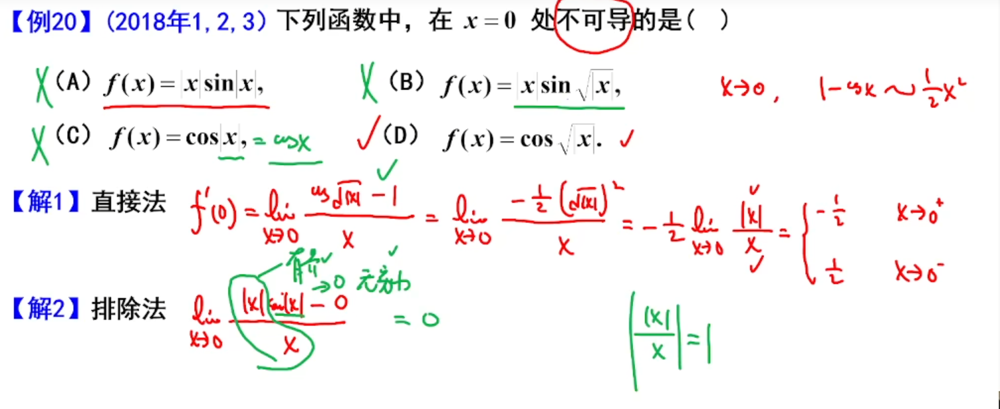

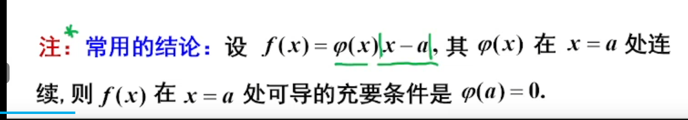

## 切线和法线

关系为负倒数