# 积分

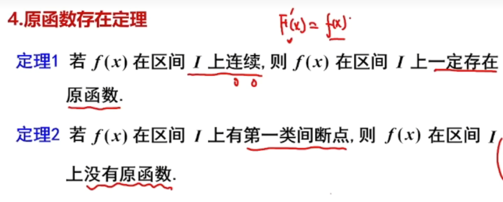

-   连续函数有原函数

不可导所以不能是他的原函数

## 常见的凑微分

$$\frac{dx}{\sqrt{x}} = 2d\sqrt{x}$$

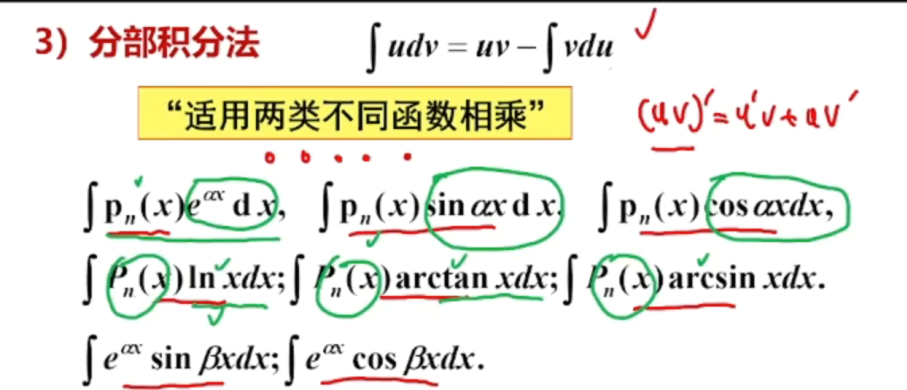

-   次数低万能代换好用

-   开几次但是必须内部是两个一次的比

# 定积分

## 定积分的概念

-   有限闭区间
-   函数有界

-   分：在区间内分n-1个点
-   匀：f（x）*x
-   和
-   极限

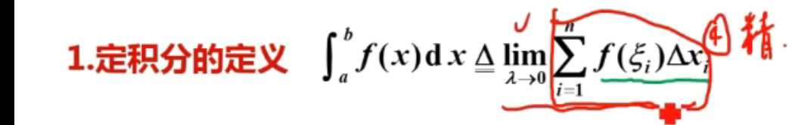

入：最大子区间的长度

## 定积分存在的充分条件

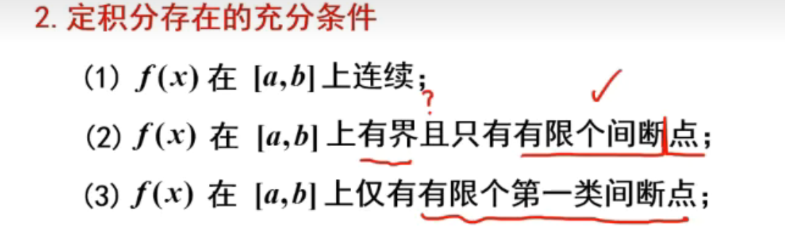

### 性质

-

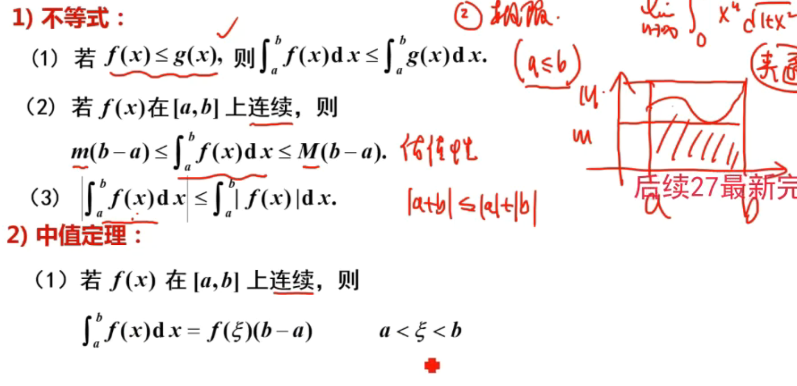

-   积分中值定理

## 积分上限函数

-   上限是x则是一个函数

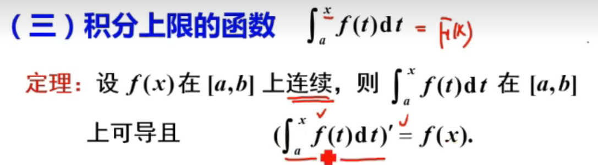

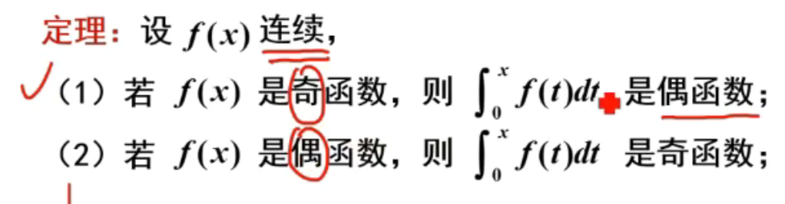

### 做题思路

-   把函数内的x清空，换元或者提出来

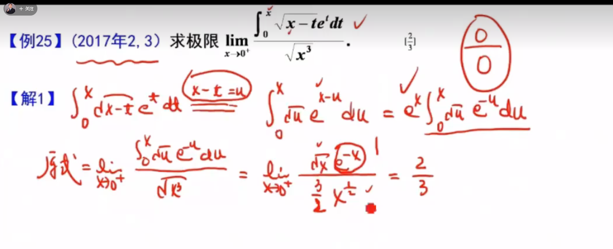

-   积分中值定理
    -   拿积分为非零的

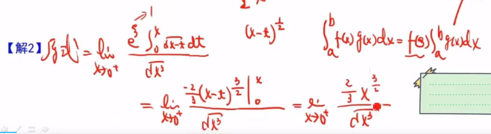

-   积分中值定理
-   算出变上限函数

## 定积分的计算

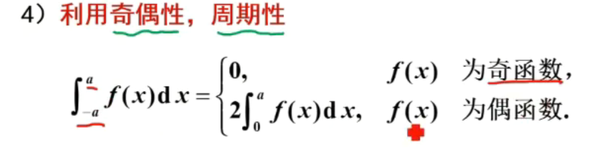

### 常见的定积分

-   火箭
-   区间在现
-   

-   几 何意义

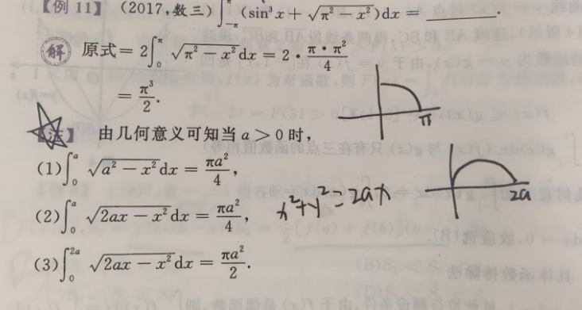

#  反常积分

## 考题：

反常积分敛散性

反常积分的计算

## 类型

-   无穷区间
-   有限区间 + 无界函数

## 方法

1.   找被积函数的原函数（好积的情况）
2.   比较判别法
3.   p积分

##  无穷区间上的反常积分

-   有限区间取极限定义的

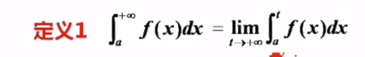

如果极限存在，则反常积分是收敛的

-   定义三要都收敛才收敛

**这与极限不同，极限是两个极限不存在但是加起来可能极限存在，这里是只要有一个不存在就是发散的（定义）**

## 判定敛散性的方法

### 比较判别法

-   判断一个未知的敛散性要与已知敛散性的函数作比较
-   大的收敛则小的收敛
-   小的发散则大的发散

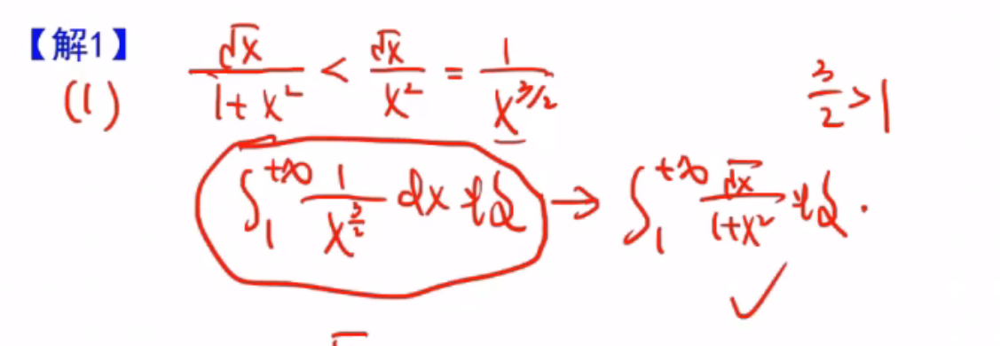

## 比较判别法的极限形式

-   由于放大缩小不方便

 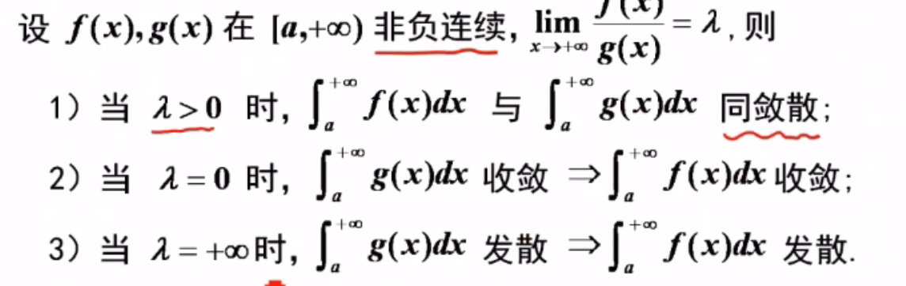

-   
-   入 = 0：分子小分母大，大的收敛小的一定收敛
-   入 = 正无穷：分子大分母小，小的发散大的一定发散

 - 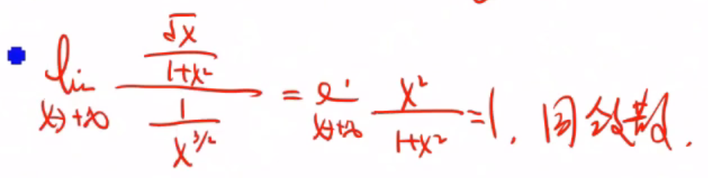

## 无界函数的敛散性

-   无界点分为三种情况

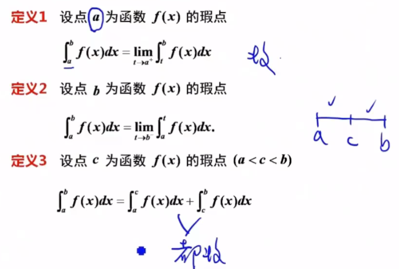

-   左无界
-   右无界
-   中间无界

与p积分相比

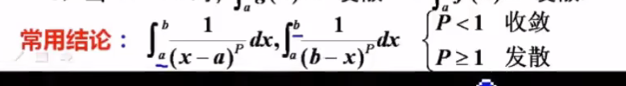

与无穷积分相反

-----

小的发散则大的发散

大的收敛 则小的收敛

-----

# 定积分的应用

-   几何
-   物理

## 1. 平面图形的面积

求平面内区域D的面积
$$
\int{\int{1dD\ =\ S}}
$$
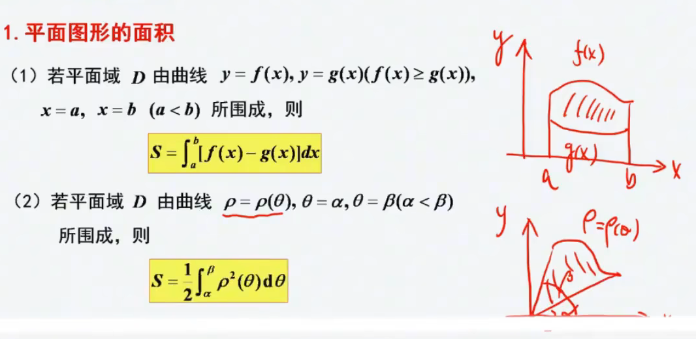

**极坐标推导**
$$
曲面面积：S\ =\ \frac{1}{2}r*r*\theta
$$

$$
dS\ =\ \frac{1}{2}\rho *\rho *d\theta
$$

再积dS

-   看成二重积分做

1.   二重积分法

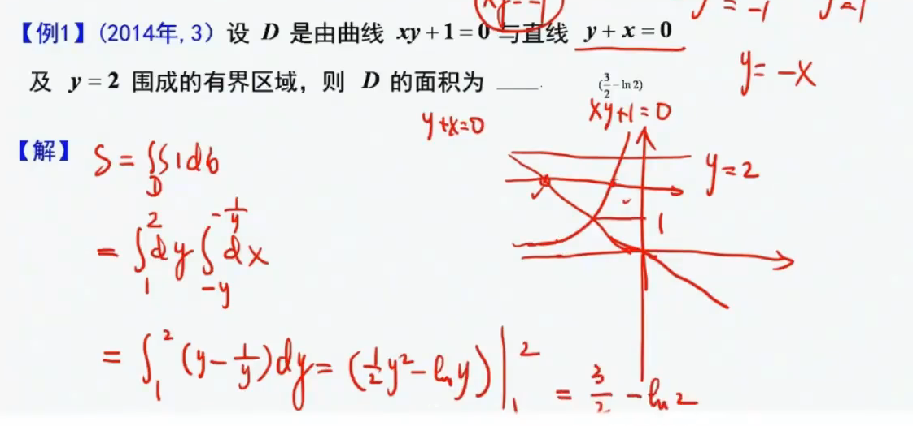

2.   

 

## 旋转体体积

一个平面区域D和一个直线ax+by+c=0（不穿过）

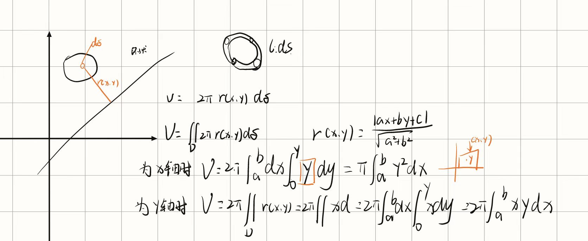

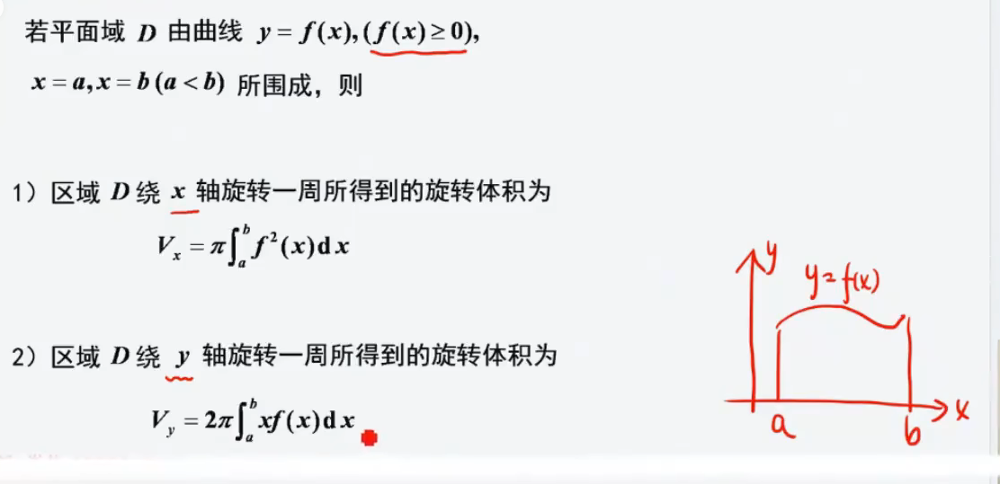

-   只能绕坐标轴的面积

## 弧长

-   弧微分

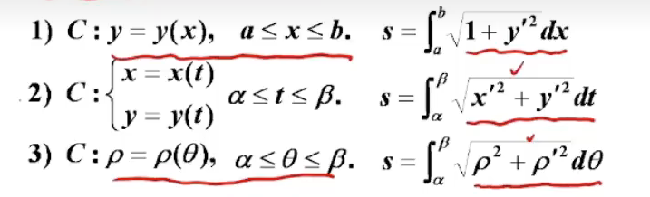

-   直角坐标
-   参数方程
-   极坐标

-   旋转体的侧面积

$$
2\pi \int_a^b{f\left( x \right) \sqrt{1+f'^2\left( x \right)}dx}
$$

