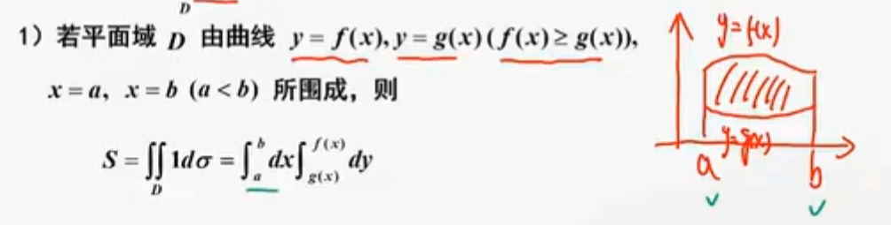
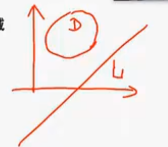
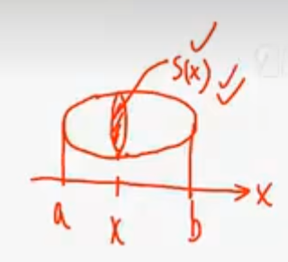
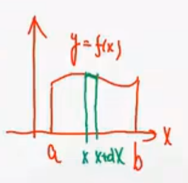
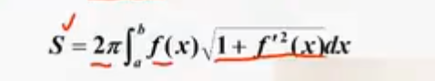

# 几何
## 面积
### 平面域
**弧长公式**  L = rθ
元素法，微元法
1. 二重积分
$$S=\iint_D 1 d\sigma$$

- 直角坐标
$$S = \iint_D 1 d\sigma = \int_a^b dx \int_{g(x)}^{f(x)} dy$$

$$= \int_a^b [f(x) - g(x)] dx$$
- 极坐标
$$S = \iint_D 1 d\sigma = \int_{\alpha}^{\beta} d\theta \int_0^{r(\theta)} r dr$$
dcta 用弧长公式l = rx看成长方形算面积
## 体积
### 旋转体
平面域D绕直线L：ax+by+c =0（该直线不穿过区域D)旋转所得旋转体体积记为V.

- 二重积分
在面积中取小区域D，V 近似于 S(转完那个圆环的面积)\*周长
$$dV = 2\pi r(x,y) d\sigma$$

$$V = 2\pi \iint_D r(x,y) d\sigma$$
点到直线距离
$$r(x,y) = \frac{|ax + by + c|}{\sqrt{a^2 + b^2}}$$

#### 当绕y = 0转（x轴转）
$$V_x = 2\pi \iint_D y \, d\sigma = 2\pi \int_a^b dx \int_0^{f(x)} y \, dy$$

$$= \pi \int_a^b f^2(x) \, dx$$
#### 当绕x = 0转（y轴转）
$$V_y = 2\pi \iint_D x \, d\sigma = 2\pi \int_a^b dx \int_0^{f(x)} x \, dy$$

$$= 2\pi \int_a^b x f(x) \, dx$$
### 已知横截面面积的体积

$$V = \int_a^b S(x) dx$$

## 曲线弧长
**平面曲线**
$$C: y = y(x), \quad a \le x \le b.$$

$$s = \int_a^b \sqrt{1 + y'^2} dx$$
提出 $dx$，得到 $ds = \sqrt{1 + (\frac{dy}{dx})^2} dx = \sqrt{1 + y'^2} dx$。
$$C: \begin{cases} x = x(t) \\ y = y(t) \end{cases}, \quad \alpha \le t \le \beta.$$

$$s = \int_\alpha^\beta \sqrt{x'^2 + y'^2} dt$$
将 $dx$ 和 $dy$ 都看作关于 $t$ 的函数，提出 $dt$，得到 $ds = \sqrt{(\frac{dx}{dt})^2 + (\frac{dy}{dt})^2} dt = \sqrt{x'^2 + y'^2} dt$。

$$C: r = r(\theta), \quad \alpha \le \theta \le \beta.$$

$$s = \int_\alpha^\beta \sqrt{r^2 + r'^2} d\theta$$
结合极坐标和直角坐标的转换公式 $x = r\cos\theta, y = r\sin\theta$，分别求导后代入 $ds$ 的基本形式并化简，即可得到 $ds = \sqrt{r^2 + (\frac{dr}{d\theta})^2} d\theta = \sqrt{r^2 + r'^2} d\theta$。

**旋转体侧面积**

# 物理
1. 压力
2. 引力
3. 做功
