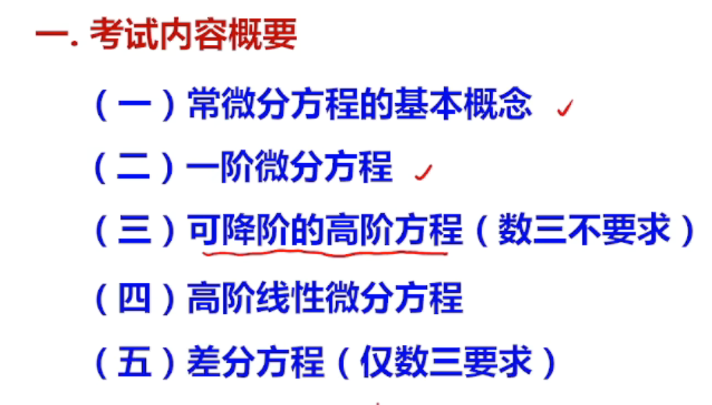
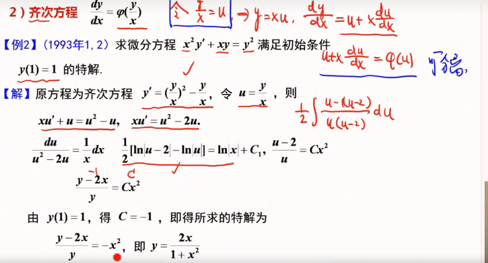
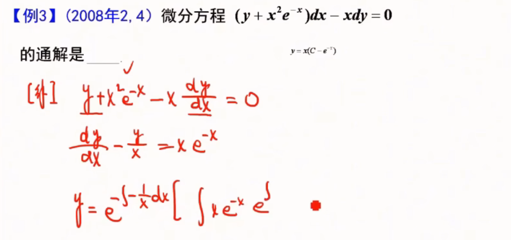
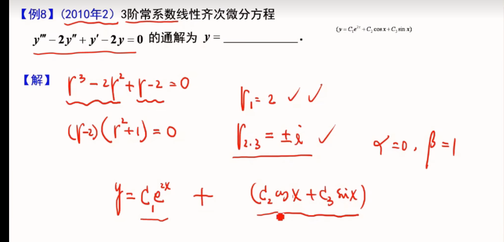

## 微分方程

-   定义：含有y，y',y'',x
-   阶：所出现的未知函数最高阶的导数的阶数
-   解：满足函数的解
-   通解：如果微分方程的解含有任意常数，任意常数的个数与微分方程的阶数相同
-   初始条件：确定特解的一组常数
-   积分曲线：方程的一个解在平面对应一条曲线

## 一阶微分方程
有时候需要把xy对调能看出是线性方程
或者是变量代换
### 可分离变量

**方程中只包含一阶导数 y′ 。**
**方法**
变量分离
两边积分
$$y' = f(x)g(y)$$


$$\frac{dy}{dx} = f(x)g(y) \Rightarrow \frac{dy}{g(y)} = f(x)\,dx$$

 - **例**（2006）：$y' = \frac{y(1-x)}{x}$

$\int \frac{dy}{y} = \int \frac{1-x}{x}dx$ → $\ln|y| = \ln|x| - x + C_1$

$y = Cxe^{-x}$


**例**：$y' + xy^2 - y^2 = 1 - x$

$y' = (1-x)(1+y^2)$ → $\int \frac{dy}{1+y^2} = \int (1-x)dx$


- **例**：$y' = \cos(x + y)$

令 $x + y = u$，则 $1 + y' = u'$

$u' = 1 + \cos u$，化为可分离变量方程

### 齐次方程

> 形如 $\frac{dy}{dx}=f\left(\frac{y}{x}\right)$，注意 $\frac{y}{x}$ 结构有时不会直接给出，需作简单变换才能看出。

**解法**
- 令$u=\frac{y}{x}$，则 $y=xu$，两边求导得 $$y'=u+xu'$$，代入化为 $u$ 关于 $x$ 的可分离变量方程

$$\frac{dy}{dx} = u + x\frac{du}{dx}$$

代入得 $u + x\frac{du}{dx} = \varphi(u)$，化为可分离变量方程

 


### 一阶线性微分方程


$$y' + P(x)y = Q(x)$$

$$y = e^{-\int P(x)\,dx}\left[\int Q(x)e^{\int P(x)\,dx}\,dx + C\right]$$

-   例


### 全微分方程
左边等于一个函数的二元全微分
$$P(x,y)dx + Q(x,y)dy = 0$$

判定：$$\frac{\partial P}{\partial y} = \frac{\partial Q}{\partial x}$$

- 例：$(2xy + y^2)dx + (x^2 + 2xy)dy = 0$

$\frac{\partial P}{\partial y} = 2x + 2y = \frac{\partial Q}{\partial x}$，是全微分方程

取 $(x_0, y_0) = (0, 0)$

$$u(x, y) = \int_0^x 0\,dt + \int_0^y (x^2 + 2xt)\,dt = x^2y + xy^2$$

通解 $x^2y + xy^2 = C$
## 可降阶的高阶方程（数三不要求）

| 类型  | 形式               | 解法                                 |
| --- | ---------------- | ---------------------------------- |
| 1   | $y'' = f(x)$     | 直接两次积分（多次积分）                       |
| 2   | $y'' = f(x, y')$ | 令 $y' = p$，$y'' = \frac{dp}{dx}$（） |
| 3   | $y'' = f(y, y')$ | 令 $y' = p$，$y'' = p\frac{dp}{dy}$  |
|     |                  |                                    |

- 例：$y'' = e^x + x$

$y' = e^x + \frac{1}{2}x^2 + C_1$

$y = e^x + \frac{1}{6}x^3 + C_1x + C_2$


- 例（第3类）：$2yy'' = (y')^2 + y^2$，$y(0)=1$，$y'(0)=-1$
- **无显式x**   P159

令 $y' = p$，$y'' = p\frac{dp}{dy}$，代入 $2yp\frac{dp}{dy} = p^2 + y^2$

整理 $2\frac{p}{y}\frac{dp}{dy} = \left(\frac{p}{y}\right)^2 + 1$，令 $u = \frac{p}{y}$

化为 $2yu\frac{du}{dy} = 1 - u^2$，得 $u = -1$

$p = -y$ → $y' = -y$ → $y = Ce^{-x}$，代入初值 $y = e^{-x}$


#  高阶线性微分方程

## 解的结构
### 齐次方程
**齐次**：$y'' + p(x)y' + q(x)y = 0$（二阶）
如果y1，y2都是齐次方程的解（线性无关（比不等于常数）），则C1y1+C2y2也是齐次方程的通解

### 非齐次方程
1. y1，y2是齐次方程的线性无关的特解
y = C1y1(x)+C1y2(x) + y*()
2. 如果y1和y2都是非齐次方程的解，那么y1-y2是齐次方程的解
3. 叠加原理：
	若 $y_1$ 是方程 ① $y'' + P(x)\cdot y' + Q(x)\cdot y = f_1(x)$ 的解，
	 且 $y_2$ 是方程 ② $y'' + P(x)\cdot y' + Q(x)\cdot y = f_2(x)$ 的解，
	 则$y_1 + y_2$ 是方程 ③ $y'' + P(x)\cdot y' + Q(x)\cdot y = f_1(x) + f_2(x)$ 的解。


**非齐**：$y'' + p(x)y' + q(x)y = f(x)$
- 若 $y^*$ 是非齐特解 → 非通 $y = C_1y_1 + C_2y_2 + y^*$

**齐通 + 非齐特 = 非通**
**两个非齐次方程的两个特解的差是齐次的解**

## 二阶线性常系数齐次方程

特征方程 $r^2 + pr + q = 0$，设两特征根 $r_1, r_2$

| 根的情况                          | 通解                                                  |
| ----------------------------- | --------------------------------------------------- |
| $r_1 \neq r_2$（实）             | $y = C_1e^{r_1x} + C_2e^{r_2x}$                     |
| $r_1 = r_2 = r$               | $y = e^{rx}(C_1 + C_2x)$                            |
| $r_{1,2} = \alpha \pm i\beta$ | $y = e^{\alpha x}(C_1\cos\beta x + C_2\sin\beta x)$ |

-   三阶例题



---

$$
y'' + py' + q*y = 0
$$$$
y'' + py' + q*y = f(x)
$$
pq都是常数
```
y'' + y' = 2y
如果y = e^(nx)
那么可以成立
设特解y = e^(rx)

y' = ry
y'' = rry

rre^(rx) + pre^(rx) + qe^(rx) = 0
=> (rr + pr + q)r^(rx) = 0
=> r*r + pr + q = 0

现在就是求r，r的二次函数
r = r1,r2
e^(r1x) e^(r2x)

y1 = e^(r1x)
y2 = e^(r2x)
```

齐次方程$y'' + py' + qy = 0$解题：
1. 写出特征方程 $r^2 + pr + q = 0$
2. 求r1 r2
3.  通解


## 二阶常系数非齐次线性微分方程

$$y'' + py' + qy = f(x)$$

| $f(x)$ 形式                                       | 特解 $y^*$ 设解                                                           |
| ----------------------------------------------- | --------------------------------------------------------------------- |
| $P_m(x)e^{\lambda x}$                           | $y^* = x^k Q_m(x) e^{\lambda x}$                                      |
| $e^{\alpha x}[P_l\cos\beta x + P_n\sin\beta x]$ | $y^* = x^k e^{\alpha x}[R_m^{(1)}\cos\beta x + R_m^{(2)}\sin\beta x]$ |
最终解 = 齐次方程通解 + 非齐次方程特解

$m = \max\{l, n\}$，$k$ 取 $\lambda$（或 $\alpha \pm i\beta$）在特征根中的重数（0/1/2）

- 例：$y'' - 2y' + y = 2xe^x$

特征方程 $r^2 - 2r + 1 = 0$ → $r = 1$（二重根），齐通 $y = e^x(C_1 + C_2x)$

$f(x) = 2x \cdot e^x$，$\lambda = 1$ 是二重根 → $k = 2$

设 $y^* = x^2(Ax + B)e^x = (Ax^3 + Bx^2)e^x$

代入解得 $A = \frac{1}{3}$，$B = 0$，$y^* = \frac{1}{3}x^3 e^x$

非通 $y = e^x(C_1 + C_2x + \frac{1}{3}x^3)$
 

### 叠加原理


> 非齐次方程右端拆为多函数之和时，总特解等于各特解之和。

- **性质5**：若 $y_1$ 是 $y'' + P(x)y' + Q(x)y = f_1(x)$ 的解，$y_2$ 是 $y'' + P(x)y' + Q(x)y = f_2(x)$ 的解，则 $y_1 + y_2$ 是 $y'' + P(x)y' + Q(x)y = f_1(x) + f_2(x)$ 的解
- **应用**：$y'' + xy' + y = 1 + \sin x + e^x$ 拆为三个方程分别求特解，$y^* = y_1 + y_2 + y_3$
---


> $f(x)$ 有两种标准形式，分别对应不同的设解策略。

- **类型一**：$f(x) = e^{\lambda x} P_n(x)$，$P_n(x)$ 为 $n$ 次多项式
- **类型二**：$f(x) = e^{\lambda x}[P_n(x)\sin(\omega x) + P_l(x)\cos(\omega x)]$，设解时取 $m = \max\{n, l\}$


#### 类型一
例：


```
入 = 2
P(x) = 5x^2 + x + 1
Qn
k
y* = x^k * e^入x * Qn(x)
带入y*求得k和Q(n)
```
**解法**
1. r² + p·r + q = 0 解出特征根： r1 ，r2
2. 得到齐次线性方程的通解
3. 
4. 对照出k ，入，
	1. Qn(x)和Pn(x)是一个同次多项式
5. 设一个多项式Qn得到特解y*
6. 把y\*带回方程求出Qn
7. y = 通解 + 特解

例


#### 类型二

```
入
w
p(x)
需要找到
k
Q(x) 次数 = max(m,l)
```

k

**解：**
1. 特征方程
2. 找k
	1. 
	2. 

例

特征根 r1 r2
通解


特解
```
0sinx + 1cosx
入 = 0
w = 1
m = max(0,1) = 0 
y* = x^k * e^(入x) * (Q(x)sin(wx)+Q(x)cos(wx))
     1      1         零次多项式 = asinx + bcosx
带入y* 求ab
```


y = y* + 通解
