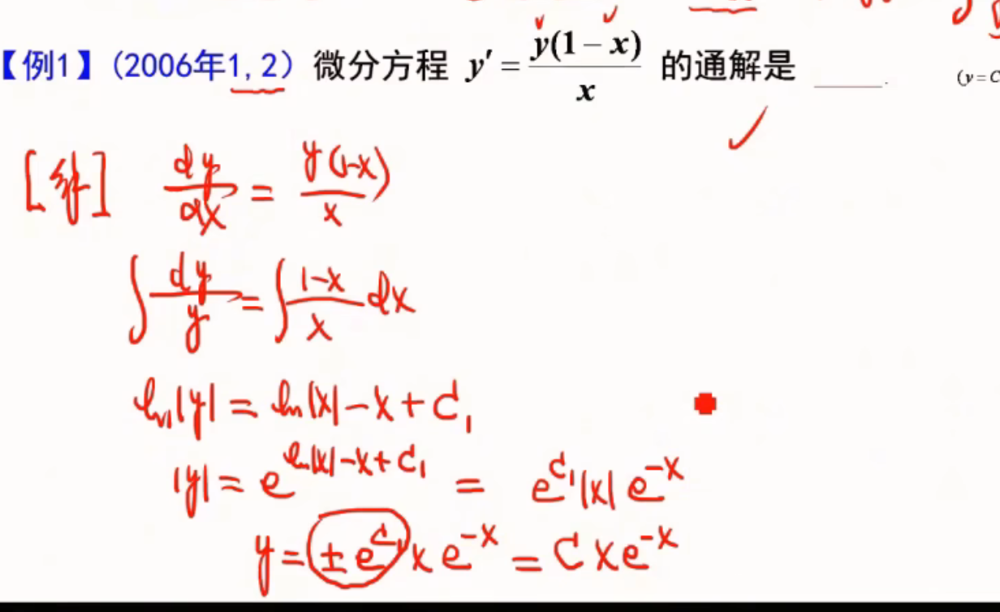
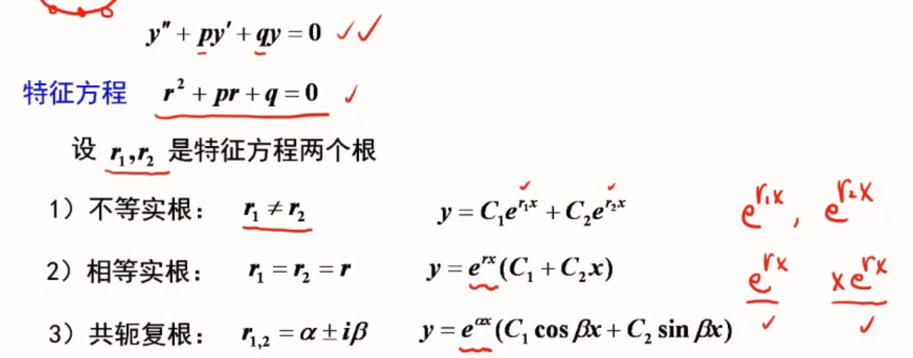

## 微分方程

-   定义：含有未知函数或未知函数的导数
-   阶：所出现的未知函数最高阶的导数的阶数
-   解：满足函数的解
-   通解：如果微分方程的解含有任意常数，任意常数的个数与微分方程的阶数相同
-   初始条件：确定特解的一组常数
-   积分曲线：方程的一个解在平面对应一条曲线

## 一阶微分方程
### 可分离变量

**方程中只包含一阶导数 y′ 。**
**方法**
变量分离
两边积分
$$y' = f(x)g(y)$$

$$\frac{dy}{dx} = f(x)g(y) \Rightarrow \frac{dy}{g(y)} = f(x)\,dx$$

 

### 齐次方程

令 $u = \frac{y}{x}$，则 $y = xu$

$$\frac{dy}{dx} = u + x\frac{du}{dx}$$

代入得 $u + x\frac{du}{dx} = \varphi(u)$，化为可分离变量方程

 

### 线性方程

$$y' + P(x)y = Q(x)$$

$$y = e^{-\int P(x)\,dx}\left[\int Q(x)e^{\int P(x)\,dx}\,dx + C\right]$$

-   例

### 全微分方程
左边等于一个函数的二元全微分
$$P(x,y)dx + Q(x,y)dy = 0$$

判定：$$\frac{\partial P}{\partial y} = \frac{\partial Q}{\partial x}$$

- 例：$(2xy + y^2)dx + (x^2 + 2xy)dy = 0$

$\frac{\partial P}{\partial y} = 2x + 2y = \frac{\partial Q}{\partial x}$，是全微分方程

取 $(x_0, y_0) = (0, 0)$

$$u(x, y) = \int_0^x 0\,dt + \int_0^y (x^2 + 2xt)\,dt = x^2y + xy^2$$

通解 $x^2y + xy^2 = C$
## 可降阶的高阶方程（数三不要求）

| 类型 | 形式 | 解法 |
|------|------|------|
| 1 | $y'' = f(x)$ | 直接两次积分 |
| 2 | $y'' = f(x, y')$ | 令 $y' = p$，$y'' = \frac{dp}{dx}$ |
| 3 | $y'' = f(y, y')$ | 令 $y' = p$，$y'' = p\frac{dp}{dy}$ |

- 例：$y'' = e^x + x$

$y' = e^x + \frac{1}{2}x^2 + C_1$

$y = e^x + \frac{1}{6}x^3 + C_1x + C_2$

#  高阶线性微分方程

**解的结构**

**齐次**：$y'' + p(x)y' + q(x)y = 0$
未知函数都是一次的
右端等于0是齐次的
- 若 $y_1, y_2$ 是齐次两线性无关特解 → 齐通 $y = C_1y_1 + C_2y_2$
y1/y2不等于常数则是线性无关的
如果是n阶的那么要找n个线性无关的特解

非齐：$y'' + p(x)y' + q(x)y = f(x)$
- 若 $y^*$ 是非齐特解 → 非通 $y = C_1y_1 + C_2y_2 + y^*$

###### **齐通 + 非齐特 = 非通**

## 常系数齐次线性微分

-   (无x其他都有x)

-   三阶例题

 

