# 二重积分

# 考点

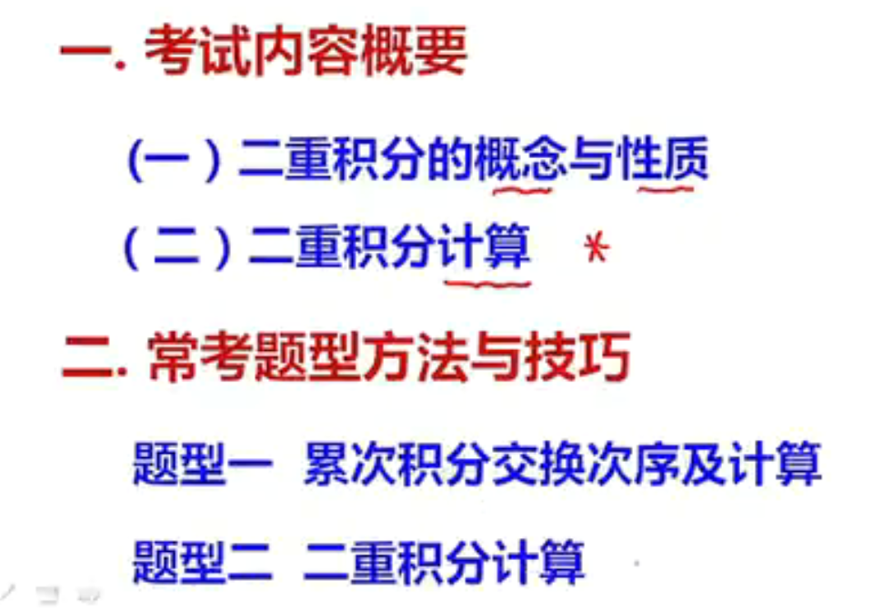

# 二重积分的概念和性质

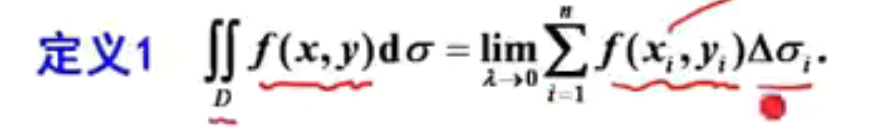

-   把一个平面区域任意划分为n个区域，函数值*面积 
-   入，小区域直径的最大值区域0 

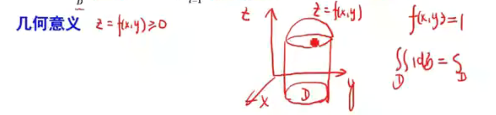

-   D是底面的投影区域
-   z是最上方的曲线

## 性质

-   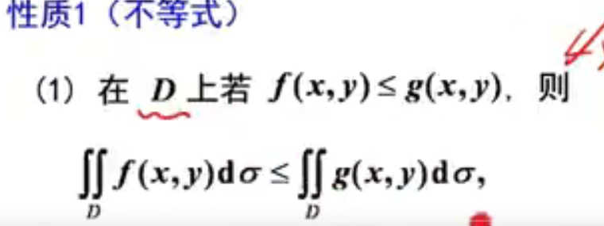
-   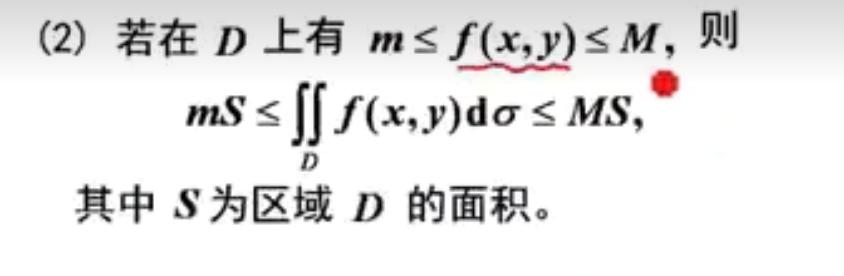
-   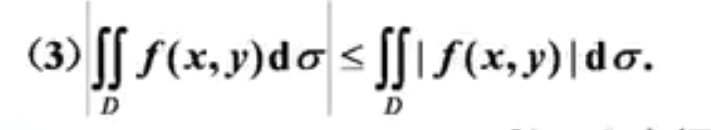

-   中值定理
-   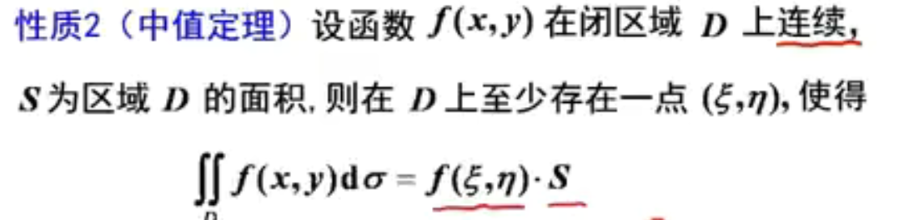

# 计算

-   直角三角形

先y后x  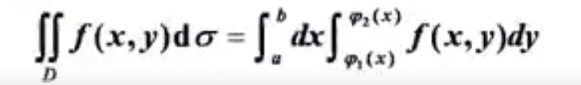

做平行于y轴的线只有两个交点

先x后y 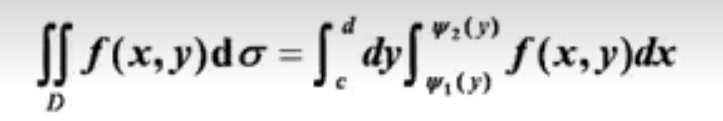

做平行于x轴的线只有两个交点

-   极坐标

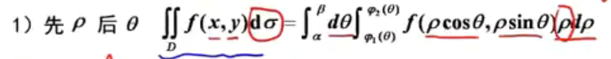

### 适合用极坐标的特征

-   被积函数：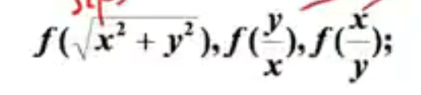

-   积分区域：

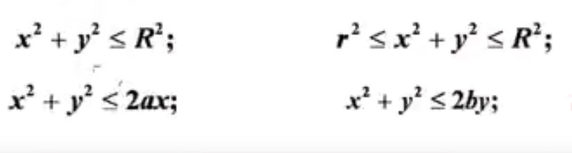

-   圆，圆环，偏心圆 

## 奇偶性

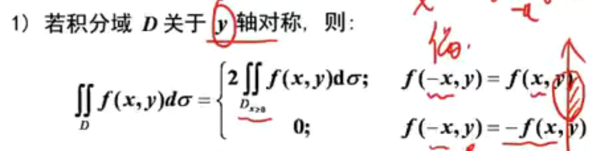

-   积分区域关于y轴对称，函数要对x有奇偶性

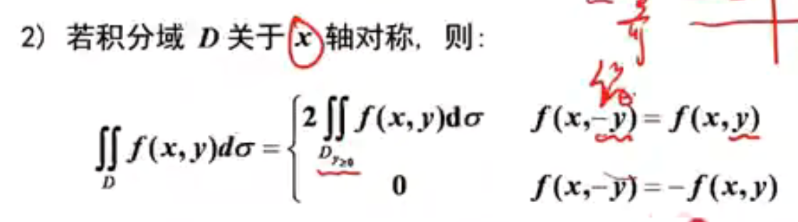

-   积分区域关于x轴对称，函数要对y有奇偶性

## 轮换对称性

-   积分区域关于y=x对称，则x可以直接使用y来替换

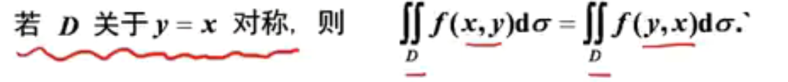

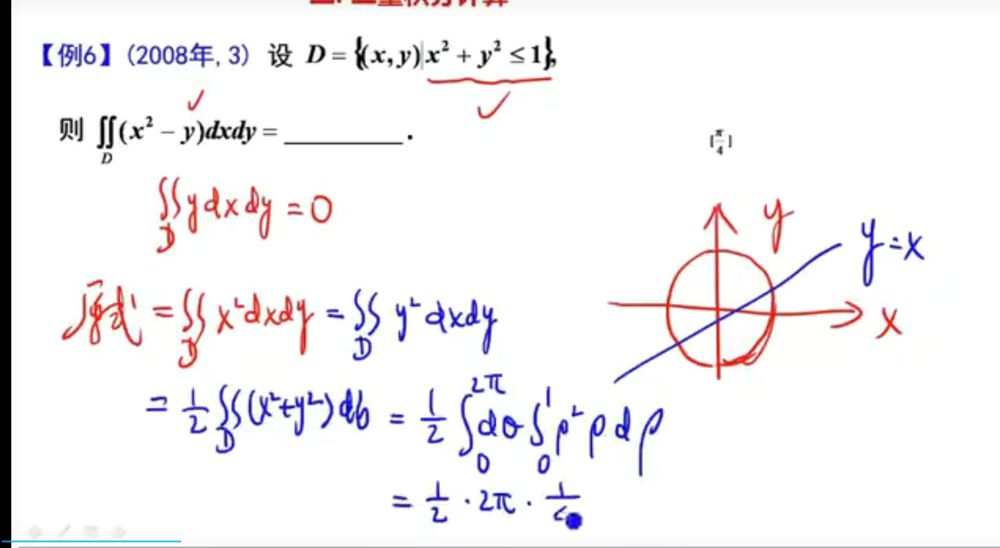

-   先使用奇函数把y删去
-   轮换对称性 

## 观察被积函数

-   如果是只含x的那么先x后y可以有一次常数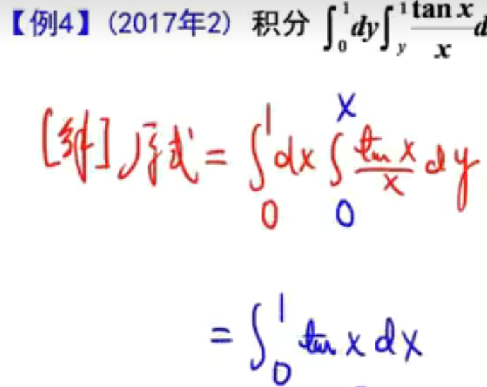

