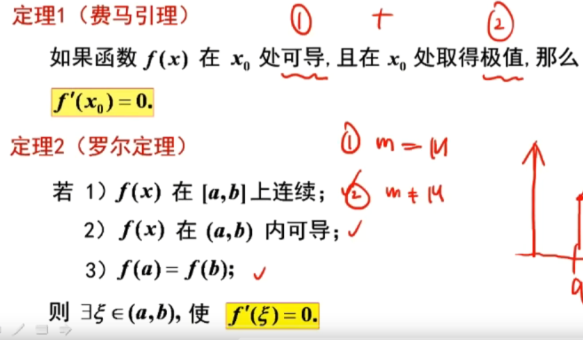
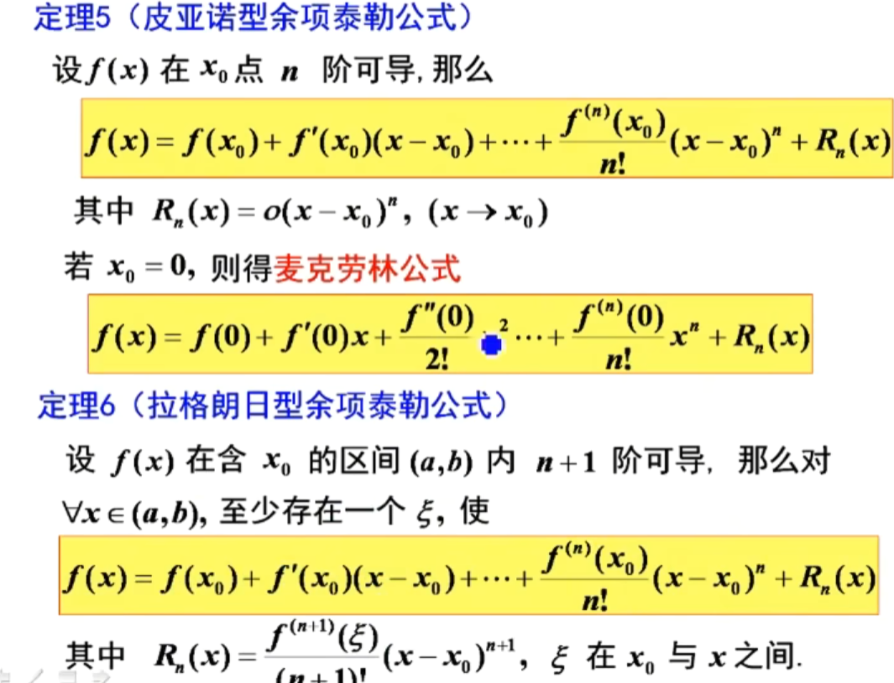
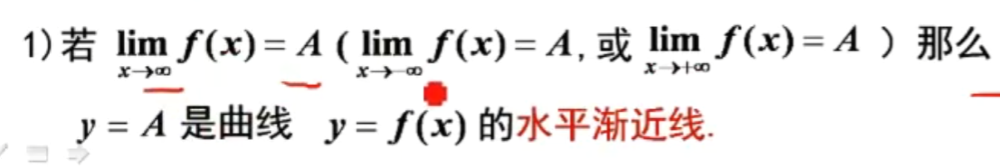
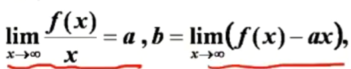
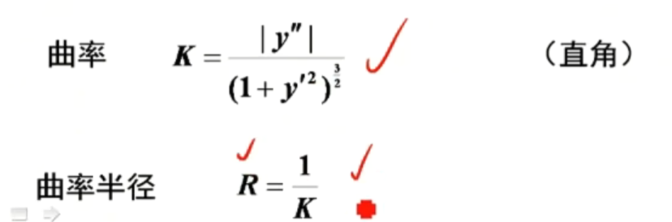
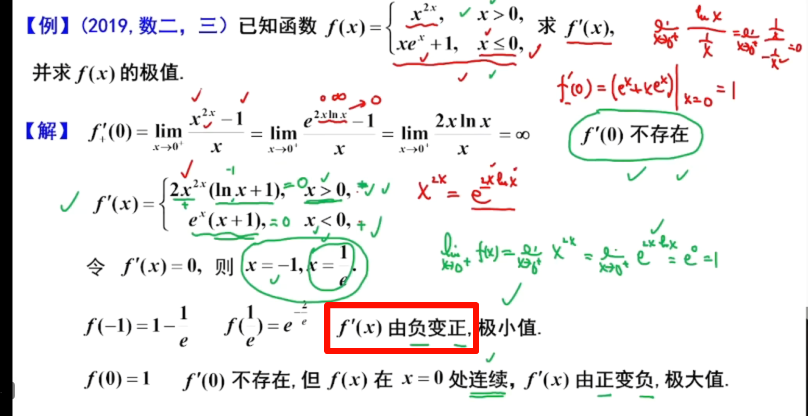

# 微分中值定理

-   费马定理：极值的导函数为0
-   罗尔定理：两端点的函数值相等，则有一个点的到导函数为0
-   拉格朗日中值：一般话的罗尔定理
-   柯西中值定理：

# 泰勒

# 凹凸性

# 渐近线

## 水平渐近线

-   用x趋向于无穷，是否趋向于有限值
-   最多可以用两条水平渐近线

## 垂直渐近线

-   用x趋向于x0，函数值趋向于无穷

## 斜渐近线

-   x趋向于无穷，两个极限需要都存在
-   最多两条

# 曲率

## 例题

