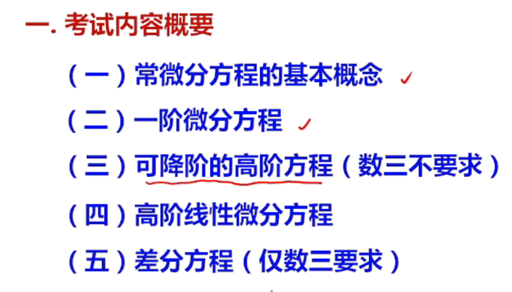
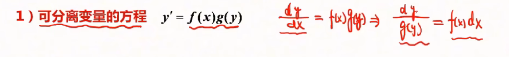
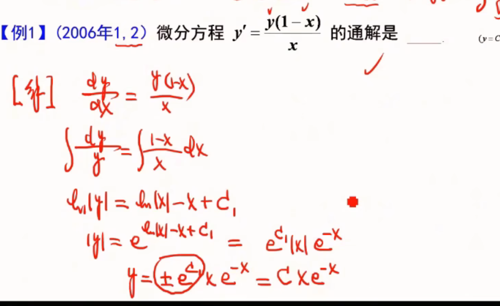
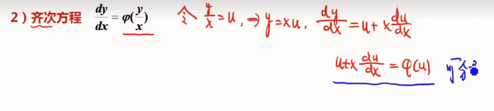
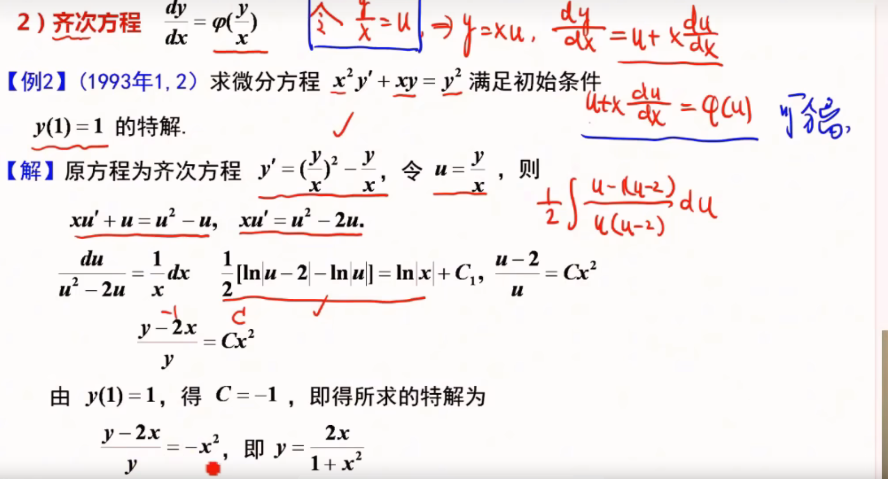
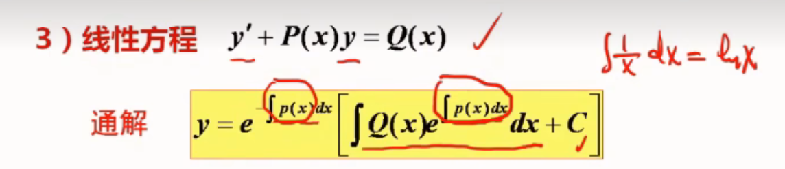
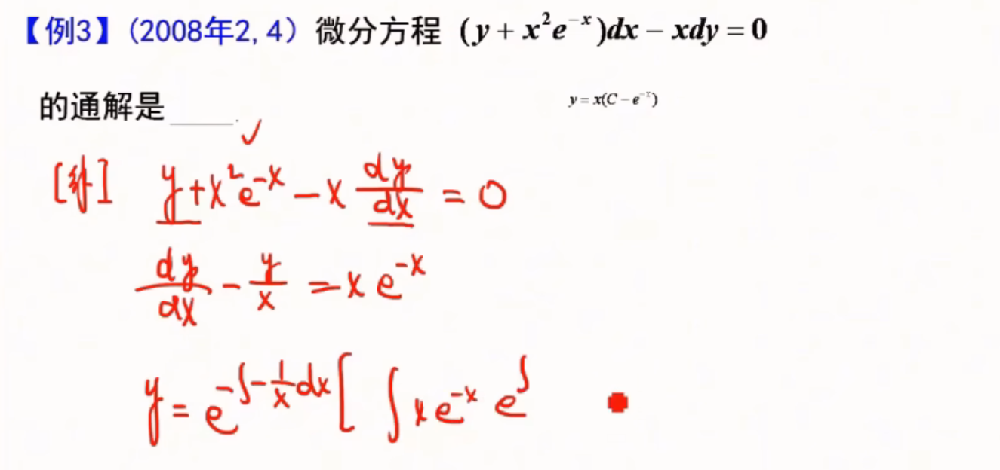
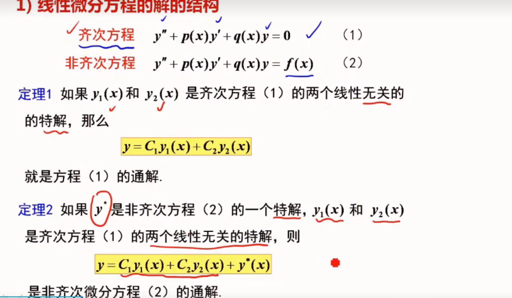
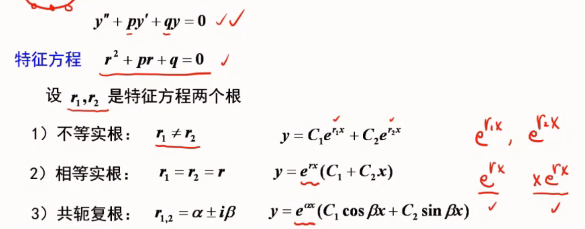
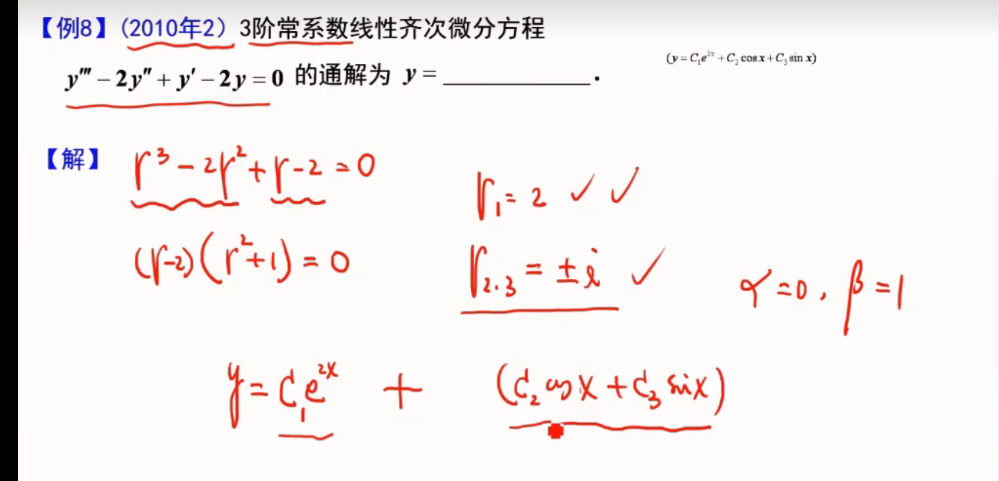

#  微分方程

## 微分方程

-   定义：含有未知函数的导数或者微分的方程
-   阶：所出现的未知函数最高阶的导数的阶数
-   解：满足函数的解
-   通解：如果微分方程的解含有任意常数，任意常数的个数与微分方程的阶数相同
-   初始条件：确定特解的一组常熟
-   积分曲线：方程的一个解在平面对应一条曲线

## 一阶微分方程

**方程中只包含一阶导数 y′*y*′ 。**

 

## 齐次方程

 

## 线性方程

-   例

#  高阶

###### **齐通 + 非齐特 = 非通**

## 常系数齐次线性微分

-   (无x其他都有x)

-   三阶例题

 

