# 二次型

二次齐次多项式

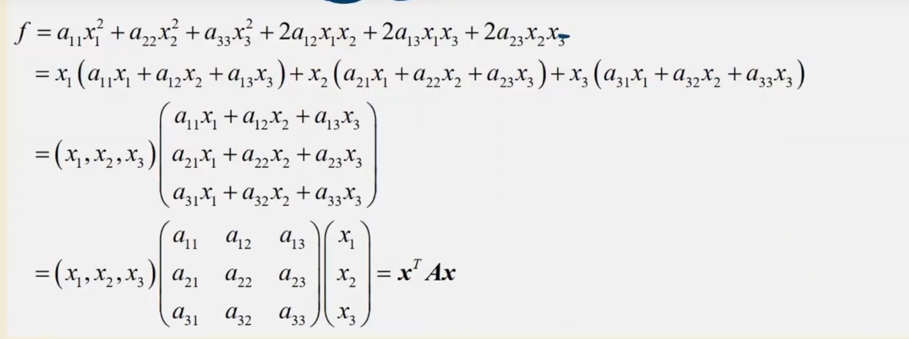

===$f = x^TAx$

-   主对角线的元素是aii平方项的系数
-   xixj是一半系数

## 题型

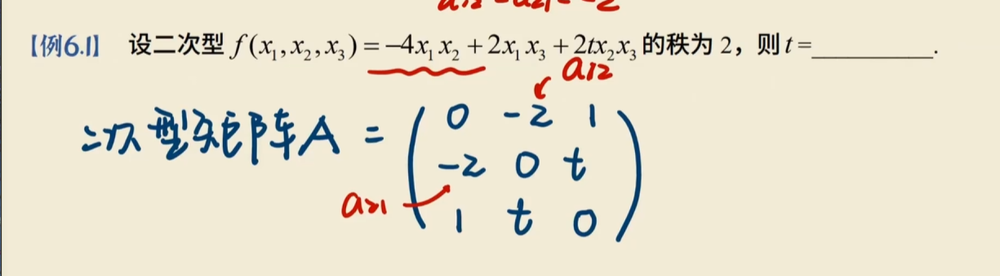

|A| = 0 = -4t

## 可逆线性变换

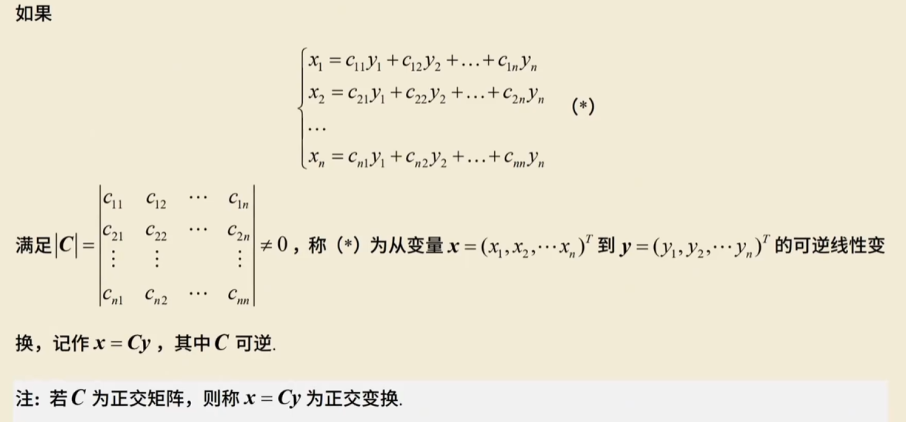

**换元**

~~~
把
f(x1,x2,x3)换成y1,y2,y3

根据矩阵提出来
x = Cy

~~~

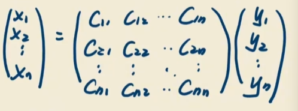

**C可逆**

若C为正交矩阵，则称是正交变换

### 题型

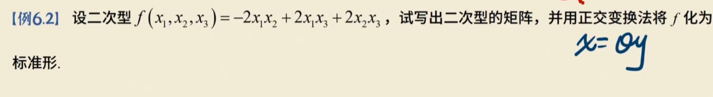

求Q

1.   写出二次型矩阵A
2.   求A特征值，正交阵
3.   另x = Qy将二次型化成标准型

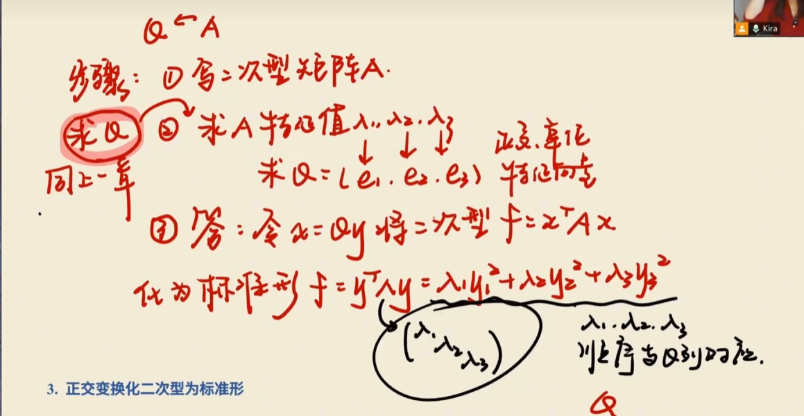

1.   A

~~~
0 -1 1
-1 0 1 = A
1 1 0 
~~~

2.   特征值

然后用施密特正交法求出正交向量

组合起来就是Q

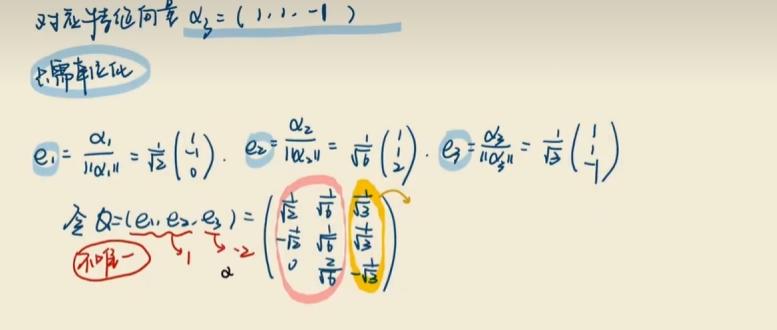

3.   用特征值组合起来

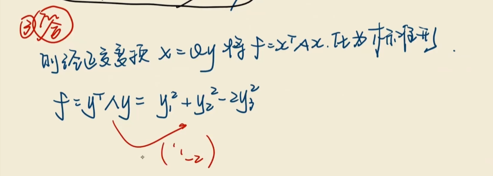

## 配方法

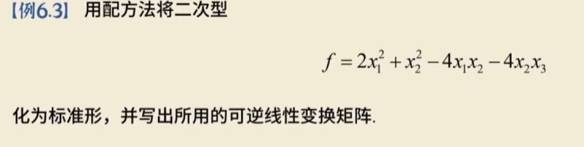

-   把含有x1的配方
-   把x2配方
-   换元

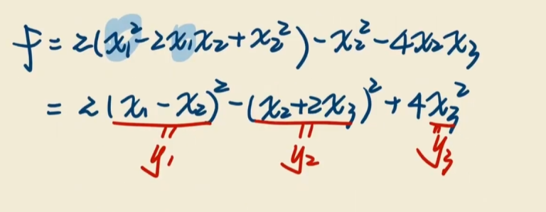

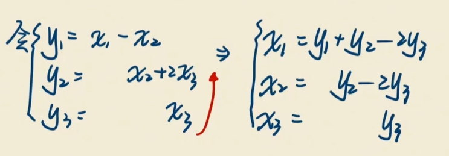

-   抄系数

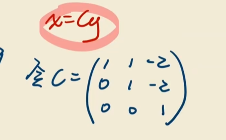

-   答

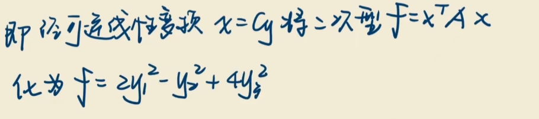

# 一些性质 

## 二次型的规范型

当标准型的系数d为 1 -1 0时叫做规范性

**任一一个二次型f都可经过逆线性变换变换成规范型**

## 惯性指数

对于二次型的标准型来说

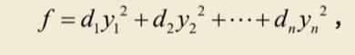

**正惯性指数：正平方项的个数，用p表示**

**负惯性指数：负平方项的个数，用q表示**

---

-   在变换时，pq的个数是不会改变的
-   对于二次型矩阵A，r（A) = q + p,即有p + q个**非零特征值**
-   p是正特征值个数
-   q是负特征值个数

---

## 合同

**设A与B都是n阶方阵，若存在可逆矩阵C使得B = C^TAC**

-   任意一个实对称矩阵合同与一个对角矩阵
-   AB合同，则x^TA x,x^TBx有相同的正惯性矩指数
-   实对称矩阵A与B合同⇒r(A) =r(B)，AT与BT合同，A-1与B-1合同.
-   实对称矩阵A与B相似→A与B合同，

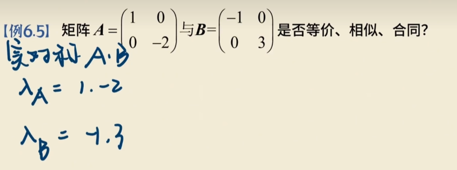

1.   相似

**定义**：如果存在可逆矩阵 $P$，使得 $P^{-1}AP = B$，则称 $A$ 与 $B$ 相似。

**判定方法**：相似的必要条件包括行列式相等、迹相等、特征值相等。对于可对角化的矩阵，**相似的充要条件是特征值完全相同**。

看特征值一不一样

2.   合同

**定义**：如果存在可逆矩阵 $C$，使得 $C^T AC = B$，则称 $A$ 与 $B$ 合同。

**判定方法**：对于实对称矩阵，**合同的充要条件是正、负惯性指数相同**（即正特征值的个数相同，负特征值的个数也相同）。

特征值的符号是否相同

3.   等价

秩相等

**定义**：如果存在可逆矩阵 $P$ 和 $Q$，使得 $PAQ = B$，则称 $A$ 与 $B$ 等价。

**判定方法**：对于同型矩阵，**等价的充要条件是秩相等**，即 $r(A) = r(B)$。

# 题

1.   配方法 2y1^2 - y2^2 + 4y3^2
2.   求特征值

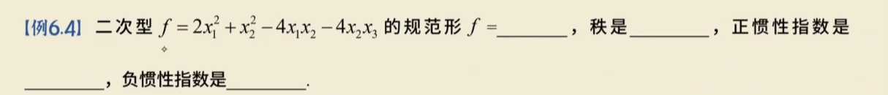

# 正定

定义设二次型f(x)=$x^TAx$，如果对任何x≠0都有f(x)=$x^TAx$>0，则称f为正定二次型，并称对称
矩阵A为正定矩阵。

对于

f = $x_1^2 + x_2^2 + x_3^2$

x可以取任何值都  > 0

## 充要条件

**定义法**：对任何 $\boldsymbol{x} \neq \mathbf{0}$，恒有 $f(\boldsymbol{x}) = \boldsymbol{x}^T A \boldsymbol{x} > 0$（证明 $f$ 正定常用）。

**标准形**：$f(\boldsymbol{x}) = \boldsymbol{x}^T A \boldsymbol{x}$ 的标准形的 $n$ 个系数全大于 $0$。

**合同关系**：$A$ 合同于单位矩阵 $E$，即存在可逆矩阵 $C$，使得 $A = C^T C$。

**惯性指数**：$A$ 的正惯性指数 $p$ 等于其阶数 $n$。

**特征值法**：$A$ 的所有特征值都是正数（证明 $f$ 正定常用）。

**霍尔维茨定理 (Hurwitz Criterion)**：$A$ 的各阶**顺序主子式**全大于 $0$（证明 $f$ 正定常用）。

  

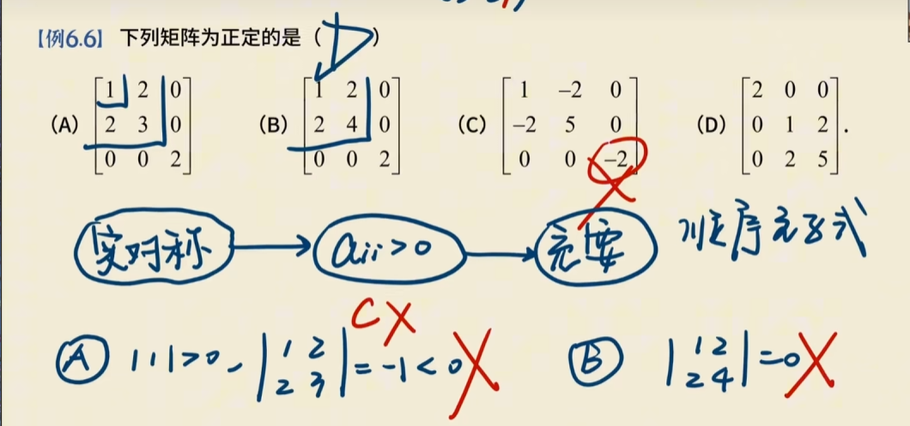

求各阶顺序主子式

