# 向量

考点

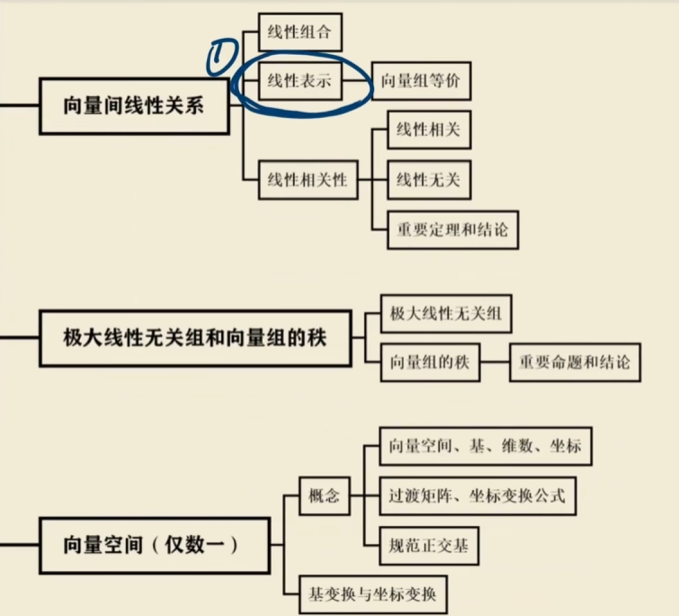

## 概念

**向量**：n个ai组成的有序数组

一般都是列向量

**向量组**：多个向量组成的集合

## 运算

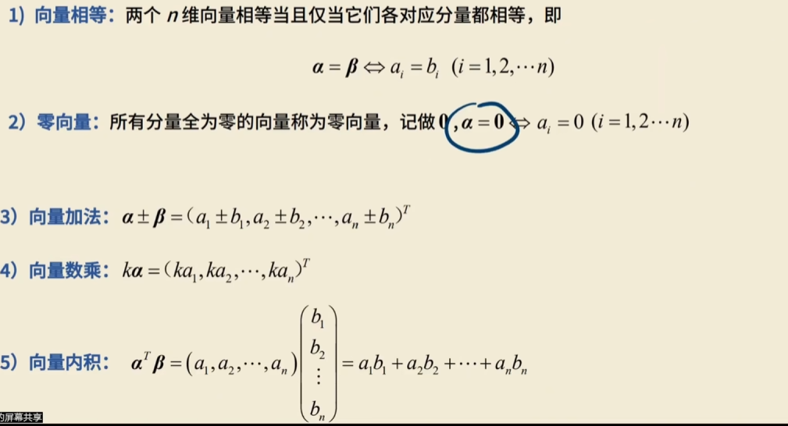

和矩阵是相同的

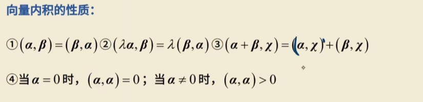

零向量的内积为0，其他任何向量与自身做内积一定不等于0

---

### 正交

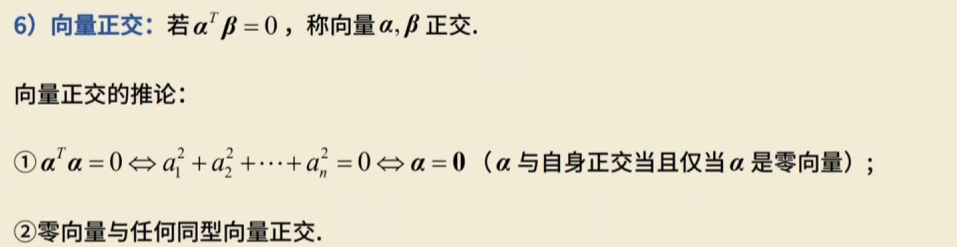

-   内积为0
-   垂直

----

**长度和单位化**

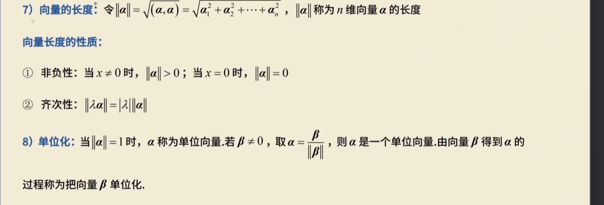

# 向量间的线性表示

## 线性组合

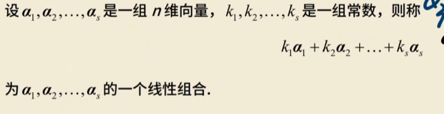

~~~
x3 = 2x1 + x2 
k可以是任意值
~~~

## 线性表示

当组合完之后可以说**x3可以由x1和x2线性表示**

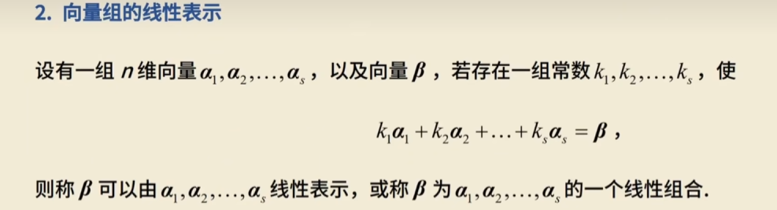

向量组y可以由x线性表示（每一个y都可以由x表示）

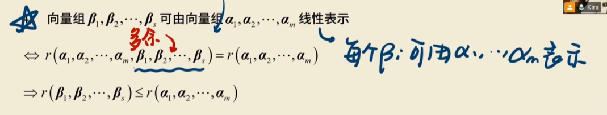

**由谁表示就把谁写两遍**

**谁被表示谁秩小**（低维可以被高维表示 ）

(例) 已知 $r(\alpha_1, \alpha_2, \alpha_3, \alpha_4) = r(\alpha_1, \alpha_3)$
$\Leftrightarrow \alpha_2, \alpha_4$ 可由 $\alpha_1, \alpha_3$ 表示。

##  定理

当且仅当，向量y可以由向量组a线性表示且**唯一**的充要条件是

s 是向量组的个数

**$$r(\alpha_1, \alpha_2, \cdots, \alpha_s) = r(\alpha_1, \alpha_2, \cdots, \alpha_s, \beta) = s$$**

有效向量的个数，y几乎可以说是多余的，没有能改变秩

**方阵中，行列式不为0，可逆**

满秩 = 行列式不为0

-   行列式不为0 => 满秩 = s
-   R1 <= R2 （越拼越大）
-   R2 <= s

-   当不唯一时

**$$r(\alpha_1, \alpha_2, \cdots, \alpha_s) = r(\alpha_1, \alpha_2, \cdots, \alpha_s, \beta) < s$$**

无穷多

-   不能表示

**$$r(\alpha_1, \alpha_2, \cdots, \alpha_s) < r(\alpha_1, \alpha_2, \cdots, \alpha_s, \beta) $$**

**$$r(\alpha_1, \alpha_2, \cdots, \alpha_s) = r(\alpha_1, \alpha_2, \cdots, \alpha_s, \beta) + 1$$**

## 例题

**含参向量组的线性表示**

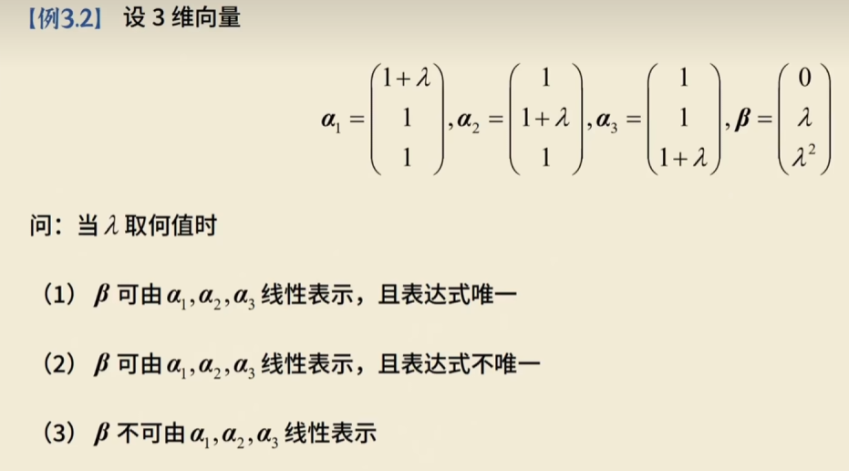

-   判断秩
    -   唯一：双拼相等 = 3
    -   不唯一：<
    -   不能表示:r = r + 1

~~~
1 + x   1      1        0
1      1 + x   1        x
1        1    1 + x   x * x
~~~

# 向量组的等价

1）定义：若向量组(I)中的每一个向量都能由向量组()线性表示，向量组()中的每一个向量也都能由向量组
(1)线性表示，则称向量组(1)和(1)等价。

每一个向量都可以由另一组表示

（个数都可以不同）

## 定理

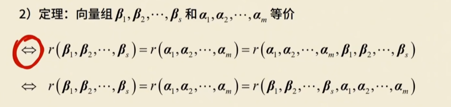

R1 = R2 = R（r1,r2)

可以相互表示

## 题型

**已知向量组等价，求参数**

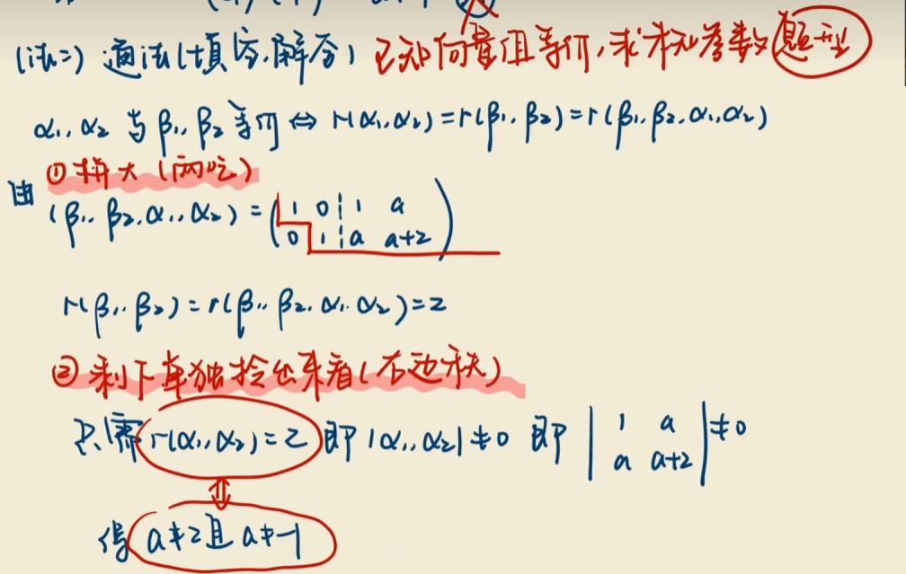

-   先拼在一起，看两个矩阵
-   单独看看右边

# 线性相关 -- 多余

存在一组系数，能让向量组等于零向量

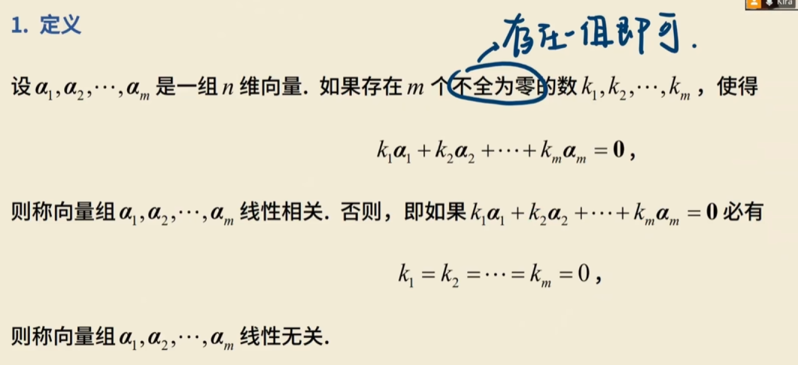

不妨设k ≠ 0 ，移项

可以等价于

x1可以由其余向量线性表示

## 性质

-   单个零向量线性相关
-   当个非零，线性无关
-   含有零向量的必相关
-   线性相关的充要条件是对应分量成比例
-   平行 == 共线 == 相关
-   无关 == 相关

-   线性相关 == 齐次线性方程组有非零解
-   == R < S
-   至少有一个向量可以由其余的向量表示
-   行列式== 0
-   n + 1个n维向量一定线性相关

###  推论

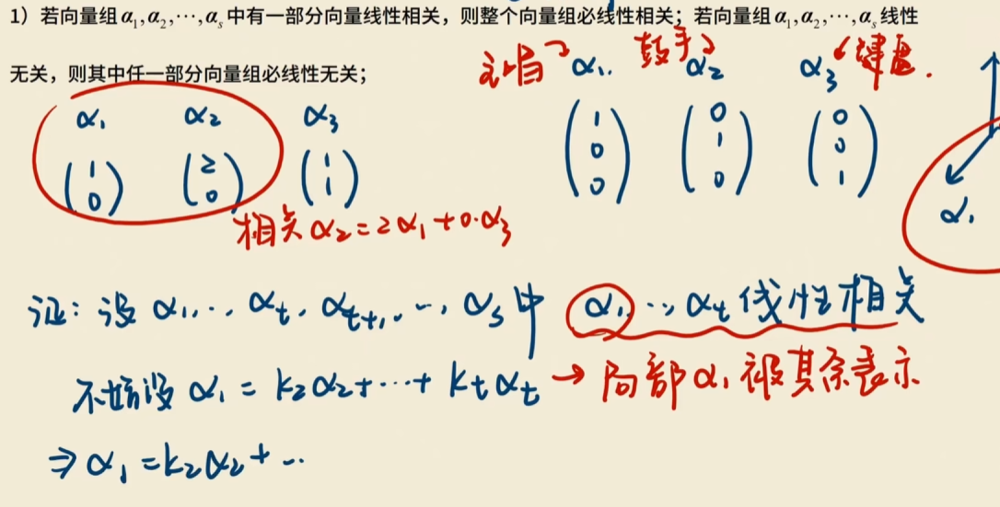

-   部分相关则整体相关

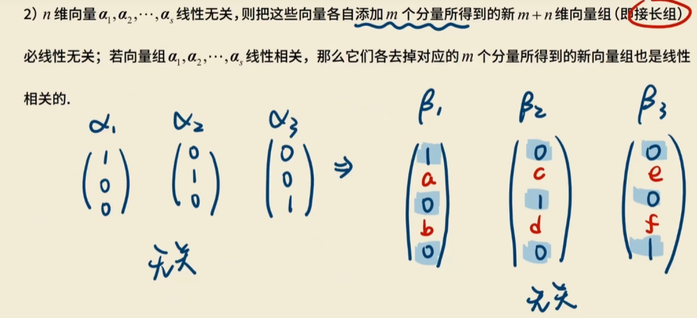

-   如果无关，**添加**m个分量还无关
-   如果相关，**去掉**m个分量也是相关的

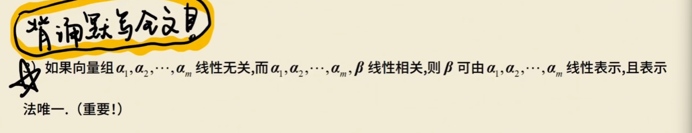

-   本来无关，加一个相关，则y多余，表示唯一

$$\alpha_1, \alpha_2, \cdots, \alpha_m \text{ 无关} \iff r(\alpha_1, \alpha_2, \cdots, \alpha_m) = m$$

$$\alpha_1, \cdots, \alpha_m, \beta \text{ 相关} \iff r(\alpha_1, \cdots, \alpha_m, \beta) < m + 1$$

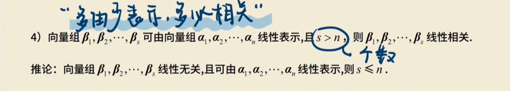

-   多由少表示，多必相关

## 题型

**证明线性无关**

-   定义法

设一组k，解方程

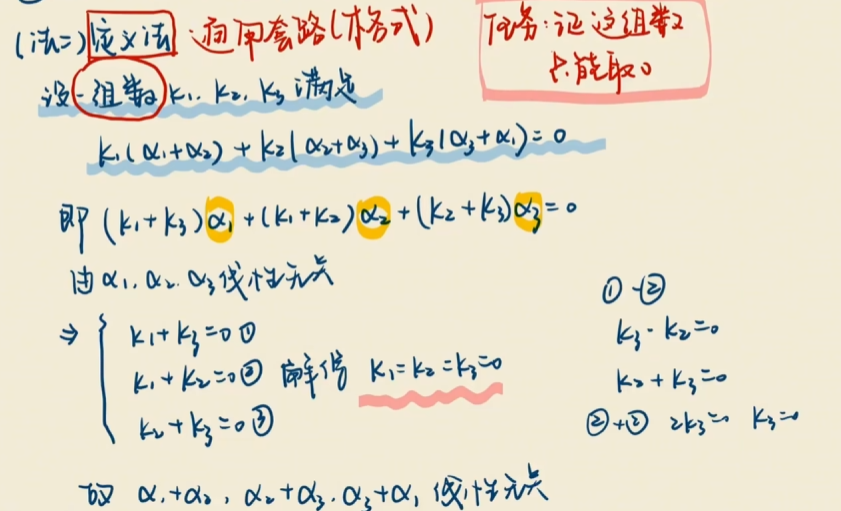

-   秩R < S 

---

这边是消列的，竖着看

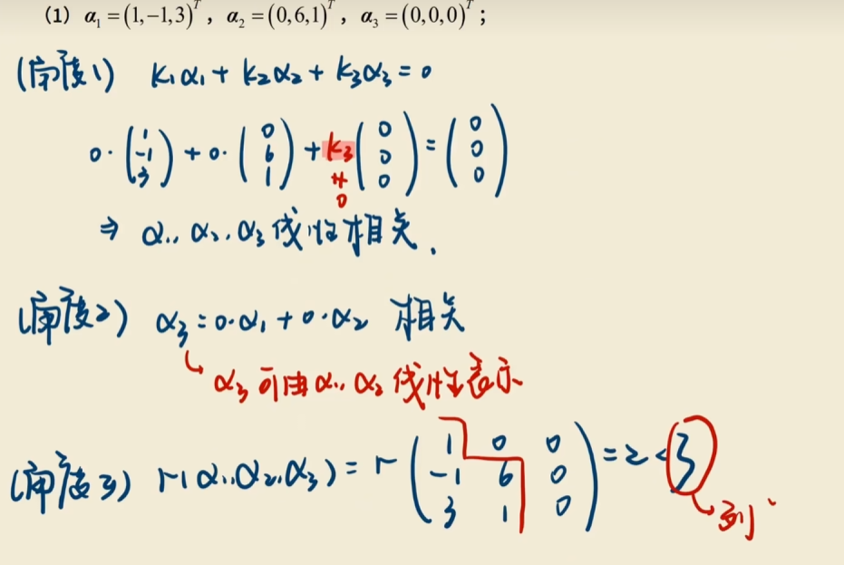

---

# 极大线性无关组

一组向量中，最大的无关向量组

一组向量本来是无关的，加上一个之后相关，则称之前的是极大线性无关组

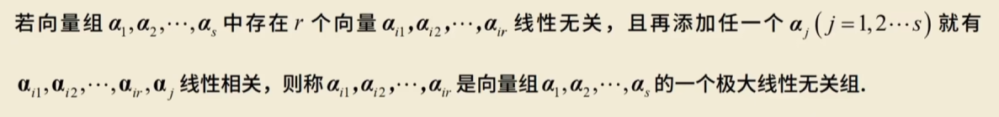

~~~
0   1 |  1   1
1   0 |  1   2
~~~

-   零向量没有极大线性无关组，含有非零向量的一定存在极大线性无关组
-   任意一个向量都可以由“组”表示
-   “组”不唯一，但个数一定相等
-   若本来就线性无关，则“组”为本身

# 向量组的秩

**极大无关组所含的个数**

-   零向量的秩为0

## 性质

**1.任一向量组与自己极大线性无关组等价**

极大组可以由自己所在的大组表示

极大组就能代替自己的大组

**2.向量组的极大线性无关组个数相等**

**若R（组） = r，则任取r个无关向量都是极大无关组**

**3.矩阵A的秩 == A行向量组的秩 == A列向量组的秩**

R = 行秩= 列秩

**4.初等行变换不改变矩阵列向量间的线性关系**

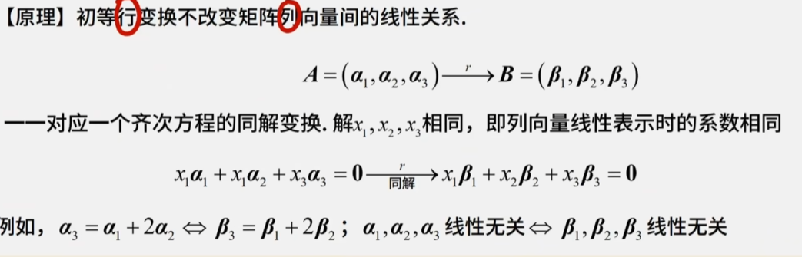

## 线性方程组的三种表示

-   方程组

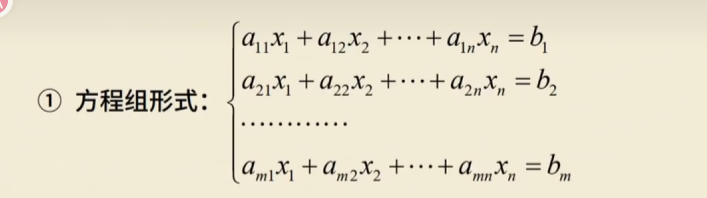

-   矩阵

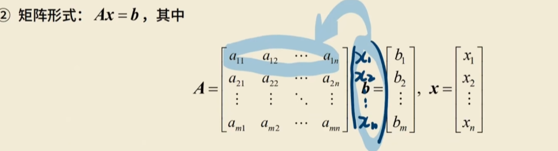

-   向量

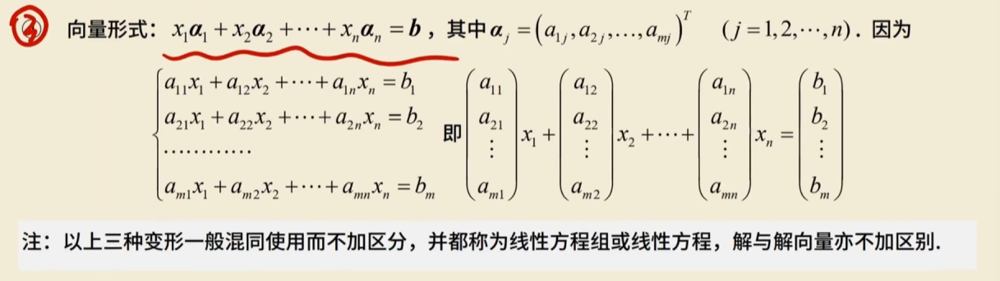

## 题型

**求秩，极大无关组，并表示其他向量**

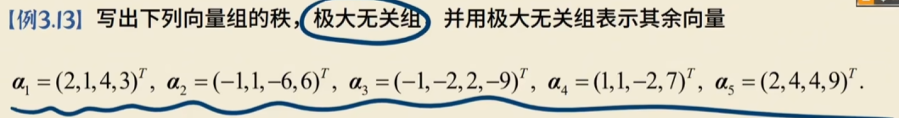

-   将向量组用列表示成矩阵
-   化成行阶梯（只能行变换）
-   每一个台阶选一列为无关组

1.   矩阵

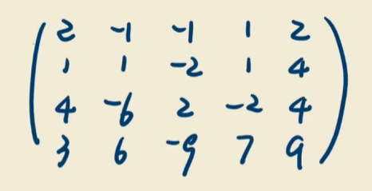

2.行阶梯

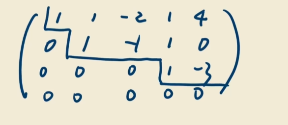

行阶梯不是最简型

3.   取列

~~~
x1  x2  x4
x1  x3  x5

一共四种
每个台阶取一列，同一行的随便哪个都行
~~~

是无关组

4.   表示

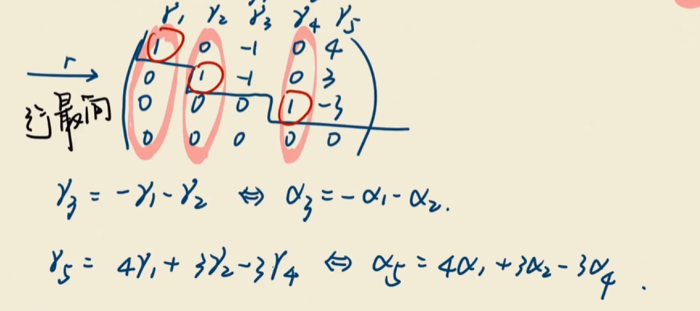

[解的原理](用线性无关组表示向量.md)

