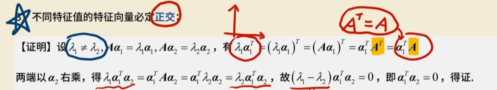
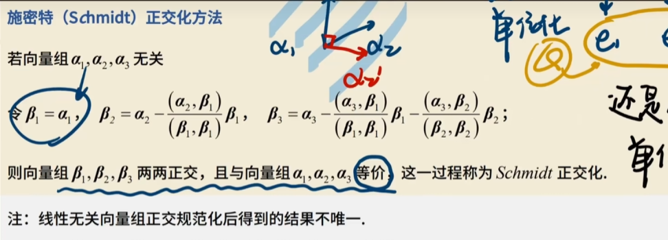
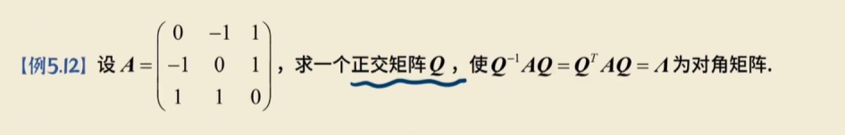
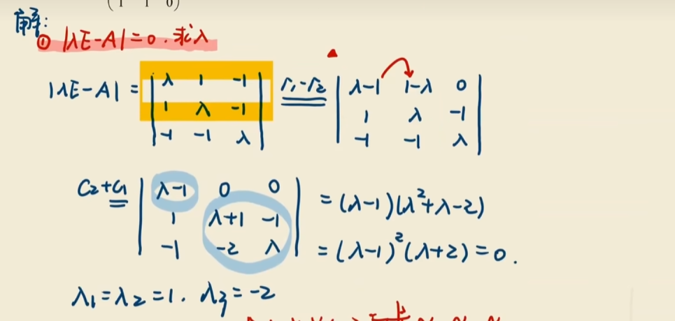
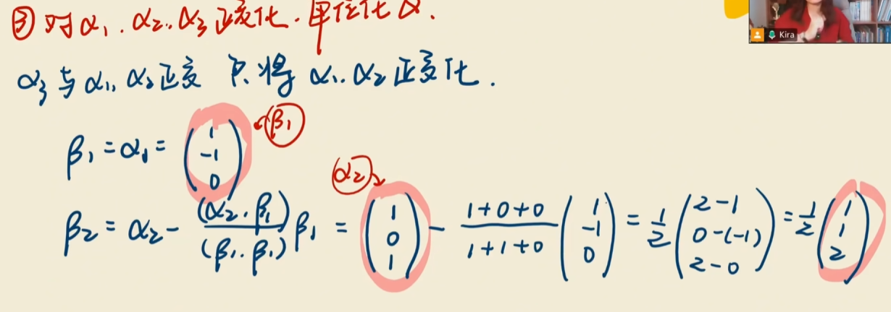
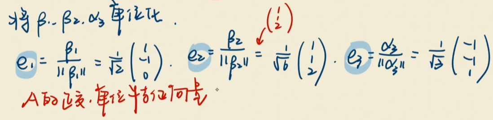
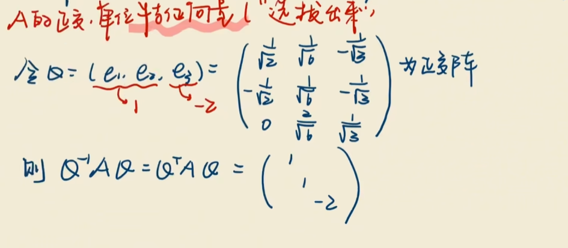

# 实对称矩阵

定义：

$A^T = A$

全是实数

## 性质

1.   特征值全为实数，向量均为实向量
2.   必能相似对角化，且存在正交矩阵Q把A给对角化了，$Q^TAQ = Q^{-1}AQ=\varLambda$
3.   不同特征值的特征向量必定**正交**

## 求Q&施密特正交

-   求完特征值和特征向量x1，x2
-   求b1，b2
-   

-   单位化

除一个模

# 正交矩阵

$AA^T = A^TA = E$

## 性质

1.   $A^{-1} = A^T$
2.   |A| = 1 或-1
3.   行/列向量长度为1，并且两两正交

~~~
1 0 0 
0 1 0
0 0 1
~~~

