# 可逆

### 矩阵相似的定义

设 $A, B$ 是两个 $n$ 阶矩阵，若存在可逆矩阵 $P$，满足
$$P^{-1}AP = B,$$
则矩阵 $A$ 与 $B$ **相似**，记作 $A \sim B$
-   方阵(p夹出来的)
## 性质
-   $P^{-1}AP = B => P^{-1}A^nP = B^n$
-   $B^{-1} = (P^{-1}A{-1}P)^{-1} = P^{-1}A{-1}P$
-   $B* = (P^{-1}AP)^{*}$
-   f(A) ~ f(B)  
 

一般找相似都直接用这个条件

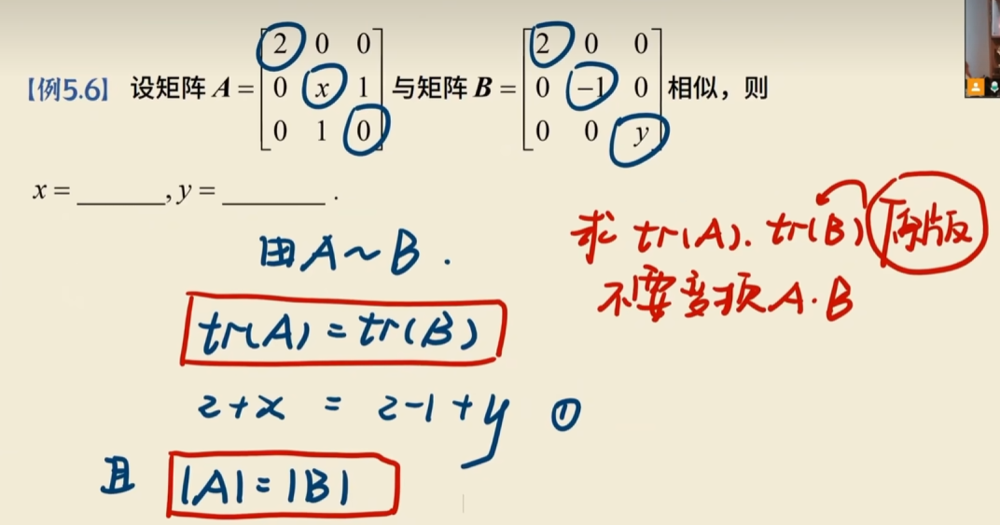

# 相似对角化的充要条件

A只要能和对角阵相似就称可以对角化
充要条件：
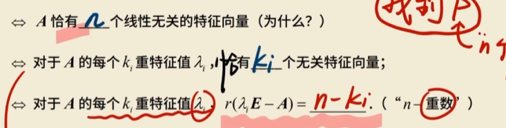
## 充分条件
n阶矩阵由n个不同的特征值，必可相似对角化
n阶实对称,必可相似对角化
A^2= A ,必可相似对角化
- 入（入 - 1） = 0 =>入 = 0或1
- 所有特征向量的个数 = n - r(A) + n - r(E-A)
	- r(A) + r(E-A) = n
	- [[证明r(A)+r(E-A)]]
A^2 = E,必可相似对角化
## 必要条件
|A| = |对角阵|
tr（A） = tr(对角阵)
r（A） = r（对角阵）

A实对称
B下三角，3个不同的特征值
C秩为一，迹 ≠ 0 

### 矩阵的相似对角化

若矩阵 $A$ 与对角矩阵 $\Lambda$ 相似，即存在可逆矩阵 $P$，使 

$$P^{-1}AP = \Lambda,$$ 

则称 $A$ 可以**相似对角化**，记为 $A \sim \Lambda$，称 $\Lambda$ 是 $A$ 的**相似标准形**。

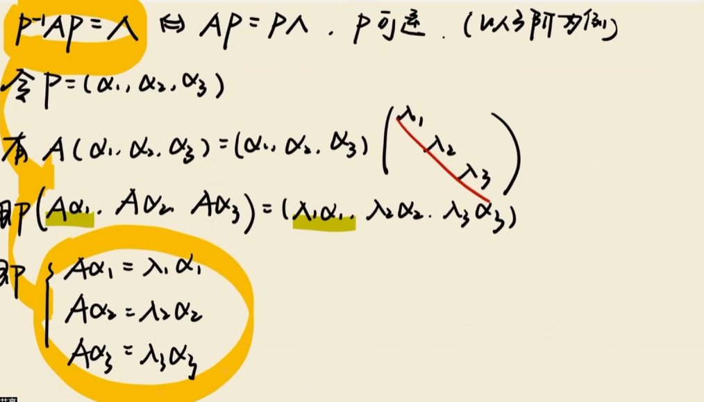

-   $\Lambda$主对角线上的元素为A的全部特征值
-   P的各列向量为A的n个线性无关的特征向量
## 结论
### 充要条件
A~对角矩阵
A恰有n个线性无关的特征向量
每个特征值的几何重数等于代数重数
### 充分条件

## 性质

1.   如果k重特征向量有k个线性无关的特征向量则可以相似对角化

-   左边都是都有，所以可以对角化
-   右边的二重少一个，所以不可以

 	1. A 恰有个线性无关的特征向量
 	2. 对于A的每个k重特征值λ₁，都有K个无关特征向量；
 	 每一个特征值都要拉满
 	 只需要看重根就可以了
 	3. 对于A的每个k重特征值入i,r(入iE - A) = n - ki

2.   如果A可以对角化，则R(A) = A非零特征值的个数

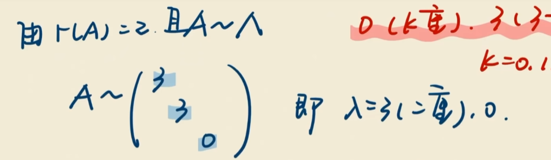

## 题型

-   三个特征值互相不同

不可以对角化

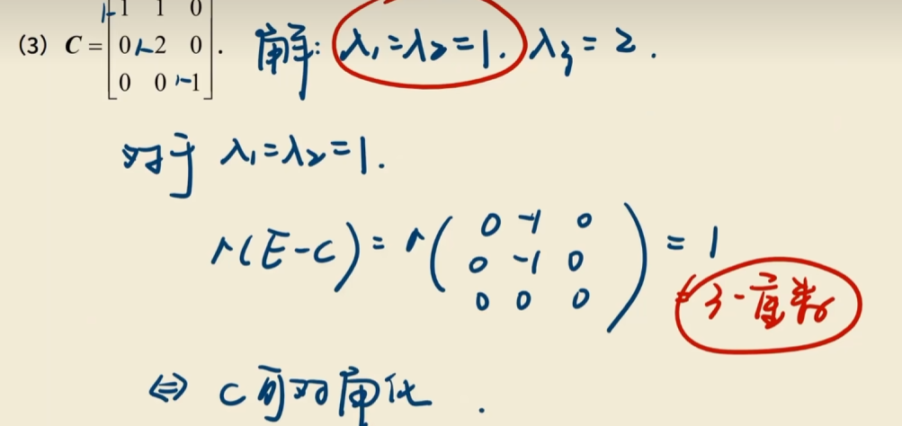

可以对角化

**对于第三条充要条件**

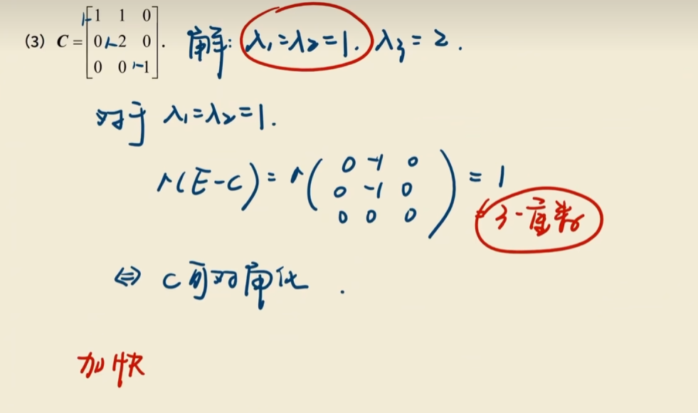

用秩判断

R(入E - A) = 3 - 2 = 1

可以

### 经典必会

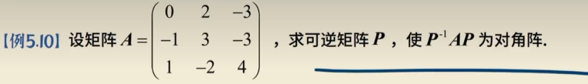

-   解矩阵方程 |R入-E|,求特征值和特征向量
-   拼起来

解：

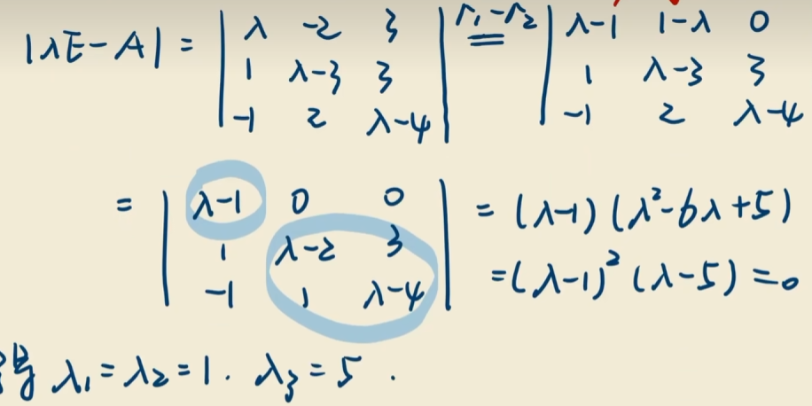

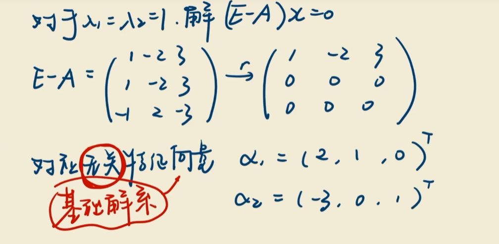

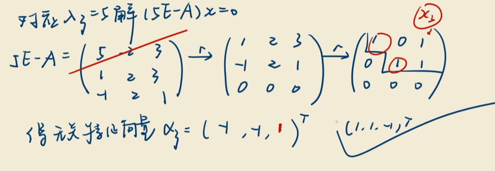

求完特征值和特征向量

拼

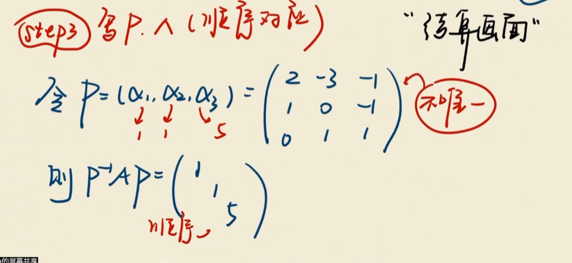

