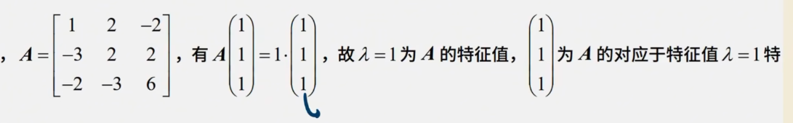
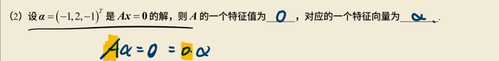
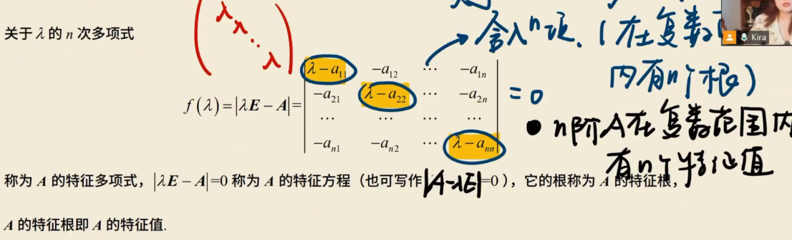
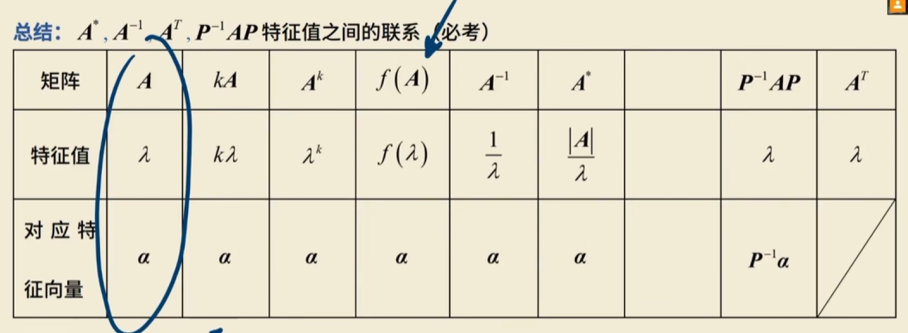

# 特征值 和特征向量

# 特征值和特征向量

-   n阶矩阵
-   方阵

存在数入和n维非零列向量x使**`Ax = 入x`**

即(`入E - A`)x = 0有非零解，则称入使一个特征值，非零解x使A对应入的特征向量

方向不变，大小伸缩

-   利用定义

 

## 求特征值

n阶矩阵在复数范围内有n个特征值

-   令|入E - A| = 0，求得特征值
-   带入每一个入
-   行最简
-   求基础解系 
-   通解
-   去掉零解
    -   并且系数不全为0

**例**

~~~
A = 1 4 6
	0 2 5
	0 0 3
	
入E - A = 入-1  -4     -6
		   0   	入-2   -5
		   0  	0     入-3
		   
 = (入-1)(入-2)(入-3) = 0
 求入
 
 依次带入
 当入 = -2时，做行最简
 1 0 1
 0 1 1
 0 0 0
 
 则x3 = （1，1，-1）T 基础解系 特征向量
 
~~~

## 性质

1.   对于上（下）三角是主对角线的元素
2.   将相同特征值的特征向量随便组合(有两个入 = 1的特征向量相互组合)，那么新得到的向量也是特征向量

[证明](特征向量.md)

 设 $\alpha_1, \alpha_2, \dots, \alpha_s$ 都是矩阵 $A$ 属于特征值 $\lambda$ 的特征向量，则非零向量 $k_1\alpha_1 + k_2\alpha_2 + \dots + k_s\alpha_s$ 也是矩阵 $A$ 属于特征值 $\lambda$ 的特征向量。

3.   矩阵A属于不同特征值的特征向量线性无关
     **不同特征值的特征向量是互相线性无关的**

4.   两个不同特征值的特征向量相加**不再是**特征向量

5.   k重特征值小于等于k个线性无关的特征向量

6.   n个特征值的迹(主对角元素之和)等于特征值之和
7.   行列式的值等于特征值的积
8.   特征值的对照表

-   特征向量不变
-   特征值都是对应的

~~~
A*A - 2E的特征值为 入*入 - 2
~~~

~~~
Ax
~~~

