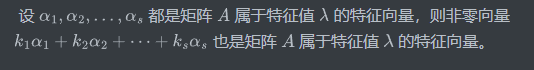

证明这个

为了让你更直观地理解这个性质，我们来看一个简单的二维矩阵例子。

假设有一个矩阵 $A = \begin{pmatrix} 2 & 0 \\ 0 & 2 \end{pmatrix}$。

### 1. 确定特征值和特征向量

这个矩阵的特征值是 $\lambda = 2$。

我们可以找到两个基础的特征向量：

-   $\alpha_1 = \begin{pmatrix} 1 \\ 0 \end{pmatrix}$ （在 $x$ 轴上）
-   $\alpha_2 = \begin{pmatrix} 0 \\ 1 \end{pmatrix}$ （在 $y$ 轴上）

### 2. 验证它们属于 $\lambda = 2$

-   $A\alpha_1 = \begin{pmatrix} 2 & 0 \\ 0 & 2 \end{pmatrix} \begin{pmatrix} 1 \\ 0 \end{pmatrix} = \begin{pmatrix} 2 \\ 0 \end{pmatrix} = 2\alpha_1$ （成立）
-   $A\alpha_2 = \begin{pmatrix} 2 & 0 \\ 0 & 2 \end{pmatrix} \begin{pmatrix} 0 \\ 1 \end{pmatrix} = \begin{pmatrix} 0 \\ 2 \end{pmatrix} = 2\alpha_2$ （成立）

### 3. 进行线性组合 (即 $k_1\alpha_1 + k_2\alpha_2$)

我们随便取两个系数，比如 $k_1 = 3, k_2 = 2$。

得到新向量：$\beta = 3\alpha_1 + 2\alpha_2 = \begin{pmatrix} 3 \\ 2 \end{pmatrix}$。

### 4. 见证奇迹：验证 $\beta$ 是否还是特征向量

我们将矩阵 $A$ 作用于这个新组合出来的向量 $\beta$：

$$A\beta = \begin{pmatrix} 2 & 0 \\ 0 & 2 \end{pmatrix} \begin{pmatrix} 3 \\ 2 \end{pmatrix} = \begin{pmatrix} 6 \\ 4 \end{pmatrix}$$

你会发现，$\begin{pmatrix} 6 \\ 4 \end{pmatrix}$ 恰好等于 $2 \times \begin{pmatrix} 3 \\ 2 \end{pmatrix}$，也就是 $2\beta$。

**结论：**

虽然 $\beta$ 是我们随意“揉捏”出来的，但它依然满足 $A\beta = 2\beta$。这说明 $\beta$ 仍然是矩阵 $A$ 属于特征值 $2$ 的特征向量。

------

### 为什么这很有用？

在你的**智能农业机器人项目**中，如果你通过算法提取了某个目标的特征，只要这些特征属于同一个特征空间（同一个特征值），你对这些特征进行加权融合（线性组合）后，它在数学本质上依然保持原有的空间特性，不会跑偏。