# 四.线性方程组

**齐次线性方程组：右边全为0**

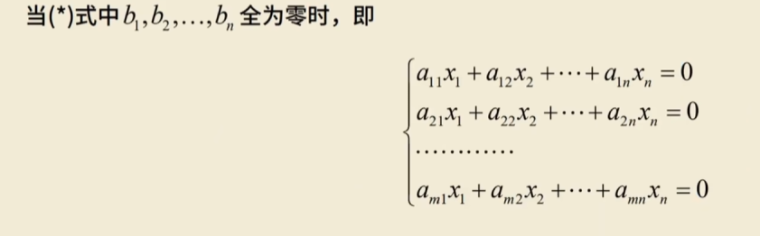

**非齐次线性方程组：不为0**

## 克拉默法则

n个方程的n元方程组（方阵）

系数行列式不等于0

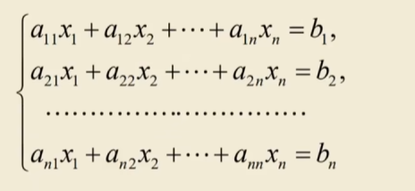

**若A的行列式不等于0则方程组必有唯一解**

~~~
|A| ≠ 0 <=> AX = b 有唯一解
~~~

$x_j = \frac{D_j}{D}  j = 1,2,3,4...n$

# 线性方程组的判定

## 非齐次方程组解的情况

-   唯一解

n个有效方程 n个未知数

<=> 

**满秩**

变成增广矩阵 R（A） = R(A,b)  = 有效行数 = 未知量的个数 = n

<=>

**b可以由A唯一表示**

b可由A的列向量线性表示，且表示法唯一

<=>

**只要行列式不为0，就是唯一解**

A为n阶方阵时，|A| ≠ 0，可用克拉默法则解 Ax = b

=>

**左边的向量组无关**

A = (a1,a2,...an)列向量线性无关

=>

Ax = 0只有零解

---

-   无穷多

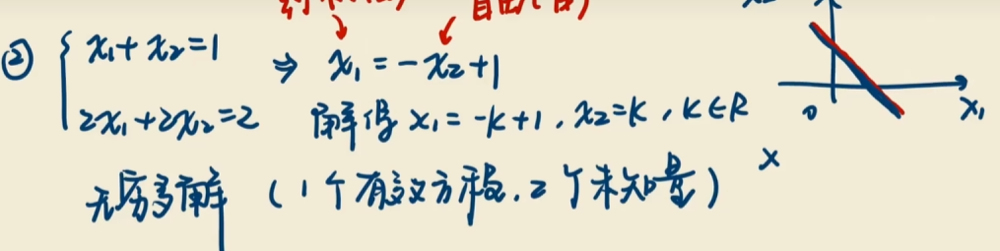

R(A) = R(A,b) = 1 = 一个有效行数（方程） < 未知量个数 
没有矛盾方程

<=> 

**不满秩序**

R(A) = R(A,b) < n

<=> 

**b可以被多种表示**

b可以由A由无穷多种方式表示

=>

**克拉默法则，|A| = 0没有唯一解**

A为n阶方阵时，|A| = 0

~~~
(A,b) = (1 1 | 1)
		(0 0 | 0)
~~~

=>

**线性相关，有效方程组个数减少，**

A 向量组线性相关

=>

Ax = b有非零解

---

-   无解

R(A) > R(A,b)无解

<=> 

b不能由A的列向量组线性表示

​	找不到一组系数满足

=> 

**克拉默|A| = 0**

当A为n阶方程时，|A| = 0

~~~
(A,b) = (1 1 |1)
		(0 0 |1)
		
~~~

## 齐次线性方程组的解

必有零解，比过零点

不会有无解的情况

---

-   唯一解 

**唯一解就是零解**

<=>

R(A) = n

<=>

A向量组线性无关

<=>

|A| = 0

---

-   无穷多解

**有效方程个数 < 未知量个数** ==>>**没有把变量全部约束，**

<=>

**R(A) < n(矩阵A的列数)**

R(A) <=m < n秩小于等于行数，小于列数
如果 m>=n那么说明方程组个数 >=未知量个数，能够固定下来，就有唯一零解

<=>

A 向量组线性相关

<=>

**克拉默 |A| = 0**

**若A 是m*n，m < n则必有非零解**
未知数多

---

不可逆 = 不满秩 = 行列式等于0 = 线性相关 = 齐次线性方程组有非零解

## 题型

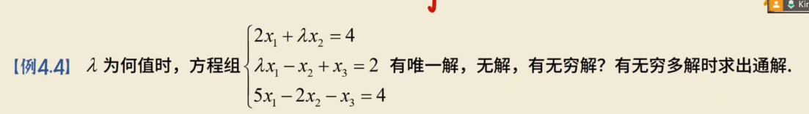

像判断解的情况需要判断

~~~
唯一解 R(A) = R(A,b) = n
多解  R(A) = R(A,b) < n
无解 R(A) < R(A,b)
~~~

或者是克拉默法则

~~~
|A| ≠ 0 唯一解
|A| = 0 多解或无解
~~~

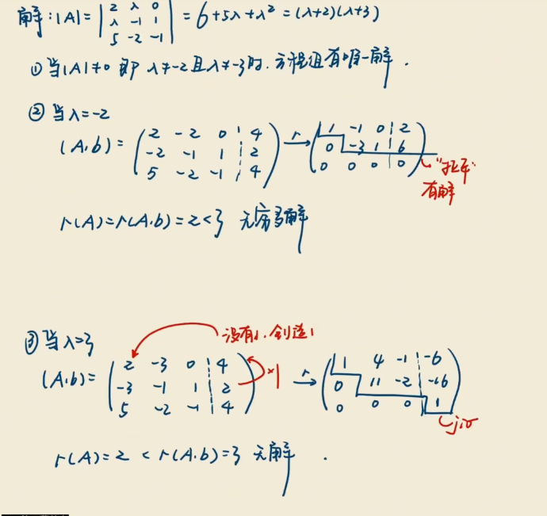

----

上题还可以换一种问法

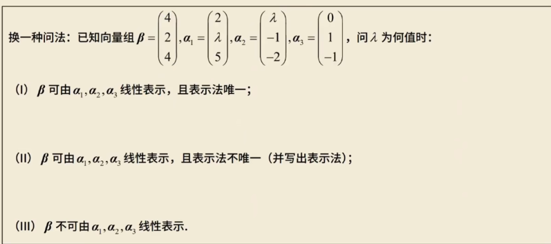

# 线性方程组求通解

## 解的性质

### 齐次线性方程组的Ax = 0解的性质

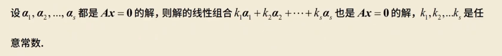

$Ax_i = 0$

-   k1 ... ks可以全为0

### 非齐次线性方程组Ax = b解的性质

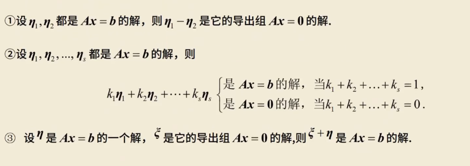

1.   两个非齐次的解作差会把b消掉，所以是**齐次的解**
2.   如果系数之和为1则为**非齐次**
3.   如果系数之和为0则为**齐次**

**证明**

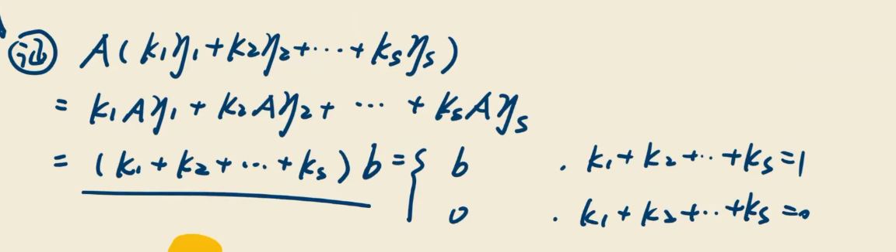

  

## 解的结构

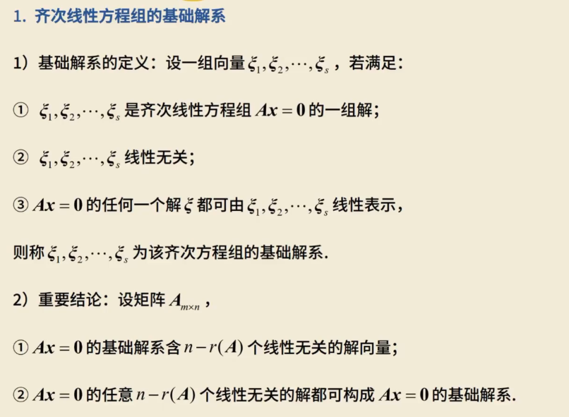

## 基础解系（仅在齐次）

 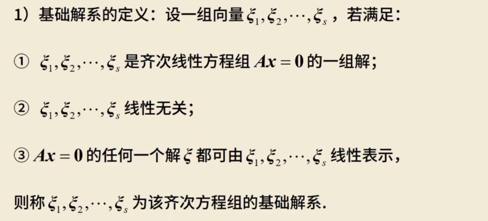

-   一定是无穷多解 / 非零解、
-   每一个向量都是解
-   各个无关
-   Ax = 0解向量全体的极大无关组

### 结论

1.   Ax = 0 的基础解系含**n - R(A)**个线性无关的解向量
     就是自由变量的个数
2.   Ax = 0的**任意n - R(A)**个**线性无关的解**都可构成Ax = 0的基础解系

3.   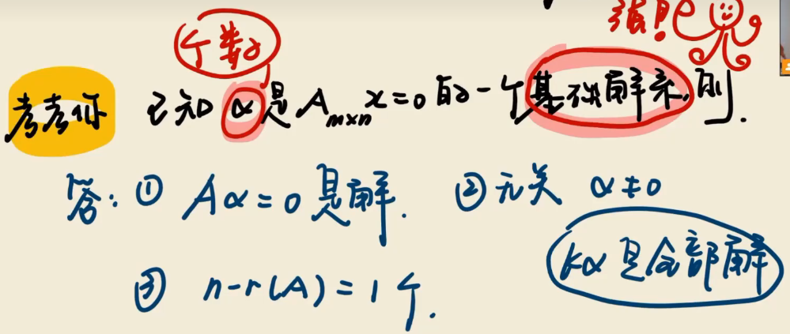

如果x是基础解系，那么kx就一定是全部的解了

4.   当看到基础解系
     1.   每一个都是一个解
     2.   都是无关的
     3.   个数n - r(A) = 给你的个数的

## 通解 -- 全部的解

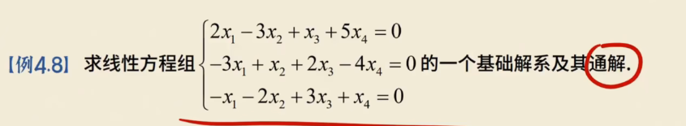

1.   行最简
2.   依次给每一个自由变量赋1，得到n - r(A)个无关解（基础解系）

1.   行最简

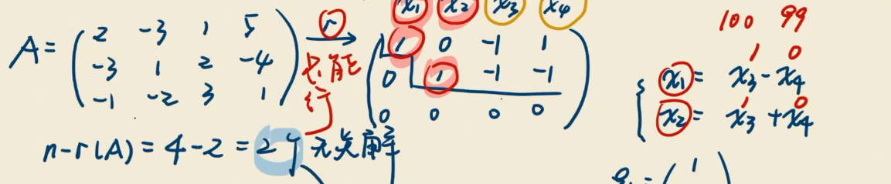

2.   基础解系

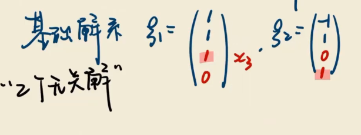

几个自由变量就有几个解，所有解叫做基础解析，解之间都是无关的

3.   通解

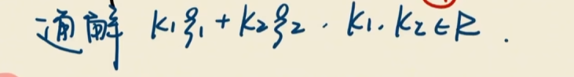

### 高斯消元法

通过初等**行变换**化成最简型

写同解方程

取自由变量写通解

​	约束变量在左
​	自由变量在右

1.   行最简

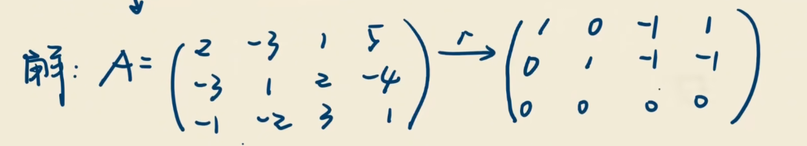

2.   

让约束在右边是因为可以直接提出来，仅在一行中出现

~~~
x1 - x3 + x4 = 0
x2 - x3 - x4 = 0
四个未知量
2个有效方程

x1 = x3 - x4
x2 = x3 + x4
~~~

3.   

~~~
x3 = k1
x4 = k2

{
    x1 = k1 - k2
    x2 = k1 + k2
    x3 = k1
    x4 = k2
}
~~~

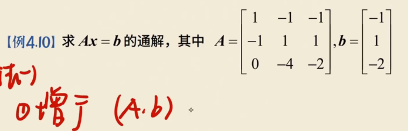

1.   行最简

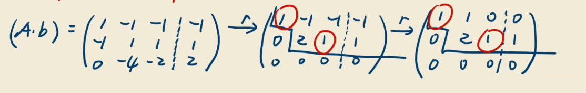

2.   同解

~~~
x1 = -x2
x3 = -2x2 + 1
~~~

3.   解

~~~
{
    x1 = -a
    x2 = a
    x3 = -2a + 1
}
~~~

## 非齐次线性方程组的通解

齐通 + 非齐特
AX=0的基础解系 + 一个 特解

-   行最简
-   表示约束变量
-   特解：将自由变量全取0
-   求齐次基础解系

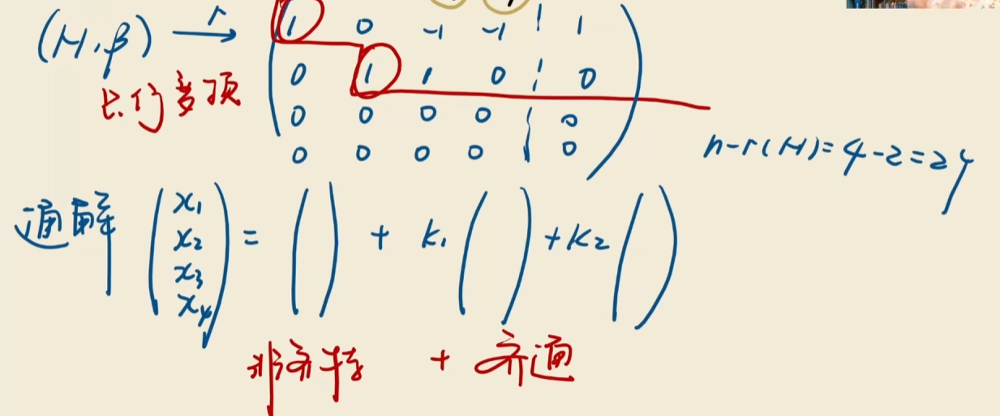

-   行最简
-   两个自由，两个齐通

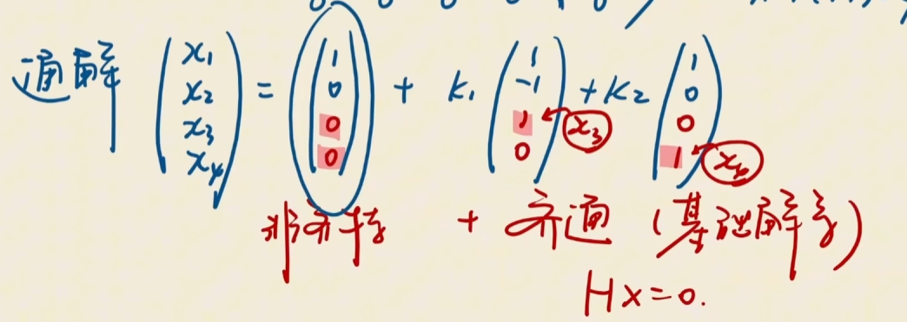

**注：求齐通的时候要把b都变成0**

