# 行列式

-   一个数字

## 性质

行数列数都相同

## 计算

-   一阶二阶三阶

-   四阶以上

## 展开定理

### 余子式

在n阶行列式，把元素$a_ij$所在的行列数花去后，其余的n - 1行列式记作$M_ij$

### 代数余子式

$(-1)^{i+j}M_{ij}$,称为元素$a_{ij}$记为$A_{ij}$

## 逆序数$\varUpsilon $

找后面比自己小的数

~~~
436512
(3+2+3+2)

~~~

n(n-1)(n-2)....1的逆序数：$\frac{n(n-1)}{2}$

**奇排列-：逆序数为奇数个**

**偶排列+：逆序数为偶数个**

其实**展开**就是行标123..n，列标的全排列（每一行选一个元素，不能重复）

逆序数决定正负号，偶排列是+

# 按行展开

-   元素与代数余子式乘积（(-1)）之和

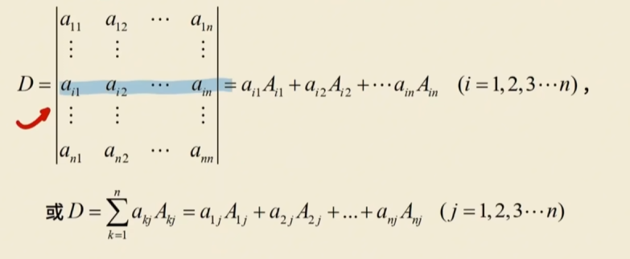

-   这样可以降阶，之后去找零展开
    -   没有零就进行行列式的互换

# 性质

## 1.转置值不变

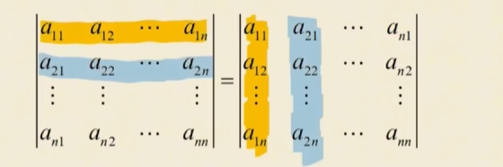

## 2.互换变号

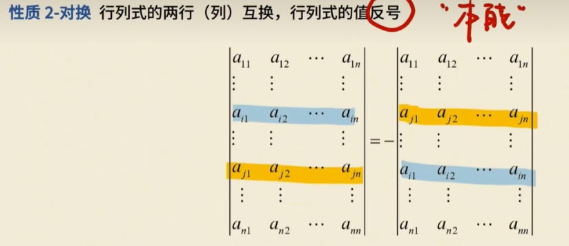

-   如果行列式有两行相同值为0

$$
\left| \begin{matrix}
	1&		2\\
	1&		2\\
\end{matrix} \right|\ =\ -\left[ \begin{matrix}
	1&		2\\
	1&		2\\
\end{matrix} \right]
$$

$$
D\ =\ -D\ =>\ D\ =\ 0
$$

## 3.倍乘

**列式的某(列)每个元素都乘常数k，则等于k乘此列式的值**

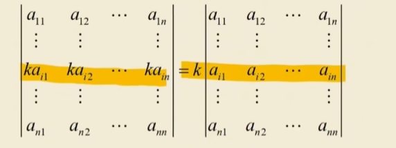

**推论** 

**1）若列式中某（列）元素全为零，则列式的值为零；**
**2）若列式中两（列）对应元素成例，其值为零。**

## 4.拆分

如果列式某(列)元素都写成两数之和，则该列式可以写成两个列式之和，即

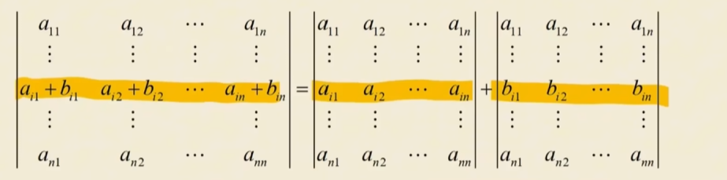

-   二阶的拆成四项
-   三阶的拆成八项

## 5.恒等变形

**将行列式的某行（列）的每个元素都乘常数k，再加到另一行（列）的对应元素上，行列式的值不变**

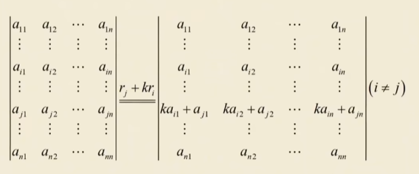

-   值变了一行

# 公式

##  拉普拉斯

（分块）

-   可以不是方阵
-   其实就是行列对换
-   AB需要时方阵

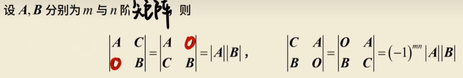

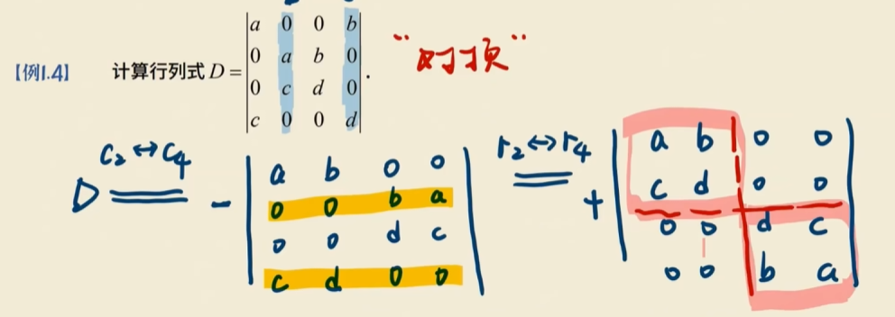

## 范德蒙行列式

-   第一行全是1
-   第二行任意
-   之后依次升阶

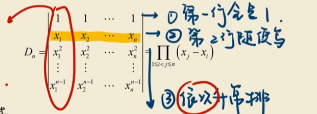

-   等于位置后的依次减位置前的

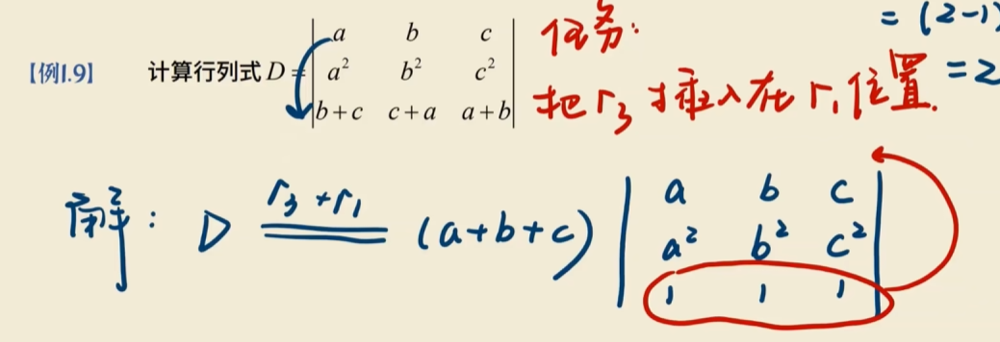

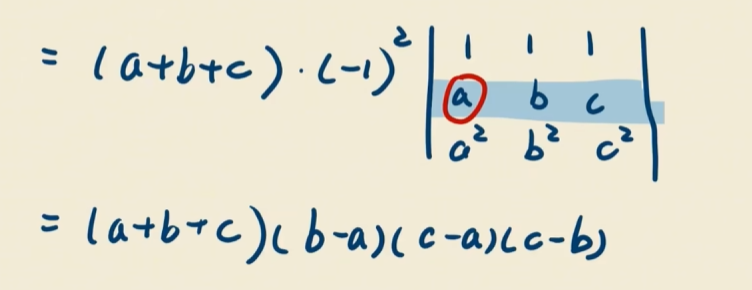

-   将行列式最后一行换到第一行需要操作几次

`n - 1次`

新行列式的值为$(-1)^{n-1}D$

## 替换公式使用代数余子式

===**任意行的元素与另一行对应元素的代数余子式乘积之和等于0**

-   位置是i，j但是元素可以是别的位置的元素，让他变成一个新的行列式

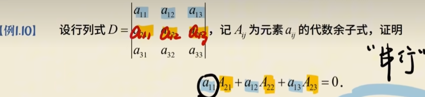

**如果不是对应位置，那么一定等于0**

因为一定会有两行相等

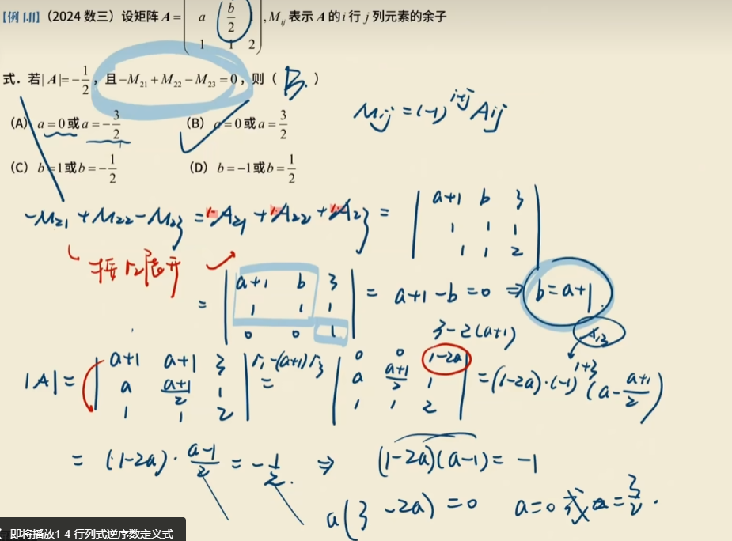

# 计算行列式的思路

-   降阶，找零

-   某一行化成只有一个元素不为0
-   找三角行列式

## 适合化三角形行列式

### 一点两斜

-   按照点所在的展开
-   能出上三角或下三角行列式

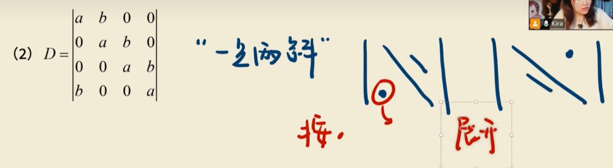
$$
D\,\,=\,\,a\left( -1 \right) ^{1+1}\left| \begin{matrix}
	a&		b&		0\\
	0&		a&		b\\
	0&		0&		a\\
\end{matrix} \right|\ +\ b\left( -1 \right) ^{1+4}\left| \begin{matrix}
	b&		0&		0\\
	a&		b&		0\\
	0&		a&		b\\
\end{matrix} \right|
$$

### 各行元素之和相等

-   把各行全部加在第一行
-   提公因子
-   各行减1，化成三级翱翔

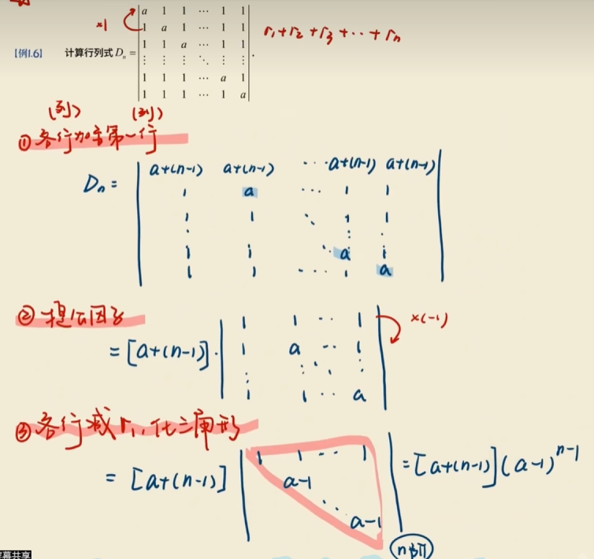

### 爪型行列式

-   各行倍加到第一行，消去平爪

$$
\left| \begin{matrix}
	1&		1&		1&		1\\
	1&		a&		&		\\
	1&		&		b&		\\
	1&		&		&		c\\
\end{matrix} \right|\ =\ \left| \begin{matrix}
	1-\frac{1}{a}-\frac{1}{b}-\frac{1}{c}&		&		&		\\
	1&		a&		&		\\
	1&		&		b&		\\
	1&		&		&		c\\
\end{matrix} \right|
$$

 = abc(1-1/a-1/b-1/c)

### 三对角行列式

-   把多余的数消去，凑三角

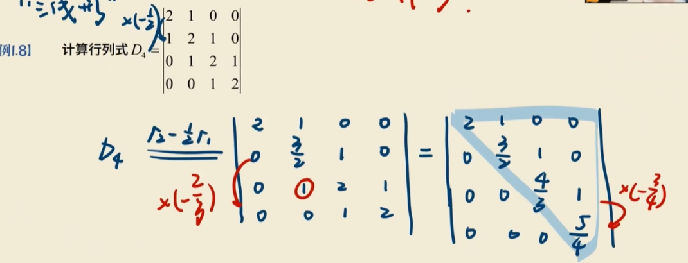

# 结论

##  1.三角行列式的值等于主对角元素相乘

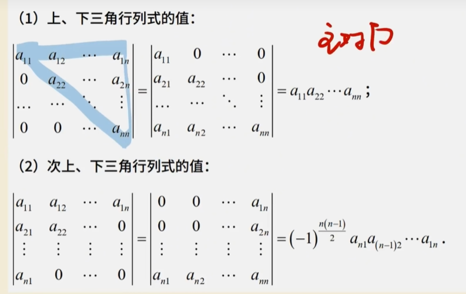

## 2.倍乘

**1）若列式中某（列）元素全为零，则列式的值为零；**
**2）若列式中两（列）对应元素成例，其值为零。**

