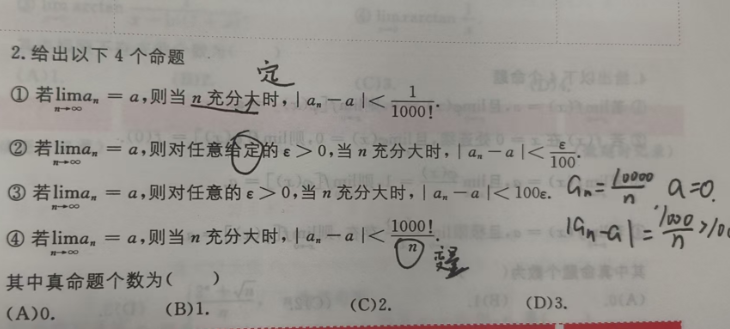

# 极限定义

$\delta$必须要确定下来，求极限时不能是个变量

如果极限确定
$$
\underset{x>0}{\lim}\frac{f\left( x \right)}{x}\ =\ 1
$$
根据保号性，f(x)的去心邻域 = 0，但是函数值≠0

# 积分

### 三角

$$
\int{\sin ^2x}dx\ =\ \int{\frac{1-\cos 2x}{2}dx}
$$

### 分式

$$
\int{\frac{1}{x\left( x+1 \right)}dx\ =\ \int{\frac{1\ +\ x\ -\ x}{x\left( x\ +\ 1 \right)}dx\ =\ \int{\frac{1}{x}dx\ -\ \int{\frac{1}{x+1}dx}}}}
$$

$$
\int{\frac{1}{\left( t\ +\ 1 \right) \left( t\ -\ 1 \right)}}dx\ =\ 1/2\int{\frac{t\ -\ 1\ -\ \left( t\ +\ 1 \right)}{\left( t\ +\ 1 \right) \left( t\ -\ 1 \right)}dx}
$$
