是基于上下文的嵌入模型
可以理解同型不同意的词
# 原理
只有编码器encoder的transformer

输入：句子
输出：特征值

会得到每个单词的上下文特征


# 配置
## BERT-BASE
12层编码器
每个编码器有12个注意力头
前馈层有768个隐藏神经元
输出的特征向量：768
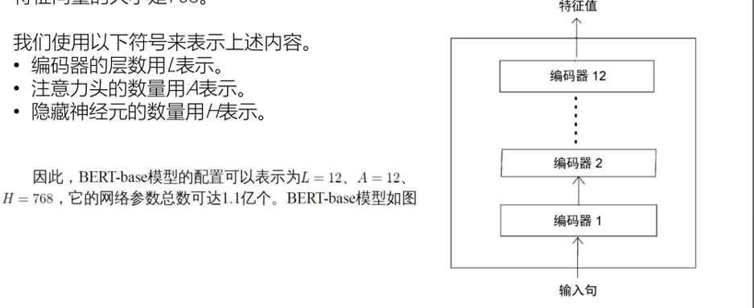

## BERT-large
24层编码器
16个注意力头
1024个隐藏神经元
输出的特征向量：1024

# 预训练
属于迁移学习的一种实现方式
避免从零开始训练
## 流程
1. 基础模型准备：定义基础模型m
2. 大规模预训练：针对特定任务训练模型
3. 保存模型
4. 在新任务上做微调

## DETR能实现的任务
1. 掩码语言模型构建
2. 下句预测
### 语言模型构建
预测一连串单词和下一单词
**分类**
1. 自动回归式语言模型
	1. 正向（从左到右）
	2. 反向
	3. 其实就是先掩盖一个单词，Paris is a beautiful ~~city~~. I love Paris。
		1. 如果是正向看就正向读取所有单词一直到空白处，
			1. `Paris is a beautiful __`
		2. 如果是反向就逆着读取到空白处
			1. `__ I love Paris`
2. 自动编码式语言模型
	1. 双向的
**BERT是自动编码式语言模型，也就是双向预语言模型**
### 掩码语言模型构建
给定句子中随机掩盖15%的单词
需要准确预测被掩盖的单词
**`[MASK]`是掩码**
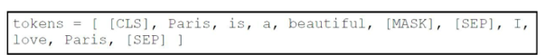

**问题**
在训练的时候模型预测MASK但是在微调阶段没有MASK标记
**解决** 80-10-10规则
先随机选择15%的标记处理
- 80%的情况用`[mask]`掩盖
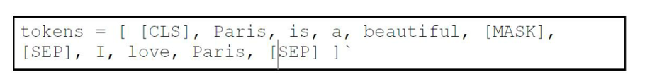
- 10%使用一个**随机词**来替换该标记
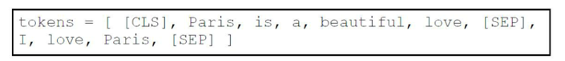
- 10%不做任何变化
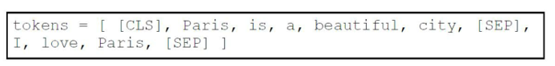
#### 全词掩码
如果一个单词被分为多个小单词时，当一个子词被掩盖，那么对应的母词也会被掩盖
如果掩码率 > 15%可以忽略其他的词也就是不掩盖


### 下句预测
二分类任务
向模型提供两个句子，必须预测第二个句子是否是第一个句子的下一句
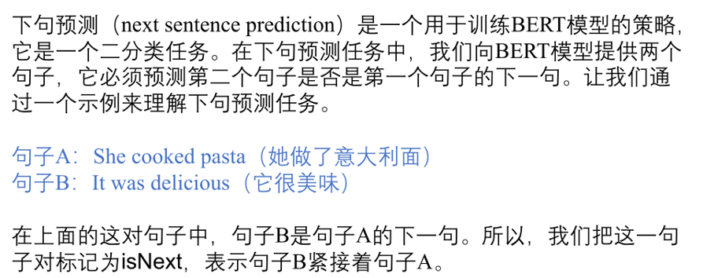

- 如果是下一句则标记为`isNext`
- 如果不是则标记为`notNext`
#### 作用
可以让模型理解两个句子的关系
适合问答，文本生成

#### 数据集
从任意单语言资料库生成数据集
- isNext 任意抽两个连续的句子
- notNext从两个文档抽句子
保证各占50%
#### 数据处理
在开头加`[cls]`结尾加`[sep]`
之后直接训练得到特征值
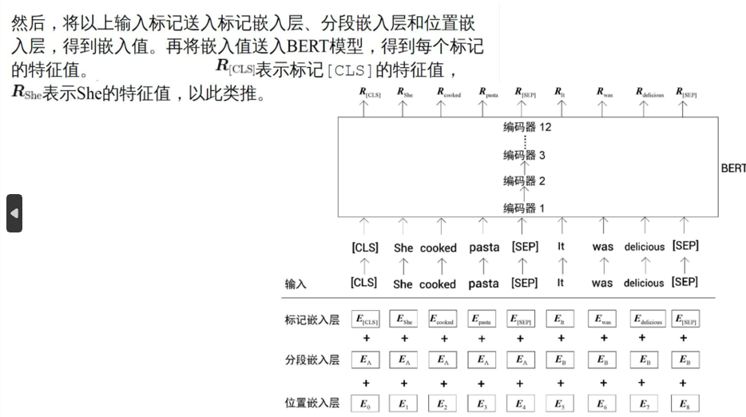

#### 做输出
1. 对于分类任务，BERT 的标准做法是**只取第一个位置（即 `[CLS]` 标记）的输出向量**。
`[CLS]` 没有任何实际的词汇含义，它能够公平地与句子 A 和句子 B 中的所有词进行交互。随着层数加深，`[CLS]` 向量 $C$ 逐渐聚合了整个“句子对”的全局语义特征和逻辑关系。

2. 拿到代表整个句子对的特征向量 $C$ 后，我们在这个向量之上叠加一个全连接层（线性变换），将其维度从 $H$ 降到 $2$（因为是二分类任务：`IsNext` 和 `NotNext`）。

3. 激活并输出概率 (Softmax)

## 1.数据准备
把嵌入数据
1. 标记嵌入层
2. 分段嵌入层
3. 位置嵌入层

 ---
1.  分词标记

### 标记嵌入层
1. 添加新标记`[cls]`作为开头
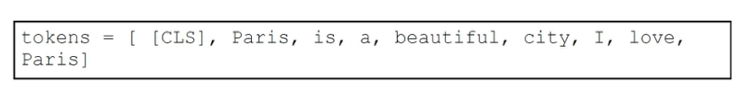
2. 末尾添加`[sep]`
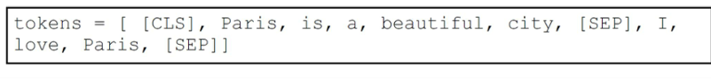
**`[CLS]只在第一句的开头添加，而[SEP]在每一句的结尾都要添加。[CLS]用于分类任务，而ISEPJ用于表示每个句子的结束。`**
3. 把标记转化为嵌入
```
[cls] -> E[cls] = [0.12,0.23...,0.23]
```
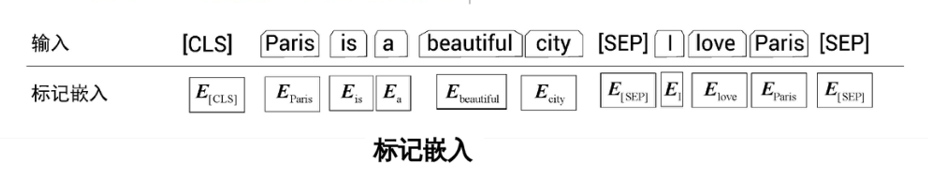


### 分段嵌入层
区分两个给定的句子
句子A的所有标记都被映射到嵌入EA，
句子B的所有标记则都被映射到嵌入EB。
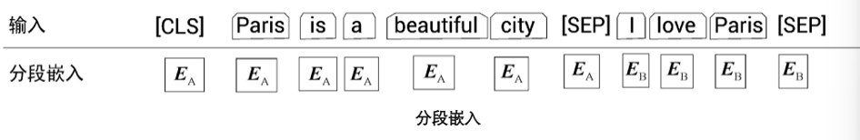

### 位置嵌入层
给出位置信息
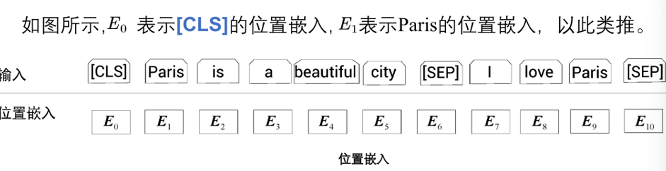

## 2.输入数据
把标记嵌入，分段嵌入，位置嵌入逐元素相加
送入BERT

给单词掩码
[掩码语言模型构建](4.2BERT.md#掩码语言模型构建)


## 3.输出
输出每个标记的嵌入向量
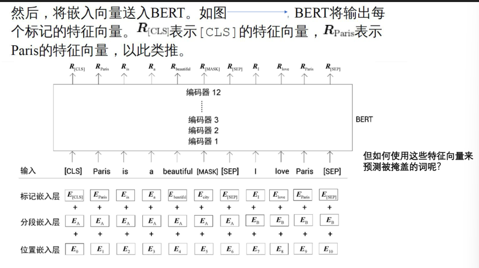


# 字词词元分析器WordPiece
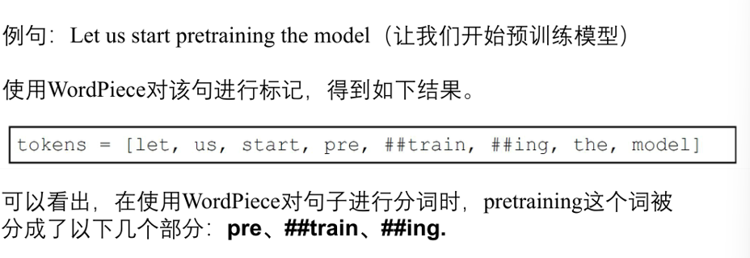
把单词转化为词元

## 流程
1. 检查单词是否存在于词表中
	1. 存在：直接写
	2. 不存在：进入子词拆分流程
2. 子词拆分
	1. 拆分为子词，检查是否在词表中
		1. 存在：直接写
		2. 不存在：继续拆分
3. 直至拆分到字母级别

BERT中词表大约3w个标记

`##`代表是子词，并且前面有其他词
``pretraining = pre + ##train + ## ing``

分词结束后在首部加`[cls]`,尾部加`[sep]`

## 子词词元化算法
1. 先分词
2. 没在词表中的单词标记为`[UNK]`
> 词表中不能有重复单词

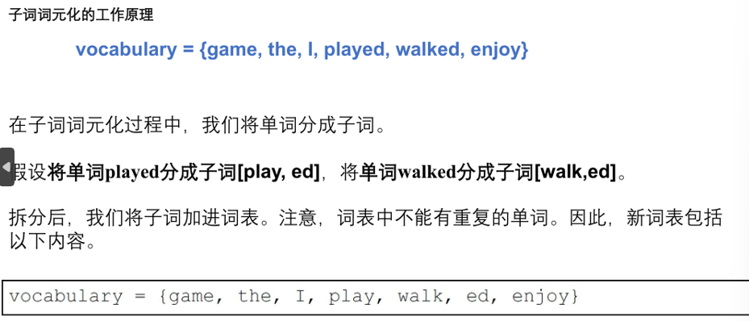
但是直接分为子词元

## **对于哪些单词需要拆分用以下的算法**
### 字节对编码
假设有一个数据集，我们首先从其中提取所有的单词并计算它们出现的次数。假设从数据集中提取的单词和计数，
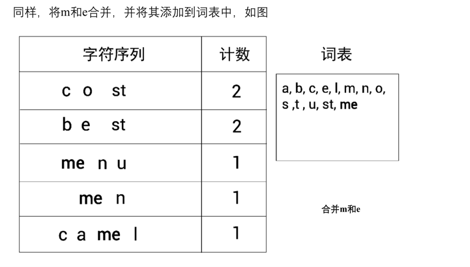
把所有字母都加到词表中，在看出现最多的字母对
一直达到需要的词表大小

#### 使用词表
1. 检查单词是否在词表中
2. 拆分为子词
3. 不在继续拆
如果字母也没有，就标记为`[UNK]`

### 字节级字节对编码
所有字母都被替换为数字
```
best => 62 65 73 74
```
#### wordPiece
根据相似度合并


1. 从给定的数据集中提取单词并计算它们出现的次数。
2. 确定词表的大小。
3. 将单词拆分成一个字符序列。
4. 将字符序列中的所有非重复字符添加到词表中。
5. 在给定的数据集（训练集）上构建语言模型。
6.  选择并合并具有最大相似度（基于步骤5中的语言模型）的符号对。
7. 重复步骤6，直到达到步骤2中所设定的词表大小1. 

构建完词表后，进行文本标记


# 参数
```

batch_size = 256
step = 1 000 000
lr = 1e-4
预热步 10000
```

使用了dropout = 0.1
使用GELU做激活函数
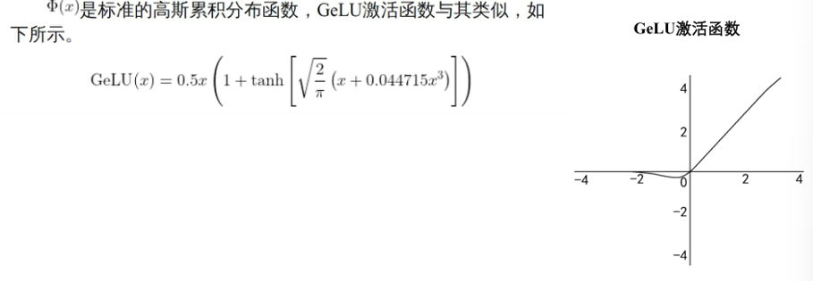