把大预训练模型迁移到小BERT模型

# 知识蒸馏
模型压缩技术
师生学习
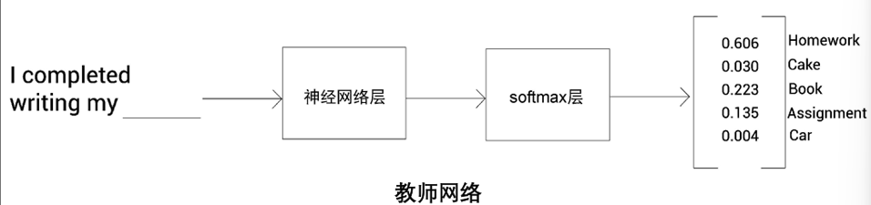
1. 返回概率分布
2. 选择概率最高的单词作为下一个单词
3. 但也有很相关的高概率单词（**隐藏知识**）

当分差很大时但学生网络也想学一些隐藏知识
需要使用Softmax
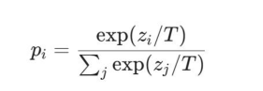
T越大概率越均衡，越平滑
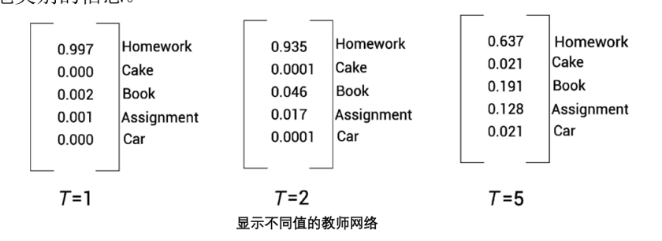
## 学生网络训练
**教师网络**：预训练网络
学生网络没有经过预训练
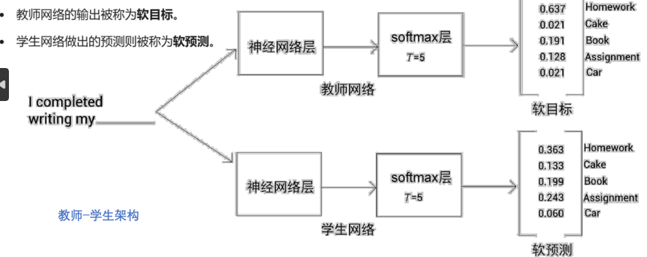
将输入同时送到两个网络中
教师的概率分布是目标
计算**交叉熵损失**反向传播给学生网络
两个的softmax保持一致，T > 1
同时还使用了**学生损失**
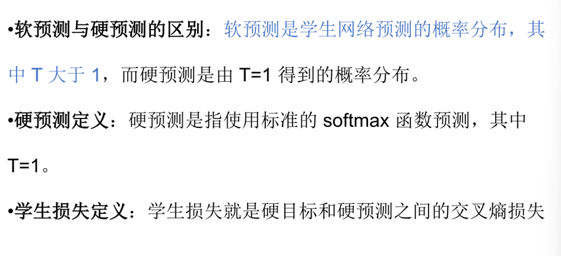

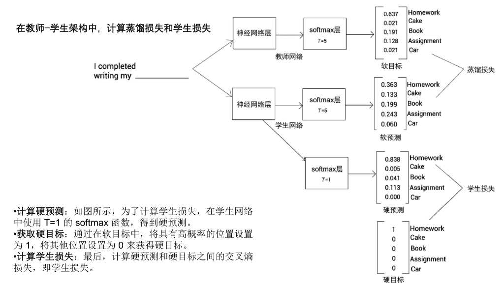
最终损失：L=α.学生损失+β·蒸馏损失

# DistilBERT模型
教师模型：BERT-Base
掩码单词预测
输入一个带掩码的句子，预训练的BERT模型输出了词表中所有单词的掩码概率分布
将隐藏只是迁移到BERT中

| 教师BERT模型包含1.1亿个参数，   |
| -------------------- |
| 学生BERT模型仅包含6600万个参数。 |
隐藏层768
## 学生模型训练
任务选择：只使用掩码语言模型构建任务来训练学生 BERT模型。
掩码方式：在该任务中使用动态掩码。
批量设置：在每次迭代中采用较大的批量值。
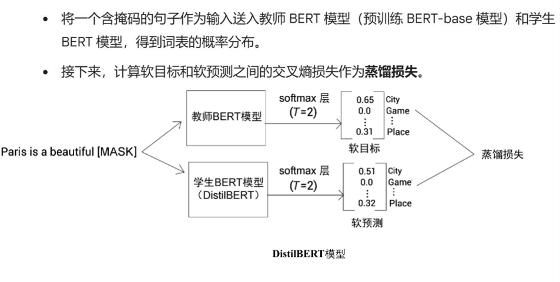
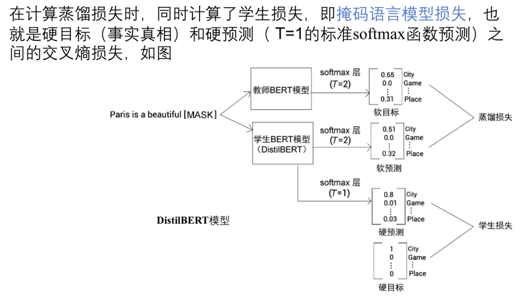
 余弦嵌入损失：它是教师BERT模型和学生BERT模型所学的特征向量之间的距离。
L = 蒸馏损失 + 学生损失（掩码语言模型损失） + 余弦嵌入损失

只在学生训练（蒸馏模型的预训练）有老师模型的参数，对于下游任务是自己学

# TinyBERT模型
从嵌入层和编码层迁移知识

TinyBERT的多层迁移
注意力矩阵：用教师BERT模型产生的隐藏状态和注意力矩阵来训练学生模型
嵌入层迁移：从教师模型中获取嵌入曾的输出
			训练学生模型使产生于教师相同的嵌入矩阵
			
---
除了把输出层迁移到学生模型外，还将中间层的知识迁移到学生网络中

在学生训练和下游任务都有老师带
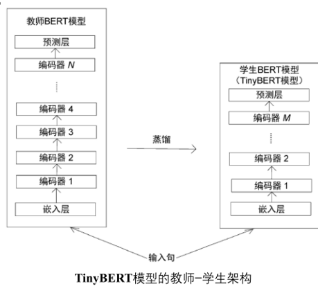
使用4个编码器的模型
特征大小312
只有1450w个参数

## 迁移
$$n = g(m)$$
映射函数 g 表示将知识从教师 BERT 模型的第n 层迁移到学生 BERT 模型的第 m层。

## transformer蒸馏
1. 注意力的蒸馏
	1. 句子结构
	2. 指代信息
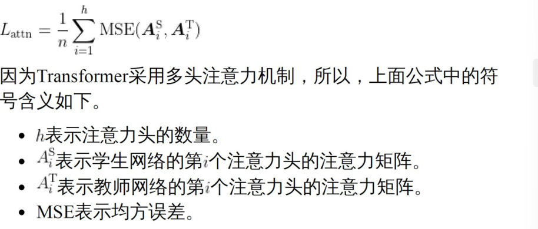
2. 隐藏状态的蒸馏
	1. 编码器的输出（特征值）
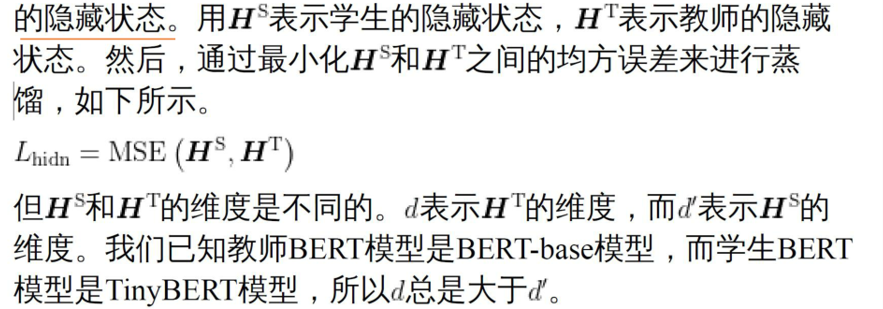
$$L_{hidn} = MSE(H^S W_h, H^T)$$
映射到同一维度

## 嵌入层蒸馏
$$L_{embd} = MSE(H^S W_h, H^T)$$

## 预测层蒸馏
- **Logit 向量 ($Z$)：** 神经网络在最后一层全连接层输出的**原始得分（Raw Scores）**，此时还没有经过任何概率归一化处理。数值有正有负，没有边界。
- **$Z^T$ (Teacher Logits)：** 庞大的教师模型输出的原始得分。
- **$Z^S$ (Student Logits)：** 轻量级的学生模型输出的原始得分。
$L_{pred} = -\text{softmax}(Z^T) \cdot \log\_\text{softmax}(Z^S)$
## 所有损失
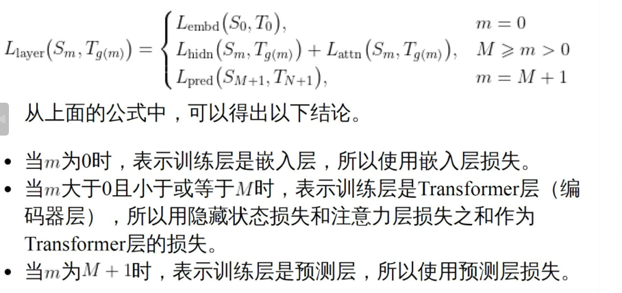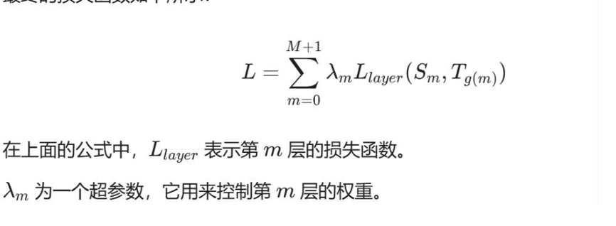

## TinyBERT下游任务
1. 通用蒸馏
2. 特定任务蒸馏
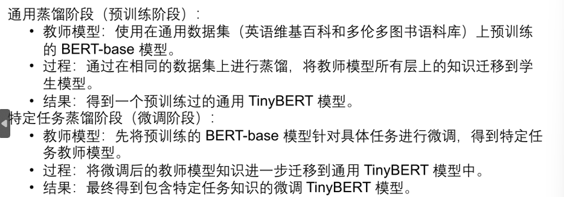
## 数据增强
### 掩码
随机挑选句子中的一个或多个词，将其替换为一个特殊的占位符

- 原句：我今天非常**开心**。
    
- 掩码后：我今天非常 `[MASK]`。
    
- 生成新句：我今天非常**激动**。（由模型预测生成）
### 基于词性的词汇替换方法
这种方法会先用工具对句子进行词性标注，然后随机选中某个词，在同义词词典（如 WordNet）或词向量空间（如 GloVe）中，找一个**词性相同且意思相近**的词把它替换掉。

- 原句：这只**小狗**跑得非常**快**。（名词：小狗；形容词：快）
    
- 替换后：这只**小狗**跑得非常**迅速**。（形容词替换）
    
- 替换后：这只**犬**跑得非常**快**。（名词替换）
### n-gram采样方法
在 NLP 中，一个词叫 unigram，连续的两个词叫 bigram，连续的 n 个词就叫 n-gram。

而 n-gram 采样方法会**随机框选出句子中连续的几个词（一个 n-gram 片段）**，对这整个片段进行整体的掩码、删除或替换操作。

- 原句：苹果公司在**加利福尼亚州**发布了新产品。
    
- 采样一个 3-gram：“加利福尼亚州”。
    
- 操作结果：可以直接将整个地名片段 mask 掉，或者用另一个多词组成的同义短语进行整体替换。