在BERT的变体中，在训练新模型的时候，老模型的参数是锁住的，那么现在是要微调老模型
之前用老模型知识加一个分类头，并且只能调整分类头的参数，现在是要反向传播给整个参数

---
```python
from transformers import AutoTokenizer,AutoModelForSequenceClassification

# 加载分词器
model_id = "bert-base-cased"
model = AutoModelForSequenceClassification.from_pretrained(
	model_id,num_label = 2
)
tokenizer = AutoTokenizer.from_pretrained(model_id)

# 分词
from transformers import DataCollatorWithPadding

## 保证长度一致
## 数据中最长的那句话，然后把其他较短的句子用特殊的 `[PAD]` 占位符补齐到同样的长度，保证长度一致
data_collator = DataCollatorWithPadding(tokenizer = tokenizer)

def preprocess_function(example):
	## 截断。BERT 一次最多只能处理 512 个 Token。
	return tokenizer(examples["text"],truncation = True)
	
# 对数据集测试集分词
tokenized_train = train_data.map(preprocess_function,batched = True)
tokenized_test = test_data.map(preprocess_function,batched = True)
```

F1 = 85%
预训练是80%
# 冻结实验
1. 冻结除了分类头的所有层
不会有新的特征表示
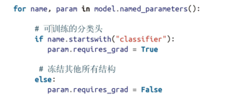

F1 = 63%
但速度快

2. 冻结前十个编码器层
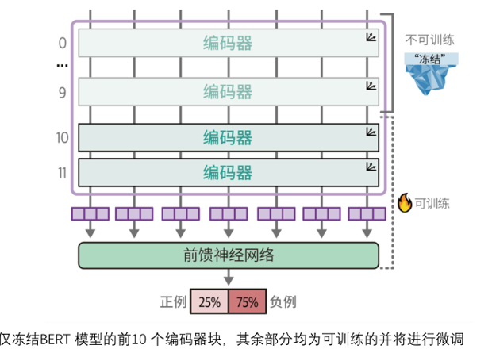

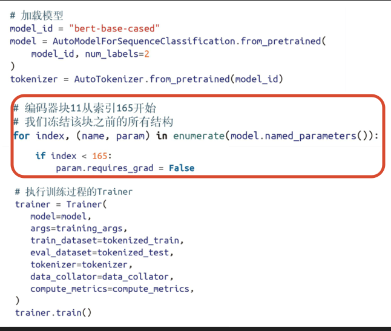

F1 = 0.8
3. 消融实验
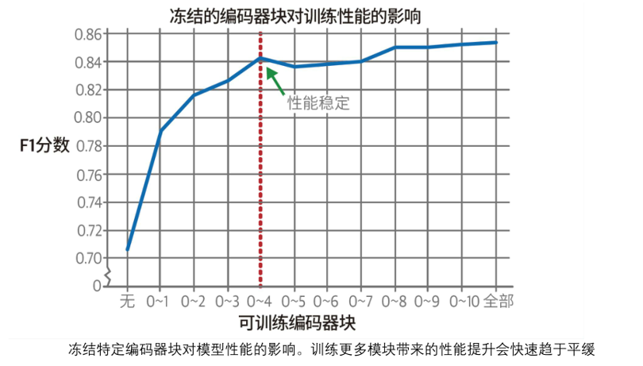

# 少样本下高效的微调SetFit
基于sentence-transformers
1. 采集训练数据
2. 微调嵌入模型
	1. 利用生成的额句子微调，才有对比学习的方法
3. 训练分类头
	1. 选择任意的scikit-learn提供的分类模型或分类头作为分类器
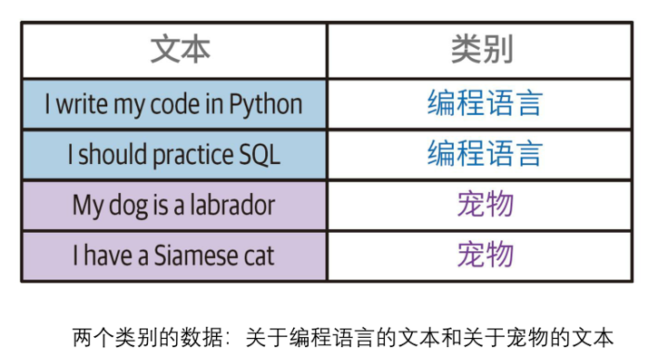

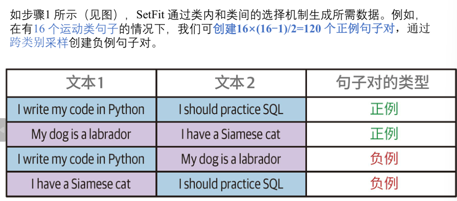
这样创建的数据集可以缩减规模

选用sentence_transformers/all-mpnet-base-v2微调
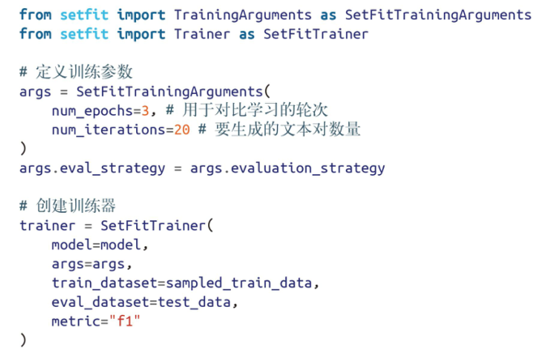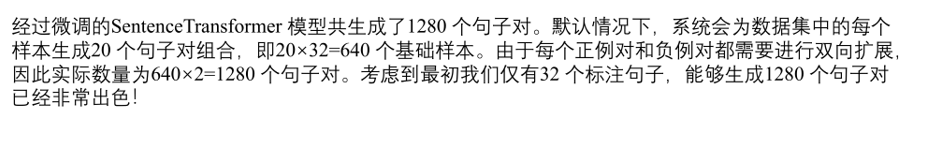

F1 0.84

# 掩码语言模型建模的继续预训练
预训练 + 微调的方式在处理特定领域的数据时存在局限性
办法：在预训练和微调之间增加继续预训练环节
-  在预训练和微调两步之间，用特定领域数据进行**掩码语言建模**训练
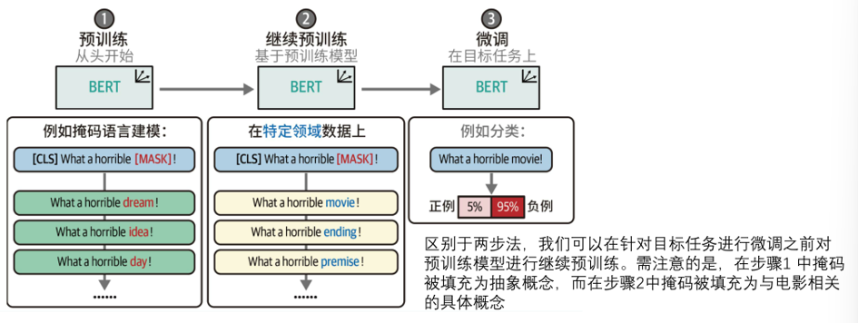
1. 1中的掩码填充为抽象概念
2. 2中的掩码填充为具体概念

```python
使用bert-base-cased模型
from transformers import AutoTokenizer,AutoModelForMaskedLM

model = AutoModelForMaskedLM.from_pretrained("bert-base-cased")
tokenizer = AutoTokenizer.from_pretrained("bert-base-cased")

# 分词处理，并且需要移除标签
```
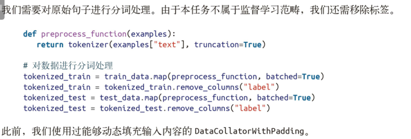
**掩码操作：**
1. 词元掩码，15%独立词元
2. 对整个单词掩码（**难度高，速度慢**）
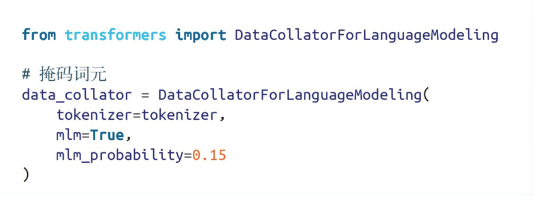
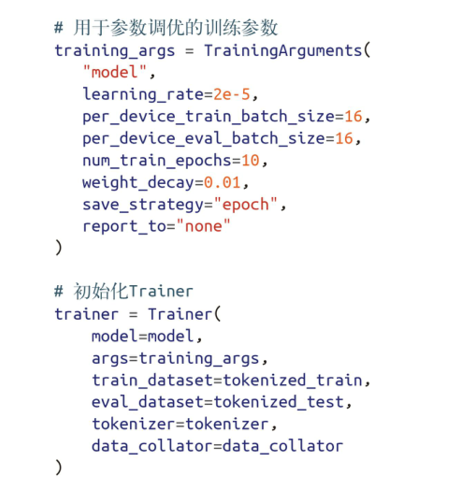

# 命名实体识别NER
对BERT微调
对象时单个词元/单词
可用于：去标签化，匿名化
**不同**
1. 数据预处理
2. 分类粒度
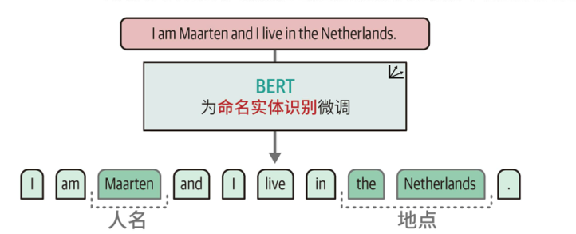

- 不再对词元嵌入做聚合或池化操作，直接对序列每个词元单独预测
- 分类对象时单个词元
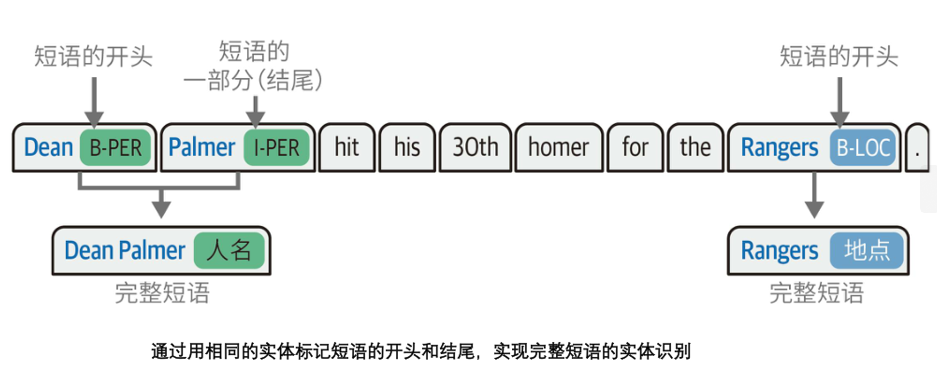

- 对于一个单词被分为多个词元来说，可能会被被判定为多个人名/地名，需要做新标签
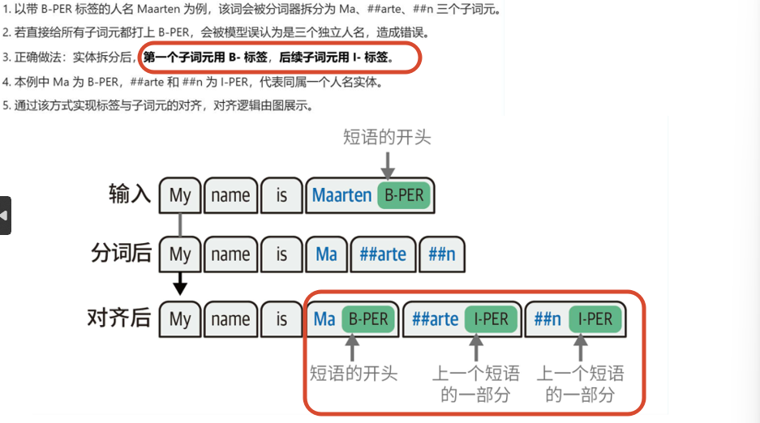


