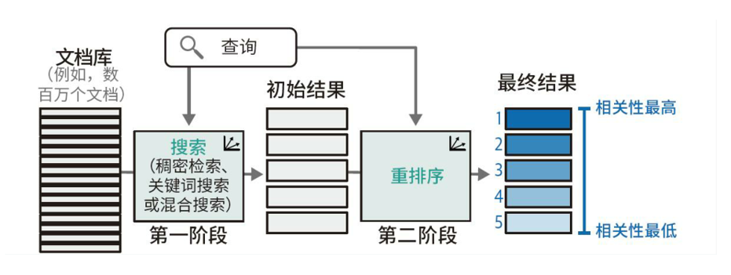
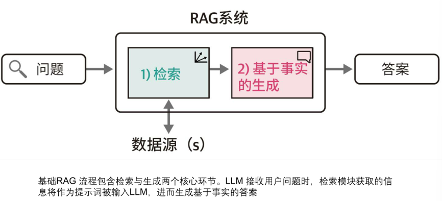

# RAG（检索增强生成）

> **术语说明**：课堂转录中老师使用的"增强解锁"实际为 **检索增强生成（Retrieval-Augmented Generation，RAG）**，"解锁Pipeline"实际为 **检索Pipeline**。下文均使用正确术语。

## 一、课堂原始转录

解决实时性和准确性（幻觉）问题
 (6:54) 后来又讲了一个RAG, (6:55) RAG大家知道是增强解锁， (6:57) 但增强解锁它有什么模式呢？ (7:04) 就是增强解锁它的架构， (7:06) 你们要搞清楚， (7:07) 比如说它的解锁Pipeline, (7:11) 它的流水线是什么， (7:13) 它怎么分工了， (7:15) 它通过什么结构去组成了这个RAG, (7:19) 怎么去实现了这个RAG, (7:22) 这也是个基础题。

## 二、RAG 概述

RAG（Retrieval-Augmented Generation，检索增强生成）是一种结合信息检索与文本生成的技术架构，旨在**解决大语言模型的两大核心问题**：

- **实时性问题**：LLM 的知识截止于训练日期，无法获取最新信息
- **准确性（幻觉）问题**：LLM 可能凭空编造不存在的事实

核心思路：在生成回答之前，先从外部知识库中检索相关文档，将检索结果作为上下文注入生成过程，使模型基于真实数据产出更准确的回答。

## 三、RAG 架构模式

RAG 有多种架构模式，按复杂度递增：

### 3.1 Naive RAG（朴素 RAG）
最基本的实现范式：「索引 → 检索 → 生成」直线流程。单次查询、单次检索、单次生成，没有反馈或迭代。

### 3.2 Advanced RAG（高级 RAG）
在 Naive RAG 基础上引入**检索前优化**与**检索后优化**：
- **检索前**：查询重写（Query Rewriting）、查询扩展、多角度查询
- **检索后**：重排序（Re-ranking）、上下文压缩、结果过滤与去重

### 3.3 Modular RAG（模块化 RAG）
将 RAG 拆分为可插拔的独立模块，支持灵活编排：
- 检索模块可替换（稠密检索 / 稀疏检索 / 混合检索）
- 可引入记忆模块、路由模块、自省模块等
- 各模块按需组合，适配不同场景

### 3.4 Agentic RAG（智能体 RAG）
引入 Agent 范式，由 LLM 自主决策**何时检索、检索什么、如何利用检索结果**，支持多轮迭代检索与推理，是当前最前沿的方向。

## 四、RAG Pipeline 流水线

完整 Pipeline 包含以下阶段：

```
文档加载 → 文档分割 → 向量化嵌入 → 索引构建 → 查询处理 → 检索召回 → 重排序 → 生成回答
```

### 4.1 文档加载（Document Loading）
是 RAG 的入口。将各种格式的非结构化数据（PDF、Word、网页、数据库等）转化为系统可处理的统一文本格式。

**元数据提取**：在提取文本的同时，记录文档的属性——文件名、页码、标题、作者、创建时间。需要处理冗余信息（页眉页脚、广告、导航栏等）。

### 4.2 文档分割（Chunking）
将长文档切分为适当大小的文本块（Chunk），在语义完整性和检索精度之间取得平衡：
- 固定长度分割（如每 512 token 一块）
- 基于语义边界的分割（按段落、按句子切分）
- 滑动窗口重叠分割（相邻 chunk 有部分重叠，避免信息断裂）

### 4.3 向量化嵌入（Embedding）
将文本块通过**嵌入模型**（Embedding Model）转化为稠密向量，映射到高维语义空间中。语义相近的文本在向量空间中距离更近。

### 4.4 索引构建（Indexing）
将文档向量存入**向量数据库**（Faiss / Chroma / Pinecone / Milvus 等），构建高效最近邻检索索引，支撑后续快速召回。

### 4.5 查询处理（Query Processing）
对用户输入的查询进行预处理：查询重写、关键词提取、意图识别，生成适合检索的查询向量。

### 4.6 检索召回（Retrieval）
- **稠密检索**：基于文本嵌入，把问题转化为查询向量，和文档向量做相似度匹配（余弦相似度等）。
- **重排序**：对初步检索结果进行相关性评分，筛选出最相关的 top-k 文档。

> RAG 中的检索 = 稠密检索 + 重排序

### 4.7 生成回答（Generation）
把问题和检索获得的前若干相关文档共同输入 LLM。检索模块获取的信息作为提示词（Prompt）的上下文，引导模型基于真实文档生成回答。

## 五、各阶段分工

| Pipeline 阶段 | 负责模块            | 核心职责              |
| ----------- | --------------- | ----------------- |
| 文档加载        | Document Loader | 多格式解析、文本提取、元数据记录  |
| 文档分割        | Text Splitter   | 合理切分文本块、保持语义连贯    |
| 向量化嵌入       | Embedding Model | 文本 → 向量映射、语义空间建模  |
| 索引构建        | Vector Store    | 向量存储与高效最近邻检索      |
| 查询处理        | Query Processor | 理解用户意图、查询重写与优化    |
| 检索召回        | Retriever       | 稠密检索 + 重排序，找最相关文档 |
| 生成回答        | Generator（LLM）  | 基于检索上下文生成最终答案     |

## 六、组成结构

RAG 由以下核心组件构成：

### 6.1 检索器（Retriever）
负责从知识库中找到与用户查询最相关的文档片段：
- **嵌入模型**：文本 → 稠密向量
- **向量数据库**：存储向量 + 相似度检索
- **重排序模型**（Reranker）：对召回结果做二次精排

### 6.2 生成器（Generator）
通常是大型语言模型（LLM），接收检索器返回的相关文档作为上下文，生成最终回答。

### 6.3 知识库（Knowledge Base）
外部文档集合，可以是本地文件、数据库、API、网页等。

### 6.4 编排层（Orchestration）
连接检索器与生成器的中间层，负责：
- Prompt 模板构建（将检索结果与用户问题拼接）
- 流程控制（是否触发检索、检索几轮）
- 引用标注与来源追溯

## 七、实现方式概述

### 7.1 主流开发框架

| 框架 | 特点 |
|---|---|
| **LangChain** | 最流行的 LLM 应用框架，内置完整 RAG 流水线 |
| **LlamaIndex** | 专注数据索引与检索增强，文档处理能力强大 |
| **Haystack** | 面向生产环境的 NLP 管道框架，管道设计灵活 |
| **Dify / FastGPT** | 低代码 RAG 平台，开箱即用 |

### 7.2 关键组件选型

| 组件 | 常见方案 |
|---|---|
| 嵌入模型 | OpenAI text-embedding-3、BGE、M3E、Jina Embeddings |
| 向量数据库 | Faiss（轻量）、Chroma（易用）、Milvus（生产级）、Pinecone（云服务）、Weaviate |
| LLM | GPT-4o、Claude、Qwen、DeepSeek、GLM |
| 重排序模型 | BGE-Reranker、Cohere Rerank、Cross-Encoder |

### 7.3 基本实现流程（代码层面）

1. **准备阶段（离线）**：加载文档 → 分割为 chunk → 嵌入为向量 → 存入向量数据库
2. **查询阶段（在线）**：接收用户问题 → 嵌入查询向量 → 向量相似度检索 → 重排序 → 拼接 Prompt → LLM 生成回答
3. **返回阶段**：返回生成结果，可附带引用来源增强可信度

### 7.4 LangChain 简易示例

```python
from langchain.document_loaders import TextLoader
from langchain.text_splitter import RecursiveCharacterTextSplitter
from langchain.embeddings import OpenAIEmbeddings
from langchain.vectorstores import Chroma
from langchain.chains import RetrievalQA
from langchain.llms import OpenAI

# 1. 加载文档
loader = TextLoader("knowledge.txt")
documents = loader.load()

# 2. 分割文档
text_splitter = RecursiveCharacterTextSplitter(chunk_size=500, chunk_overlap=50)
chunks = text_splitter.split_documents(documents)

# 3. 向量化并构建索引
embeddings = OpenAIEmbeddings()
vectorstore = Chroma.from_documents(chunks, embeddings)

# 4. 创建检索问答链
qa_chain = RetrievalQA.from_chain_type(
    llm=OpenAI(),
    retriever=vectorstore.as_retriever()
)

# 5. 提问
answer = qa_chain.run("什么是RAG？")
```

## 附录：学生原有笔记（原始内容保留）

**搜索**
1. 稠密检索
基于文本嵌入，把问题转化为查询向量，和文档向量最相似度匹配
2. 重排序
初步检索结果进行相关性评分

3. RAG

RAG中的检索是稠密检索 + 重排序
生成：检索模块获取的信息作为提示词输入LLM

### 文档加载
是RAG的入口
将各种格式的非结构化数据转化为系统可处理的同一文本格式

元数据提取：在提取文本的同时，记录文档的属性：文件名，页码，标题，作者，创建时间
需要处理冗余信息

### 检索
稠密检索 + 重排序后，检索到相关文档
通过对比嵌入向量之前的相似度，找到相关性最高的信息添加到提示词
### 生成
把问题和检索获得的前若干相关文档共同输入LLM
