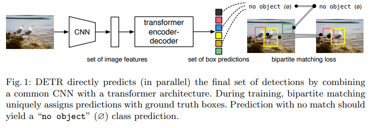
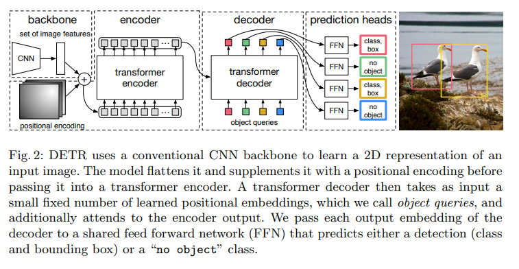
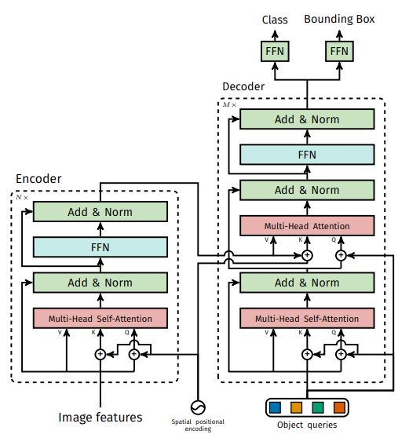

| 时间      | 模型 | 作者        | 关键贡献                                      |
| --------- | ---- | ----------- | --------------------------------------------- |
| 2020年2月 | ViT  | Google      | 第一个把纯Transformer用于图像分类（ImageNet） |
| 2020年5月 | DETR | Facebook AI | 第一个把纯Transformer用于目标检测（COCO）     |

DETR 和 ViT（Vision Transformer）之间的关系非常密切，可以说 DETR 是第一个把 ViT 思想真正用于目标检测的模型，而 ViT 则是 DETR 的直接灵感来源和核心组件之一。

| 组件                | ViT（图像分类）                  | DETR（目标检测）                               | 关系                                |
| ------------------- | -------------------------------- | ---------------------------------------------- | ----------------------------------- |
| Backbone            | 纯Transformer（把图像切成patch） | ResNet50 + 一个小型Transformer Encoder         | DETR 最初没敢直接用纯ViT背骨        |
| 输入方式            | Image → Patches → Tokens         | Image → CNN特征图 → Flatten成Tokens            | 核心思想一样：图像 → 一序列tokens   |
| Transformer Encoder | 标准ViT Encoder（全局自注意力）  | 几乎完全复用了ViT的Encoder结构                 | 代码几乎可以直接抄ViT               |
| 预测头              | 一个MLP分类头                    | 300个object queries + Decoder + FFN预测框+类别 | DETR 额外发明了“object queries”机制 |
| 训练方式            | 普通分类交叉熵                   | 二分匹配 + Hungarian Loss                      | DETR 最大的创新点                   |

DETR ≈ ViT Encoder + CNN Backbone + Object Queries + Hungarian Loss

| 年份      | 模型                        | Backbone               | 说明                                              |
| --------- | --------------------------- | ---------------------- | ------------------------------------------------- |
| 2020      | 原始DETR                    | ResNet50               | 怕纯Transformer太慢，先用CNN提取特征              |
| 2021      | Deformable DETR             | ResNet50               | 加速版，但仍用CNN                                 |
| 2022      | DN-DETR, DINO 等            | ResNet50               | 精度起飞，但还是CNN backbone                      |
| 2023      | RT-DETR                     | HGNetV2（CNN）         | 开始追求实时，仍用CNN                             |
| 2023-2024 | H-DINO, DETR-next 等        | Swin Transformer / ViT | 开始大规模换成纯ViT背骨                           |
| 2024-2025 | RT-DETRv2, Grounding DINOv2 | ViT-L/H/巨大           | 现在最强检测模型几乎全在用ViT或其变种作为backbone |

# 正式进入

## 特点

-   端到端
-   不需要预先定义的先验anchor，也不需要NMS处理
-   小目标效果差

## 总体框架

DETR的总体框架如下，先通过CNN提取图像的特征；再送入到transformer encoder-decoder中，该编码器解码器的结构基本与transformer相同，主要是在输入部分和输出部分的修改；最后得到类别和bbox的预测，并通过二分匹配计算损失来优化网络。

## transformer架构

1）对于输入，首先进行embedding操作，即将输入映射为向量的形式，包含两部分操作，第一部分是input embedding：例如，在NLP领域，称为token embedding，即将输入序列中的token（如单词或字符）映射为连续的向量表示；在CV领域，可以是将每个像素或者每个patch块映射为向量形式，例如，patch embedding层
2）另一个embedding操作为positional encoding：即位置编码，即一组与输入经过embedding操作后的向量相同维度的向量(例如都为[N, HW, C])，用于提供位置信息。位置编码与input embedding相加得到transformer 编码器的输入。
3）transformer encoder：是由多个编码模块组成的编码器层，每个编码模块由多头自注意力机制+残差add+层归一化LayerNorm+前馈网络FFN+残差add+层归一化LayerNorm组成

-   多头自注意力机制：核心部分，例如，在CV领域，经过embedding层后的输入为[N, HW, C]，N为Batch num，HW为像素个数，每个像素映射为一个维度为C的向量；然后通过QKV的自注意力机制和划分为多头的方式，得到输出为[N, HW, C]：

要除以$\sqrt{d_k}$  的原因：查询（Query）与键（Key）之间的点积，然后将这个点积除以一个缩放因子，最后应用softmax函数来获得注意力权重。如果不进行缩放，当键的维度dk很大时，点积的结果可能会非常大，这会导致softmax函数的梯度非常小，从而引起梯度消失问题。通过除以根号dk，提高训练的稳定性。

-   add+LayerNorm：经过多头自注意力机制后再与输入相加，并经过层归一化LayerNorm，即在最后一个维度C上做归一化，详见https://blog.csdn.net/m0_48086806/article/details/132153059
    前馈网络FFN：是由两个全连接层+ReLu激活函数组成

4）transformer decoder：是由多个解码模块组成的解码器层，每个解码模块由Masked多头自注意力机制+残差add&层归一化LayerNorm+多头cross attention机制+add&LayerNorm+前馈网络FFN+add&LayerNorm。
5）此外需要注意的是，第一个解码模块的输入为output(可以初始化为0或者随机初始化)经过embedding操作后的结果，之后各个解码模块的输入就变为前一个解码模块的输出了；第二个cross attention机制的QKV输入分别为：KV键值对都是等于编码器最终的输出；Query为Masked多头自注意力的输出

Masked多头自注意力机制：一个通俗解释为：一个词序列中，每个词只能被它前面的词所影响，所以这个词后面的所有位置都需要被忽略，所以在计算Attention的时候，该词向量和它后面的词向量的相关性为0。因此为Mask

6）最后通过Linear层+Softmax得到最终的输出

## DETR

DETR基本结构如下：简单来说，就是通过CNN提取图像特征（通常 Backbone 的输出通道为 2048，图像高和宽都变为了 1/32），并经过input embedding+positional encoding操作转换为图像序列（如下图所说，就是类似[N, HW, C]的序列）作为transformer encoder的输入，得到了编码后的图像序列，在图像序列的帮助下，将object queries（下图中说的是固定数量的可学习的位置embeddings）转换/预测为固定数量的类别+bbox预测。也就是说Transformer本质上起了一个序列转换的作用。

## 结构图

https://blog.csdn.net/m0_48086806/article/details/132155312

