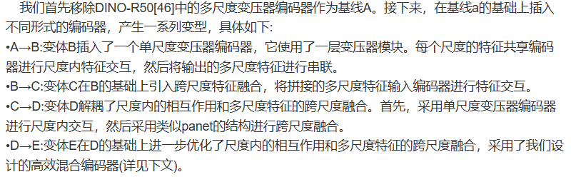
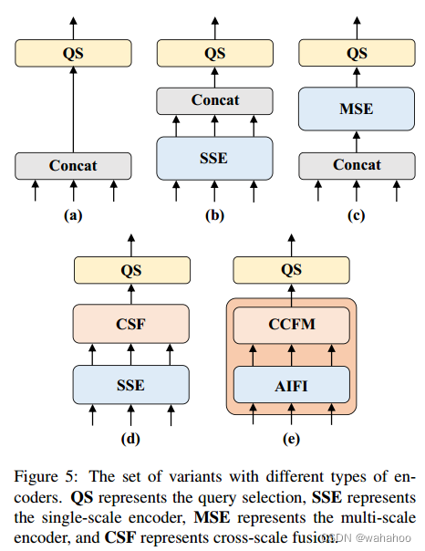
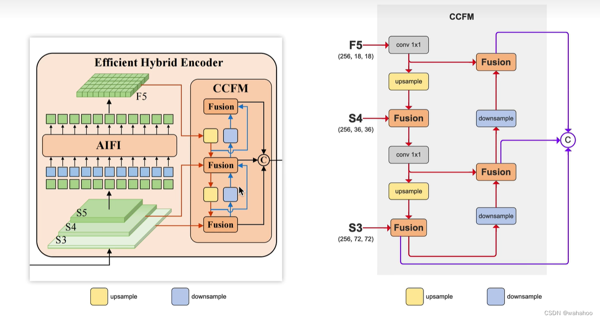

https://blog.csdn.net/qq_60199131/article/details/137919976

# 前版本的不足

-   DETR 把多尺度的特征拉平拼接，构成一个序列很长的向量，让多尺度可以计算，但是计算量大。

-    RT-DETR认为相较于较浅的S3 特征和 S4 特征， S5 特征拥有更深、更高级、更丰富的语义特征，这些语义特征是Transformer更加感兴趣的和需要的，对于区分不同物体的特征是更加有用的，而浅层特征因缺少较好的语义特征而起不到什么作用。

# 改进

### 五种编码器变体 (a) 到 (e) 的分析

-   **（a）简单拼接 + 单尺度编码：**
    -   将所有输入特征**拼接**在一起（通常是展平为向量后），然后通过 **QS** 模块进行查询选择。
    -   **缺陷：** 丢失了特征图的空间结构和多尺度信息。
-   **（b）单尺度编码 + 拼接 + 查询选择：**
    -   首先对每个尺度进行 **SSE**（单尺度编码），然后将编码后的特征**拼接**，最后进行 **QS**。
    -   **缺陷：** 仅在 SSE 之后进行简单拼接，没有明确的多尺度融合。
-   **（c）多尺度编码 + 查询选择：**
    -   将输入特征**拼接**后，通过 **MSE**（多尺度编码），然后进行 **QS**。
    -   **缺陷：** 拼接后再编码，可能导致计算量大，且编码器难以有效处理尺寸差异巨大的特征。
-   **（d）单尺度编码 + 跨尺度融合 + 查询选择：**
    -   首先对每个尺度进行 **SSE**，然后使用 **CSF** 模块进行**显式的跨尺度融合**，最后进行 **QS**。
    -   **优点：** 这是一个更合理的处理多尺度特征的基线模型。
-   **（e）RT-DETR 的高效混合编码器（CCFM + AIFI）：**
    -   这是 RT-DETR 论文中**最终提出和采用的编码器**结构。
    -   它首先使用 **AIFI**（基于注意力的尺度内特征交互）处理每个尺度的特征。
    -   然后使用 **CCFM**（上下文跨尺度融合模块）高效地融合不同尺度的特征。
    -   最后通过 **QS** 进行查询选择。
    -   **优势：** 这种结构被设计用于在**保证实时性 (Real-Time)** 的同时，最大化**语义融合**的效果，是 RT-DETR 实现高性能和高效率的关键。

| **缩写**   | **含义 (英文)**                                 | **含义 (中文)**            | **作用**                                                     |
| ---------- | ----------------------------------------------- | -------------------------- | ------------------------------------------------------------ |
| **QS**     | Query Selection                                 | 查询选择                   | 负责从编码器的输出中选择用于解码器（Decoder）的 **Queries**（通常是 **Anchor Queries** 或 **Sparse Queries**），这是 Transformer 检测器的关键步骤。 |
| **SSE**    | Single-Scale Encoder                            | 单尺度编码器               | 对**单一尺度**的特征图进行编码。                             |
| **MSE**    | Multi-Scale Encoder                             | 多尺度编码器               | 对**所有尺度**的特征图进行编码，通常是在特征图连接或融合之后。 |
| **CSF**    | Cross-Scale Fusion                              | 跨尺度融合                 | 一种明确设计的模块，用于**融合**不同尺度的特征信息。         |
| **CCFM**   | Context Cross-scale Fusion Module               | 上下文跨尺度融合模块       | RT-DETR 提出的用于融合上下文信息的**核心模块**。             |
| **AIFI**   | Attention-based Intra-scale Feature Interaction | 基于注意力的尺度内特征交互 | RT-DETR 提出的用于处理**单一尺度内部**特征的模块。           |
| **Concat** | Concatenation                                   | 拼接                       | 将多个特征图或向量沿着某一维度堆叠起来。                     |

## AIFI

AIFI 是 **RT-DETR (Real-Time DEtection TRansformer)** 提出的**高效混合编码器**中的一个关键组件，全称是 **Attention-based Intra-scale Feature Interaction**，即**基于注意力的尺度内特征交互**。

### 作用

并行处理S3，S4，S5的特征图

**核心功能：**

1.  **尺度内特征增强：** AIFI 专注于对**单一尺度**的特征图进行内部增强和精炼。
2.  **提取语义上下文：** 它利用**自注意力机制 (Self-Attention)** 来捕捉特征图内部像素之间的全局关系和上下文信息，从而使特征更具辨识度

AIFI 是 **RT-DETR (Real-Time DEtection TRansformer)** 提出的**高效混合编码器**中的一个关键组件，全称是 **Attention-based Intra-scale Feature Interaction**，即**基于注意力的尺度内特征交互**。

### 📌 AIFI 的定位与作用

AIFI 的主要作用是在 RT-DETR 的混合编码器中，并行地处理来自骨干网络的不同尺度的特征图（例如 $S3, S4, S5$），为后续的跨尺度融合（CCFM）做好准备。

**核心功能：**

1.  **尺度内特征增强：** AIFI 专注于对**单一尺度**的特征图进行内部增强和精炼。
2.  **提取语义上下文：** 它利用**自注意力机制 (Self-Attention)** 来捕捉特征图内部像素之间的全局关系和上下文信息，从而使特征更具辨识度。

### ⚙️ AIFI 的工作原理

AIFI 模块通常由以下步骤组成：

1.  **输入：** 接收来自骨干网络某一阶段的单尺度特征图 $F_i$（例如 $F_{S4}$）。

2.  展平与注意力计算： 将特征图 $F_i$ 展平 (Flatten) 为序列，并送入一个标准的 Transformer 编码器层，计算自注意力：

    

    $$\text{Attention}(Q, K, V) = \text{Softmax}\left(\frac{QK^T}{\sqrt{d_k}}\right)V$$

    -   $Q, K, V$ 都是由输入特征 $F_i$ 线性变换而来的，这样可以捕获该尺度特征图内所有位置之间的依赖关系。

3.  **特征交互：** 通过自注意力机制，每个像素的特征都会聚合整个特征图的上下文信息，实现特征的**全局交互**和**信息增强**。

4.  **输出：** 输出增强后的特征图 $F'_i$，它具有更强的**尺度内语义信息**。

