# YOLO

- YOLO的核心思想就是利用整张图作为网络的输入，直接在输出层回归bounding box的位置和bounding box所属的类别。
- 将一幅图像分成SxS个网格(grid cell)，如果某个object的中心 落在这个网格中，则这个网格就负责预测这个object。 

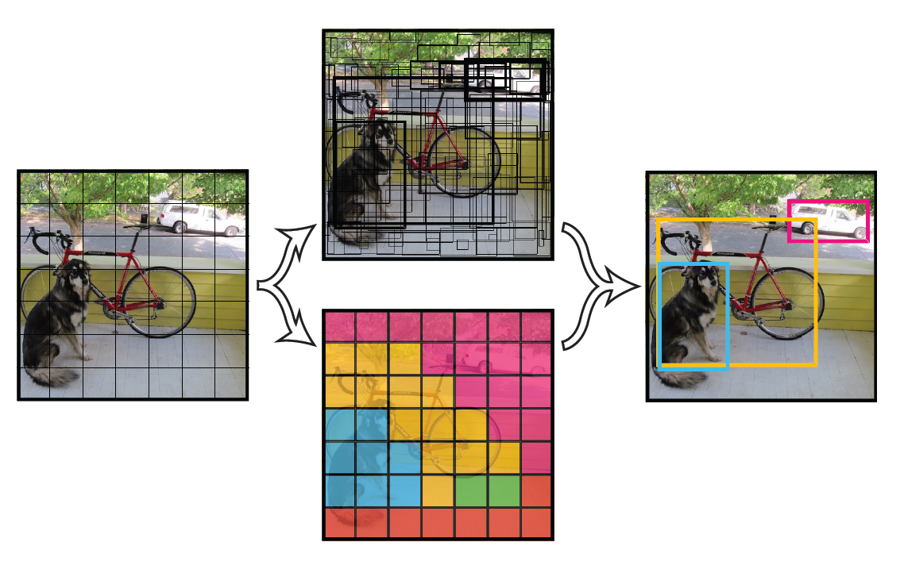

每个网格要预测B个`bounding box`（矩形框），每个`bounding box`除了要回归自身的位置之外，还要附带预测一个`confidence`值。

其中如果有object落在一个grid cell里，第一项取1，否则取0。 第二项是预测的`bounding box`和实际的`groundtruth`之间的IoU值。 

- 每个bounding box要预测(x, y, w, h)和confidence共5个值，每个网格还要预测一个类别信息，记为C类。则SxS个网格，每个网格要预测B个bounding box还要预测C个categories。输出就是`S x S x (5*B+C)`的一个[tensor](https://so.csdn.net/so/search?q=tensor&spm=1001.2101.3001.7020)。 
	注意：class信息是针对每个网格的，confidence信息是针对每个bounding box的。

# YOLOv1

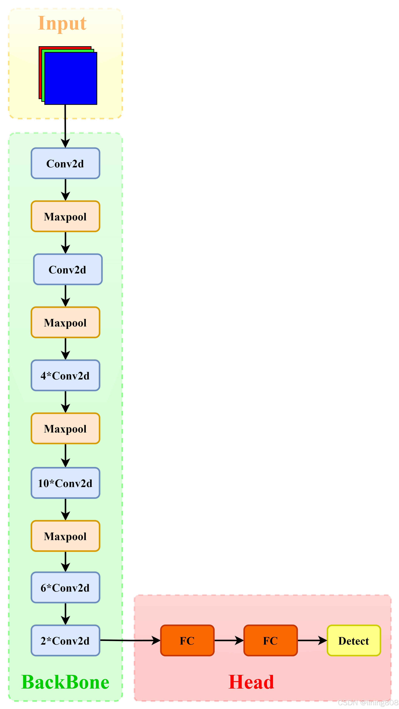

- 24个卷积 2个全连接

`输出一个7*7*30的特征图`

类似与googlenet

## 全卷积网络是如何做分类的

例如yolov1，他在最后是输出一个`7*7*30`维度的张量

~~~
[0] tx → 中心 x 偏移  
[1] ty → 中心 y 偏移  
[2] tw → 宽度缩放  
[3] th → 高度缩放  
[4] confidence → 目标存在概率（objectness）

[5] tx → 中心 x 偏移  
[6] ty → 中心 y 偏移  
[7] tw → 宽度缩放  
[8] th → 高度缩放  
[9] confidence → 目标存在概率（objectness）

后面20个都是分类置信度
~~~

## 他是如何固定维度表示固定含义的

通过定义反向传播，控制输出的张量第几个通道是什么含义（定义他的语义信息）

~~~
class YOLOLoss(nn.Module):
    def forward(self, pred, target):
        # pred: (B, 125, 13, 13)
        # target: (B, 125, 13, 13)  # 你生成，通道顺序相同

        tx_loss = F.mse_loss(pred[:, 0, :, :], target[:, 0, :, :]) 固定第0维是什么
        ty_loss = F.mse_loss(pred[:, 1, :, :], target[:, 1, :, :])
        tw_loss = F.mse_loss(pred[:, 2, :, :], target[:, 2, :, :])
        th_loss = F.mse_loss(pred[:, 3, :, :], target[:, 3, :, :])
        conf_loss = F.mse_loss(pred[:, 4, :, :], target[:, 4, :, :])

        return tx_loss + ty_loss + tw_loss + th_loss + conf_loss + ...
~~~

## 如何做到预测一张图片中的多个锚框

理论上最多可以找到 49 个框，但 实际远少于 49 个，而且 每个框不一定对应一个独立物体。

## 两个框

作者 Redmon 当年的理由是：

-   统计发现，大多数物体只需要 1~2 个框就够覆盖了（比如人和车很少完全重叠）
-   固定 2 个框是速度和精度的折中（当时如果像后来的 YOLOv5/v8 那样用 anchor 聚类 + 多个尺度，计算量会爆炸）
-   简单粗暴，实现快

### 缺点

如果一个格子里真的有 3 个以上目标（比如一群鸟、一堆行人）→ 只能预测其中 2 个 → 漏检

如果两个目标形状差异很大（一个很细长，一个很方正）→ 这 2 个框很难同时拟合好 → 定位不准

这就是后来 YOLOv2、v3、v5/v8 疯狂改进的地方（引入 anchor、多尺度、每个格子预测 3~9 个框）

## 边框归一化

### 目的：增强稳定性

### 做法

`W / Wimage`

`H / Himage`

框中心 x 坐标 ÷ 当前 grid cell 的宽度

`x = x_pred_relative × (W_image / S)`

| 符号                                          | 含义                                            | 详细解释                                                     |
| --------------------------------------------- | ----------------------------------------------- | ------------------------------------------------------------ |
| **x**                                         | 最终还原到原图上的真实中心 x 坐标（单位：像素） | 比如一张 448×448 的图，x 可能等于 235.7 像素                 |
| **x_pred_relative**（你写成 x̂ 或 x̃ 那条横线） | 网络直接预测出来的**相对值**（已经过 sigmoid）  | 取值范围 [0, 1]，表示中心点相对于当前 grid cell 左上角的偏移比例 |
| **S**                                         | 网格数量（YOLOv1 固定为 7）                     | 整张图被横竖各分成 7 份 → 7×7=49 个格子                      |
| **W_image**                                   | 输入图片的宽度（像素）                          | YOLOv1 固定输入 448×448，所以 W_image = 448                  |
| **W_image / S**                               | 每个 grid cell 的宽度（像素）                   | 448 ÷ 7 ≈ 64 像素/格子                                       |

# 核心指标

## mAP

**mean Average Precision**（平均平均精度）

- **AP (Average Precision - 平均精度)**:
	- AP 是针对**单个类别**的评估指标。
	- 它通过计算该类别下，不同置信度阈值对应的 Precision-Recall 曲线下的面积来得到。
	- 简单来说，它衡量了模型在检测某一类物体时，既准确（高 Precision）又全面（高 Recall）的程度。
- **mAP (mean Average Precision - 平均平均精度)**:
	- mAP 是所有类别 AP 的**平均值**。
	- 它综合评估了模型在**所有类别**上的整体性能。
	- 公式：`mAP = (AP_class1 + AP_class2 + ... + AP_classN) / N`

## 损失函数

-   衡量回归框的好坏

### 交并比

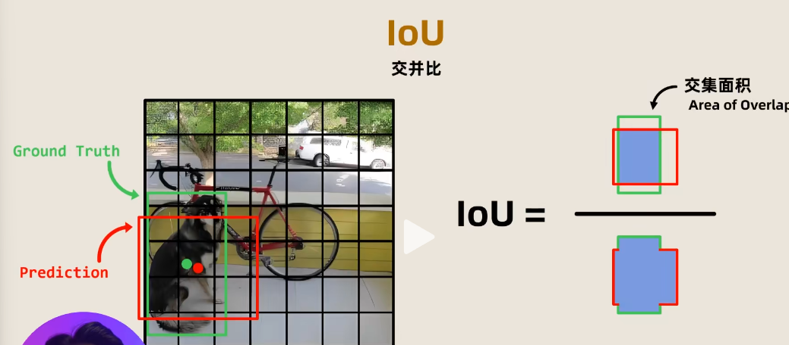

### 流程

对前十维的两个框做IOU，放弃小的IOU框

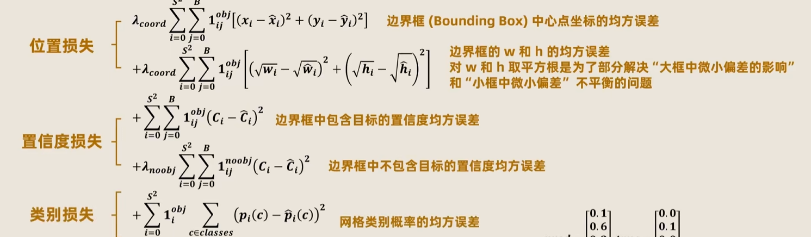

~~~
i = s*s = 7*7 = 49
B = 2
1^obj^ ij = 1 or 0

入coord = 5 放大中心点和边界框的损失影响程度（放大有物体的）

~~~

# YOLOv2 (yolo9000)

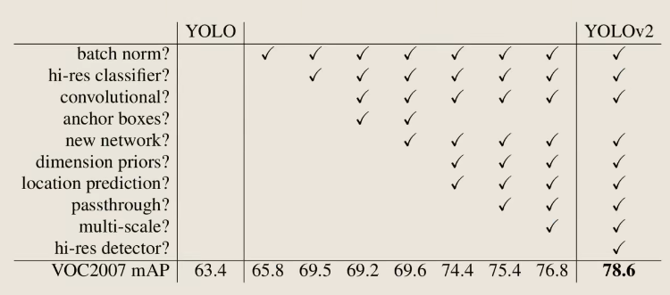

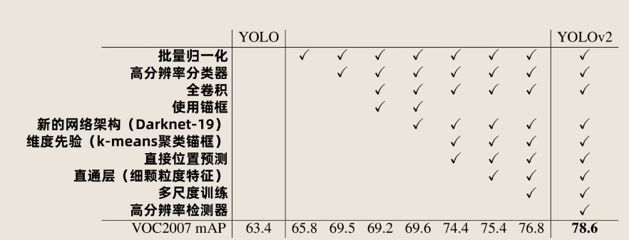

## Batch Normalization

让每一层网络的输入分布在整个训练过程中保持相对稳定，从而彻底解决深层网络“训练难、训练慢、容易梯度爆炸/消失”的问题。

### 计算

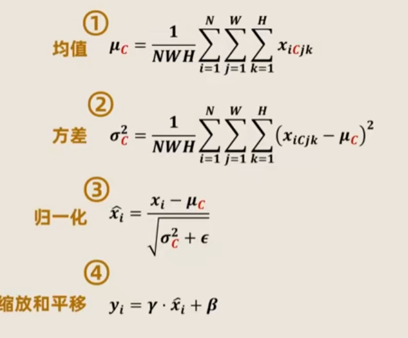

对于一张5 * 5 * 3 通道的图片，一个batch=64

1.   计算μ~c~ = 把所有通道的值加起来 / batch * H * W
2.   计算方差
3.   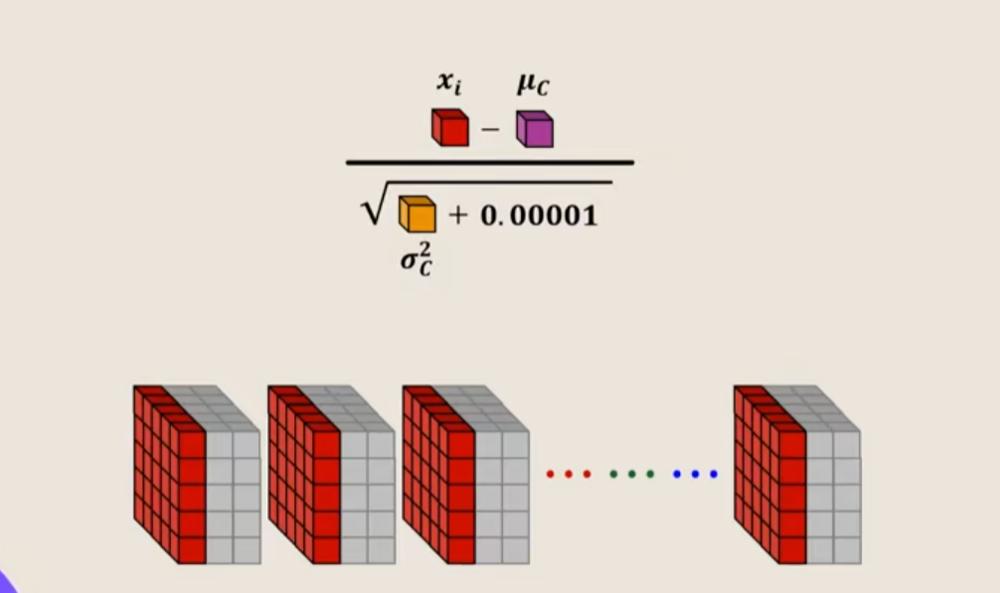

-   基于空间平移不变

    -   均值和方差是跨批次，样本共享更新的

    

## 预训练，高分类器训练

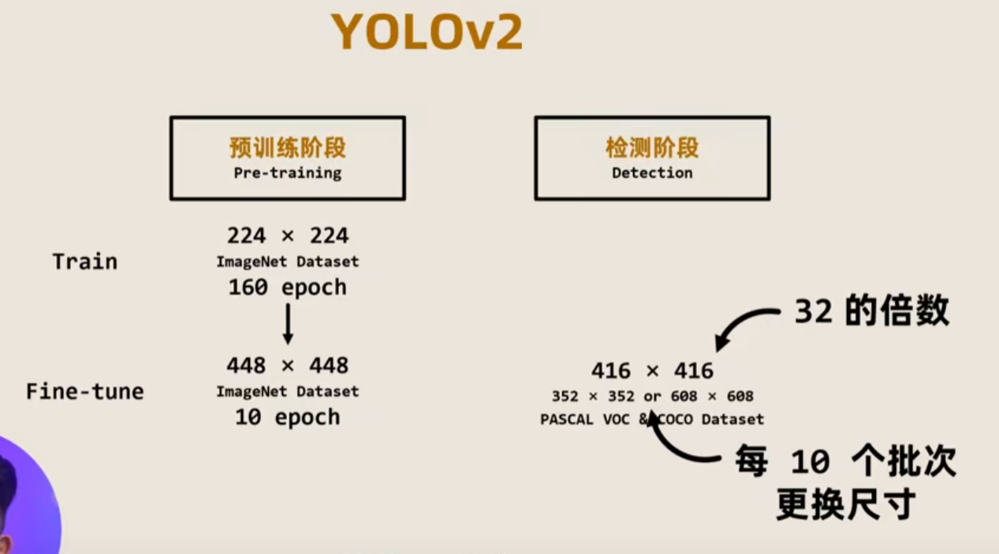

多尺度训练

为什么要变成32的倍数

直通层，完成浅层高分辨率特征和深层低分辨率特征的一种融合方法

### 直通层

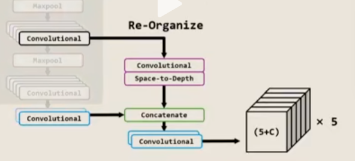

 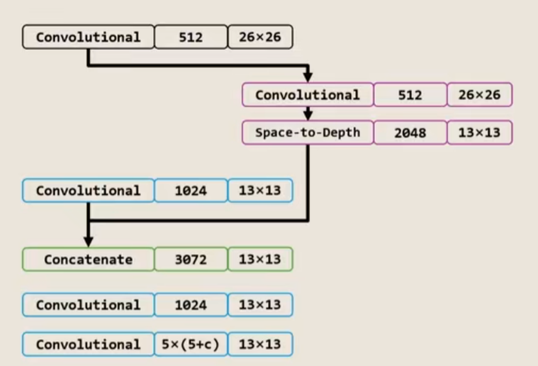

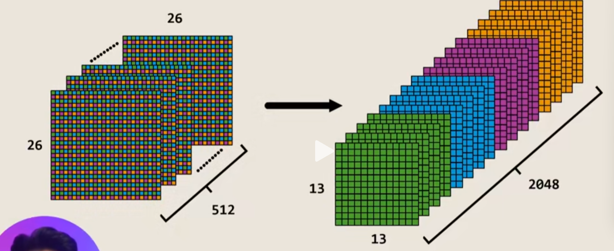

### FIne-Grained Features细颗粒度特征

解决小目标检测低

## 输出`13*13*5*（5+c）`

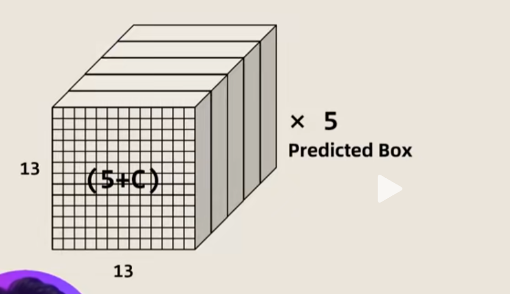

13*13每个网格都能给出五个预测框

### 5+c

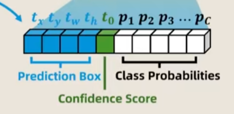

## 锚框的选择

通过对GT的锚框做k-means分析得知

k = 5

锚框可以被分为五类，在做预测时，从这五类选一个合适的

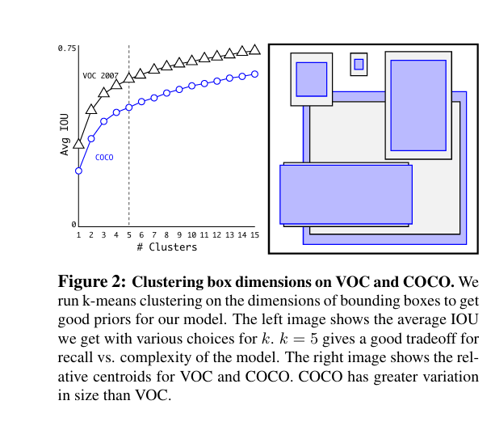

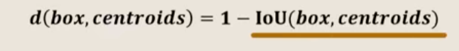

# YOLOv3

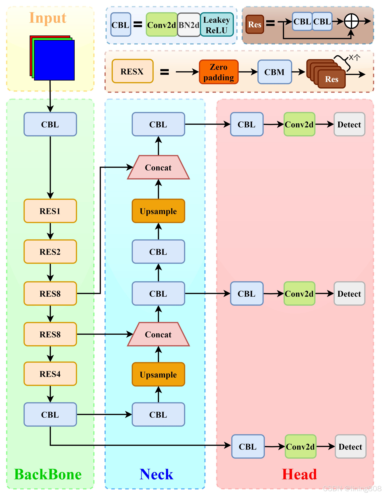

-   53个卷积
-   引入残差结构residual
-   使用卷积替代池化

## CBL

~~~
conv + BN + LeakyRelu
~~~

## 上采样

-   目的：放大特征图的分辨率

`最近邻插值` 

复制最近的像素值

`双线性插值`

取左右两边的平均

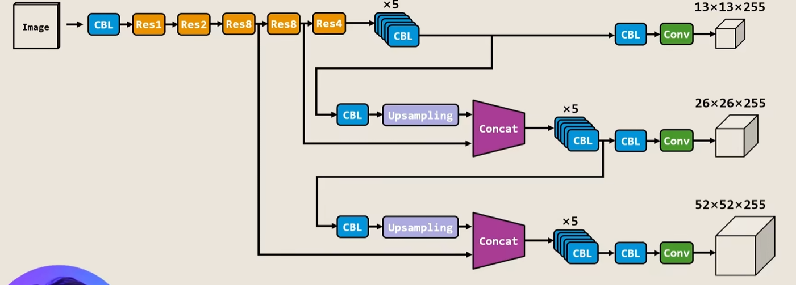

输出三种不同尺寸的特征图

## NECK Feature Pyramid Network特征金字塔

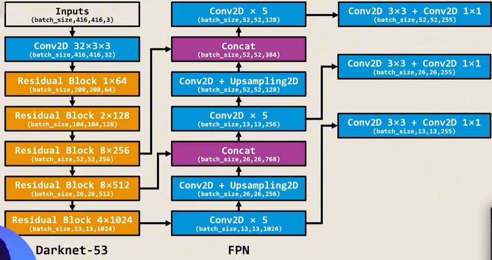

-   构建了从上到下的路径，将网络深层中的强语义信息，传递到浅层精细特征

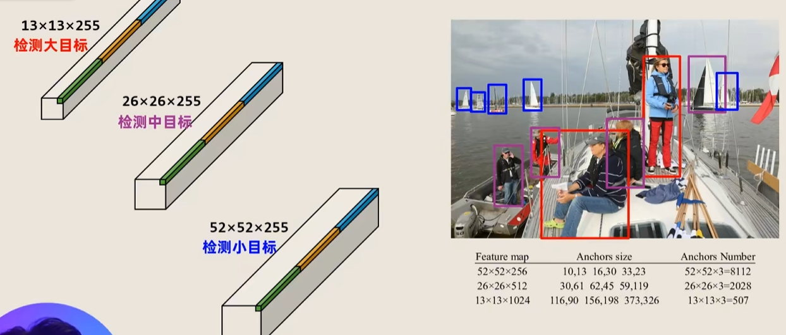

解决小目标检测差的问题

# 先验锚框

| 版本                        | 是否使用 Anchor  | 关键变化与原因                                               |
| --------------------------- | ---------------- | ------------------------------------------------------------ |
| **YOLOv1-v5** (2016-2020)   | 是（从 v2 开始） | 使用 k-means 聚类生成 anchor，提高多尺度检测效率，但 anchor 需手动/自动优化，泛化性差。 |
| **YOLOv6-v7** (2022)        | 是（部分）       | 仍依赖 anchor，但引入更多自动化（如 auto-anchor）。          |
| **YOLOv8** (2023)           | **否**           | 首次全面 anchor-free，直接预测对象中心点 + 宽高偏移，简化模型、提升精度和速度。 |
| **YOLOv9-v10** (2024)       | **否**           | 继承 v8 设计，进一步优化（如 GELAN 骨干），anchor-free 已成为主流。 |
| **YOLOv11** (2024 年 10 月) | **否**           | 强化 anchor-free，支持更灵活的边界框生成，尤其对小/不规则物体友好。 |
