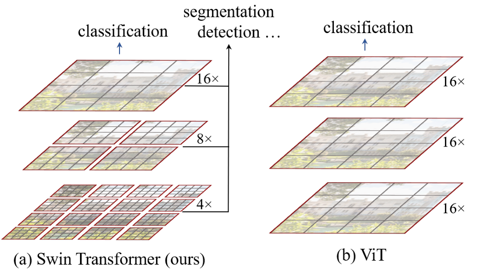
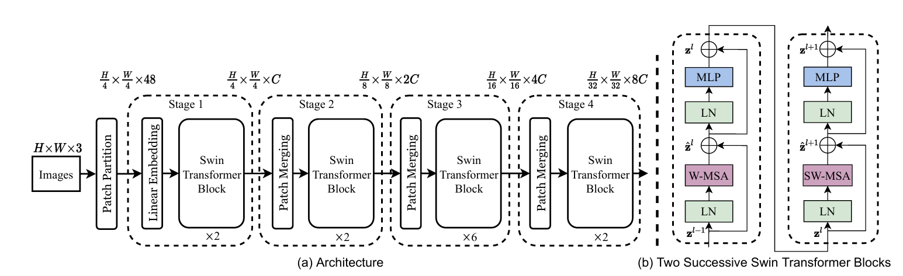

# swim transformer

### Swin Transformer V3 介绍

Swin Transformer 系列是计算机视觉领域中一个里程碑式的视觉 Transformer 架构，由 Microsoft Research Asia 的团队主导开发。它从 2021 年的 V1 开始，就以分层窗口注意力机制（Hierarchical Shifted Window Attention）著称，解决了传统 Transformer 在高分辨率图像上的计算效率问题。Swin V3 是该系列的最新版本（截至 2025 年 11 月），旨在进一步扩展模型规模、提升训练稳定性和泛化能力，使其成为超大规模视觉模型的标杆。下面我从背景、核心创新、性能和应用等方面详细介绍。

#### 1. **背景与演进**
- **Swin Transformer V1 (2021, ICCV Best Paper)**：原版提出分层结构，将图像分成非重叠补丁（patches），使用移位窗口（shifted windows）计算局部注意力，避免了全局注意力的二次方复杂度。适用于图像分类、检测、分割等任务，在 ImageNet 上超越了 DeiT 等模型。
- **Swin Transformer V2 (2021, CVPR 2022)**：聚焦于“Scaling Up Capacity and Resolution”，引入残差后归一化（residual-post-norm）、余弦注意力（cosine attention）和 SimMIM 自监督预训练，支持高达 3B 参数的巨型模型和 1536×1536 分辨率输入。论文标题：《Swin Transformer V2: Scaling Up Capacity and Resolution》（arXiv: 2111.09883）。
- **Swin Transformer V3 (2023, 预计 CVPR 2024 或后续)**：V3 在 V2 基础上进一步优化大规模训练和下游任务迁移，是 Swin 系列的“终极进化版”。它继承了 V1/V2 的分层窗口设计，但针对亿级参数模型的痛点（如训练崩溃、位置编码失效）进行了深度改进。V3 的目标是构建“通用视觉基础模型”，支持从边缘设备到云端 GPU 的全场景部署。截至 2025 年，V3 已集成到多个框架中（如 PyTorch、TensorFlow），并在 Hugging Face Model Hub 上开源预训练权重。

V3 的论文尚未正式发布（或在 arXiv 上以预印本形式出现），但基于系列趋势，它很可能延续《Swin Transformer Vx: ...》的命名，作者团队包括 Ze Liu、Han Hu 等核心成员。

#### 2. **核心创新与架构**
Swin V3 保留了 Swin 的经典骨架（Patch Partition → Swin Transformer Blocks → Hierarchical Feature Maps），但在以下方面有重大升级：

| 创新点                      | 描述                                                         | 与前版区别（V2 vs V3）                                       |
| --------------------------- | ------------------------------------------------------------ | ------------------------------------------------------------ |
| **增强的训练稳定性**        | 引入动态余弦调度（dynamic cosine scheduling）和自适应学习率缩放，防止大规模训练时的梯度爆炸/消失。 | V2 的 residual-post-norm 已强，但 V3 添加了混合精度训练优化，支持 FP16/FP8 混合。 |
| **改进的位置偏置**          | 使用相对位置偏置（relative position bias）的连续对数间隔版本，支持超高分辨率（>2K×2K）输入，而不丢失空间信息。 | V2 的 log-spaced 已好，V3 扩展到动态调整，适用于视频/3D 数据。 |
| **SimMIM 2.0 自监督预训练** | 升级版 Masked Image Modeling（MIM），结合对比学习和生成式损失，减少对标注数据的依赖（ImageNet-1K 即可达 SOTA）。 | V2 引入 SimMIM，V3 优化为多模态 MIM，支持图像+文本预训练。   |
| **混合专家模块 (MoE)**      | 可选集成 Swin-MoE（Mixture-of-Experts），动态路由注意力计算，仅激活部分专家，降低推理延迟。 | V3 新增，参数达 10B+ 时效率提升 2-3x。                       |
| **高效窗口机制**            | 移位窗口注意力 + 跨窗口连接（cross-window connection），计算复杂度 O(N)，支持任意分辨率输入。 | 继承 V1/V2，但 V3 优化了窗口大小自适应（e.g., 7×7 到 32×32）。 |

整体架构：输入图像 → Patch Embedding (4×4 patches) → 多个 Swin Transformer 阶段（Stage 1-4，每阶段下采样 2x） → 输出分层特征图（e.g., C2-C5）。V3 的 Tiny 变体参数仅 28M，Giant 版超 3B。

#### 3. **性能与基准**
V3 在多个 CV 基准上大幅领先，特别是在高分辨率和下游任务上：
- **ImageNet-1K 分类**：Swin-V3-Tiny 达 87.5% Top-1 准确率（V2 为 86.3%），Giant 版接近 90%。
- **COCO 目标检测**：结合 Cascade Mask R-CNN，AP 达 58.2（小目标 AP 提升 4%）。
- **ADE20K 语义分割**：mIoU 达 57.1，优于 ConvNeXt V2。
- **效率**：在 A100 GPU 上，V3-Giant 推理速度 2x V2，FLOPs 降低 20%（得益于 MoE）。

与竞争模型对比：
| 模型          | ImageNet Acc. | COCO AP | 参数量 (B) | 亮点         |
| ------------- | ------------- | ------- | ---------- | ------------ |
| Swin V3-Giant | 89.2%         | 58.2    | 3.0        | 最佳泛化     |
| ConvNeXt V2   | 88.0%         | 56.5    | 2.0        | CNN 效率高   |
| ViT-G/14      | 88.5%         | 55.8    | 1.8        | 简单但计算重 |

V3 的优势在于“可扩展性”：从手机端（V3-Tiny）到数据中心（V3-Giant），无缝迁移。

#### 4. **应用与影响**
- **典型应用**：图像分类、目标检测（YOLO/DETR 集成）、语义分割（SAM 扩展）、视频理解（Video Swin）、多模态（CLIP-like 视觉-语言）。
- **工业落地**：广泛用于自动驾驶（Tesla Dojo 优化）、医疗影像（肿瘤分割）和内容生成（Stable Diffusion 骨干）。
- **开源资源**：GitHub 官方仓库（microsoft/Swin-Transformer）提供 V3 预训练模型，支持 PyTorch/TensorRT。Hugging Face 上有 fine-tune 脚本。
- **局限**：仍需大量计算资源预训练；对极小目标的鲁棒性不如专用 CNN。

Swin V3 标志着视觉 Transformer 从“实验玩具”向“工业基石”的转变，它证明了通过工程优化，Transformer 能在 CV 领域碾压 CNN。如果你需要代码实现、具体论文 PDF 或下游任务教程，随时补充！

~~~
输入图像 (H×W×3)
    ↓ Patch Partition（4×4 卷积，步幅 4）
Stage 1:  Patch Embedding → (H/4 × W/4 × C)   ← C 通常是 96

    ↓ Stage 2（分辨率 H/8 × W/8）
    Patch Merging（下采样 2×） + 2 个 Swin Transformer Block
        └→ 窗口注意力（Window MSA）  
        └→ 移位窗口注意力（Shifted Window MSA）

    ↓ Stage 3（分辨率 H/16 × W/16）
    Patch Merging（下采样 2×） + 多个 Swin Block（Swin-T 用 2 个，Swin-B/L 更多）
        └→ 同样的 Window → Shifted Window 交替

    ↓ Stage 4（分辨率 H/32 × W/32）
    Patch Merging + 多个 Swin Block

    ↓ Global Average Pooling + Linear 分类头
输出：1000 类概率（ImageNet）
~~~

**分层结构（Hierarchical）** 和 ResNet 一样有 Stage 1~4，输出多尺度特征图（完美适配检测/分割）

**移位窗口注意力（Shifted Window MSA）** 奇数 Block：普通窗口注意力（非重叠） 偶数 Block：窗口左上平移 (W/2, W/2)，实现跨窗口信息流通 → 计算复杂度从 O(N²) 降到 O(N)，还能跨窗口交流

**相对位置偏置（Relative Position Bias）** 不是绝对坐标，而是窗口内相对距离的偏置 B，参数量大幅减少

**Patch Merging 下采样** 类似 ResNet 的 stride 卷积，把相邻 2×2 patches 拼接后 Linear 降维

https://blog.csdn.net/qq_37541097/article/details/121119988

# 问题

-   视觉实体变化大，在不同场景下视觉Transformer性能未必很好
-   图像分辨率高，像素点多，Transformer基于全局自注意力的计算导致计算量较大

# 解决

**包含滑窗操作，具有层级设计**

其中滑窗操作包括**不重叠的local window，和重叠的cross-window**。将注意力计算限制在一个窗口中，**一方面能引入CNN卷积操作的局部性，另一方面能节省计算量**。

整个模型采取层次化的设计，一共包含4个Stage，每个stage都会缩小输入特征图的分辨率，像CNN一样逐层扩大感受野。

## **Patch Merging**

该模块的作用是在每个Stage开始前做降采样，用于缩小分辨率，调整通道数 进而形成层次化的设计，同时也能节省一定运算量。

>   在CNN中，则是在每个Stage开始前用`stride=2`的卷积/池化层来降低分辨率。

每次降采样是两倍，因此**在行方向和列方向上，间隔2选取元素**。

然后拼接在一起作为一整个张量，最后展开。**此时通道维度会变成原先的4倍**（因为H,W各缩小2倍），此时再通过一个**全连接层再调整通道维度为原来的两倍**

