[yolov5深度学习环境的配置_哔哩哔哩_bilibili](https://www.bilibili.com/video/BV1uC4y197d3/?vd_source=a2ca28b5d43fd5bb97f1927ca5a7f26f)

> 后面换成这个了:
>
> [6. 6Windows系统上训练PASCAL VOC数据集._哔哩哔哩_bilibili](https://www.bilibili.com/video/BV1rt4y1W7Dc?p=6&vd_source=79043f2a8efe4672df69e4818fe876b8)
>
> > 只看到配置环境，配置数据集没看

## 环境配置

### 安装`Anaconda`

> 就是可以便捷获取包且对包能够进行管理，同时对环境可以统一管理的发行版本。

> 学习资源：
>
> [anaconda的安装和使用（管理python环境看这一篇就够了）-CSDN博客](https://blog.csdn.net/tqlisno1/article/details/108908775)
>
> > 这里有能换成国内源的方法

- 查看和创建环境：

  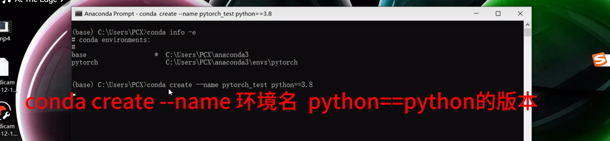

- 切换环境：

  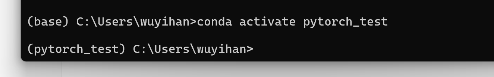


### 安装`pytorch`

> 下得巨慢，遇到连接失败，可以关掉梯子多试几次


### 显卡驱动配置

> 这里就不是GPU版本了，这里本电脑有独立显卡，就用这个了

[6. 6Windows系统上训练PASCAL VOC数据集._哔哩哔哩_bilibili](https://www.bilibili.com/video/BV1rt4y1W7Dc?p=6&vd_source=79043f2a8efe4672df69e4818fe876b8)

> 还能参考下这个：[（带你避坑）win10安装带CUDA的Pytorch看这篇就够了_torch自带cuda-CSDN博客](https://blog.csdn.net/aquapisces/article/details/121040096)

> 了解：[一句话讲清楚什么是CUDA，人人都能听懂的CUDA概念_cuda是什么,电脑只有cpu用不了对吧-CSDN博客](https://blog.csdn.net/qq_39570621/article/details/135697696)

> 这里没搞环境变量对应3分钟左右

> 新版本`cudnn`不用再装了


> 小插曲：
>
> 出现问题：[【已解决】nvcc fatal : No input files specified； use option --help for more information_nvcc fatal : no input files specified; use option -CSDN博客](https://blog.csdn.net/BetrayFree/article/details/134866627)
>


测试结果：

```sh
nvcc -V
```


## YOLOv5

> 下面的路径一律用的相对项目的根目录的路径


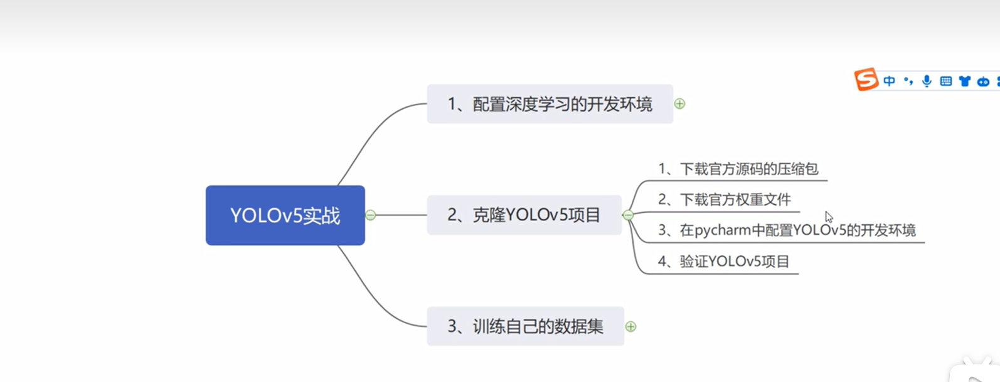


### `YOLOv5`配置

> 跟着大部分跟着视频走就行

- 拉取`YOLOv5`项目

​	[ultralytics/yolov5: YOLOv5 🚀 in PyTorch > ONNX > CoreML > TFLite (github.com)](https://github.com/ultralytics/yolov5)


- 在`pycharm`中配置`conda`环境

  > 版本问题可能会找不到：
  > [pycharm配置anaconda环境时找不到python.exe解决办法_anaconda 环境 tools 没有python.exe-CSDN博客](https://blog.csdn.net/ytusdc/article/details/137782055)

  `pip install requirements.txt`:安装依赖时

  > 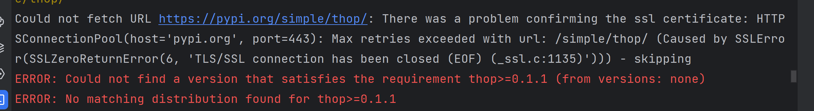
  >
  > 出现ssl相关的问题，下载不了部分依赖
  >
  > 这里是通过换源解决的：
  >
  > ```sh
  > pip install -r requirements.txt -i http://mirrors.aliyun.com/pypi/simple/ --trusted-host mirrors.aliyun.com
  > ```
  >
  > > 换成了阿里的源就行了
  >
  > > 参考：[【日常踩坑】解决 pip 安装第三方包时因 SSL 报错_pip ssl-CSDN博客](https://blog.csdn.net/CoolBoySilverBullet/article/details/123365452)
  >
  
  
  
  > 到这里已经能正常运行了
  
  
  
  
  
  ### 下载权重文件
  
  
  
  
  
  > 感觉就是一个加速处理的东西，那些参数跟最后的效果是有关系的
  >
  > 特征少的无所谓，特征多的用大的就行
  
  > 似乎是需要跟版本想对应的
  
  > 了解：[深入理解YOLOv5预训练权重文件(.pth)：提升模型性能的利器-百度开发者中心 (baidu.com)](https://developer.baidu.com/article/detail.html?id=3336348)
  
  > 往下拉：说明文档会有的，这里是新版的需要额外下载
  
  > 放的位置：
  >
  > 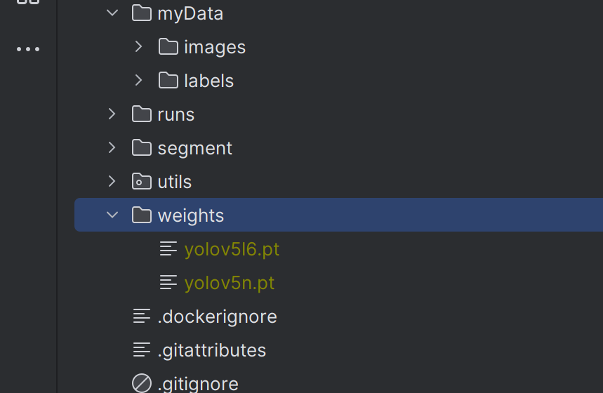
  >
  > 
  
  
  
  - 测试（命令行）：
  
    ```sh
    python detect.py --source 需要处理的图片的文件夹|单个图片|视频|网络来源也行的路径 --weights 权重文件的路径 --conf 置信度的值
    ```
  
    > 需要操作超过这个置信度才能显示出来
  
    例子：
  
    ```sh
    python detect.py --source ./data/images --weights weights/yolov5l6.pt --conf 0.4
    python detect.py --source ./data/images --weights weights/yolov5n.pt --conf 0.4
    # 需要时间最短，但是效果一般的
    python detect.py --source ./data/images --weights weights/yolov5x.pt --conf 0.4
    ```
  
    > 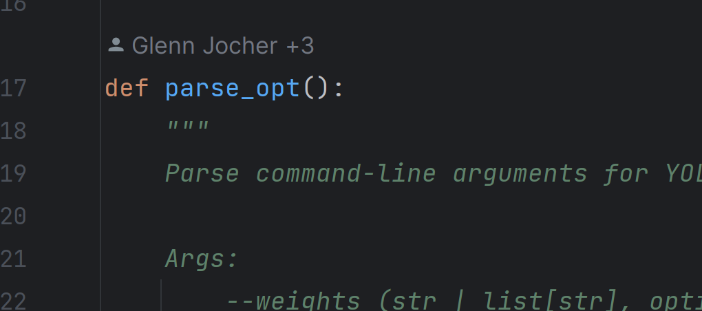
    >
    > > 这个方法可以看到各种参数的设置
  
  
  
  


~~~~
    parser = argparse.ArgumentParser()
    parser.add_argument("--weights", nargs="+", type=str, default=ROOT / "yolov5s-seg.pt", help="model path(s)") # 权重选择
    parser.add_argument("--source", type=str, default=ROOT / "data/images", help="file/dir/URL/glob/screen/0(webcam)")
    parser.add_argument("--data", type=str, default=ROOT / "data/coco128.yaml", help="(optional) dataset.yaml path")
    parser.add_argument("--imgsz", "--img", "--img-size", nargs="+", type=int, default=[640], help="inference size h,w")
    parser.add_argument("--conf-thres", type=float, default=0.25, help="confidence threshold")
    	# 置信度大于0.25显示
    parser.add_argument("--iou-thres", type=float, default=0.45, help="NMS IoU threshold")
    parser.add_argument("--max-det", type=int, default=1000, help="maximum detections per image")
    parser.add_argument("--device", default="", help="cuda device, i.e. 0 or 0,1,2,3 or cpu")
    parser.add_argument("--view-img", action="store_true", help="show results")
    # 实时显示
    parser.add_argument("--save-txt", action="store_true", help="save results to *.txt")
    parser.add_argument("--save-conf", action="store_true", help="save confidences in --save-txt labels")
    parser.add_argument("--save-crop", action="store_true", help="save cropped prediction boxes")
    parser.add_argument("--nosave", action="store_true", help="do not save images/videos")
    parser.add_argument("--classes", nargs="+", type=int, help="filter by class: --classes 0, or --classes 0 2 3")
    parser.add_argument("--agnostic-nms", action="store_true", help="class-agnostic NMS")
    parser.add_argument("--augment", action="store_true", help="augmented inference")
    parser.add_argument("--visualize", action="store_true", help="visualize features")
    parser.add_argument("--update", action="store_true", help="update all models")
    parser.add_argument("--project", default=ROOT / "runs/predict-seg", help="save results to project/name")
    parser.add_argument("--name", default="exp", help="save results to project/name")
    parser.add_argument("--exist-ok", action="store_true", help="existing project/name ok, do not increment")
    parser.add_argument("--line-thickness", default=3, type=int, help="bounding box thickness (pixels)")
    parser.add_argument("--hide-labels", default=False, action="store_true", help="hide labels")
    parser.add_argument("--hide-conf", default=False, action="store_true", help="hide confidences")
    parser.add_argument("--half", action="store_true", help="use FP16 half-precision inference")
    parser.add_argument("--dnn", action="store_true", help="use OpenCV DNN for ONNX inference")
    parser.add_argument("--vid-stride", type=int, default=1, help="video frame-rate stride")
    parser.add_argument("--retina-masks", action="store_true", help="whether to plot masks in native resolution")
    opt = parser.parse_args()
    opt.imgsz *= 2 if len(opt.imgsz) == 1 else 1  # expand
    print_args(vars(opt))
    return opt
~~~~


### 训练数据集

> 这里跟的视频：[[yolov5小白训练教程\]0基础教学，训练自己的数据集，详细教学_哔哩哔哩_bilibili](https://www.bilibili.com/video/BV1f94y1R7a4/?vd_source=a2ca28b5d43fd5bb97f1927ca5a7f26f)
>
> 这里讲的比之前的好

#### 收集数据集

> 有具体要求的

#### 使用labelimg制作数据集


- 找下训练图片和新建对应的文件夹

  

  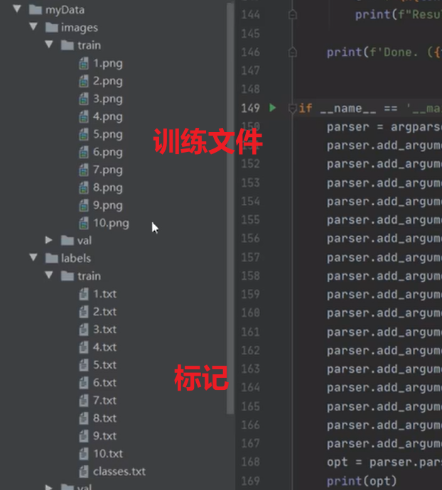

  > 下面的val是用来验证的


- `pip install labelimg`下载对图像打标记的包

  下载后打开工具（命令行输入）：`labelimg`

  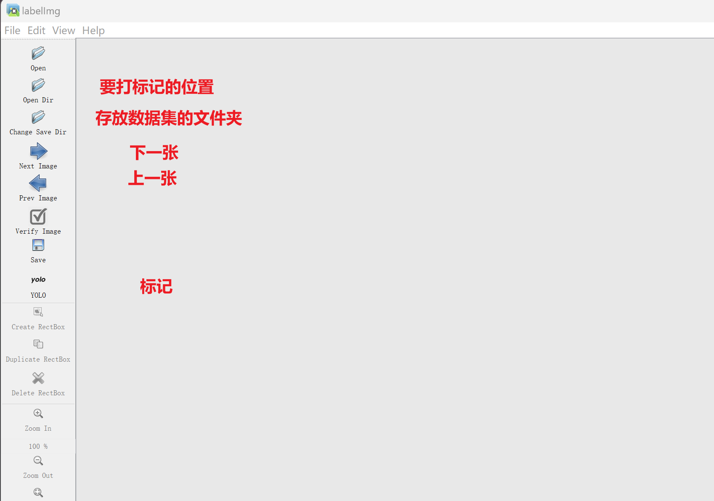

  标注功能：

  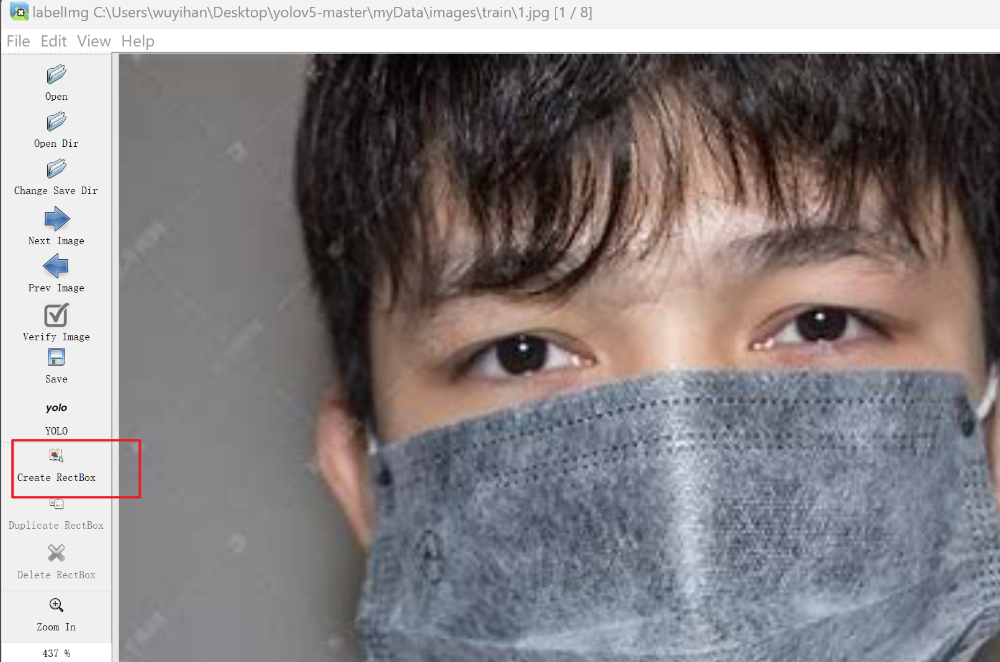

  > 打上分类，记得保存

  

> `train`:是用来训练的
>
> `val`:是用来验证的
>
> > 在识别的过程中测试


>  打标签对应的东西：
>
> 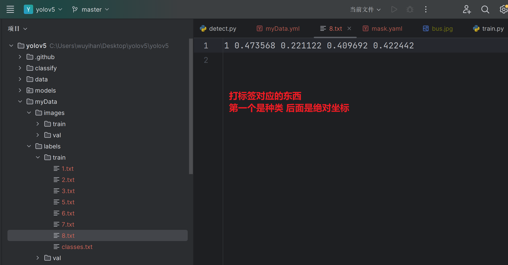
>
> > 坐标单位是百分比：
> >
> > 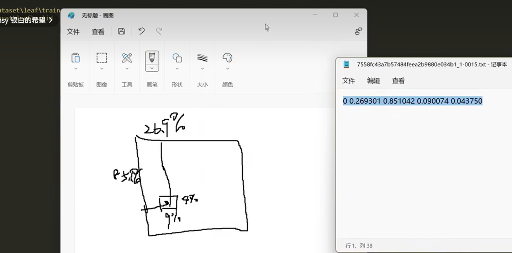

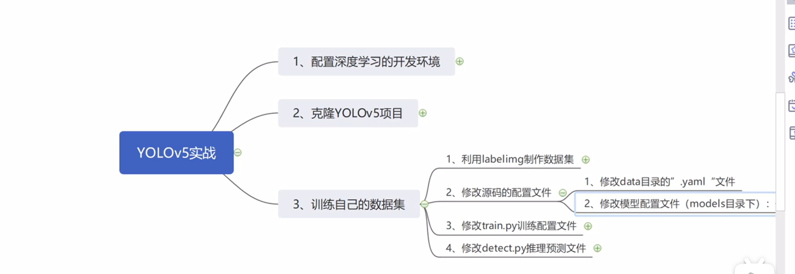

#### 修改配置文件

> 这里不跟一开始的视频了，感觉讲得特别混乱

> 原来的位置在这里：（可以仿照这里）
>
> 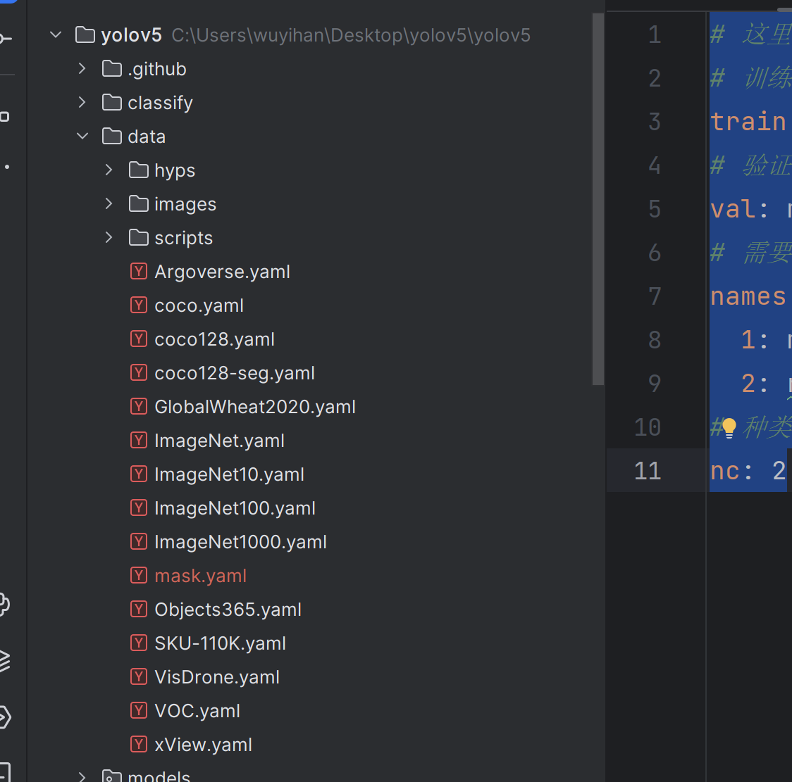

> 这个文件是必须的:
>
> 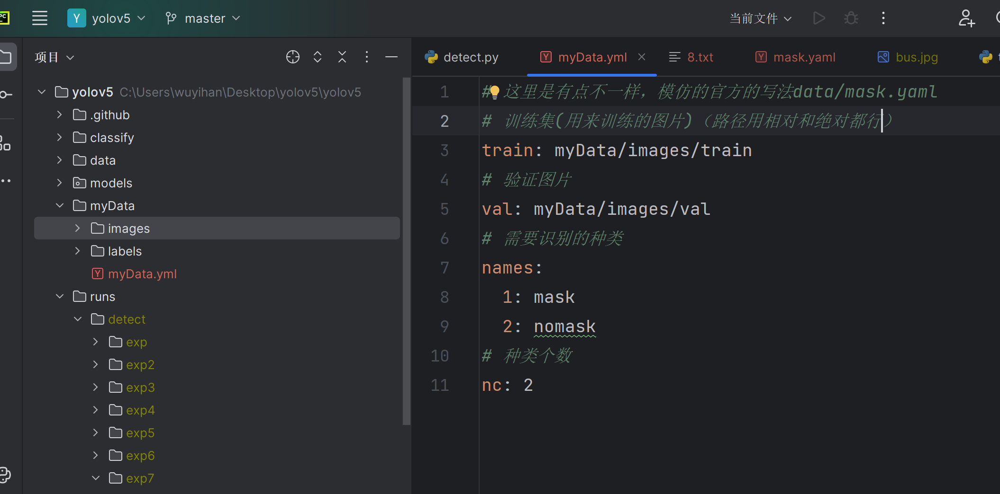

```yaml
# 这里是有点不一样，模仿的官方的写法data/mask.yaml
# 训练集(用来训练的图片)（路径用相对和绝对都行）
train: myData/images/train
# 验证图片
val: myData/images/val
# 需要识别的种类
names:
  0: mask
  1: nomask
# 种类个数
nc: 2
```

> 小心了，是从0开始了


#### 修改`train.py`训练的配置：

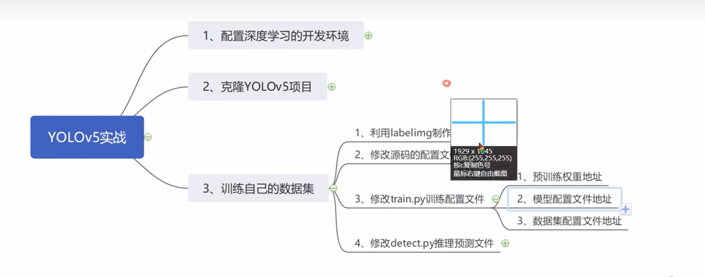

> 各种参数对应的代码：
>
> 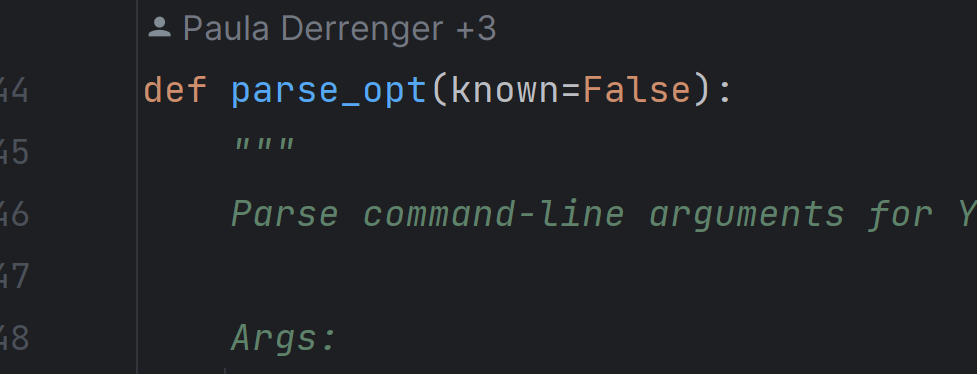


训练数据集代码：

```sh
python train.py --batch-size 4  --epochs 200 --data myData/myData.yaml --weights weights/yolov5x.pt
```

> - `epches`:训练轮数
>
> - `batch-size`:单词训练多少张（跟内存有关系，16GB可能不够）
>
>   > 这种很耗内存
>
> - `weights`：使用的权重文件

> 注意：**训练轮数一定要够，不能太少，否则可能出现`no detections`，识别不出来**

> 训练结果/进度：
>
> 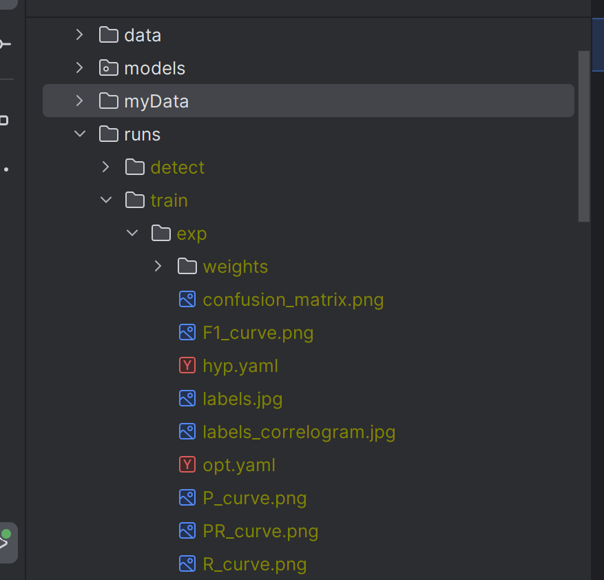
>
> 训练的好坏：
>
> > up说看这个文件：
> >
> > 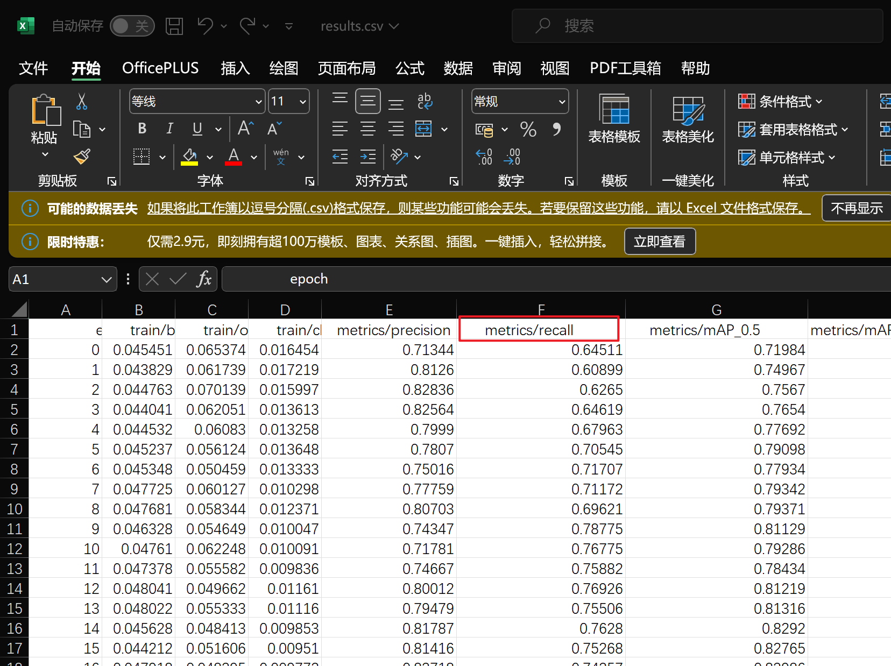


> 训练出来的权重文件：
>
> 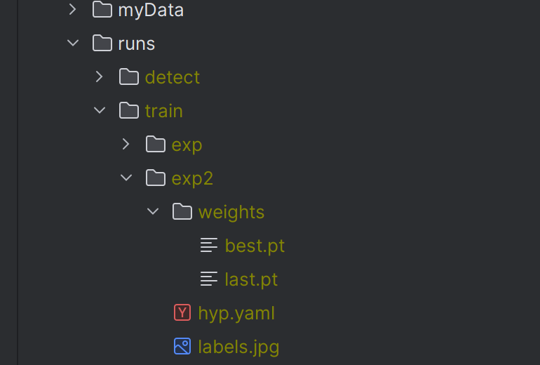

```
python train.py --batch-size 4  --epochs 300 --data dataset/dataset.yaml
python train.py --batch-size 8  --epochs 400 --data dataset/dataset.yaml --weights weights/yolov5x.pt

python train.py --batch-size 8  --epochs 400 --data dataset/person/person.yaml --weights weights/yolov5x.pt

python train.py --batch-size 4  --epochs 400 --data now_myData/class.yaml --weights weights/yolov5x.pt


```

##### 中断后继续训练

> 调个参数就行了
>
> [Yolov5如何在训练意外中断后接续训练_yolo训练可以中途停止吗-CSDN博客](https://blog.csdn.net/ShakalakaPHD/article/details/120635894)


#### 测试

```
python .\detect.py --source 需要检测的数据集位置 --weights 训练好的权重文件
```

```
python .\detect.py --source myData/images/train/1.jpg --weights runs/train/exp2/weights/best.pt
```

```sh
python .\detect.py --source myData/images/train --weights C:\Users\wuyihan\Desktop\yolov5\yolov5\runs\train\exp14\weights\best.pt

python .\detect.py --source test --weights C:\Users\wuyihan\Desktop\yolov5\yolov5\runs\train\exp26\weights\best.pt


# 下面这个效果特别好
python .\detect.py --source test --weights weights/crowdhuman_vbody_yolov5m.pt
python .\detect.py --source test --weights weights/crowdhuman_vbody_yolov5m.pt --save-json
python .\detect.py --source 0 --weights weights/crowdhuman_vbody_yolov5m.pt --save-txt --vid-stride 100


# 别人训练的模型
python .\detect.py --source test --weights weights/exp5_yolov5x/weights/best.pt
```

#### 评判训练结果的好坏

> [（超详细）YOLOv5训练出结果，如何分析结果的性能分析_yolov5训练结果分析-CSDN博客](https://blog.csdn.net/qq_44421796/article/details/135151535)
>
> [YOLOv5性能评估指标-＞mAP、Precision、Recall、FPS、Confienc (讲解论文关注的主要指标)_yolov5目标检测模型评估指标-CSDN博客](https://blog.csdn.net/java1314777/article/details/135120684)
>
> > 实话

> GPT:
>
> 再`result.csv`文件中有这几个参数：
>
> ```
>   epoch,      train/box_loss,      train/obj_loss,      train/cls_loss,   metrics/precision,      metrics/recall,     metrics/mAP_0.5,metrics/mAP_0.5:0.95,        val/box_loss,        val/obj_loss,        val/cls_loss,               x/lr0,               x/lr1,               x/lr2
> ```
>
> 针对不同的参数，一般情况下，以下规则适用：
>
> 1. **损失值（box_loss, obj_loss, cls_loss）**：
>    - 这些损失值通常是越低越好，因为它们表示模型在训练过程中的预测误差。因此，随着训练的进行，这些损失值应该逐渐降低。
>
> 2. **性能指标（precision, recall, mAP）**：
>    - **Precision（精确率）**：Precision的取值范围是0到1之间，值越接近1表示模型预测为正例的样本中真正正例的比例越高，因此越大越好。
>    - **Recall（召回率）**：Recall的取值范围也是0到1之间，值越接近1表示模型正确捕获到的正例占总正例的比例越高，因此越大越好。
>    - **mAP（平均精度均值）**：mAP的取值范围也是0到1之间，值越高表示模型的目标检测性能越好，因此越大越好。
>
> 3. **学习率（lr0, lr1, lr2）**：
>    - 学习率的大小直接影响模型的训练效果，通常需要根据具体情况来确定。学习率过大可能导致训练不稳定，学习率过小可能导致收敛缓慢。
>
> 综合来看，对于损失值，希望其越小越好；而对于性能指标，如Precision、Recall和mAP，希望其越大越好。至于学习率，需要根据具体情况来调整，通常希望在训练过程中保持适当的大小以促进模型的收敛和学习。


#### 参数设置：

> GPT:
>
> 这是 YOLOv5 推理过程中的一些关键参数说明：
>
> 1. **weights (str | Path)**: 模型权重文件的路径，默认为 `yolov5s.pt`。可以指定你训练的模型文件路径。
>    
> 2. **source (str | Path)**: 输入数据的来源。可以是文件、目录、URL、屏幕捕捉、或者摄像头索引。
>
> 3. **data (str | Path)**: 数据集的配置文件路径，默认为 `data/coco128.yaml`，该文件指定了标签和类别等信息。
>
> 4. **imgsz (tuple[int, int])**: 推理图像的大小，默认是 `(640, 640)`。可以根据需求调整图像尺寸。
>
> 5. **conf_thres (float)**: 置信度阈值。低于此值的检测将被忽略，默认值为 `0.25`。
>
> 6. **iou_thres (float)**: Non-Max Suppression (NMS) 的 IOU 阈值，用于抑制重叠的检测框，默认是 `0.45`。
>
> 7. **max_det (int)**: 每张图像最大的检测数量，默认是 `1000`。
>
> 8. **device (str)**: 指定运行设备，可以是 GPU（如 `'0'`）或 `'cpu'`。默认是自动选择最佳设备。
>
> 9. **view_img (bool)**: 如果设置为 `True`，使用 OpenCV 显示推理结果。默认是 `False`。
>
> 10. **save_txt (bool)**: 如果设置为 `True`，将检测结果以文本文件保存。默认是 `False`。
>
>     > 可能用到
>
> 11. **save_csv (bool)**: 如果设置为 `True`，将结果保存为 CSV 文件。默认是 `False`。
>
> 12. **save_conf (bool)**: 保存结果时包含置信度分数，默认是 `False`。
>
> 13. **save_crop (bool)**: 如果设置为 `True`，保存裁剪后的预测框。默认是 `False`。
>
>     > 这个可能用到
>
> 14. **nosave (bool)**: 如果设置为 `True`，不保存推理的图像或视频。默认是 `False`。
>
> 15. **classes (list[int])**: 过滤特定类别的检测，通过指定类别索引实现，默认是 `None`。
>
>     > 可能
>
> 16. **agnostic_nms (bool)**: 如果设置为 `True`，执行类别无关的 NMS（忽略类别）。默认是 `False`。
>
> 17. **augment (bool)**: 如果设置为 `True`，使用增强推理。默认是 `False`。
>
> 18. **visualize (bool)**: 如果设置为 `True`，可视化特征图。默认是 `False`。
>
> 19. **update (bool)**: 如果设置为 `True`，更新所有模型的权重。默认是 `False`。
>
> 20. **project (str | Path)**: 保存结果的目录，默认是 `runs/detect`。
>
>     > 可能
>
> 21. **name (str)**: 当前实验的名称，用于在 `project` 目录下创建子目录。默认是 `exp`。
>
> 22. **exist_ok (bool)**: 如果设置为 `True`，允许使用已有的目录而不增加编号。默认是 `False`。
>
> 23. **line_thickness (int)**: 边框线条的厚度，单位是像素，默认是 `3`。
>
> 24. **hide_labels (bool)**: 如果设置为 `True`，隐藏边框上的标签。默认是 `False`。
>
> 25. **hide_conf (bool)**: 如果设置为 `True`，隐藏边框上的置信度分数。默认是 `False`。
>
> 26. **half (bool)**: 如果设置为 `True`，使用 FP16 半精度推理。默认是 `False`。
>
> 27. **dnn (bool)**: 如果设置为 `True`，使用 OpenCV 的 DNN 后端进行 ONNX 推理。默认是 `False`。
>
> 28. **vid_stride (int)**: 视频帧处理的步幅，跳过帧来加速处理。默认是 `1`。
>
>     > 跳过几帧
>
> 这些参数允许你对 YOLOv5 的推理过程进行灵活的控制，适用于不同的应用场景和性能优化需求。


### 原理（了解）

[YOLOV5入门讲解+常用数据集_yolov5数据集-CSDN博客](https://blog.csdn.net/lbcyllqj/article/details/130467904)

[YOLO算法原理讲解（通俗易懂版）_哔哩哔哩_bilibili](https://www.bilibili.com/video/BV1sR4y1h7s4/?spm_id_from=333.788.recommend_more_video.-1&vd_source=79043f2a8efe4672df69e4818fe876b8)

> 这个比较好懂


### `detect.py`识别

> 资料：
>
> [史上最详细YOLOv5的detect.py逐句注释教程_yolov5 detect-CSDN博客](https://blog.csdn.net/qq_51511878/article/details/130004796)
>
> > 这个设计到点源码，可以先跳过，感觉不是很需要
>
> [【yolov5】detect.py文件的参数详解_yolov5 detect.py参数配置-CSDN博客](https://blog.csdn.net/qq_39972370/article/details/133818220)
>
> > 这个需要重点看看
> >
> > [==python根据yolov5检测得到的txt文件，截取目标框图片并保存_yolo截取图片-CSDN博客==](https://blog.csdn.net/qq_36756866/article/details/116762837#:~:text=yolov5在模型推理阶段，命令如下： python detect.py --weights runs%2Fexp1%2Fweights%2Fbest.pt --source inference%2Fimages%2F --device,该命令中save_txt选项用于生成结果的txt标注文件，会生成每张图片对应文件名的txt检测框信息文件，每个txt会生成一行一个目标的信息，信息包括类别序号、xcenter ycenter w h，后面四个为bbox位置，均为归一化数值，如下图： 2. python根据 yolov5 检测得到的txt文件，截取目标框图片并保存（即从原图中裁剪出检测到的目标物小图），代码如下：)
> >
> > > 我估计是需要使用到这个参数


```
python detect.py --save-txt --source 0
```

> 能把识别的标签存下来
>
> > 感觉这个挺重要的，可以由这个来整功能

### 源码：

> 这个没细看

[史上最详细yolov5环境配置搭建+配置所需文件_yolov5环境搭建-CSDN博客](https://blog.csdn.net/qq_44697805/article/details/107702939)

> 这里有部分资料


## 课堂检测研究

> 这些估计都需要使用python实现

理想的需求：

识别出课堂的每个人，同时识别出他的行为（是否听讲，例如看书、抬头、睡觉玩手机等等），记录下行为的次数，存到数据库中


> 自己训练后的尝试：
>
> > 标签包含姓名+动作
> >
> > 但是这里我感觉是不太可能实现的，自己训练后发现准确率太低了，根本不太可能
> >
> > > 标上对应的人不太可能


变更：

> 识别出整个课堂的情况，看底下每个学生都在干嘛？
>
> > 不标上对应人，而是仅仅标上每个人的动作
> >
> > 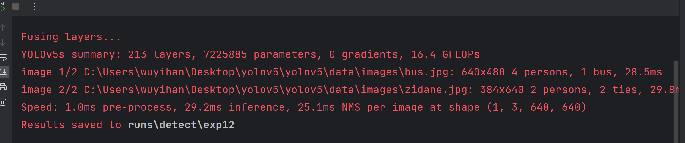
> >
> > 先记录下课堂的整体情况，并存到数据库中
>
> > 这里打算先把课堂的视频，分成一帧帧图片，分别识别每一张图片
> >
> > 这里尝试看看：能否分割出每个识别出来的对话框并存储下来（标上不同的id），依次找到这个人的映射(这个再说吧，先完成整体的)


看了一些资料和跑了下项目后回来：

> - 感觉其实可以不跑个针对视频跟踪的
>
> - 对于人的映射最好不要放在训练的标签中
>
>   > 训练后，发现准确率太低了，所以这里只打算先只识别动作，先不进行识别具体映射哪个人（后面再看看这个算法）


> 想做的动作：
>
> > 这里只打算做一个(大学生)学生视角的
> >
> > 这感觉这里只包含动作会好点(像什么分心的，感觉太泛了)
>
> - 听讲(抬头)
> - 看书
> - 写字
> - 玩手机/低头
> - 走神|聊天
>
> > 其他的感觉就没有必要了
>
> 
>
> > 感觉需要考虑的动作还是挺多的
>
> > 这里有个不好解决的点，就是这里老师是固定站在讲台上
> >
> > 能不能去考虑群体
> >
> > 考虑多场景
>
> [课堂行为动作识别数据集_学生课堂行为训练模型-CSDN博客](https://blog.csdn.net/weixin_51534858/article/details/136641555)
>
> [SCB-Dataset5 公开 学生课堂行为数据集1_哔哩哔哩_bilibili](https://www.bilibili.com/video/BV1ka4y1z7dX/?spm_id_from=333.788&vd_source=79043f2a8efe4672df69e4818fe876b8)
>
> > [公开 学生课堂行为数据集 SCB-Dataset Student Classroom Behavior dataset_学生课堂数据集-CSDN博客](https://blog.csdn.net/WhiffeYF/article/details/130035547)
>
> [教室行为状态分析_数据集-飞桨AI Studio星河社区 (baidu.com)](https://aistudio.baidu.com/datasetdetail/150080)
>
> [课堂行为检测数据集，包含举手、阅读、靠桌子、写作、玩手机、 低头、检测_考试行为检测数据集-CSDN博客](https://blog.csdn.net/2401_83580557/article/details/141123299?utm_medium=distribute.pc_relevant.none-task-blog-2~default~baidujs_baidulandingword~default-5-141123299-blog-130035547.235^v43^pc_blog_bottom_relevance_base1&spm=1001.2101.3001.4242.4&utm_relevant_index=8)

#### 数据集

> 部分还不确定是否为免费

[SCB-Dataset5 公开 学生课堂行为数据集1_哔哩哔哩_bilibili](https://www.bilibili.com/video/BV1ka4y1z7dX/?spm_id_from=333.788&vd_source=79043f2a8efe4672df69e4818fe876b8)

> 这个是公开的，但是需要翻下博客
>
> [课堂行为检测数据集，包含举手、阅读、靠桌子、写作、玩手机、 低头、检测_考试行为检测数据集-CSDN博客](https://blog.csdn.net/2401_83580557/article/details/141123299?utm_medium=distribute.pc_relevant.none-task-blog-2~default~baidujs_baidulandingword~default-5-141123299-blog-130035547.235^v43^pc_blog_bottom_relevance_base1&spm=1001.2101.3001.4242.4&utm_relevant_index=8)
>
> [Whiffe/SCB-dataset：学生课堂行为数据集 (github.com)](https://github.com/Whiffe/SCB-dataset)
>
> > 这个相当好，一定要细看

[教室行为状态分析_数据集-飞桨AI Studio星河社区 (baidu.com)](https://aistudio.baidu.com/datasetdetail/150080)

> 这个是免费的
>
> 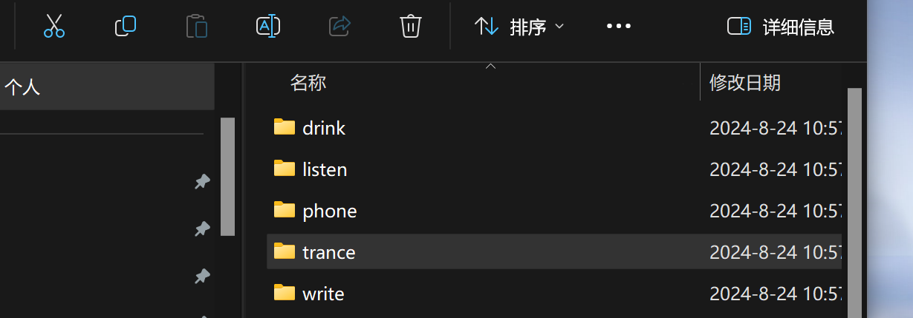


### 可能能参考：

[基于深度学习的学生课堂抬头率检测系统-CSDN博客](https://blog.csdn.net/xuehaisj/article/details/134928526)

[基于yolov5的学生行为状态监测系统，openvino加速_哔哩哔哩_bilibili](https://www.bilibili.com/video/BV1LM4m1o7ps/?spm_id_from=333.788.recommend_more_video.1&vd_source=79043f2a8efe4672df69e4818fe876b8)

> 这个感觉挺适合项目的

[DragonistYJ/EduWatching: 基于PaddlePaddle的智慧课堂实时监测系统—EduWatching (github.com)](https://github.com/DragonistYJ/EduWatching)

> 这个算法不太一样

## 想做：

### 云平台：

[新手小白如何租用GPU云服务器跑深度学习_gpu租用-CSDN博客](https://blog.csdn.net/h_u_m_a_n/article/details/127771716)

### 公开数据集

[图像处理及深度学习开源数据集大全（四万字呕心沥血整理）-CSDN博客](https://blog.csdn.net/qq_34972053/article/details/128014530)

## 目标跟踪算法

### `deepsort`

> 感觉这里感觉用不到，感觉这里应该是用在视频上，追踪同一个目标
>
> 所以先跳过了

这里放一写还没细看的资料

> [Yolov5 + Deepsort 重新训练自己的数据（保姆级超详细）_yolov5+deepsort训练自己的数据-CSDN博客](https://blog.csdn.net/weixin_53711236/article/details/123762215)
>
> [YOLOv10+deepsort-智能交通系统(原创毕设)_哔哩哔哩_bilibili](https://www.bilibili.com/video/BV1xu4y1u7ji/?spm_id_from=333.788.recommend_more_video.1&vd_source=79043f2a8efe4672df69e4818fe876b8)


### `ByteTrack`


## 视频识别任务模型

### `slowfast`

> 注重时空维度

> [facebookresearch/SlowFast: PySlowFast: video understanding codebase from FAIR for reproducing state-of-the-art video models. (github.com)](https://github.com/facebookresearch/slowfast)

> [学生课堂行为检测 SlowFast Networks for Video Recognition复现代码 使用自己的视频进行demo检测_哔哩哔哩_bilibili](https://www.bilibili.com/video/BV1bT4y1P7xb/?spm_id_from=333.788&vd_source=79043f2a8efe4672df69e4818fe876b8)


## 感觉能参考的项目

### 模型的融合

[wufan-tb/yolo_slowfast： Yolov5+SlowFast： 基于 PytorchVideo 的实时动作检测 (github.com)](https://github.com/wufan-tb/yolo_slowfast)

[视频实时行为检测——基于yolov5+deepsort+slowfast算法-CSDN博客](https://blog.csdn.net/kobepaul123/article/details/126942095)

> 这里其实还用了个deepsort
>
> 这个感觉挺不错的
>
> 感觉主要都是针对视频，deepsort实现跟踪，slowfast从空间和时间维度实现行为的识别


[基于YOLOv8与ByteTrack的车辆检测追踪与流量计数系统【python源码+Pyqt5界面+数据集+训练代码】深度学习实战、目标追踪、车辆检测追踪、过线计数、流量统计_改进yolo算法与bytetrack结合-CSDN博客](https://blog.csdn.net/qq_42589613/article/details/138444042)

[基于YOLOv8与ByteTrack的车辆行人多目标检测与追踪系统【python源码+Pyqt5界面+数据集+训练代码】深度学习实战、目标追踪、运动物体追踪_哔哩哔哩_bilibili](https://www.bilibili.com/video/BV15T4m1S7EH/?spm_id_from=333.788.recommend_more_video.1&vd_source=79043f2a8efe4672df69e4818fe876b8)


[什么是OpenVino？以及如何使用OpenVino运行yolo-CSDN博客](https://blog.csdn.net/bjbz_cxy/article/details/130318904)

> 感觉这个openvino主要是用来快速部署深度学习的工具

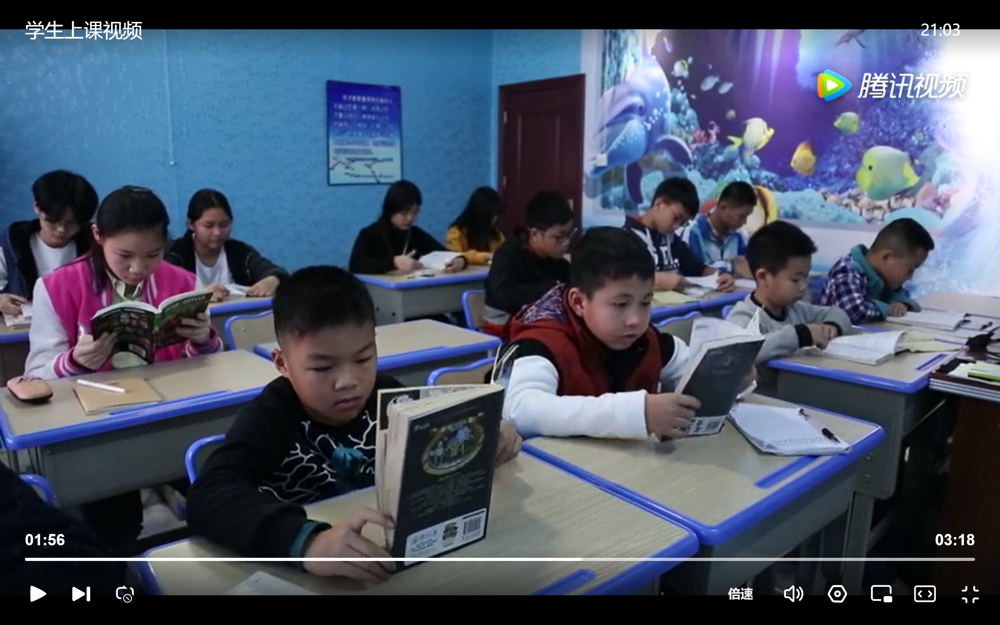
