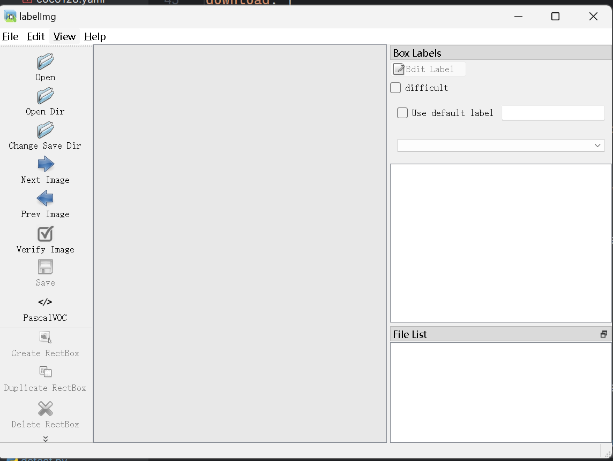
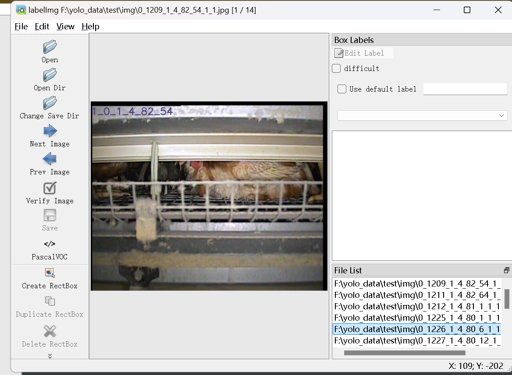
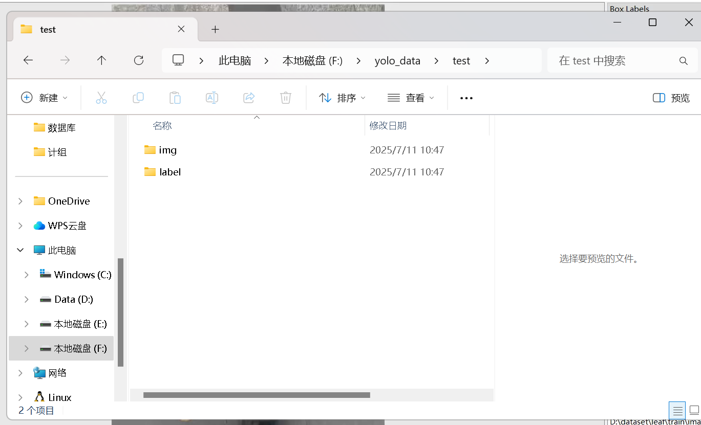
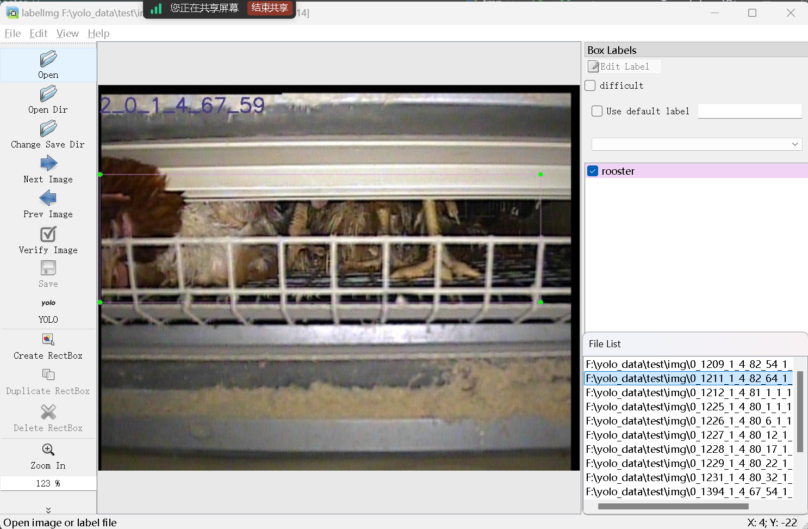
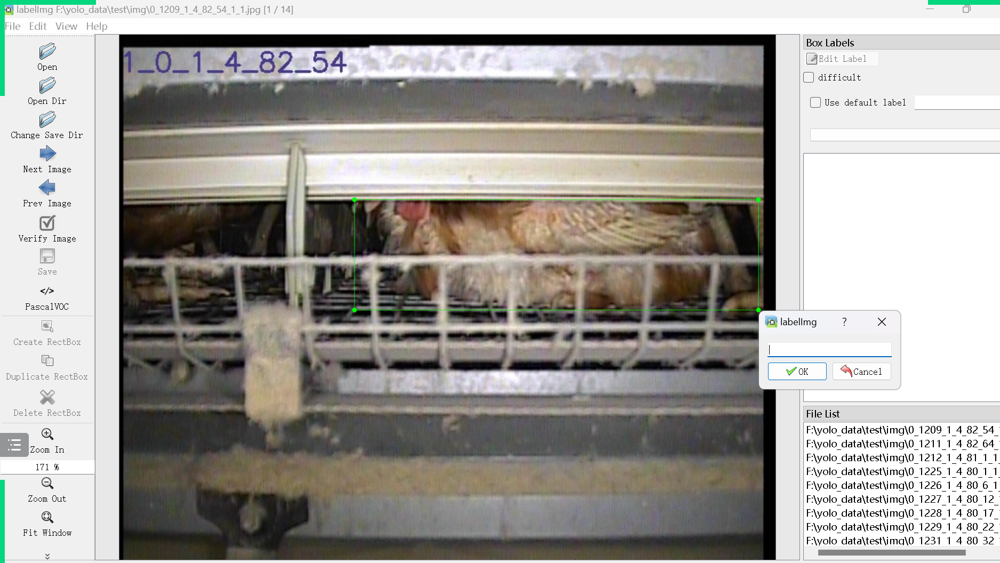
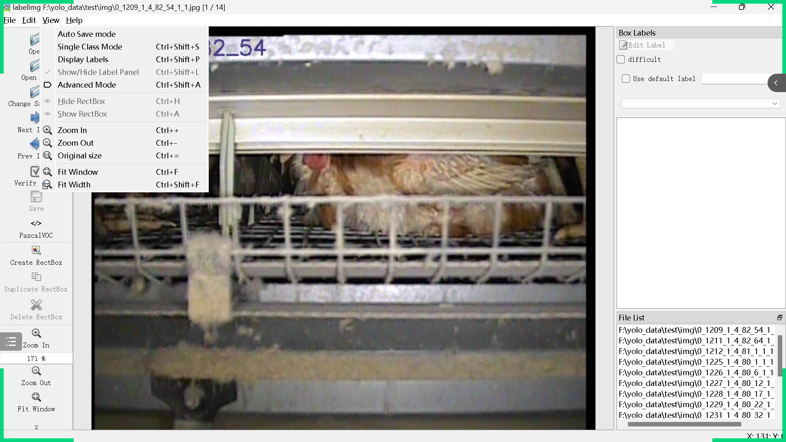
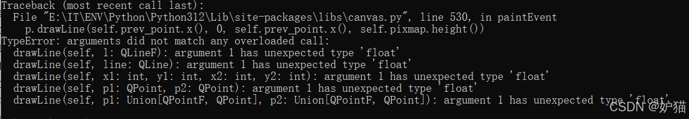

# yolo数据标注

- 下载

~~~
pip install labelimg
~~~

- 用cmd打开

~~~~
labelimg
~~~~

打开后记得不要关闭cmd或者直接用pycharm启动也可以

- 打开opendir 打开文件夹找到自己的img

- change save dir 选择保存label的位置
	- 一般和img放到一个文件件下

- 这个img和label是自己创建的，img是放图片的，label目前是空

左边save下面要点成yolo才可以，保存时才会有txt否则是xml（一开始可能是VOC）

## 开始标注

选一个然后右键，create Rectbox然后画框写标注（标注要用英语）

ad可以切换图片

第一个是自动保存可以打开

左边save下面要点成yolo才可以，保存时才会有txt否则是xml

## 报错

`【labelimg标注图片时float报错问题 完美解决方案】argument 1 has unexpected type ‘float‘`

出现这个需要改一下源代码

https://blog.csdn.net/wangpjpj/article/details/142451247按这个文章来改即可