# 二阶段目标检测

# RCNN（Region-basedConvolutionalNeuralNetworks）

## 训练

-   Selective Search 方法生成2000个候选区
-   送到alexnet提取深度特征
-   交叉熵损失进行分类训练
-   SVM分类器
-   边框回归器

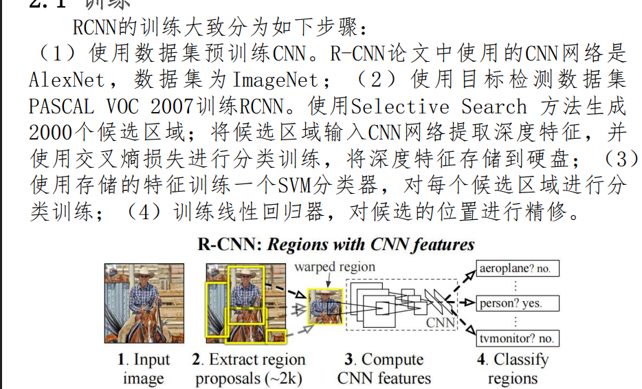

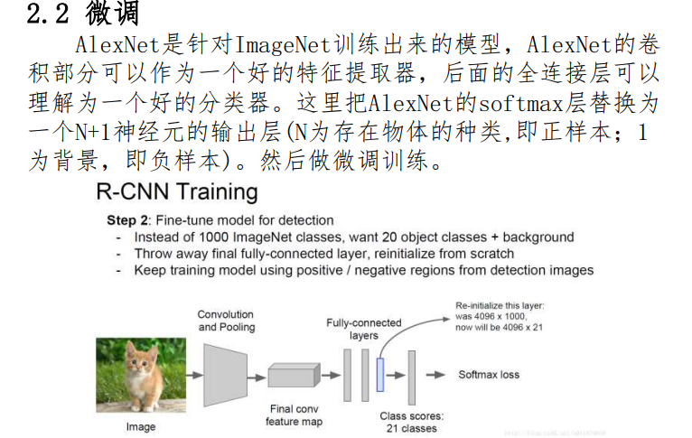

-   把alexnet的softmax换成FC

## selective search

用selective search生成的候选框做预测框回归（同时也做了类别识别，注意不是二分类）

如果预测框的IOU小于阈值就判定为背景

RCNN和Fast RCNN的bbox回归器是**每类一个回归器**（或者共享权重但乘以类别专属的偏移参数），训练时只有当proposal是该类的正样本时，才会参与该类的回归损失。

如果不做类别识别，你根本不知道该用哪一类的回归器去计算smooth L1损失。

~~~
# 分类头：输出21类分数
cls_score = fc_cls(feature)      # [N, 21]

# 回归头：输出20类 × 4个偏移量（背景类没有回归）
bbox_pred = fc_reg(feature)      # [N, 80] → reshape成 [N, 20, 4]

# 训练时：
for each proposal:
    if max_iou >= 0.5:
        label = 匹配到的GT的类别id（1~20）
        cls_loss += cross_entropy(cls_score, label)
        bbox_loss += smooth_l1(bbox_pred[:, label*4:(label+1)*4], gt_offset)
    else:
        label = 0  # 背景
        cls_loss += cross_entropy(cls_score, 0)
        # 背景不参与bbox回归，损失权重为0
~~~

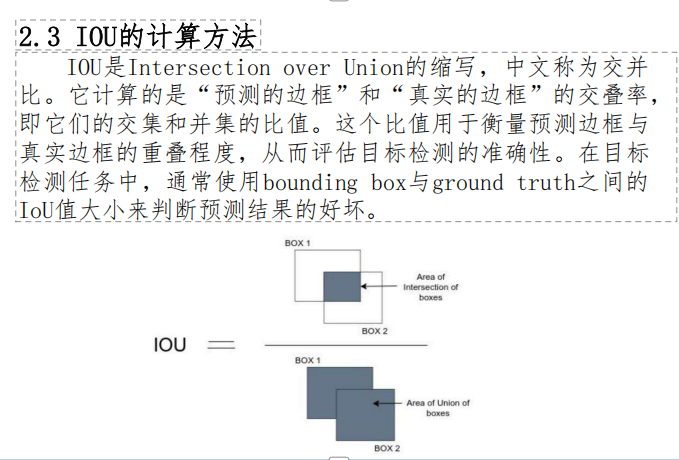

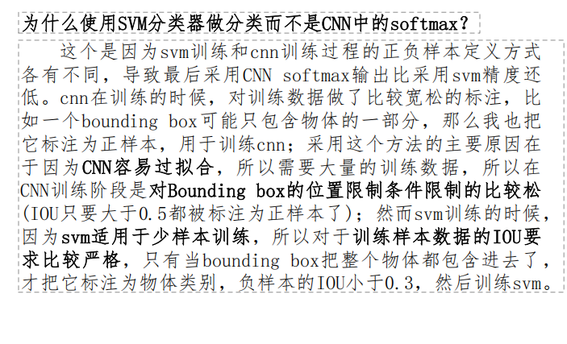

CNN比SVM更容易过拟合，只要在数据多的时候才可以

##  训练

-   锚框随机选定（启发式）

    -   selective search 

-   使用预训练模型于选择

    -   ~~~
        初始化: 分割图像成元素区域 R = {r1, r2, ..., rn}
        while |R| > 1:
            对于所有相邻对 (ri, rj):
                计算 s(ri, rj)
            找到 max_s 的 (ri, rj)
            合并: rk = merge(ri, rj); 更新 R
            在此阶段添加当前所有边界框到提议列表
        
        输出: 提议列表 (排序 by 面积或置信)
        
        s 是 两个相邻区域（regions）之间的总相似度分数
        ~~~

    

    

    -   2.   **相似度度量（Similarity Measures）**

        Selective Search 的关键是定义区域间的**相似度分数**，用于决定何时将两个相邻区域合并。相似度基于四个互补的“通道”（channels），每个通道捕捉不同视觉线索：

| 相似度类型                          | 公式                                                         | 解释                                                         |
| ----------------------------------- | ------------------------------------------------------------ | ------------------------------------------------------------ |
| **颜色相似度 (Color Similarity)**   | $$( s_{\text{color}} = w_1 \cdot \| c_1 - c_2 \| ) $$ （\( c_1, c_2 \) 为区域均值颜色向量，\( w_1 \) 为 Lab 颜色空间权重） | 比较两个区域的平均颜色分布（使用 Lab 空间更鲁棒）。差异小则相似度高。 |
| **纹理相似度 (Texture Similarity)** | $$( s_{\text{text}} = w_2 \cdot \| t_1 - t_2 \| )$$  （\( t_1, t_2 \) 为区域纹理梯度直方图） | 使用 Gabor 滤波器或梯度直方图捕捉纹理模式。                  |
| **大小相似度 (Size Similarity)**    | $$( s_{\text{size}} = \frac{w_3}{\text{size}(R_1) + \text{size}(R_2)} )$$ | 偏好合并小区域（大小用像素面积表示），鼓励从细粒度到粗粒度逐步合并。 |
| **填充相似度 (Fill Similarity)**    | $( s_{\text{fill}} = w_4 \cdot \frac{\min(\text{size}(R_1), \text{size}(R_2))}{\text{size}(R_1 \cup R_2)} )$ | 测量合并后区域的“填充效率”，惩罚形状不规则的合并。           |

   - 

## 流程

~~~
Selective Search → ~2000 个框
        ↓
每个框：warp 到固定大小 (e.g., 227×227)
        ↓
CNN 特征提取（AlexNet/VGG 等）
        ↓
SVM 分类器 → 每个框预测 K+1 类分数（K 个目标 + 背景）
        ↓
NMS（每类单独做）→ 去重，输出最终检测框
~~~

## NMS

目标检测的过程中在同一目标的位置上会产生大量的候选 框，这些候选框相互之间可能会有重叠，此时需要利用非极大 值抑制找到最佳的目标边界框，消除冗余边界框。

左图是人脸检测的候选框结果，每个边界框有一个置 信度得分，如果不使用非极大值抑制，就会有多个候选框 出现，右图是使用非极大值抑制之后的结果（就是多个框重叠）

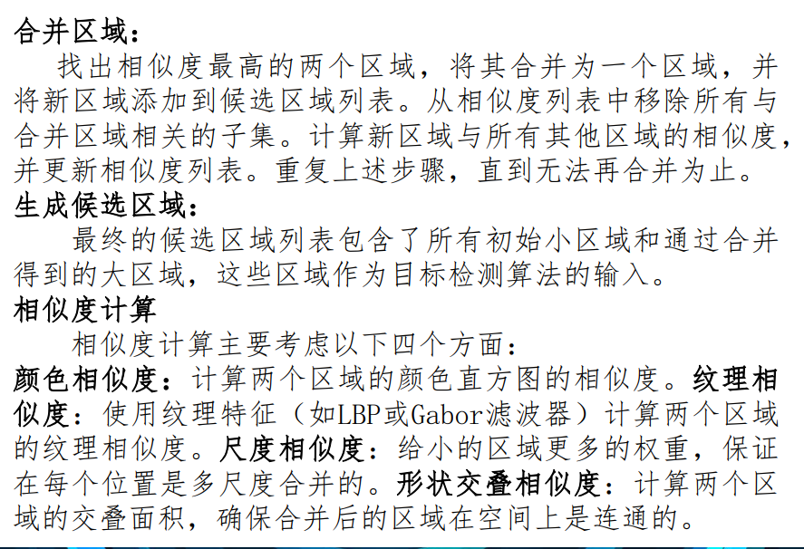

##  测试

分类：在测试时，先对带检测图像提取出约2000个候选 区域，将每个区域都进行缩放，然后将缩放后的图片输入 CNN进行特征提取，对CNN输出的特征用SVM打分(每类都有一 个SVM，21类就有21个SVM分类器)，对打好分的区域使用NMS 即非极大抑制去除相交的多余的框，到这里分类就完成了。

## iou的使用

### 两次 IoU 计算一览表

| 次数        | 发生阶段                  | 用途                                                         | 是否每类单独做  | 代码位置（典型）  |
| ----------- | ------------------------- | ------------------------------------------------------------ | --------------- | ----------------- |
| **第 1 次** | **训练阶段** （标签分配） | 给 Selective Search 的 proposal 打 **正/负样本标签** → IoU ≥ 0.5 → 正样本 | 否（跨所有 GT） | generate_labels() |
| **第 2 次** | **推理阶段** （NMS 去重） | **每类单独做 NMS**：抑制重叠框 → IoU > 0.7 → 抑制低分框      | 是（每类独立）  | nms_per_class()   |

## 位置修正

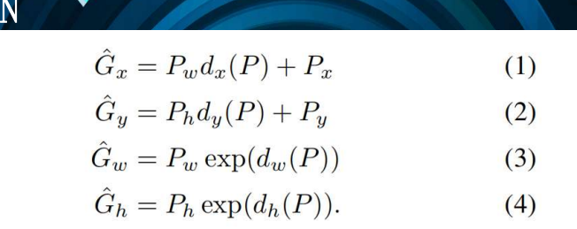

## 整体流程

~~~
Selective Search → ~2000 个框
        ↓
CNN 特征提取 → 4096维向量
        ↓
┌─────────────────────┐
│ 1. SVM 分类          │ → 预测类别 + 置信度
│ 2. BBox Regressor    │ → **位置修正在这儿！**
└─────────────────────┘
        ↓
NMS（每类单独做）→ 最终检测框
~~~

推理阶段：SVM 分类完后，对所有 正样本 proposal 做回归修正训练时依赖 IoU只对 IoU ≥ 0.5 的 proposal 训练回归器

**在 SVM 分类之后、NMS 之前，对每个分类为正样本的 proposal，用 独立的 BBox Regressor 预测 4 个偏移量，修正原始框。**

## 缩放

在 R-CNN（原始版本，使用 Selective Search + AlexNet）中，候选区域缩放（warp） 发生在 特征提取之前，是 强制将任意大小的 proposal 缩放到 CNN 输入固定尺寸 的关键步骤。

CNN 输入固定AlexNet/VGG 只能接受 227×227 或 224×224不能用 RoI Pooling那是 Fast R-CNN 的改进，R-CNN 没有共享特征图每框独立前向2000 个框 → 2000 次 CNN → 极慢（正是 R-CNN 的瓶颈）

# fast RCNN

## 对于RCNN

-    候选区域的特征提取方式不同 （ROI）

-    分类器和回归器不同

| 改进点              | R-CNN（2014（慢得要死）                                      | Fast R-CNN（2015）                                           | 加速倍数 / 提升效果                                          |
| ------------------- | ------------------------------------------------------------ | ------------------------------------------------------------ | ------------------------------------------------------------ |
| 1. RoI Pooling      | 每个候选框（~2000个）都要warp成227×227 → 送进CNN → 提取4096维特征） | 整张图只前向一次 → 共享卷积特征 → 所有RoI直接在feature map上做RoI Pooling | 测试速度提升约200倍（从47秒/图 → 0.32秒/图） 训练速度提升约10倍 |
| 2. SVD 加速全连接层 | 每个RoI都要做两次4096×4096的全连接，非常慢                   | 把fc6、fc7两个大矩阵用SVD低秩分解： W ≈ UΣVᵀ → 用两个小矩阵代替 | 测试时额外再提速3~4倍（0.32秒 → 0.08~0.12秒） 论文里明确写“可选加速技巧” |

RoI Pooling： “A key innovation in Fast R-CNN is RoI pooling, which eliminates the costly per-region warping and feature extraction of R-CNN.”

SVD 加速： “After replacing the two fully-connected layers with their SVD approximations, inference speed is increased by a factor of 3 with less than 0.3% drop in mAP.”

## 流程

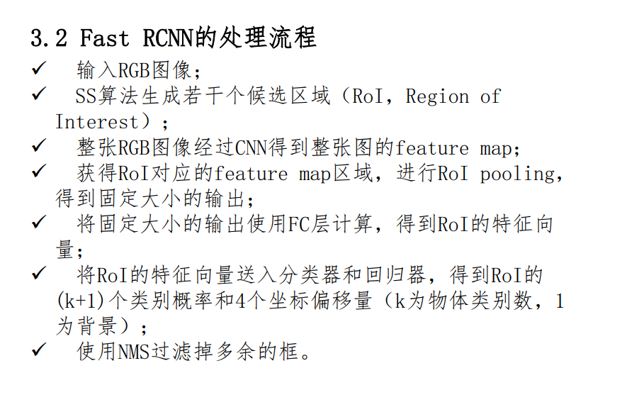

使用VGG16为backbone

## ROI感兴趣区域池化

### 解决

-   将不同的大小和形状的感兴趣区域映射为固定尺寸，为全连接做准备---实现不同输入大小的图片映射为固定的

（全连接需要相同尺寸）

-   避免重复计算

-   保留空间信息，为分类和回归
    通过max pooling 或avg pooling会丢失空间信息，ROI过将区域分成多个小块，对小块进行pooling

## 步骤

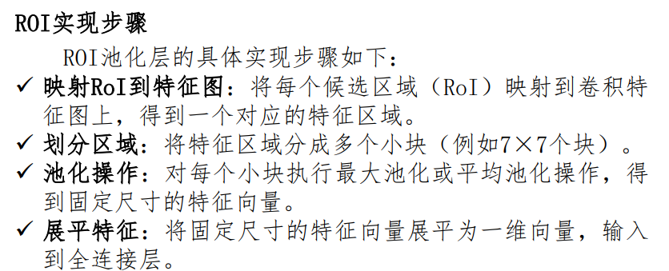

-   小块并不会使用重复的像素块

## 计算方式

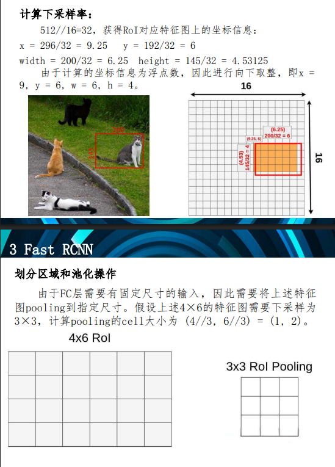

## 损失函数

### 分类器

`输出k+1个类别概率`

### 回归器

`输出4个坐标偏移量`

| 部分                 | 作用                          | 使用的分类器类型         | 细节说明                                                     |
| -------------------- | ----------------------------- | ------------------------ | ------------------------------------------------------------ |
| 1. 类别分类头 (cls)  | 判断RoI属于哪一类（包括背景） | Softmax 分类器（多分类） | 输出维度 = 类别数 N + 1（+1是背景类）                        |
| 2. 边框回归头 (bbox) | 精细修正候选框位置            | 线性回归（无激活函数）   | 每个类别独立回归4个坐标偏移（tx, ty, tw, th），共 4×(N+1) 个输出 |

对应这里 k+1个类 加 四个偏移

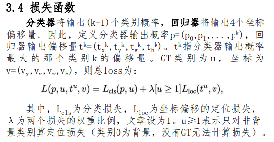

| u 的取值 | 含义                       | 分类损失（cls loss）是否计算？ | 边框回归损失（bbox loss）是否计算？ |
| -------- | -------------------------- | ------------------------------ | ----------------------------------- |
| u = 0    | 背景（negative RoI）       | 不计算                         | 不计算                              |
| u ≥ 1    | 某个前景类（positive RoI） | 计算（和预测的 p_u 算交叉熵）  | 计算（只用该类的4个回归器输出）     |

## 分类损失

-   是交叉熵损失

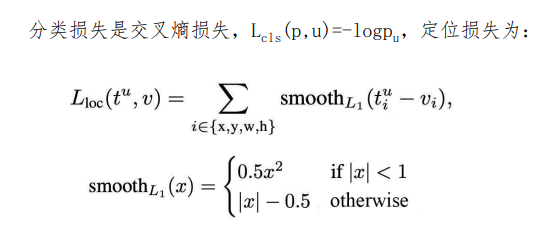

-   t^u^ 为预测的，v是实际的

~~~
smooth函数
1. 1/2x^2 求完导为x
2. -0.5 为了连续
3. 可以防止 梯度爆炸和难收敛
~~~

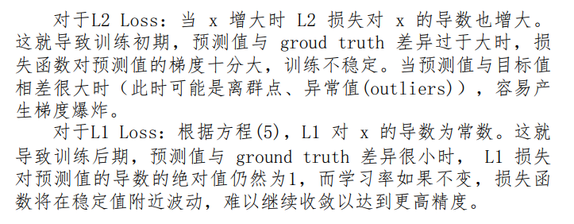

## SVD

### 问题

-   需要处理大量的感兴趣 区域，每个RoI都要通过全连接层进行计算，这导致全连接 层的计算量非常大

### 解决

-   通过矩阵奇异值分解的方式简化运算
-   即把一个全连接拆分为两个全连接

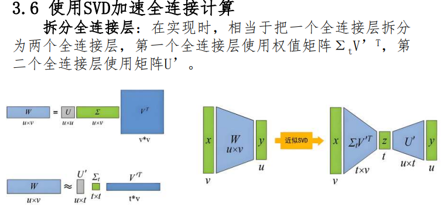

## 好处

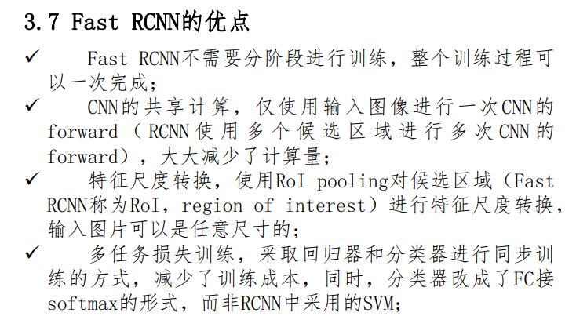

# faster RCNN

## 更新

-   特征提取 `feature extraction`
-   区域建议 `region proposal` 取代 selective Search
-   边框回归 `bounding box regression`
-   分类 `classification`

整合到一个网络

## 网络

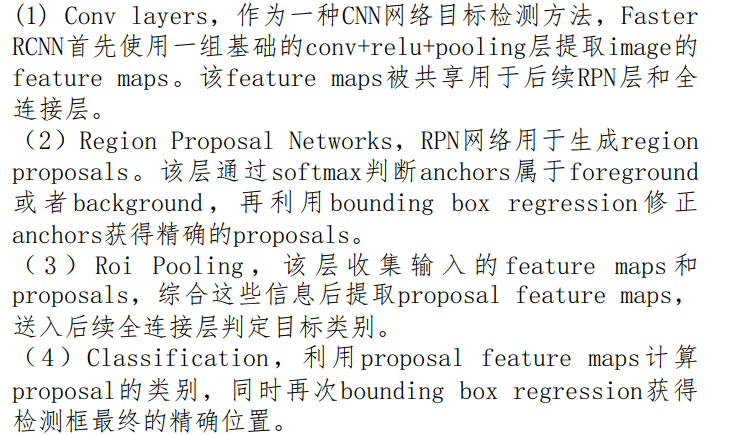

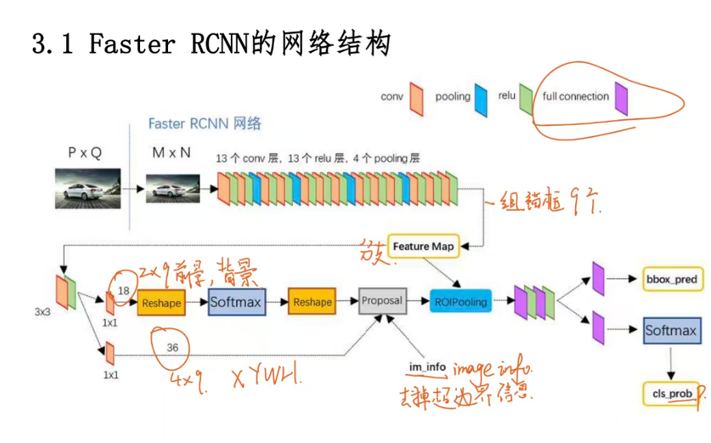

### 卷积层

~~~
13 个 conv 
	k_s = 3 ,pad = 1
13 个 relu
4 个 pooling
	k_s = 2,stride = 2
	
	
N*M ---> M/16 N/16
~~~

##   RPN

**作用**：在共享的卷积特征图上快速生成一组高质量的候选区域

**物体/非物体二分类**（Objectness Score）：判断某个位置“有没有目标”（不是具体类别，只是前景 vs 背景）。

**初步边界框回归**（Coarse Bounding Box Regression）：对预设的锚框（anchors）进行初步的位置修正，输出更准确的提议框。

RPN网络分为两条线

他固定了9个模板（3种尺度 * 3种长宽），但是中心点相同分别进行预测。

一共预测 9 次分类 + 9 次回归

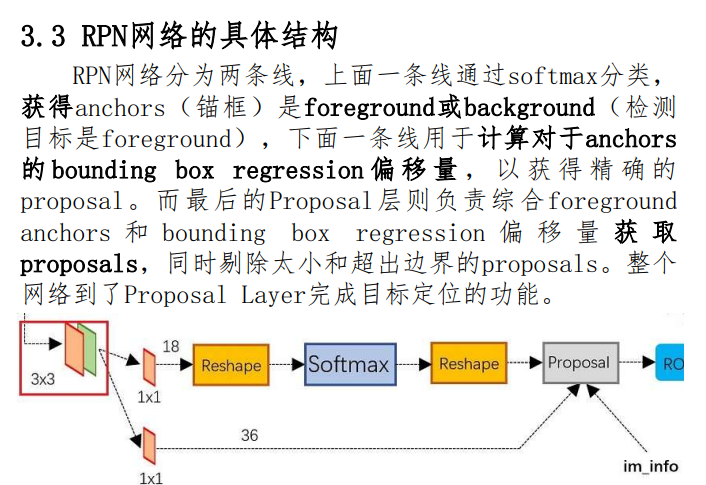

**2 × 9**：用来判断这个 anchor 是前景（foreground）还是背景（background）→ 二分类 × 9 种 anchor

**4 × 9**：用来回归这 9 种 anchor 的坐标偏移量（Δx, Δy, Δw, Δh）→ 4个坐标 × 9 种 anchor

| 输出通道数 | 计算方式 | 含义                                                         | 对应任务                 |
| ---------- | -------- | ------------------------------------------------------------ | ------------------------ |
| 18         | 2 × 9    | 每个 anchor 要预测：是前景（objectness=1）还是背景（0） → 2个分数 特征图上每个位置有9个anchor → ×9 | anchor 分类（前景/背景） |
| 36         | 4 × 9    | 每个 anchor 要预测4个坐标修正值：(dx, dy, dw, dh) 9个anchor → ×9 | anchor 边框回归          |

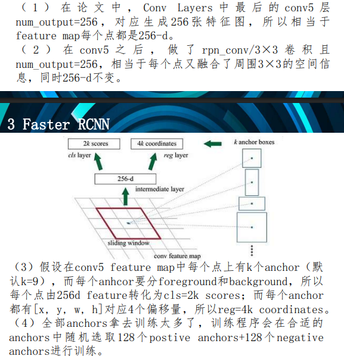

## 变换

一副M×N大小的矩阵送入Faster RCNN网络后，到RPN网 络变为W=M/16，H=N/16。在进入reshape与softmax之前，先做了1×1卷积，num_output=18，也就是经过该卷积的输出图 像为W×H×18大小。这也就刚好对应了feature maps每一个 点都有9个anchors，

## 在softmax后加reshape

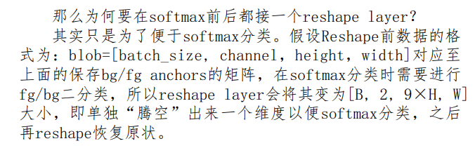

## bounding box regression原理

Faster RCNN由两处用到边框回归，一处是RPN生成初 始的候选框，并通过边框回归对这些候选框进行初步调整。 一处是在整个Faster RCNN的尾端，通过边框回归进行精 调，最终输出更准确的目标边界框。

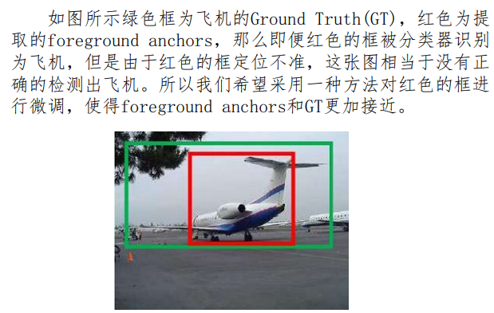

**GT**：真实标注的

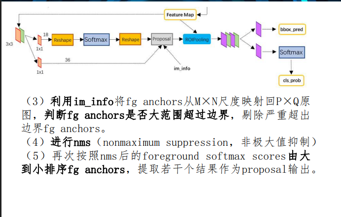
